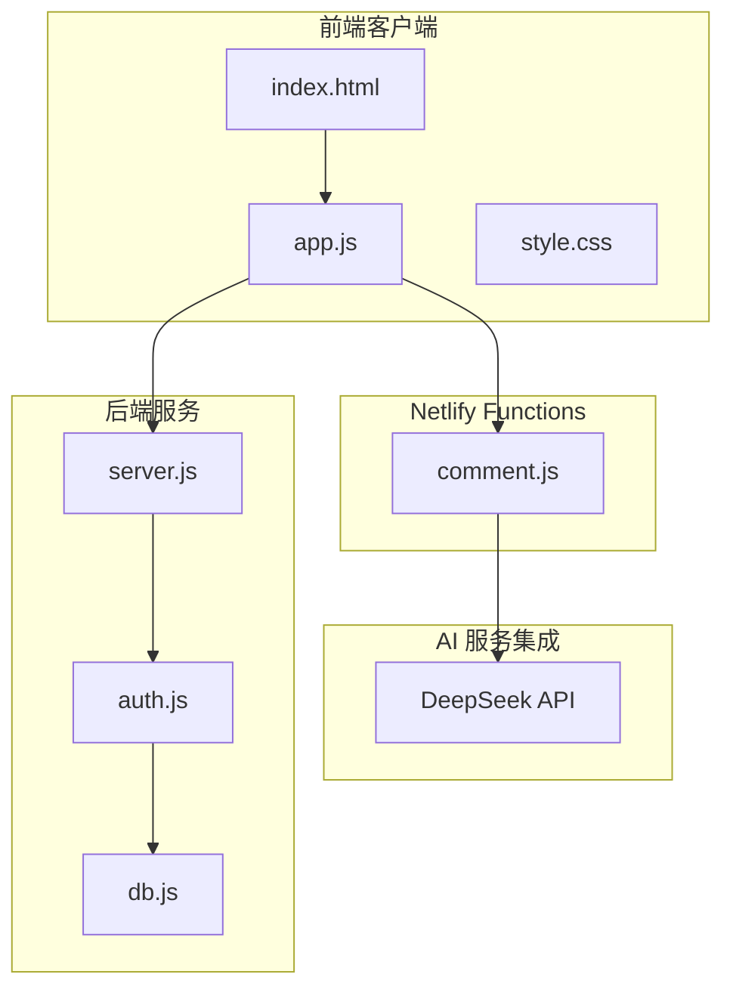
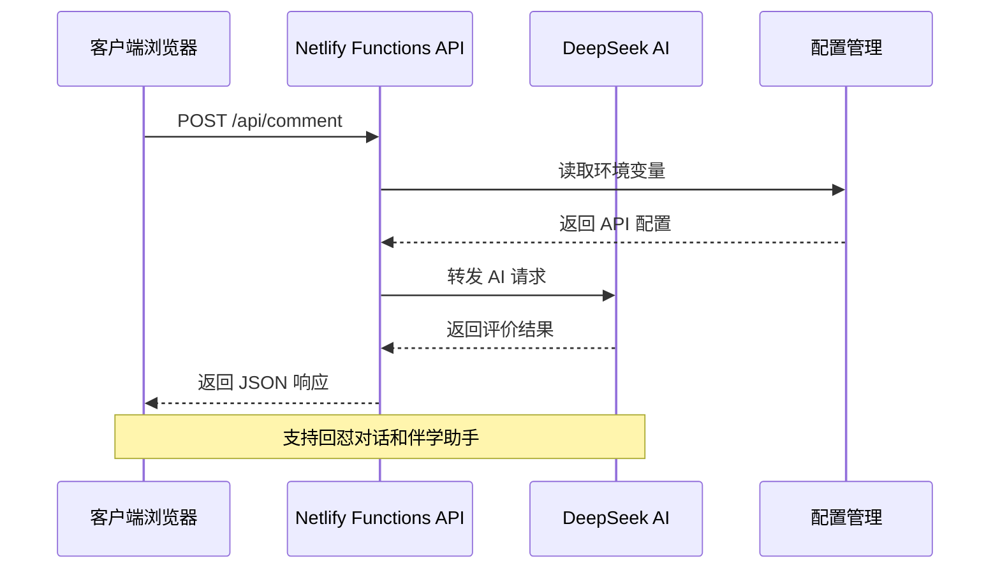
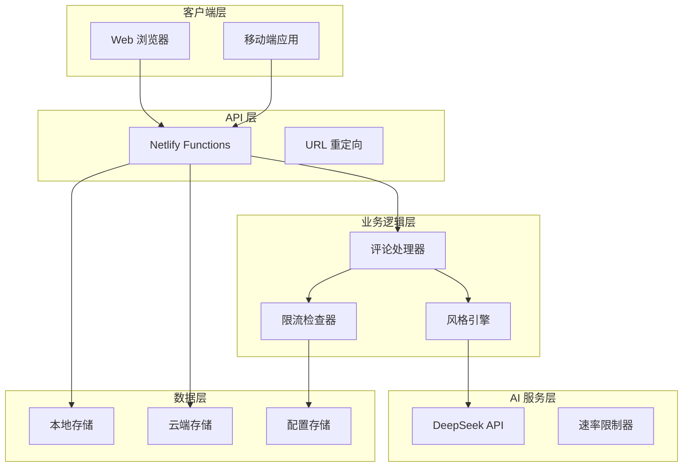
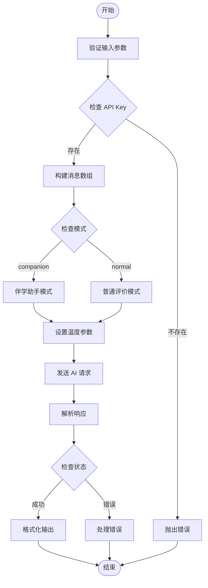
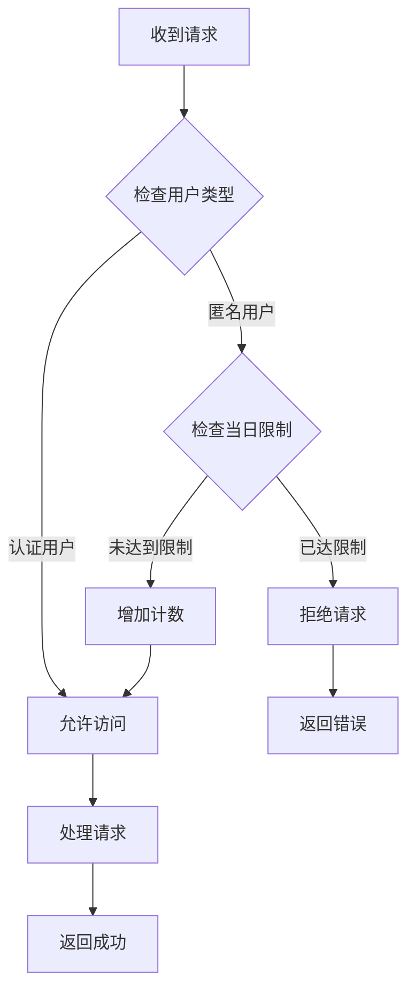
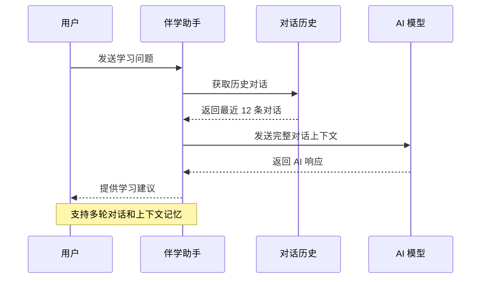
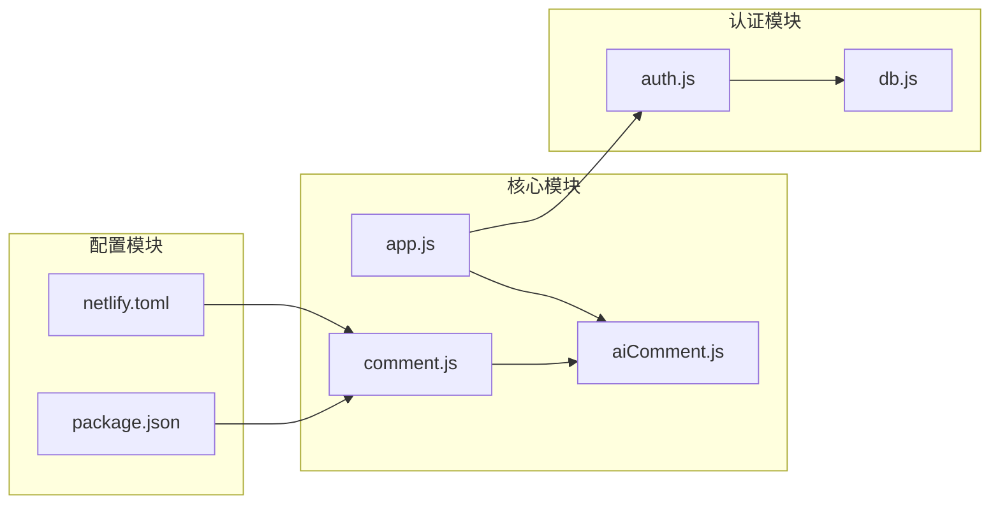

# AI 评论 API

<cite>
**本文档引用的文件**
- [comment.js](file://netlify/functions/comment.js)
- [aiComment.js](file://lib/aiComment.js)
- [app.js](file://app.js)
- [index.html](file://index.html)
- [netlify.toml](file://netlify.toml)
- [package.json](file://package.json)
- [server.js](file://server.js)
- [auth.js](file://lib/auth.js)
- [db.js](file://lib/db.js)
</cite>

## 目录
1. [简介](#简介)
2. [项目结构](#项目结构)
3. [核心组件](#核心组件)
4. [架构概览](#架构概览)
5. [详细组件分析](#详细组件分析)
6. [依赖关系分析](#依赖关系分析)
7. [性能考虑](#性能考虑)
8. [故障排除指南](#故障排除指南)
9. [结论](#结论)

## 简介

AI 评论 API 是 MyScore 成绩管理应用中的核心智能交互功能，基于 Netlify Functions 提供的无服务器架构，集成了 DeepSeek AI 大模型服务。该 API 为用户提供四种不同风格的 AI 评价模式，支持回怼对话功能和伴学助手使用方法。

MyScore 是一款专注于成绩记录与管理的智能应用，通过 AI 技术为用户提供个性化的学习反馈和成长陪伴。应用支持匿名用户和认证用户的差异化使用体验，其中认证用户享有无限次 AI 评论使用权限，而匿名用户每日仅有 5 次使用限制。

## 项目结构

MyScore 项目采用前后端分离架构，主要包含以下核心模块：



**图表来源**
- [index.html](file://index.html)
- [app.js](file://app.js)
- [comment.js](file://netlify/functions/comment.js)
- [server.js](file://server.js)

**章节来源**
- [index.html](file://index.html)
- [app.js](file://app.js)
- [comment.js](file://netlify/functions/comment.js)

## 核心组件

### AI 评论接口 (/api/comment)

AI 评论接口是整个系统的核心入口，负责处理客户端的 AI 评论请求并返回相应的评价内容。该接口支持多种请求方法和参数配置，为用户提供丰富的交互体验。

#### 接口规范

**HTTP 方法**: POST  
**端点**: `/api/comment`  
**内容类型**: `application/json`

#### 请求参数

| 参数名 | 类型 | 必需 | 描述 | 限制 |
|--------|------|------|------|------|
| examType | string | 否 | 考试类型名称 | 最大 30 字符 |
| currentScore | number/string | 否 | 当前考试分数 | 最大 20 字符 |
| historyScores | array | 否 | 历史分数数组 | 数组长度不限 |
| userRebuttal | string | 否 | 用户回嘴内容 | 最大 500 字符 |
| previousComment | string | 否 | 前一条 AI 评论 | 最大 500 字符 |
| userMessage | string | 否 | 伴学助手消息 | 最大 1000 字符 |
| conversationHistory | array | 否 | 伴学对话历史 | 最大 12 条 |
| style | string | 否 | AI 评价风格 | 默认为 storm |

#### 响应格式

**成功响应**:
```json
{
  "comment": "AI 生成的评价内容"
}
```

**错误响应**:
```json
{
  "error": "错误信息描述"
}
```

#### 四种 AI 评价风格

系统提供四种不同的 AI 评价风格，每种风格都有独特的语言特点和温度参数：

| 风格 | 标识 | 特点 | 适用场景 |
|------|------|------|----------|
| 风暴 | storm | 毒舌刻薄，犀利评价 | 需要激励和压力的用户 |
| 暖阳 | sun | 温暖鼓励，共情支持 | 需要鼓励和安慰的用户 |
| 冷锋 | cold | 理性分析，客观数据 | 需要客观反馈的用户 |
| 阵雨 | rain | 先损后帮，反转效果 | 希望有戏剧性反馈的用户 |

**章节来源**
- [comment.js](file://netlify/functions/comment.js)
- [aiComment.js](file://lib/aiComment.js)
- [app.js](file://app.js)

## 架构概览

MyScore 的 AI 评论系统采用多层次架构设计，确保系统的可扩展性、可靠性和安全性。



**图表来源**
- [comment.js](file://netlify/functions/comment.js)
- [aiComment.js](file://lib/aiComment.js)
- [app.js](file://app.js)

### 系统架构图



**图表来源**
- [comment.js](file://netlify/functions/comment.js)
- [aiComment.js](file://lib/aiComment.js)
- [server.js](file://server.js)

## 详细组件分析

### Netlify Functions 评论处理器

Netlify Functions 提供了无服务器的 API 处理能力，使得 AI 评论功能能够快速部署和扩展。

#### 核心功能

1. **请求路由**: 将 `/api/comment` 请求转发到评论处理函数
2. **CORS 处理**: 支持跨域请求，确保前端访问安全
3. **环境变量管理**: 读取和配置 AI API 的密钥和基础 URL
4. **错误处理**: 统一的错误响应格式和状态码

#### 配置选项

| 环境变量 | 默认值 | 描述 |
|----------|--------|------|
| AI_API_KEY | 必需 | DeepSeek API 密钥 |
| AI_BASE_URL | https://api.deepseek.com | AI 服务基础 URL |
| AI_MODEL | deepseek-chat | AI 模型名称 |

**章节来源**
- [comment.js](file://netlify/functions/comment.js)
- [netlify.toml](file://netlify.toml)

### AI 评论引擎

AI 评论引擎是系统的核心逻辑处理模块，负责构建 AI 请求、处理响应和格式化输出。

#### 请求构建流程



**图表来源**
- [aiComment.js](file://lib/aiComment.js)

#### 模式区分

系统支持两种主要模式：

1. **普通评价模式**: 基于单次成绩的 AI 评价
2. **伴学助手模式**: 支持连续对话的历史记录

**章节来源**
- [aiComment.js](file://lib/aiComment.js)

### 限流机制

系统实现了双重限流机制，确保资源使用的合理性和公平性。

#### 匿名用户限流

| 用户类型 | 每日限制 | 实现方式 |
|----------|----------|----------|
| 匿名用户 | 5 次 | 基于 IP 地址的内存计数器 |
| 认证用户 | 无限次 | 无限制访问 |

#### 限流实现细节



**图表来源**
- [server.js](file://server.js)

**章节来源**
- [server.js](file://server.js)

### 伴学助手功能

伴学助手是 AI 评论系统的重要扩展功能，提供持续的学习陪伴和对话支持。

#### 伴学对话流程



**图表来源**
- [aiComment.js](file://lib/aiComment.js)
- [app.js](file://app.js)

#### 对话历史管理

伴学助手支持最多 12 条对话历史的管理，确保 AI 能够理解上下文并提供连贯的回复。

**章节来源**
- [aiComment.js](file://lib/aiComment.js)
- [app.js](file://app.js)

## 依赖关系分析

### 外部依赖

MyScore 项目的主要外部依赖包括：

| 依赖项 | 版本 | 用途 |
|--------|------|------|
| Node.js | >= 20 | 运行时环境 |
| Netlify CLI | 最新版 | 本地开发和部署 |
| DeepSeek API | v1 | AI 评论服务 |
| Chart.js | 最新版 | 成绩图表可视化 |

### 内部模块依赖



**图表来源**
- [app.js](file://app.js)
- [aiComment.js](file://lib/aiComment.js)
- [comment.js](file://netlify/functions/comment.js)
- [auth.js](file://lib/auth.js)
- [db.js](file://lib/db.js)
- [netlify.toml](file://netlify.toml)
- [package.json](file://package.json)

**章节来源**
- [app.js](file://app.js)
- [aiComment.js](file://lib/aiComment.js)
- [comment.js](file://netlify/functions/comment.js)

## 性能考虑

### 响应时间优化

系统通过以下方式优化 AI 评论的响应时间：

1. **缓存策略**: 本地缓存最近的 AI 评论结果
2. **请求超时**: 设置 30 秒的请求超时时间
3. **并发控制**: 限制同时进行的 AI 请求数量
4. **CDN 加速**: 使用 Netlify 的全球 CDN 分发静态资源

### 资源使用优化

- **内存管理**: 使用内存映射存储匿名用户限流数据
- **网络优化**: 合并和压缩静态资源文件
- **数据库优化**: 采用 JSON 文件存储用户数据

### 扩展性设计

系统采用无服务器架构，具备良好的水平扩展能力：

- **自动扩缩容**: Netlify Functions 根据请求量自动调整实例数量
- **负载均衡**: 全球 CDN 分发请求到最近的边缘节点
- **故障转移**: 多区域部署确保服务可用性

## 故障排除指南

### 常见问题及解决方案

#### AI API 配置错误

**症状**: 请求返回 "AI_API_KEY is not configured"

**解决方案**:
1. 检查环境变量是否正确设置
2. 验证 API 密钥的有效性
3. 确认网络连接正常

#### 请求超时

**症状**: 请求在 30 秒后超时

**解决方案**:
1. 检查网络连接质量
2. 验证 AI 服务的可用性
3. 考虑减少请求负载

#### 限流错误

**症状**: 返回 "今日 AI 评论次数已用完"

**解决方案**:
1. 等待到下一个自然日
2. 注册账号以获得无限次使用
3. 检查本地存储的使用记录

### 调试工具

系统提供了多种调试工具帮助开发者诊断问题：

1. **浏览器开发者工具**: 查看网络请求和响应
2. **控制台日志**: 输出详细的错误信息
3. **状态指示器**: 显示当前的系统状态

**章节来源**
- [comment.js](file://netlify/functions/comment.js)
- [app.js](file://app.js)

## 结论

MyScore 的 AI 评论 API 提供了一个功能完整、性能优异的智能交互平台。通过精心设计的架构和多种优化策略，系统能够在保证用户体验的同时，提供稳定可靠的 AI 服务。

### 主要优势

1. **多风格评价**: 四种不同的 AI 评价风格满足不同用户需求
2. **智能限流**: 合理的使用限制确保资源公平分配
3. **无缝集成**: 与现有成绩管理系统完美融合
4. **扩展性强**: 无服务器架构支持未来的功能扩展

### 未来发展

系统将继续优化 AI 服务质量，扩展更多个性化功能，并持续改进用户体验。随着技术的发展，系统将支持更多 AI 模型和更丰富的交互方式。