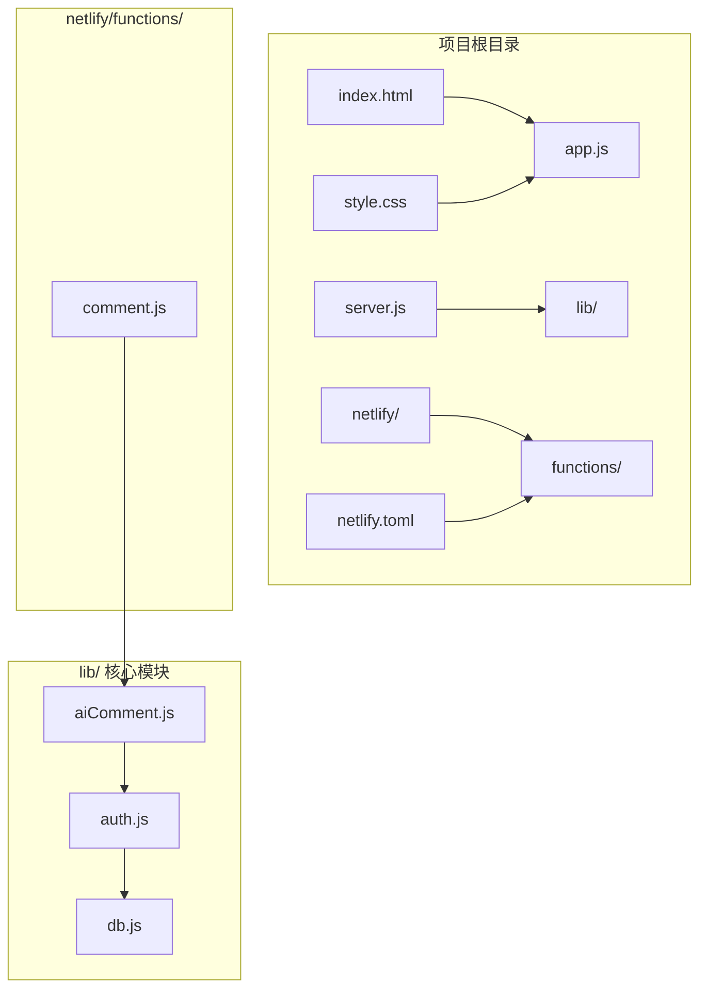
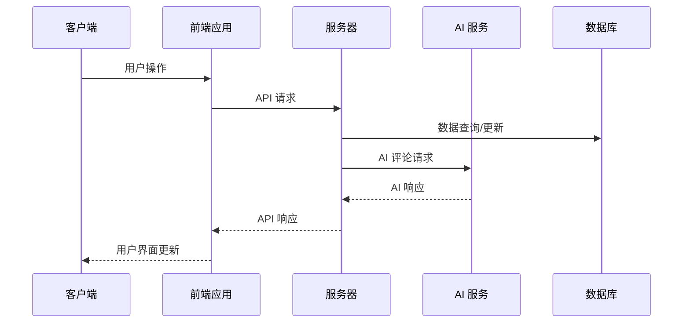
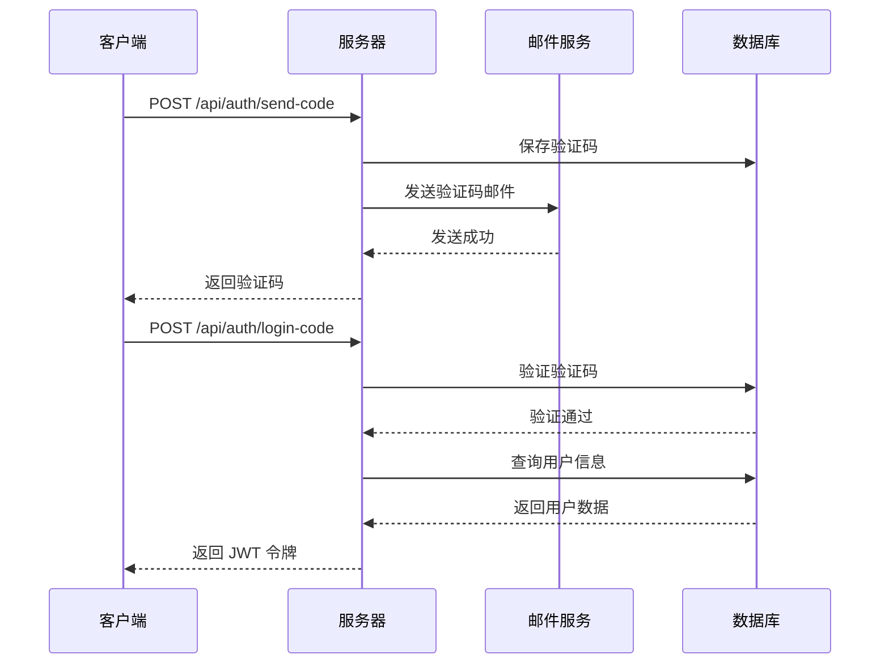
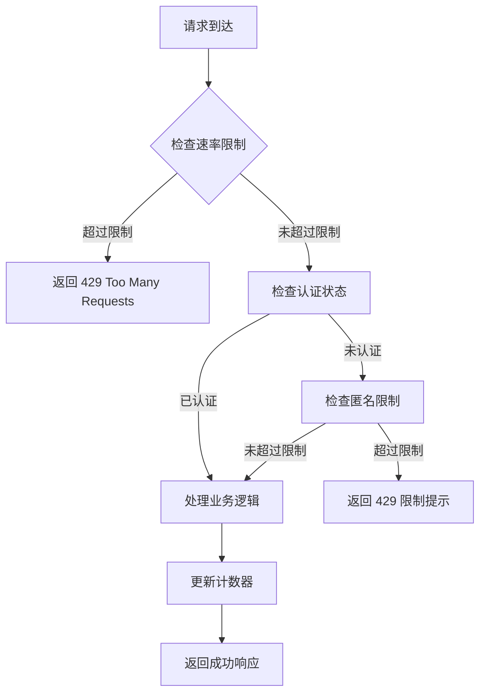
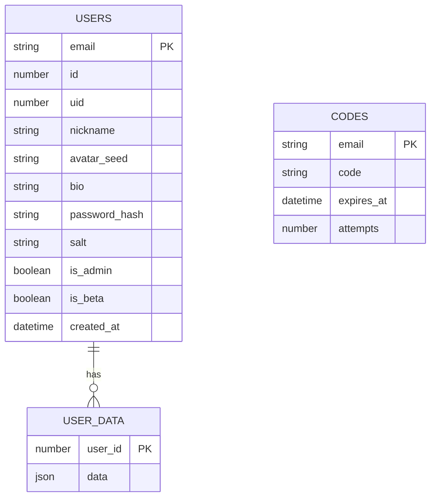

# API 接口文档

<cite>
**本文档引用的文件**
- [README.md](file://README.md)
- [app.js](file://app.js)
- [server.js](file://server.js)
- [lib/auth.js](file://lib/auth.js)
- [lib/db.js](file://lib/db.js)
- [lib/aiComment.js](file://lib/aiComment.js)
- [netlify/functions/comment.js](file://netlify/functions/comment.js)
- [netlify.toml](file://netlify.toml)
- [DEPLOYMENT.md](file://DEPLOYMENT.md)
- [package.json](file://package.json)
</cite>

## 目录
1. [简介](#简介)
2. [项目结构](#项目结构)
3. [核心组件](#核心组件)
4. [架构概览](#架构概览)
5. [详细组件分析](#详细组件分析)
6. [依赖关系分析](#依赖关系分析)
7. [性能考虑](#性能考虑)
8. [故障排除指南](#故障排除指南)
9. [结论](#结论)

## 简介

MyScore 是一个功能完善的 AI 智能成绩管理系统，具备云端账号系统和 AI 交互能力。该项目采用前后端分离架构，支持 Netlify 和 Zeabur 两种部署方式，提供完整的 RESTful API 接口。

**版本信息**: 当前版本为 5.0.0-beta，支持拖动条输入、扣分制计分、实时校验和分享卡记录选择等高级功能。

## 项目结构

MyScore 项目采用模块化设计，主要包含以下核心目录和文件：



**图表来源**
- [server.js:1-541](file://server.js#L1-L541)
- [lib/aiComment.js:1-172](file://lib/aiComment.js#L1-L172)
- [lib/auth.js:1-191](file://lib/auth.js#L1-L191)
- [lib/db.js:1-207](file://lib/db.js#L1-L207)

**章节来源**
- [README.md:217-236](file://README.md#L217-L236)
- [package.json:1-13](file://package.json#L1-L13)

## 核心组件

MyScore 的 API 架构由四个主要组件构成：

### 1. 认证服务 (Authentication API)
- 验证码发送：`/api/auth/send-code`
- 验证码登录：`/api/auth/login-code`
- 密码登录：`/api/auth/login-password`
- 用户注册：`/api/auth/register`
- 用户资料：`/api/auth/profile`

### 2. 同步服务 (Sync API)
- 数据同步：`/api/sync` (GET/PUT)

### 3. AI 评论服务 (AI Comment API)
- 评论请求：`/api/comment` (POST)
- 支持四种 AI 风格：风暴、暖阳、冷锋、阵雨

### 4. 静态资源服务
- 前端静态文件托管
- 自动路由重定向

**章节来源**
- [server.js:275-502](file://server.js#L275-L502)
- [lib/aiComment.js:47-171](file://lib/aiComment.js#L47-L171)

## 架构概览

MyScore 采用统一的 API 架构，支持双平台部署：



**图表来源**
- [server.js:504-536](file://server.js#L504-L536)
- [lib/aiComment.js:137-167](file://lib/aiComment.js#L137-L167)

## 详细组件分析

### 认证 API

#### 验证码发送接口
**HTTP 方法**: POST  
**URL**: `/api/auth/send-code`  
**认证**: 无需认证  
**请求头**: `Content-Type: application/json`  
**请求体**:
```javascript
{
  "account": "string",      // 邮箱或 UID
  "turnstileToken": "string" // Cloudflare Turnstile 验证码
}
```

**响应体**:
```javascript
{
  "ok": true,
  "maskedEmail": "string"   // 掩码邮箱
}
```

**错误处理**:
- 400: 账号格式错误或人机验证失败
- 429: 请求过于频繁

**章节来源**
- [server.js:283-318](file://server.js#L283-L318)
- [lib/auth.js:138-142](file://lib/auth.js#L138-L142)

#### 验证码登录接口
**HTTP 方法**: POST  
**URL**: `/api/auth/login-code`  
**认证**: 无需认证  
**请求体**:
```javascript
{
  "account": "string",      // 邮箱或 UID
  "code": "string"          // 6位验证码
}
```

**响应体**:
```javascript
{
  "ok": true,
  "isNewUser": true,        // 新用户标记
  "token": "string",        // JWT 令牌
  "user": {
    "id": "number",
    "uid": "number",
    "email": "string",
    "nickname": "string",
    "avatar_seed": "string",
    "bio": "string",
    "is_admin": "boolean",
    "is_beta": "boolean"
  }
}
```

**章节来源**
- [server.js:320-351](file://server.js#L320-L351)
- [lib/auth.js:179-190](file://lib/auth.js#L179-L190)

#### 密码登录接口
**HTTP 方法**: POST  
**URL**: `/api/auth/login-password`  
**认证**: 无需认证  
**请求体**:
```javascript
{
  "account": "string",      // 邮箱或 UID
  "password": "string"      // 密码
}
```

**响应体**:
```javascript
{
  "ok": true,
  "token": "string",
  "user": {
    "id": "number",
    "uid": "number",
    "email": "string",
    "nickname": "string",
    "avatar_seed": "string",
    "bio": "string",
    "is_admin": "boolean",
    "is_beta": "boolean"
  }
}
```

**章节来源**
- [server.js:369-396](file://server.js#L369-L396)
- [lib/auth.js:168-177](file://lib/auth.js#L168-L177)

#### 用户注册接口
**HTTP 方法**: POST  
**URL**: `/api/auth/register`  
**认证**: 无需认证  
**请求体**:
```javascript
{
  "email": "string",        // 邮箱
  "code": "string",         // 验证码
  "nickname": "string",     // 昵称 (1-20字符)
  "avatarSeed": "string",   // 头像种子
  "bio": "string",          // 个性签名 (最多60字符)
  "password": "string",     // 密码 (至少6位)
  "inviteCode": "string"    // 邀请码 (可选)
}
```

**响应体**:
```javascript
{
  "ok": true,
  "token": "string",
  "user": {
    "id": "number",
    "uid": "number",
    "email": "string",
    "nickname": "string",
    "avatar_seed": "string",
    "bio": "string",
    "is_admin": "boolean",
    "is_beta": "boolean"
  }
}
```

**章节来源**
- [server.js:353-367](file://server.js#L353-L367)
- [lib/auth.js:144-166](file://lib/auth.js#L144-L166)

#### 用户资料接口
**HTTP 方法**: GET/PUT  
**URL**: `/api/auth/profile`  
**认证**: Bearer Token  
**请求头**: `Authorization: Bearer <token>`

**GET 请求响应体**:
```javascript
{
  "ok": true,
  "profile": {
    "id": "number",
    "uid": "number",
    "email": "string",
    "nickname": "string",
    "avatar_seed": "string",
    "bio": "string",
    "is_admin": "boolean",
    "is_beta": "boolean"
  }
}
```

**PUT 请求体**:
```javascript
{
  "nickname": "string",     // 昵称 (1-20字符)
  "avatar_seed": "string",  // 头像种子
  "bio": "string"           // 个性签名 (最多60字符)
}
```

**PUT 响应体**:
```javascript
{
  "ok": true,
  "profile": {
    "id": "number",
    "uid": "number",
    "email": "string",
    "nickname": "string",
    "avatar_seed": "string",
    "bio": "string",
    "is_admin": "boolean",
    "is_beta": "boolean"
  }
}
```

**章节来源**
- [server.js:398-455](file://server.js#L398-L455)
- [lib/db.js:96-108](file://lib/db.js#L96-L108)

### 同步 API

#### 数据同步接口
**HTTP 方法**: GET/PUT  
**URL**: `/api/sync`  
**认证**: Bearer Token  
**请求头**: `Authorization: Bearer <token>`

**GET 请求响应体**:
```javascript
{
  "ok": true,
  "data": {
    "records": "array",      // 成绩记录
    "custom": "object",      // 自定义考试
    "goals": "object",       // 目标设置
    "ai_style": "string",    // AI 风格
    "tutuer_history": "array" // 伴学历史
  }
}
```

**PUT 请求体**:
```javascript
{
  "records": "array",
  "custom": "object",
  "goals": "object",
  "ai_style": "string",
  "tutuer_history": "array"
}
```

**响应体**:
```javascript
{
  "ok": true
}
```

**章节来源**
- [server.js:469-502](file://server.js#L469-L502)
- [app.js:672-743](file://app.js#L672-L743)

### AI 评论 API

#### 评论请求接口
**HTTP 方法**: POST  
**URL**: `/api/comment`  
**认证**: Bearer Token (可选)  
**请求头**: `Content-Type: application/json`

**请求体**:
```javascript
{
  "mode": "string",                    // "comment" 或 "companion"
  "examType": "string",               // 考试类型
  "currentScore": "number",           // 当前分数
  "historyScores": "array",           // 历史分数数组
  "userRebuttal": "string",           // 用户回嘴内容
  "previousComment": "string",        // 上次 AI 评价
  "userMessage": "string",            // 伴学对话内容
  "conversationHistory": "array",     // 伴学对话历史
  "style": "string"                   // AI 风格 (storm/sun/cold/rain)
}
```

**响应体**:
```javascript
{
  "comment": "string"                 // AI 评价内容
}
```

**AI 风格说明**:
- **风暴 (storm)**: 毒舌刻薄，50字以内，温度 1.2
- **暖阳 (sun)**: 温暖鼓励，50字以内，温度 0.7
- **冷锋 (cold)**: 冷静分析，50字以内，温度 0.6
- **阵雨 (rain)**: 先损后帮，50字以内，温度 1.1

**章节来源**
- [lib/aiComment.js:47-171](file://lib/aiComment.js#L47-L171)
- [server.js:135-176](file://server.js#L135-L176)

### API 序列图

#### 用户登录流程


**图表来源**
- [server.js:283-351](file://server.js#L283-L351)
- [lib/auth.js:138-190](file://lib/auth.js#L138-L190)

## 依赖关系分析

### 速率限制系统

MyScore 实现了多层次的速率限制机制：



**图表来源**
- [server.js:16-48](file://server.js#L16-L48)
- [server.js:114-133](file://server.js#L114-L133)

### 数据库架构



**图表来源**
- [lib/db.js:73-94](file://lib/db.js#L73-L94)
- [lib/db.js:129-188](file://lib/db.js#L129-L188)

**章节来源**
- [lib/db.js:1-207](file://lib/db.js#L1-L207)

## 性能考虑

### 缓存策略
- 静态资源采用适当的缓存控制
- 字体文件长期缓存，其他资源动态验证
- gzip 压缩文本类资源

### 安全措施
- JWT 令牌认证，30天有效期
- Cloudflare Turnstile 人机验证
- 速率限制防止 API 滥用
- 输入验证和清理
- CORS 配置限制来源域名

### 错误处理
- 统一的错误响应格式
- 详细的错误信息脱敏
- 优雅的降级处理

## 故障排除指南

### 常见问题

**1. JWT_SECRET 未设置**
- 症状：服务器启动失败
- 解决：设置 `JWT_SECRET` 环境变量

**2. 验证码发送失败**
- 症状：验证码邮件未送达
- 解决：检查 `RESEND_API_KEY` 配置

**3. AI 评论接口报错**
- 症状：AI 服务不可用
- 解决：检查 `AI_API_KEY` 和网络连接

**4. CORS 跨域问题**
- 症状：浏览器控制台跨域错误
- 解决：配置 `ALLOWED_ORIGIN` 环境变量

**章节来源**
- [lib/auth.js:4-8](file://lib/auth.js#L4-L8)
- [server.js:54-67](file://server.js#L54-L67)

## 结论

MyScore 提供了一个完整、安全、高性能的 API 架构，支持多种部署方式和丰富的功能特性。其设计充分考虑了安全性、可扩展性和用户体验，为用户提供了流畅的成绩管理和 AI 交互体验。

通过统一的 API 设计和严格的速率限制机制，MyScore 能够在保证服务质量的同时，为用户提供稳定可靠的服务。