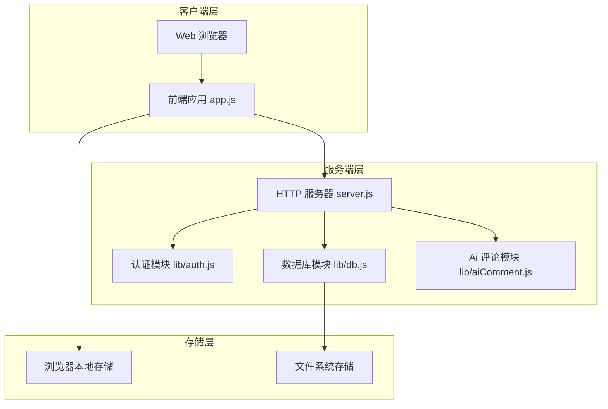
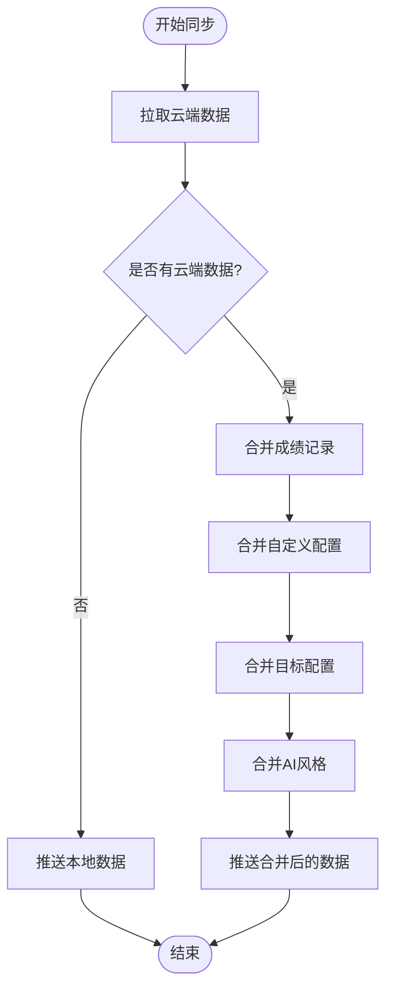
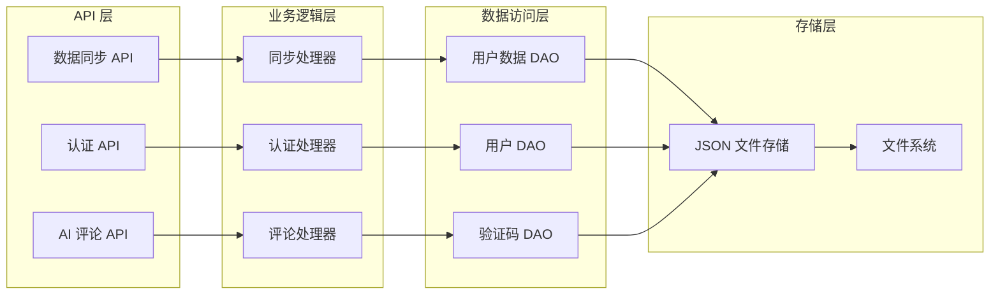
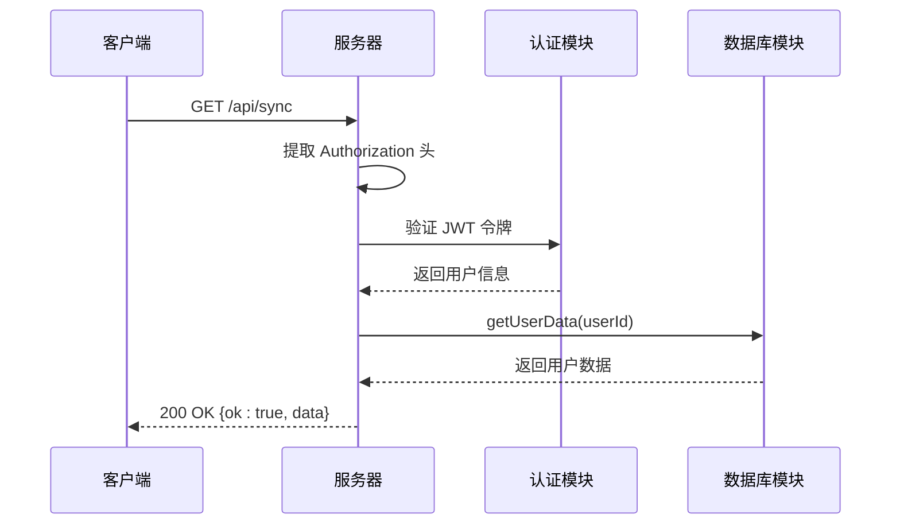
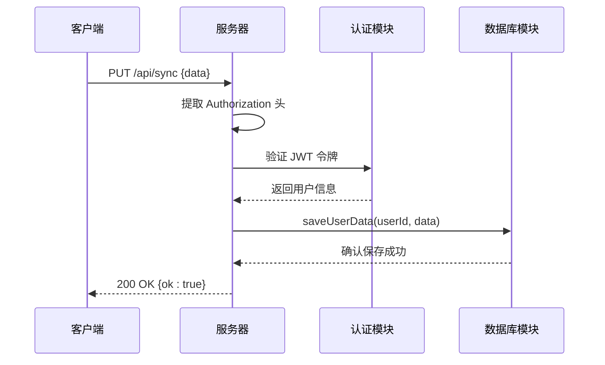
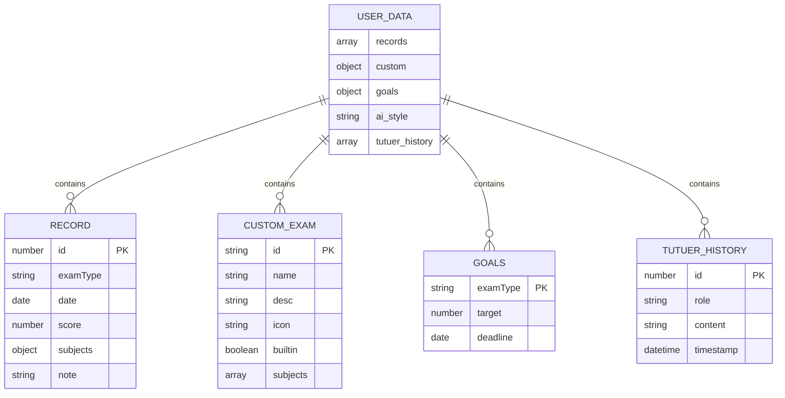
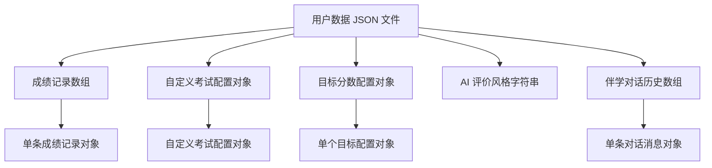
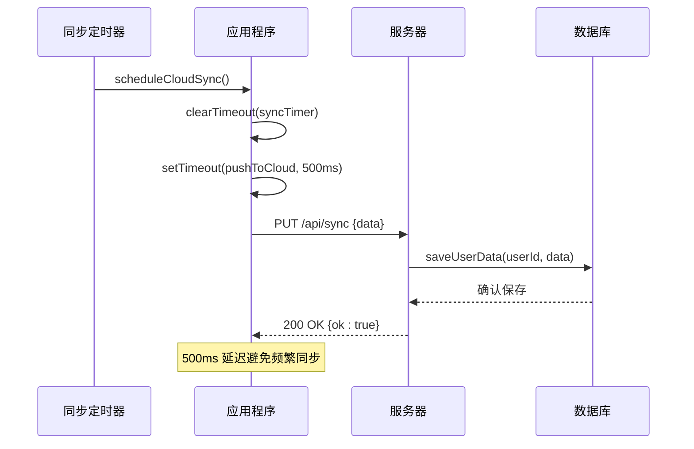
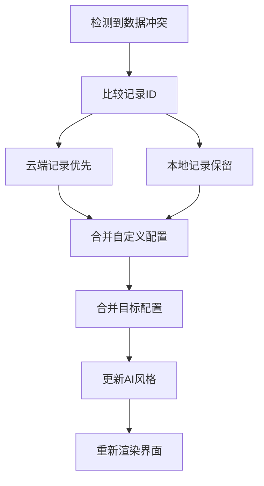
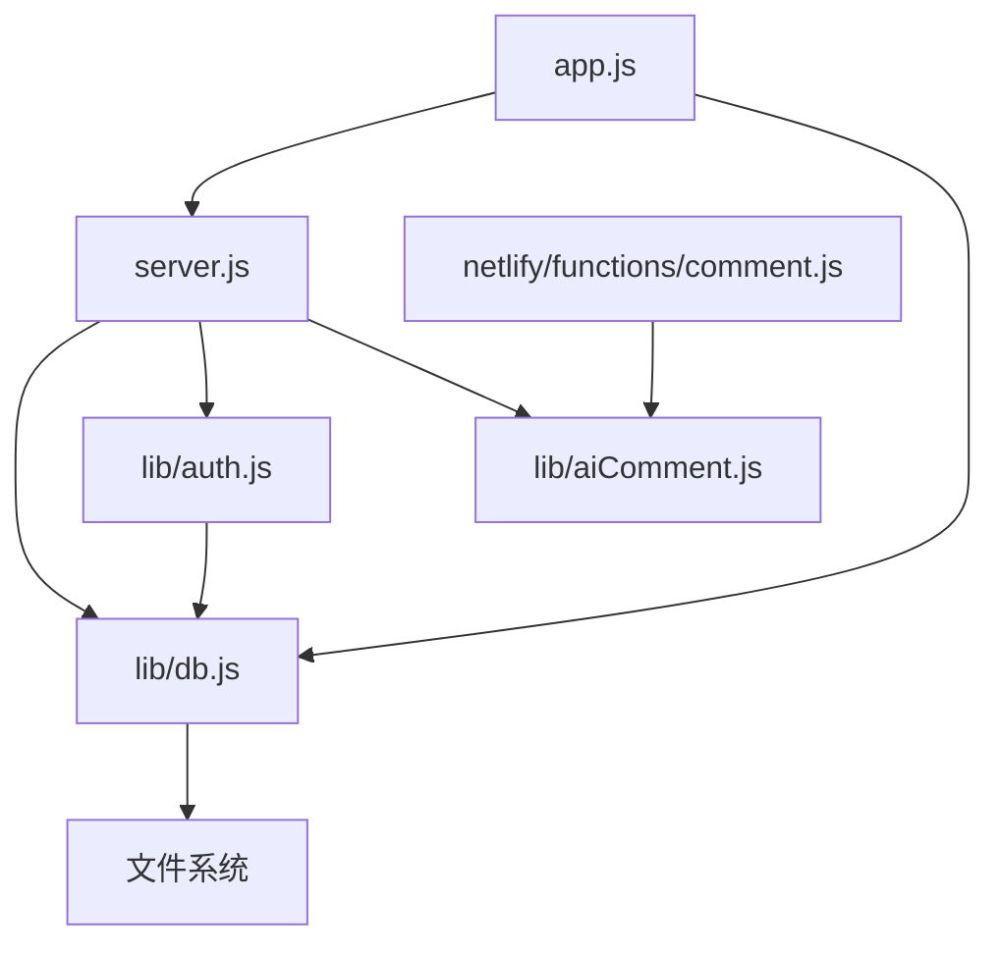

# 数据 API

<cite>
**本文档引用的文件**
- [server.js](file://server.js)
- [app.js](file://app.js)
- [lib/db.js](file://lib/db.js)
- [lib/auth.js](file://lib/auth.js)
- [lib/aiComment.js](file://lib/aiComment.js)
- [netlify/functions/comment.js](file://netlify/functions/comment.js)
- [README.md](file://README.md)
</cite>

## 目录
1. [简介](#简介)
2. [项目结构](#项目结构)
3. [核心组件](#核心组件)
4. [架构概览](#架构概览)
5. [详细组件分析](#详细组件分析)
6. [依赖分析](#依赖分析)
7. [性能考虑](#性能考虑)
8. [故障排除指南](#故障排除指南)
9. [结论](#结论)

## 简介

MyScore 是一个基于 Web 的 AI 智能成绩管理系统，提供云端数据同步功能。本文档专注于数据 API 的完整文档，特别是数据同步接口（/api/sync）的设计与实现。

MyScore 的核心特性包括：
- 云端数据同步：登录后成绩数据自动上传云端，换设备登录数据不丢失
- 用户系统：邮箱验证码登录、密码登录、UID 登录
- AI 智能交互：毒舌老师评价、突突er伴学助手
- 响应式设计：移动端优先适配，支持多平台部署

## 项目结构

MyScore 采用前后端分离的架构设计，主要包含以下组件：

**图表来源**
- [server.js:1-541](file://server.js#L1-L541)
- [app.js:1-800](file://app.js#L1-L800)
- [lib/db.js:1-207](file://lib/db.js#L1-L207)

**章节来源**
- [server.js:1-541](file://server.js#L1-L541)
- [app.js:1-800](file://app.js#L1-L800)
- [lib/db.js:1-207](file://lib/db.js#L1-L207)

## 核心组件

### 数据同步接口

数据同步接口位于 `/api/sync`，提供用户数据的云端同步功能。该接口支持两种 HTTP 方法：

- **GET /api/sync**: 获取用户的云端数据
- **PUT /api/sync**: 保存用户的本地数据到云端

### 数据存储结构

MyScore 将用户数据分为两类存储：

1. **本地存储**：使用浏览器的 localStorage，包含以下键值：
   - `myscore_v51_records`: 成绩记录数组
   - `myscore_v51_custom`: 自定义考试配置对象
   - `myscore_goals`: 目标分数配置
   - `myscore_ai_style`: AI 评价风格设置
   - `myscore_tutuer_history`: 伴学对话历史

2. **云端存储**：使用 JSON 文件存储在服务器端，文件名为 `{userId}.json`

### 数据合并策略

当用户登录后，系统会执行数据合并策略：

**图表来源**
- [app.js:715-743](file://app.js#L715-L743)

**章节来源**
- [app.js:705-743](file://app.js#L705-L743)
- [lib/db.js:190-206](file://lib/db.js#L190-L206)

## 架构概览

MyScore 的数据 API 架构采用分层设计：

**图表来源**
- [server.js:469-502](file://server.js#L469-L502)
- [lib/db.js:190-206](file://lib/db.js#L190-L206)

**章节来源**
- [server.js:469-502](file://server.js#L469-L502)
- [lib/db.js:190-206](file://lib/db.js#L190-L206)

## 详细组件分析

### 数据同步 API 实现

#### GET /api/sync - 获取用户数据

当客户端发起 GET 请求时，服务器执行以下流程：

**图表来源**
- [server.js:469-487](file://server.js#L469-L487)
- [lib/db.js:198-206](file://lib/db.js#L198-L206)

#### PUT /api/sync - 保存用户数据

当客户端发起 PUT 请求时，服务器执行以下流程：

**图表来源**
- [server.js:489-495](file://server.js#L489-L495)
- [lib/db.js:192-196](file://lib/db.js#L192-L196)

**章节来源**
- [server.js:469-502](file://server.js#L469-L502)
- [lib/db.js:190-206](file://lib/db.js#L190-L206)

### 数据结构定义

#### 本地存储数据结构

**图表来源**
- [app.js:705-713](file://app.js#L705-L713)

#### 云端存储数据结构

云端存储采用简单的 JSON 文件格式，文件名为 `{userId}.json`：

**图表来源**
- [lib/db.js:192-196](file://lib/db.js#L192-L196)

**章节来源**
- [app.js:705-713](file://app.js#L705-L713)
- [lib/db.js:190-206](file://lib/db.js#L190-L206)

### 数据验证规则

#### 前端数据验证

前端应用对用户输入进行严格的验证：

- **成绩记录验证**：确保 `id` 为数字，`examType` 为字符串，`date` 为有效日期，`score` 为有效数值
- **自定义考试验证**：验证 `subjects` 数组中的每个科目配置
- **目标配置验证**：确保 `target` 为有效数值，`deadline` 为有效日期
- **AI 风格验证**：仅允许 `storm`、`sun`、`cold`、`rain` 四种风格

#### 后端数据验证

后端服务器对请求数据进行验证：

- **JWT 令牌验证**：确保请求携带有效的 Bearer 令牌
- **数据格式验证**：验证 JSON 数据结构的完整性
- **数据大小限制**：限制请求体大小不超过 1MB

**章节来源**
- [app.js:715-743](file://app.js#L715-L743)
- [server.js:103-112](file://server.js#L103-L112)

### 同步机制

#### 自动同步流程

**图表来源**
- [app.js:666-687](file://app.js#L666-L687)
- [server.js:489-495](file://server.js#L489-L495)

#### 手动同步触发

用户可以通过以下方式触发手动同步：
- 页面加载时自动同步
- 数据变更时自动触发
- 用户手动点击同步按钮

**章节来源**
- [app.js:666-687](file://app.js#L666-L687)
- [app.js:689-703](file://app.js#L689-L703)

### 冲突处理策略

MyScore 采用"云端优先，本地合并"的冲突处理策略：

1. **成绩记录冲突**：比较 `id` 字段，云端记录优先，本地记录保留
2. **自定义配置冲突**：使用 `Object.assign()` 合并，云端配置优先
3. **目标配置冲突**：使用 `Object.assign()` 合并，云端配置优先
4. **AI 风格冲突**：云端配置覆盖本地配置

**图表来源**
- [app.js:715-743](file://app.js#L715-L743)

**章节来源**
- [app.js:715-743](file://app.js#L715-L743)

## 依赖分析

### 组件间依赖关系

**图表来源**
- [server.js:6-8](file://server.js#L6-L8)
- [app.js:1-8](file://app.js#L1-L8)

### 外部依赖

MyScore 使用以下外部服务：

1. **Cloudflare Turnstile**：人机验证服务
2. **Resend**：邮件发送服务
3. **DeepSeek API**：AI 评论服务
4. **DiceBear**：头像生成服务

**章节来源**
- [server.js:52-67](file://server.js#L52-L67)
- [lib/auth.js:9-10](file://lib/auth.js#L9-L10)
- [lib/aiComment.js:73-149](file://lib/aiComment.js#L73-L149)

## 性能考虑

### 缓存策略

- **静态资源缓存**：CSS、JS、图片等文件使用长期缓存策略
- **API 响应缓存**：数据同步接口返回的数据具有适当的缓存控制
- **内存缓存**：JWT 令牌在内存中缓存，避免重复解析

### 限流机制

服务器实现了多种限流机制：

- **IP 限流**：针对敏感端点的请求频率限制
- **验证码限流**：每分钟最多发送 3 次验证码
- **登录限流**：每分钟最多尝试 10 次登录
- **AI 评论限流**：每分钟最多 20 次 AI 评论请求

### 错误处理

- **优雅降级**：网络错误时提供友好的用户提示
- **重试机制**：自动重试短暂的网络错误
- **错误日志**：服务器端记录详细的错误信息

## 故障排除指南

### 常见问题及解决方案

#### 401 未授权错误

**症状**：请求返回 401 未授权错误

**原因**：
- JWT 令牌无效或已过期
- Authorization 头格式不正确

**解决方案**：
1. 检查 JWT 令牌是否正确设置
2. 确认令牌未过期（默认有效期 30 天）
3. 验证 Authorization 头格式：`Bearer <token>`

#### 404 未找到错误

**症状**：请求返回 404 未找到错误

**原因**：
- 用户数据文件不存在
- 用户 ID 无效

**解决方案**：
1. 确认用户已正确登录
2. 检查用户 ID 是否正确
3. 验证数据文件是否存在

#### 500 服务器内部错误

**症状**：请求返回 500 服务器内部错误

**原因**：
- 文件系统权限问题
- 数据格式异常
- 服务器资源不足

**解决方案**：
1. 检查服务器日志获取详细错误信息
2. 验证数据文件格式的完整性
3. 确认服务器有足够的磁盘空间

#### 同步失败

**症状**：数据同步失败，提示网络连接问题

**原因**：
- 网络连接不稳定
- 服务器暂时不可用
- 防火墙阻止请求

**解决方案**：
1. 检查网络连接状态
2. 稍后重试同步操作
3. 检查防火墙设置
4. 联系系统管理员

**章节来源**
- [server.js:478-501](file://server.js#L478-L501)
- [app.js:683-686](file://app.js#L683-L686)

## 结论

MyScore 的数据 API 设计体现了现代 Web 应用的最佳实践：

1. **安全性**：采用 JWT 令牌认证，支持人机验证，实现严格的访问控制
2. **可靠性**：提供完善的错误处理和重试机制，确保数据一致性
3. **性能**：优化的缓存策略和限流机制，提升用户体验
4. **可维护性**：清晰的代码结构和文档，便于后续开发和维护

数据同步功能通过简单而强大的 API 设计，实现了跨设备的数据共享，为用户提供了无缝的学习体验。系统的冲突处理策略确保了数据的完整性和一致性，而严格的安全措施保护了用户隐私和数据安全。