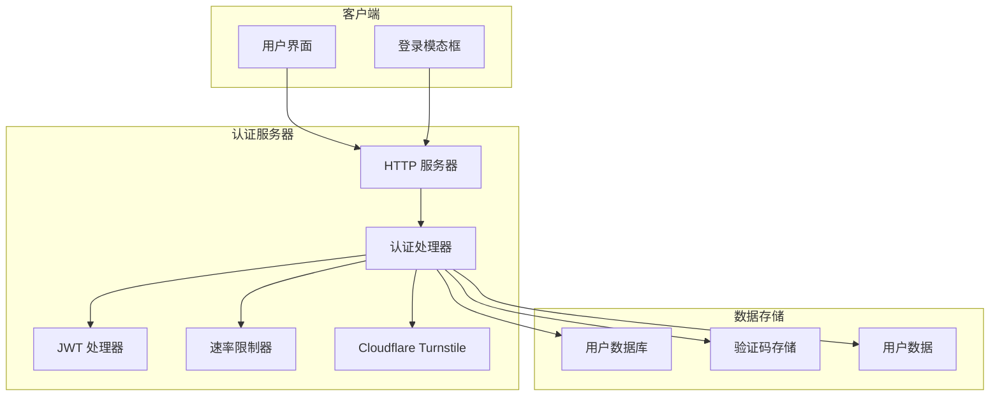
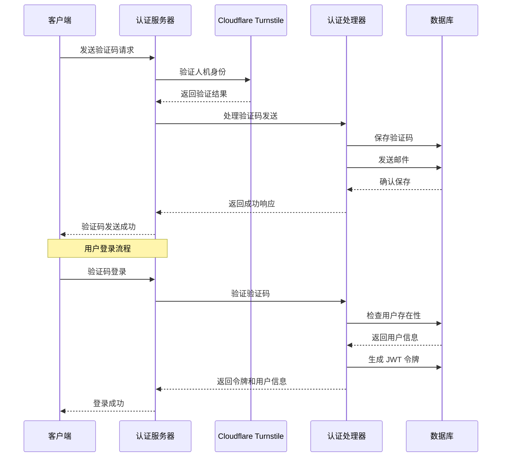
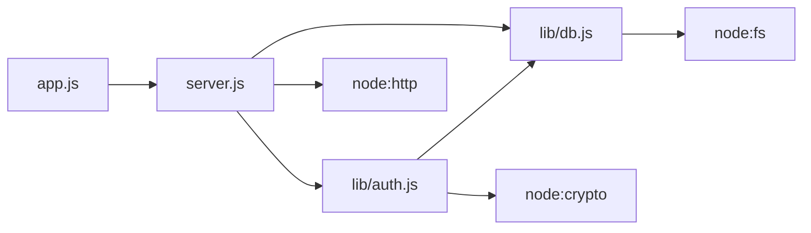
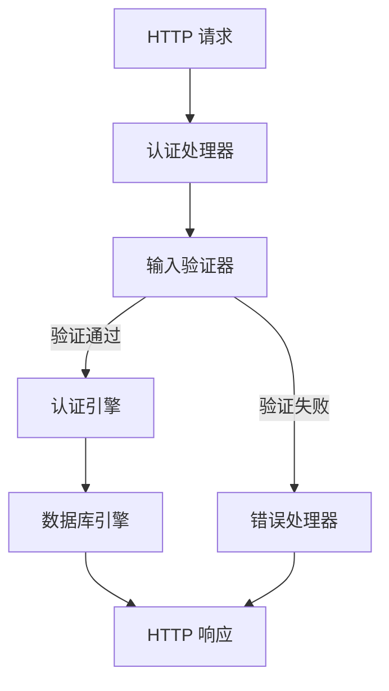

# 认证 API

<cite>
**本文引用的文件**
- [server.js](file://server.js)
- [lib/auth.js](file://lib/auth.js)
- [lib/db.js](file://lib/db.js)
- [app.js](file://app.js)
- [README.md](file://README.md)
</cite>

## 目录
1. [简介](#简介)
2. [项目结构](#项目结构)
3. [核心组件](#核心组件)
4. [架构概览](#架构概览)
5. [详细组件分析](#详细组件分析)
6. [依赖分析](#依赖分析)
7. [性能考虑](#性能考虑)
8. [故障排除指南](#故障排除指南)
9. [结论](#结论)

## 简介
MyScore 是一个具备 AI 交互能力和云端账号系统的考试成绩管理平台。本文档详细记录了认证 API 的所有接口，包括验证码发送、验证码登录、密码登录、用户注册和用户资料查询/更新等核心功能。文档涵盖了人机验证（Cloudflare Turnstile）的集成方式、JWT 令牌的生成和验证机制、验证码验证流程，以及用户资料管理的字段验证规则。

## 项目结构
MyScore 采用前后端分离的架构设计，认证系统由三个主要模块组成：
- 前端交互层：负责用户界面和 API 调用
- 服务器层：处理认证请求和业务逻辑
- 数据存储层：管理用户数据和验证码



**图表来源**
- [server.js:1-541](file://server.js#L1-L541)
- [lib/auth.js:1-191](file://lib/auth.js#L1-L191)
- [lib/db.js:1-207](file://lib/db.js#L1-L207)

**章节来源**
- [server.js:1-541](file://server.js#L1-L541)
- [lib/auth.js:1-191](file://lib/auth.js#L1-L191)
- [lib/db.js:1-207](file://lib/db.js#L1-L207)

## 核心组件
认证系统的核心组件包括：

### 1. 服务器端组件
- **HTTP 服务器**：基于 Node.js 内置 HTTP 模块构建
- **认证处理器**：专门处理所有认证相关的 API 请求
- **JWT 处理器**：实现自定义的 JWT 生成和验证逻辑
- **速率限制器**：防止暴力破解和滥用攻击
- **Cloudflare Turnstile 集成**：可选的人机验证服务

### 2. 数据存储组件
- **用户数据库**：存储用户基本信息和认证凭据
- **验证码存储**：管理一次性验证码及其过期时间
- **用户数据目录**：存储用户的个性化配置和偏好设置

### 3. 前端组件
- **登录模态框**：提供多种登录方式的用户界面
- **Cloudflare Turnstile 集成**：在前端实现人机验证
- **AJAX 请求处理**：与后端 API 进行异步通信

**章节来源**
- [server.js:16-67](file://server.js#L16-L67)
- [lib/db.js:24-46](file://lib/db.js#L24-L46)
- [app.js:149-216](file://app.js#L149-L216)

## 架构概览
认证系统采用分层架构设计，确保了安全性、可扩展性和易维护性。



**图表来源**
- [server.js:283-318](file://server.js#L283-L318)
- [server.js:320-351](file://server.js#L320-L351)
- [lib/auth.js:138-142](file://lib/auth.js#L138-L142)

## 详细组件分析

### 1. 验证码发送接口
**接口地址**：`POST /api/auth/send-code`

#### 功能概述
该接口负责向指定邮箱发送一次性验证码，支持邮箱地址和用户 UID 两种输入方式。

#### 请求参数
| 参数名 | 类型 | 必填 | 描述 | 示例 |
|--------|------|------|------|------|
| account | string | 是 | 用户邮箱地址或 UID | "user@example.com" 或 "1100001" |
| turnstileToken | string | 是 | Cloudflare Turnstile 验证令牌 | "0x...token" |

#### 成功响应
```json
{
  "ok": true,
  "maskedEmail": "u***@example.com"
}
```

#### 错误响应
- 400 Bad Request：人机验证失败
- 400 Bad Request：请输入邮箱或 UID
- 400 Bad Request：该 UID 未注册
- 400 Bad Request：请输入有效的邮箱地址或 UID
- 500 Internal Server Error：服务器内部错误

#### 实现细节
1. **人机验证**：通过 Cloudflare Turnstile 验证用户是否为人类
2. **输入验证**：支持邮箱地址和 UID 两种格式
3. **验证码生成**：6 位数字验证码，5 分钟有效期
4. **邮件发送**：使用 Resend API 发送 HTML 格式的验证码邮件

**章节来源**
- [server.js:283-318](file://server.js#L283-L318)
- [lib/auth.js:138-142](file://lib/auth.js#L138-L142)
- [lib/db.js:129-137](file://lib/db.js#L129-L137)

### 2. 验证码登录接口
**接口地址**：`POST /api/auth/login-code`

#### 功能概述
使用验证码进行用户身份验证，支持新用户注册流程和老用户登录。

#### 请求参数
| 参数名 | 类型 | 必填 | 描述 | 示例 |
|--------|------|------|------|------|
| account | string | 是 | 用户邮箱地址或 UID | "user@example.com" 或 "1100001" |
| code | string | 是 | 6 位验证码 | "123456" |

#### 成功响应
对于新用户：
```json
{
  "ok": true,
  "isNewUser": true
}
```

对于老用户：
```json
{
  "ok": true,
  "token": "eyJhbGciOiJIUzI1NiIsInR5cCI6IkpXVCJ9...",
  "user": {
    "id": 1678886400000,
    "uid": 1100001,
    "email": "user@example.com",
    "nickname": "张三",
    "avatar_seed": "adventurer",
    "bio": "",
    "is_admin": false,
    "is_beta": false
  }
}
```

#### 错误响应
- 400 Bad Request：请输入账号和验证码
- 400 Bad Request：该 UID 未注册
- 401 Unauthorized：验证码错误或已过期
- 500 Internal Server Error：服务器内部错误

#### 实现细节
1. **UID 解析**：支持通过 UID 或邮箱地址登录
2. **验证码验证**：检查验证码的有效性和尝试次数
3. **新用户检测**：如果用户不存在则返回新用户标志
4. **令牌生成**：为老用户生成 JWT 令牌

**章节来源**
- [server.js:320-351](file://server.js#L320-L351)
- [lib/auth.js:179-190](file://lib/auth.js#L179-L190)
- [lib/db.js:139-154](file://lib/db.js#L139-L154)

### 3. 密码登录接口
**接口地址**：`POST /api/auth/login-password`

#### 功能概述
使用邮箱和密码进行用户身份验证，适用于已注册用户。

#### 请求参数
| 参数名 | 类型 | 必填 | 描述 | 示例 |
|--------|------|------|------|------|
| account | string | 是 | 用户邮箱地址或 UID | "user@example.com" 或 "1100001" |
| password | string | 是 | 用户密码 | "securePassword123" |

#### 成功响应
```json
{
  "ok": true,
  "token": "eyJhbGciOiJIUzI1NiIsInR5cCI6IkpXVCJ9...",
  "user": {
    "id": 1678886400000,
    "uid": 1100001,
    "email": "user@example.com",
    "nickname": "张三",
    "avatar_seed": "adventurer",
    "bio": "",
    "is_admin": false,
    "is_beta": false
  }
}
```

#### 错误响应
- 400 Bad Request：请输入账号和密码
- 401 Unauthorized：账号或密码错误
- 500 Internal Server Error：服务器内部错误

#### 实现细节
1. **密码验证**：使用 Scrypt 算法进行密码验证
2. **安全比较**：使用定时安全比较防止时序攻击
3. **令牌生成**：生成 30 天有效期的 JWT 令牌

**章节来源**
- [server.js:369-396](file://server.js#L369-L396)
- [lib/auth.js:168-177](file://lib/auth.js#L168-L177)
- [lib/db.js:118-125](file://lib/db.js#L118-L125)

### 4. 用户注册接口
**接口地址**：`POST /api/auth/register`

#### 功能概述
新用户通过验证码完成注册流程，创建账户并生成初始配置。

#### 请求参数
| 参数名 | 类型 | 必填 | 描述 | 示例 |
|--------|------|------|------|------|
| email | string | 是 | 用户邮箱地址 | "user@example.com" |
| code | string | 是 | 6 位验证码 | "123456" |
| nickname | string | 是 | 用户昵称 | "张三" |
| avatarSeed | string | 否 | 头像种子 | "adventurer" |
| bio | string | 否 | 个性签名 | "学习使我快乐" |
| password | string | 是 | 用户密码 | "securePassword123" |
| inviteCode | string | 否 | 内测邀请码 | "BETA2026" |

#### 成功响应
```json
{
  "ok": true,
  "token": "eyJhbGciOiJIUzI1NiIsInR5cCI6IkpXVCJ9...",
  "user": {
    "id": 1678886400000,
    "uid": 1100001,
    "email": "user@example.com",
    "nickname": "张三",
    "avatar_seed": "adventurer",
    "bio": "",
    "is_admin": false,
    "is_beta": false
  }
}
```

#### 错误响应
- 400 Bad Request：缺少必填字段
- 400 Bad Request：验证码错误或已过期
- 400 Bad Request：请输入昵称
- 400 Bad Request：昵称最多20个字符
- 400 Bad Request：无效的头像选择
- 400 Bad Request：个性签名最多60个字符
- 400 Bad Request：密码至少6位
- 400 Bad Request：该邮箱已注册
- 500 Internal Server Error：服务器内部错误

#### 实现细节
1. **验证码验证**：验证注册验证码的有效性
2. **字段验证**：严格验证所有输入字段
3. **邀请码系统**：支持内测邀请码机制
4. **密码加密**：使用 Scrypt 算法加密密码
5. **UID 分配**：为新用户分配唯一用户 ID

**章节来源**
- [server.js:353-367](file://server.js#L353-L367)
- [lib/auth.js:144-166](file://lib/auth.js#L144-L166)
- [lib/db.js:73-94](file://lib/db.js#L73-L94)

### 5. 用户资料查询/更新接口
**接口地址**：`GET /api/auth/profile` 和 `PUT /api/auth/profile`

#### GET 请求 - 用户资料查询
**请求头**：`Authorization: Bearer <JWT_TOKEN>`

##### 成功响应
```json
{
  "ok": true,
  "profile": {
    "id": 1678886400000,
    "uid": 1100001,
    "email": "user@example.com",
    "nickname": "张三",
    "avatar_seed": "adventurer",
    "bio": "学习使我快乐",
    "is_admin": false,
    "is_beta": false
  }
}
```

##### 错误响应
- 401 Unauthorized：未登录或登录已过期
- 404 Not Found：用户不存在
- 500 Internal Server Error：服务器内部错误

#### PUT 请求 - 用户资料更新
**请求头**：`Authorization: Bearer <JWT_TOKEN>`

##### 请求参数
| 参数名 | 类型 | 必填 | 描述 | 示例 |
|--------|------|------|------|------|
| nickname | string | 否 | 用户昵称 | "李四" |
| avatar_seed | string | 否 | 头像种子 | "lorelei" |
| bio | string | 否 | 个性签名 | "新的个性签名" |

##### 成功响应
```json
{
  "ok": true,
  "profile": {
    "id": 1678886400000,
    "uid": 1100001,
    "email": "user@example.com",
    "nickname": "李四",
    "avatar_seed": "lorelei",
    "bio": "新的个性签名",
    "is_admin": false,
    "is_beta": false
  }
}
```

##### 错误响应
- 400 Bad Request：昵称需1-20个字符
- 400 Bad Request：无效的头像选择
- 400 Bad Request：个性签名最多60个字符
- 401 Unauthorized：未登录或登录已过期
- 404 Not Found：用户不存在
- 500 Internal Server Error：服务器内部错误

#### 实现细节
1. **JWT 验证**：验证用户身份令牌的有效性
2. **字段验证**：严格验证更新字段的格式和长度
3. **头像验证**：确保头像种子在允许列表中
4. **数据脱敏**：查询响应中不包含敏感信息

**章节来源**
- [server.js:398-455](file://server.js#L398-L455)
- [lib/auth.js:36-59](file://lib/auth.js#L36-L59)
- [lib/db.js:96-108](file://lib/db.js#L96-L108)

## 依赖分析

### 1. 外部依赖
- **Node.js 内置模块**：crypto、fs、http、path、zlib
- **Cloudflare Turnstile**：人机验证服务
- **Resend API**：邮件发送服务
- **DiceBear API**：头像生成服务

### 2. 内部模块依赖


**图表来源**
- [server.js:1-8](file://server.js#L1-L8)
- [lib/auth.js:1-2](file://lib/auth.js#L1-L2)
- [lib/db.js:1-3](file://lib/db.js#L1-L3)

### 3. 数据流依赖


**图表来源**
- [server.js:275-462](file://server.js#L275-L462)

**章节来源**
- [server.js:1-541](file://server.js#L1-L541)
- [lib/auth.js:1-191](file://lib/auth.js#L1-L191)
- [lib/db.js:1-207](file://lib/db.js#L1-L207)

## 性能考虑
认证系统在设计时充分考虑了性能和可扩展性：

### 1. 速率限制
- **验证码发送**：每分钟最多 3 次请求
- **登录尝试**：每分钟最多 10 次请求
- **AI 评论**：每分钟最多 20 次请求

### 2. 缓存策略
- **内存缓存**：验证码存储在内存中，提高访问速度
- **文件存储**：用户数据持久化到 JSON 文件
- **会话缓存**：JWT 令牌在内存中验证，避免数据库查询

### 3. 安全优化
- **定时安全比较**：防止时序攻击
- **令牌过期**：JWT 令牌 30 天有效期
- **输入验证**：严格的输入参数验证

## 故障排除指南

### 1. 常见错误及解决方案

#### 人机验证失败
**症状**：验证码发送接口返回 400 错误
**原因**：Cloudflare Turnstile 验证失败
**解决方案**：
- 检查 TURNSTILE_SECRET_KEY 环境变量配置
- 确认前端 Turnstile Widget 正常加载
- 重新进行人机验证

#### 验证码错误或过期
**症状**：验证码登录接口返回 401 错误
**原因**：验证码错误、过期或尝试次数过多
**解决方案**：
- 重新发送验证码
- 确认验证码在 5 分钟有效期内
- 检查验证码尝试次数限制

#### JWT 令牌验证失败
**症状**：用户资料查询/更新接口返回 401 错误
**原因**：令牌过期或无效
**解决方案**：
- 重新登录获取新令牌
- 检查 Authorization 头格式
- 确认 JWT_SECRET 环境变量配置

#### 数据库文件损坏
**症状**：用户注册或登录失败
**原因**：JSON 文件格式错误或权限问题
**解决方案**：
- 检查 data 目录权限
- 验证 JSON 文件格式
- 重启服务器进程

### 2. 调试技巧
1. **启用详细日志**：检查服务器控制台输出
2. **验证环境变量**：确认所有必需的环境变量已设置
3. **测试 API 端点**：使用 curl 或 Postman 测试各个接口
4. **监控速率限制**：观察是否有请求被限流

**章节来源**
- [server.js:18-48](file://server.js#L18-L48)
- [lib/auth.js:4-8](file://lib/auth.js#L4-L8)
- [lib/db.js:24-30](file://lib/db.js#L24-L30)

## 结论
MyScore 的认证系统提供了完整、安全、易用的身份验证解决方案。系统采用分层架构设计，结合了 Cloudflare Turnstile 人机验证、JWT 令牌机制、Scrypt 密码加密和严格的输入验证，确保了用户数据的安全性和系统的稳定性。

主要特点包括：
- **多因子认证**：支持验证码登录和密码登录两种方式
- **安全防护**：人机验证、速率限制、输入验证、密码加密
- **用户体验**：简洁的登录界面、流畅的注册流程
- **可扩展性**：模块化设计，易于维护和扩展

通过本文档提供的详细接口说明和最佳实践指导，开发者可以有效地集成和使用认证系统，为用户提供安全可靠的身份验证服务。