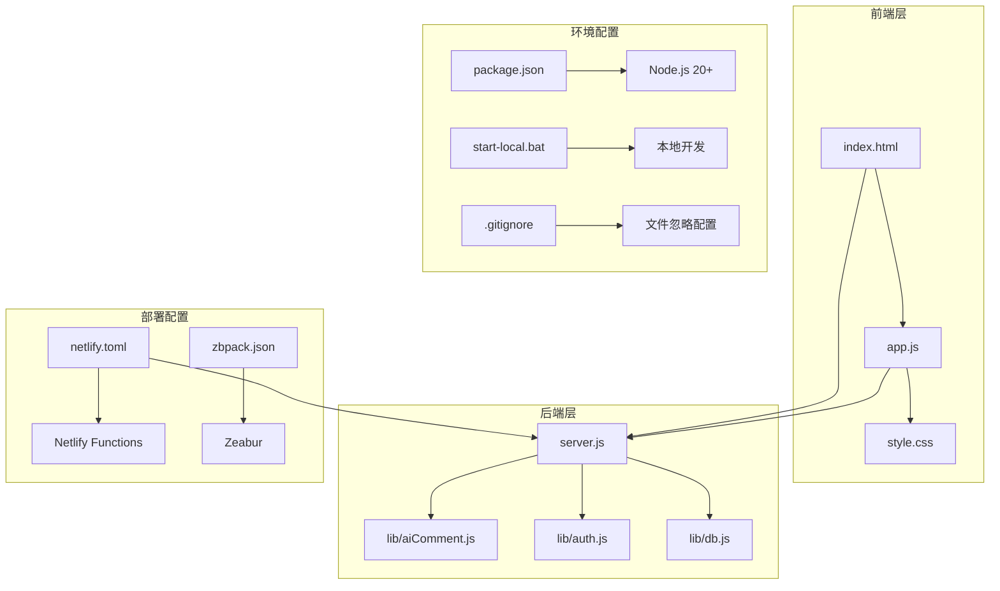
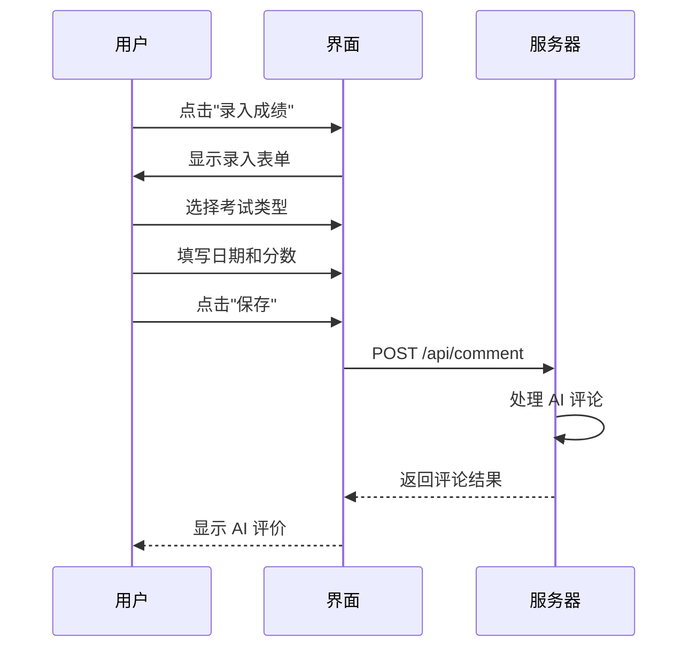

# 快速开始

<cite>
**本文引用的文件**
- [README.md](file://README.md)
- [package.json](file://package.json)
- [DEPLOYMENT.md](file://DEPLOYMENT.md)
- [netlify.toml](file://netlify.toml)
- [zbpack.json](file://zbpack.json)
- [server.js](file://server.js)
- [app.js](file://app.js)
- [start-local.bat](file://start-local.bat)
- [.gitignore](file://.gitignore)
- [lib/aiComment.js](file://lib/aiComment.js)
- [lib/auth.js](file://lib/auth.js)
- [lib/db.js](file://lib/db.js)
- [index.html](file://index.html)
- [CHANGELOG.md](file://CHANGELOG.md)
</cite>

## 目录
1. [简介](#简介)
2. [项目结构](#项目结构)
3. [环境要求](#环境要求)
4. [安装与配置](#安装与配置)
5. [部署方式](#部署方式)
6. [本地开发环境](#本地开发环境)
7. [基本使用示例](#基本使用示例)
8. [故障排除](#故障排除)
9. [结论](#结论)

## 简介

MyScore 是一个功能完善的 AI 智能成绩管理系统，具备云端账号系统和 AI 交互能力。项目采用前后端分离架构，支持 Netlify 和 Zeabur 两种部署方式，为用户提供便捷的成绩管理、AI 评论和数据分析功能。

## 项目结构

MyScore 项目采用模块化设计，主要包含以下核心组件：



**图表来源**
- [index.html:1-200](file://index.html#L1-L200)
- [server.js:1-541](file://server.js#L1-L541)
- [lib/aiComment.js:1-172](file://lib/aiComment.js#L1-L172)
- [.gitignore:1-13](file://.gitignore#L1-L13)

**章节来源**
- [README.md:217-236](file://README.md#L217-L236)
- [package.json:1-13](file://package.json#L1-L13)

## 环境要求

### Node.js 版本要求

项目要求 Node.js 版本为 20 或更高版本：

- **最低版本**: Node.js 20+
- **推荐版本**: 最新 LTS 版本
- **引擎配置**: 在 `package.json` 中明确指定

### 浏览器兼容性

项目支持主流现代浏览器：

- **Chrome**: 最新版本
- **Firefox**: 最新版本  
- **Safari**: 最新版本
- **Edge**: 最新版本

### 前置条件

1. **Git 基础**: 熟悉基本的 Git 操作
2. **Node.js 环境**: 本地开发需要安装 Node.js 20+
3. **网络连接**: 需要访问外部 API（AI 服务、邮件服务等）
4. **开发工具**: 建议使用 VS Code 或其他现代 IDE

**章节来源**
- [package.json:6-8](file://package.json#L6-L8)
- [README.md:324-335](file://README.md#L324-L335)

## 安装与配置

### 1. 克隆项目

```bash
git clone https://github.com/your-username/myscore.git
cd myscore
```

### 2. 本地开发环境准备

#### Windows 环境
1. 双击 `start-local.bat` 文件
2. 在文件中填写你的 API 密钥
3. 系统会自动设置环境变量并启动服务

#### Linux/macOS 环境
```bash
# 设置环境变量
export AI_API_KEY=sk-your_deepseek_key
export JWT_SECRET=your_jwt_secret_key
export ALLOWED_ORIGIN=http://localhost:3000

# 启动服务
npm start
```

### 3. 环境变量配置

| 环境变量 | 必需性 | 默认值 | 说明 |
|---------|--------|--------|------|
| `AI_API_KEY` | 必需 | - | DeepSeek API 密钥 |
| `JWT_SECRET` | 必需 | - | JWT 令牌加密密钥 |
| `ALLOWED_ORIGIN` | 可选 | `*` | CORS 允许的域名 |
| `RESEND_API_KEY` | 可选 | - | Resend 邮件服务密钥 |
| `RESEND_FROM` | 可选 | `MyScore <onboarding@resend.dev>` | 发件人地址 |
| `TURNSTILE_SECRET_KEY` | 可选 | - | Cloudflare Turnstile 密钥 |
| `DATA_DIR` | 可选 | `./data` | 数据存储目录 |
| `FEISHU_APP_ID` | 可选 | - | 飞书应用 ID（飞书集成功能） |
| `FEISHU_APP_SECRET` | 可选 | - | 飞书应用密钥（飞书集成功能） |
| `FEISHU_ENCRYPT_KEY` | 可选 | - | 飞书加密密钥（飞书集成功能） |

**章节来源**
- [start-local.bat:1-7](file://start-local.bat#L1-L7)
- [lib/auth.js:4-10](file://lib/auth.js#L4-L10)
- [server.js:162-165](file://server.js#L162-L165)

## 部署方式

### 方式一：Netlify 一键部署

#### 部署步骤

1. **Fork 项目**
   - 将项目 Fork 到你的 GitHub 账户

2. **登录 Netlify**
   - 访问 [Netlify](https://www.netlify.com/)
   - 选择 "Import from Git"

3. **配置环境变量**
   - 在 "Environment variables" 中添加：
     - Key: `AI_API_KEY`
     - Value: `sk-xxxx...` (你的 DeepSeek API Key)

4. **自动配置**
   - 项目已内置 `netlify.toml`
   - 会自动将 `/api/comment` 转发到 Netlify Function

5. **等待部署**
   - 等待 Netlify 完成构建和部署
   - 访问生成的 Netlify 域名

#### Netlify 配置详情

```mermaid
flowchart TD
A[用户访问] --> B[/api/comment 请求]
B --> C[Netlify 重定向]
C --> D[/.netlify/functions/comment]
D --> E[Netlify Function 处理]
E --> F[返回 AI 评论结果]
```

**图表来源**
- [netlify.toml:4-7](file://netlify.toml#L4-L7)
- [DEPLOYMENT.md:15-34](file://DEPLOYMENT.md#L15-L34)

**章节来源**
- [README.md:183-191](file://README.md#L183-L191)
- [netlify.toml:1-9](file://netlify.toml#L1-L9)

### 方式二：Zeabur 完整部署

#### 部署步骤

1. **创建项目**
   - 使用同一个 GitHub 仓库在 Zeabur 创建项目

2. **配置环境变量**
   - `AI_API_KEY`: DeepSeek API Key
   - `JWT_SECRET`: 随机长字符串（必须设置）
   - `RESEND_API_KEY`: Resend API Key
   - `RESEND_FROM`: 发件人地址
   - `INVITE_CODES`: 内测邀请码列表（可选）

3. **Cloudflare Turnstile 配置**
   - 在 Cloudflare Dashboard 创建 Site
   - 获取 Site Key 和 Secret Key
   - Site Key 填入 `app.js` 顶部变量
   - Secret Key 填入 Zeabur 环境变量

4. **启动配置**
   - 仓库包含 `server.js`、`package.json`、`zbpack.json`
   - 默认启动命令为 `npm start`

#### Zeabur 功能特性

| 功能 | 状态 | 说明 |
|------|------|------|
| AI 评价 | ✅ 完整支持 | 使用 DeepSeek API |
| 用户系统 | ✅ 完整支持 | 邮箱验证码 + 密码登录 |
| 云端同步 | ✅ 完整支持 | 跨设备数据同步 |
| 仪表盘 | ✅ 完整支持 | 成绩趋势图表 |
| 报告导出 | ✅ 完整支持 | 多种格式导出 |
| 伴学助手 | ✅ 完整支持 | 突突er 伴学对话 |
| 飞书集成 | ✅ 完整支持 | 飞书机器人绑定、成绩通知推送、命令查询 |

**章节来源**
- [README.md:193-206](file://README.md#L193-L206)
- [DEPLOYMENT.md:36-65](file://DEPLOYMENT.md#L36-L65)

## 本地开发环境

### 启动本地服务

#### Windows 环境
1. 双击 `start-local.bat` 文件
2. 在文件中填写你的 API 密钥
3. 系统会自动启动服务

#### Linux/macOS 环境
```bash
# 设置必要的环境变量
export AI_API_KEY=sk-your_deepseek_key
export JWT_SECRET=your_jwt_secret_key
export ALLOWED_ORIGIN=http://localhost:3000

# 启动服务
npm start
```

### 开发工具配置

#### VS Code 推荐扩展
- **ESLint**: JavaScript 代码检查
- **Prettier**: 代码格式化
- **Live Server**: 本地服务器预览
- **Auto Rename Tag**: HTML 标签自动重命名

#### 调试配置
```json
{
    "version": "0.2.0",
    "configurations": [
        {
            "type": "node",
            "request": "launch",
            "name": "Debug Server",
            "program": "${workspaceFolder}/server.js",
            "env": {
                "AI_API_KEY": "sk-your-key",
                "JWT_SECRET": "your-secret"
            }
        }
    ]
}
```

### 文件忽略配置

项目使用 `.gitignore` 文件来保护敏感信息和不必要的文件：

**更新后的 .gitignore 配置**：
- `node_modules/` - 第三方依赖包
- `.env` - 环境变量文件
- `.env.local` - 本地环境变量文件（已移除重复条目）
- `start-local.bat` - 本地启动脚本
- `.qoder/` - Qoder 开发工具配置目录（新增）
- `.DS_Store` - macOS 系统文件
- `Thumbs.db` - Windows 系统文件
- `*.log` - 日志文件
- `dist/` - 构建输出目录
- `.cache/` - 缓存目录
- `.netlify/` - Netlify 构建缓存
- `data/` - 数据存储目录

**重要变更说明**：
- 移除了重复的 `.env.local` 条目，避免不必要的重复配置
- 新增 `.qoder/` 条目，保护 Qoder 开发工具的配置文件
- 这些变更增强了开发环境的安全性和整洁性

**章节来源**
- [start-local.bat:1-7](file://start-local.bat#L1-L7)
- [package.json:9-11](file://package.json#L9-L11)
- [.gitignore:1-13](file://.gitignore#L1-L13)
- [CHANGELOG.md:220-223](file://CHANGELOG.md#L220-L223)

## 基本使用示例

### 1. 录入成绩

#### 操作流程



**图表来源**
- [index.html:116-124](file://index.html#L116-L124)
- [server.js:135-176](file://server.js#L135-L176)

#### 录入步骤
1. 点击导航栏的"录入成绩"按钮
2. 选择考试类型（雅思、四六级、自定义等）
3. 填写考试日期
4. 录入各项分数
5. 点击"保存"按钮
6. 查看 AI 智能评价

### 2. 使用 AI 评论功能

#### AI 评论类型

| 类型 | 特点 | 适用场景 |
|------|------|----------|
| 风暴 | 毒舌犀利 | 需要直接反馈时 |
| 暖阳 | 温暖鼓励 | 需要心理支持时 |
| 冷锋 | 理性分析 | 需要客观数据时 |
| 阵雨 | 先损后帮 | 需要激励时 |

#### 使用方法
1. 录入成绩后自动触发 AI 评论
2. 点击"回嘴"按钮进行多轮对话
3. 在"仪表盘"中查看历史评论
4. 切换不同的 AI 评论风格

### 3. 查看统计数据

#### 仪表盘功能
1. **总考试次数**: 显示累计考试数量
2. **考试类型**: 统计不同类型考试数量
3. **最近考试**: 显示最新考试日期
4. **趋势图表**: 使用 Chart.js 绘制成绩变化曲线

#### 报告导出
1. 点击"仪表盘"中的"导出报告"
2. 选择报告类型（卡片、详细报告、学习总结）
3. 预览并保存图片或复制文本

**章节来源**
- [README.md:208-213](file://README.md#L208-L213)
- [index.html:150-200](file://index.html#L150-L200)

## 故障排除

### 常见问题及解决方案

#### 1. JWT_SECRET 未设置
**问题**: 服务器启动时报错
**解决方案**: 
```bash
# 生成随机密钥
openssl rand -hex 32
# 在环境变量中设置
export JWT_SECRET=生成的32位十六进制字符串
```

#### 2. AI API Key 配置错误
**问题**: AI 评论功能无法使用
**解决方案**:
- 确认 DeepSeek API Key 格式正确
- 检查 API Key 是否有使用额度
- 验证网络连接是否正常

#### 3. CORS 跨域问题
**问题**: 前端无法访问后端 API
**解决方案**:
```bash
# 设置允许的域名
export ALLOWED_ORIGIN=http://localhost:3000,https://your-domain.com
```

#### 4. Turnstile 人机验证失败
**问题**: 注册/登录时人机验证失败
**解决方案**:
- 确认 Cloudflare Site Key 和 Secret Key 配置正确
- 检查网络连接和防火墙设置
- 验证域名是否在 Cloudflare 中正确配置

#### 5. 本地开发启动失败
**问题**: `npm start` 执行失败
**解决方案**:
- 确认 Node.js 版本满足要求（>=20）
- 检查端口占用情况（默认 3000）
- 验证环境变量配置正确

#### 6. 文件被意外提交到 Git
**问题**: .env 或其他敏感文件被提交到版本控制
**解决方案**:
- 检查 `.gitignore` 配置是否正确
- 确保 `.env` 文件被正确忽略
- 如已提交，使用 `git rm --cached` 移除并更新 `.gitignore`

**章节来源**
- [README.md:326-335](file://README.md#L326-L335)
- [lib/auth.js:5-8](file://lib/auth.js#L5-L8)
- [.gitignore:1-13](file://.gitignore#L1-L13)

## 结论

MyScore 项目提供了完整的成绩管理解决方案，具有以下优势：

### 核心优势
1. **双平台部署**: 支持 Netlify 和 Zeabur 两种部署方式
2. **AI 智能交互**: 多种 AI 评论风格，支持多轮对话
3. **云端同步**: 跨设备数据同步，保证数据安全
4. **响应式设计**: 支持桌面和移动设备
5. **零依赖**: 使用 Node.js 内置模块，减少外部依赖
6. **安全配置**: 完善的文件忽略配置，保护敏感信息

### 快速上手建议
- **新手用户**: 建议使用 Netlify 一键部署，快速体验核心功能
- **开发者**: 建议使用 Zeabur 完整部署，体验完整功能
- **本地开发**: 使用提供的启动脚本，快速搭建开发环境

### 学习路径
1. **第1天**: 完成部署和基础使用
2. **第3天**: 探索 AI 评论功能和统计数据
3. **第7天**: 自定义考试类型和高级功能
4. **第15天**: 掌握完整功能和最佳实践

### 安全注意事项
- **环境变量管理**: 使用 `.env` 文件存储敏感信息，确保不会被提交到版本控制
- **文件忽略配置**: 定期检查 `.gitignore` 文件，确保敏感文件被正确忽略
- **开发工具配置**: 注意 `.qoder/` 目录的保护，避免开发工具配置泄露

通过本快速开始指南，您应该能够在 15 分钟内成功运行 MyScore 项目并体验核心功能。如需进一步了解，建议参考项目中的详细文档和示例代码。