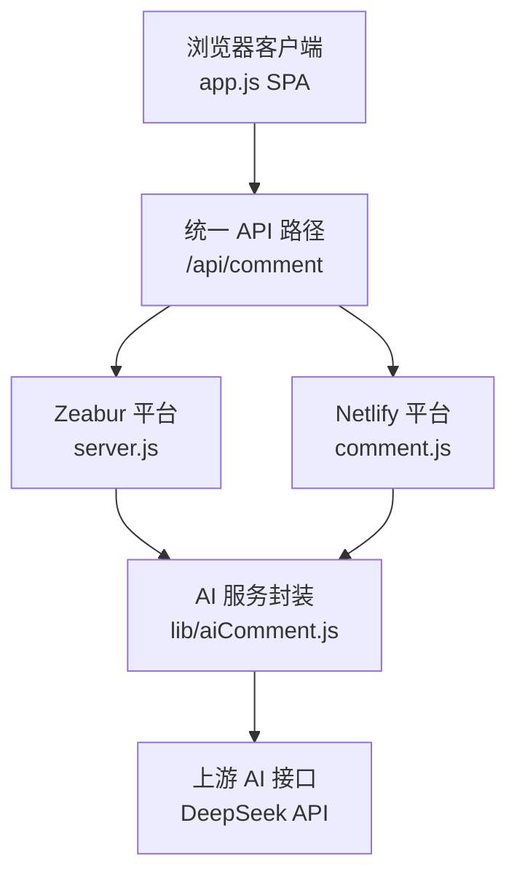
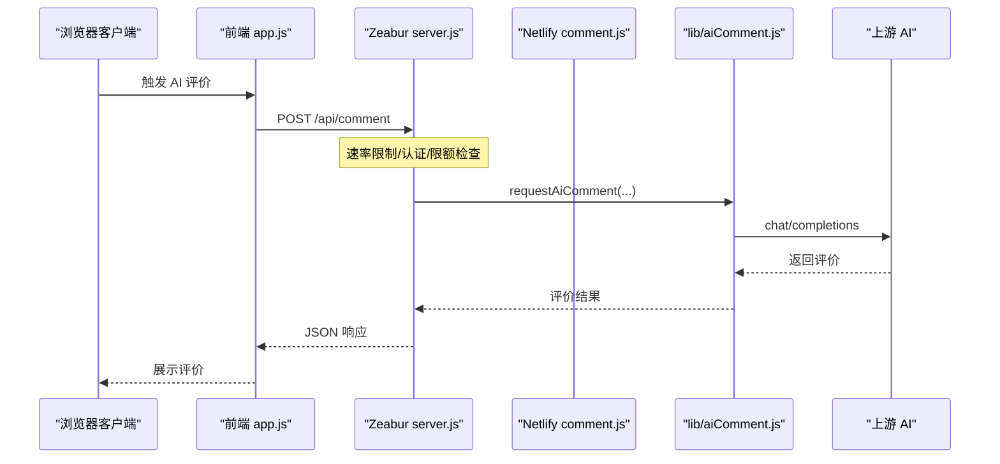
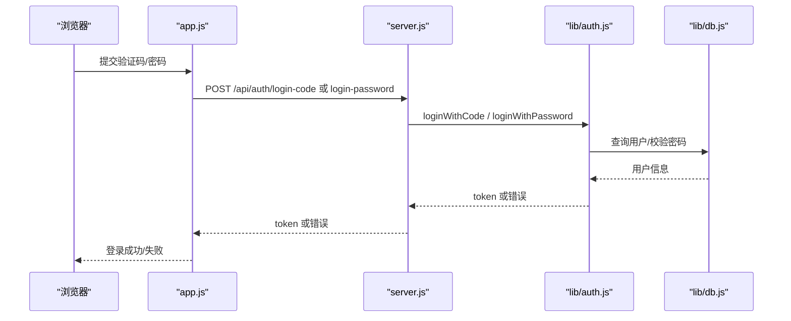
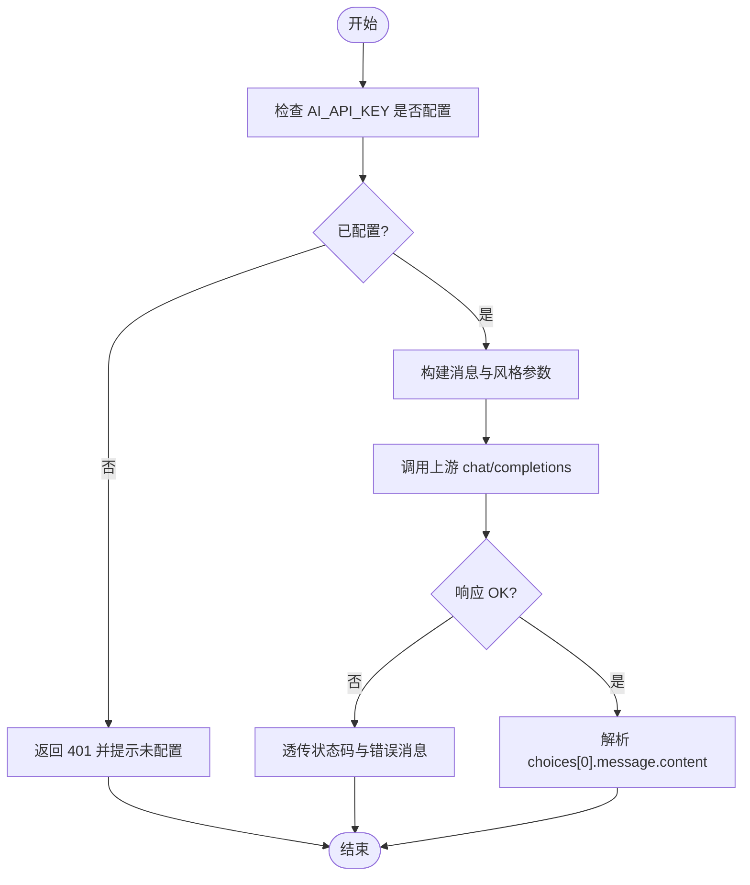
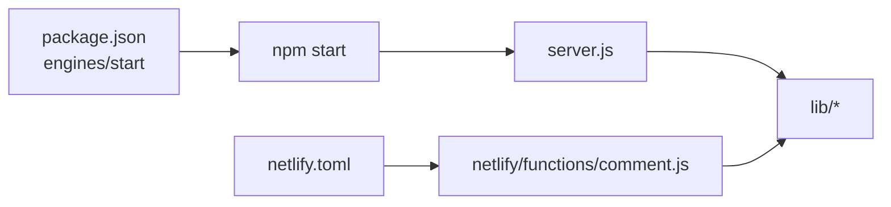

# 故障排除

<cite>
**本文引用的文件**
- [README.md](file://README.md)
- [DEPLOYMENT.md](file://DEPLOYMENT.md)
- [app.js](file://app.js)
- [server.js](file://server.js)
- [lib/auth.js](file://lib/auth.js)
- [lib/aiComment.js](file://lib/aiComment.js)
- [lib/db.js](file://lib/db.js)
- [netlify/functions/comment.js](file://netlify/functions/comment.js)
- [netlify.toml](file://netlify.toml)
- [zbpack.json](file://zbpack.json)
- [package.json](file://package.json)
</cite>

## 目录
1. [简介](#简介)
2. [项目结构](#项目结构)
3. [核心组件](#核心组件)
4. [架构总览](#架构总览)
5. [详细组件分析](#详细组件分析)
6. [依赖分析](#依赖分析)
7. [性能考虑](#性能考虑)
8. [故障排除指南](#故障排除指南)
9. [结论](#结论)
10. [附录](#附录)

## 简介
本指南面向 MyScore 的运维与开发人员，聚焦于部署、API 调用失败、认证错误、AI 服务异常等常见问题的诊断与解决。内容覆盖错误代码与响应说明、调试方法（浏览器开发者工具、网络请求检查、服务器日志）、性能优化与内存泄漏检测、安全问题排查（JWT 配置、CORS、API Key 泄漏防护）、以及版本兼容与升级注意事项。

## 项目结构
MyScore 采用前后端分离与平台适配策略：
- 前端单页应用（SPA）通过统一的 /api/comment 路径与后端交互
- 后端在 Zeabur 平台由 server.js 提供静态资源与 API 服务
- Netlify 平台通过 netlify.toml 将 /api/comment 重写到 Netlify Functions 的 comment.js
- AI 逻辑在 lib/aiComment.js 中统一实现，供 Zeabur server.js 与 Netlify Functions 共用

**图表来源**
- [app.js](file://app.js)
- [server.js](file://server.js)
- [netlify/functions/comment.js](file://netlify/functions/comment.js)
- [lib/aiComment.js](file://lib/aiComment.js)

**章节来源**
- [README.md](file://README.md)
- [DEPLOYMENT.md](file://DEPLOYMENT.md)
- [netlify.toml](file://netlify.toml)

## 核心组件
- 前端交互与认证流程：app.js 负责登录、注册、资料编辑、云端同步、AI 评价触发与展示
- 认证与用户管理：lib/auth.js 实现 JWT 签发与校验、验证码发送与校验、密码哈希与比对、邀请码与内测标识
- 数据持久化：lib/db.js 提供用户、验证码、用户数据文件的读写与 UID 分配
- AI 服务封装：lib/aiComment.js 统一构建消息、温度与 token 控制、上游请求与错误透传
- 服务端路由与限流：server.js 提供 /api/comment、/api/auth/*、/api/sync 的处理与速率限制、CORS、Turnstile 校验
- Netlify 适配：netlify/functions/comment.js 与 netlify.toml 将 /api/comment 代理到函数

**章节来源**
- [app.js](file://app.js)
- [lib/auth.js](file://lib/auth.js)
- [lib/db.js](file://lib/db.js)
- [lib/aiComment.js](file://lib/aiComment.js)
- [server.js](file://server.js)
- [netlify/functions/comment.js](file://netlify/functions/comment.js)
- [netlify.toml](file://netlify.toml)

## 架构总览
统一 API 路径与平台适配确保同一前端代码可在 Netlify 与 Zeabur 上工作，同时保留各自的环境变量与部署参数。

**图表来源**
- [app.js](file://app.js)
- [server.js](file://server.js)
- [lib/aiComment.js](file://lib/aiComment.js)

## 详细组件分析

### 组件 A：认证与用户系统
- 关键点
  - JWT_SECRET 必须配置，否则进程直接退出
  - 支持邮箱/UID 登录与验证码登录，密码登录
  - 云端资料查询与更新，头像种子与昵称长度校验
  - 邀请码与内测标识，头像选项校验
- 常见问题
  - 401 未登录或过期：检查 Authorization 头与 token 是否过期
  - 400 参数校验失败：昵称长度、头像种子、签名长度、密码长度
  - 400 验证码错误/过期/次数过多：检查验证码存储与过期时间
- 诊断步骤
  - 检查环境变量 JWT_SECRET 是否存在
  - 检查前端是否正确携带 Bearer Token
  - 查看服务器日志中的认证错误堆栈

**图表来源**
- [app.js](file://app.js)
- [server.js](file://server.js)
- [lib/auth.js](file://lib/auth.js)
- [lib/db.js](file://lib/db.js)

**章节来源**
- [lib/auth.js](file://lib/auth.js)
- [lib/db.js](file://lib/db.js)
- [server.js](file://server.js)
- [app.js](file://app.js)

### 组件 B：AI 服务封装与调用
- 关键点
  - 统一构建系统提示与用户消息，支持风格切换与回嘴模式
  - 限制输入长度，防止注入与超长请求
  - 透传上游错误状态码与消息
  - 支持 companion 模式（突突er）
- 常见问题
  - 401/403：AI_API_KEY 未配置或上游鉴权失败
  - 429：请求过于频繁或匿名用户已达每日上限
  - 5xx：上游返回无效 JSON 或服务异常
- 诊断步骤
  - 检查环境变量 AI_API_KEY、AI_BASE_URL、AI_MODEL
  - 在浏览器 Network 面板查看 /api/comment 的请求与响应
  - 在服务器日志中定位错误堆栈与状态码

**图表来源**
- [lib/aiComment.js](file://lib/aiComment.js)
- [server.js](file://server.js)
- [netlify/functions/comment.js](file://netlify/functions/comment.js)

**章节来源**
- [lib/aiComment.js](file://lib/aiComment.js)
- [server.js](file://server.js)
- [netlify/functions/comment.js](file://netlify/functions/comment.js)

### 组件 C：速率限制与每日限额
- 关键点
  - 针对敏感端点（验证码、登录、AI 评论）设置速率限制
  - 匿名用户每日 AI 评论上限（按 IP）
  - 定时清理过期计数器
- 常见问题
  - 429 请求过于频繁：检查前端重试策略与后端限流窗口
  - 429 达到每日限额：引导用户登录解锁
- 诊断步骤
  - 查看限流实现与计数器清理逻辑
  - 检查 X-Forwarded-For 与真实 IP 获取

**章节来源**
- [server.js](file://server.js)

### 组件 D：CORS 与跨域
- 关键点
  - 允许的方法与头在 lib/aiComment.js 中集中定义
  - 可通过 ALLOWED_ORIGIN 环境变量限制来源
  - Netlify 通过 netlify.toml 将 /api/comment 重写到函数
- 常见问题
  - CORS 预检失败：检查允许的方法与头
  - 403 Forbidden：路径解析失败或越权访问
- 诊断步骤
  - 在浏览器 Network 面板查看 OPTIONS 预检与响应头
  - 检查 ALLOWED_ORIGIN 与实际来源域名

**章节来源**
- [lib/aiComment.js](file://lib/aiComment.js)
- [netlify.toml](file://netlify.toml)
- [server.js](file://server.js)

## 依赖分析
- Node 版本要求：package.json 指定 Node >= 20
- 启动命令：npm start -> node server.js
- 平台差异
  - Zeabur：server.js 直接提供 API 与静态资源
  - Netlify：netlify.toml 将 /api/comment 重写到 netlify/functions/comment.js

**图表来源**
- [package.json](file://package.json)
- [server.js](file://server.js)
- [netlify/functions/comment.js](file://netlify/functions/comment.js)
- [netlify.toml](file://netlify.toml)

**章节来源**
- [package.json](file://package.json)
- [DEPLOYMENT.md](file://DEPLOYMENT.md)

## 性能考虑
- 前端
  - 使用本地存储与云端同步，避免频繁网络请求
  - 合理的节流与防抖（如云端同步定时器）
- 后端
  - 静态资源缓存与 gzip 压缩
  - 速率限制与每日限额，防止滥用
  - 严格输入长度限制，降低上游负载
- 诊断建议
  - 使用浏览器 Performance 面板观察主线程阻塞
  - 使用 Network 面板检查缓存命中与压缩效果
  - 使用服务器日志监控慢请求与错误分布

[本节为通用指导，无需特定文件引用]

## 故障排除指南

### 一、部署与平台问题
- Netlify 无法访问 /api/comment
  - 检查 netlify.toml 是否正确重写 /api/comment -> /.netlify/functions/comment
  - 确认函数已成功部署
- Zeabur 无法启动或 401
  - 检查 JWT_SECRET 是否配置
  - 检查 DATA_DIR 权限与持久卷挂载
- 双平台部署注意事项
  - 保持同一前端代码，平台差异通过环境变量与路由适配
  - 环境变量相互隔离，避免混淆

**章节来源**
- [DEPLOYMENT.md](file://DEPLOYMENT.md)
- [netlify.toml](file://netlify.toml)
- [lib/auth.js](file://lib/auth.js)
- [server.js](file://server.js)

### 二、API 调用失败
- 401 未授权
  - 检查 Authorization 头是否为 Bearer Token
  - 检查 token 是否过期或被篡改
- 403 路径越权
  - 检查请求路径是否在允许范围内
  - 检查静态资源解析与根目录限制
- 404 未找到
  - 检查端点路径拼写与平台路由
- 405 方法不允许
  - 检查请求方法是否符合端点要求
- 429 请求过于频繁
  - 检查前端重试策略与后端限流
  - 匿名用户达到每日上限，引导登录
- 5xx 服务器内部错误
  - 查看服务器日志中的错误堆栈
  - 检查上游 AI 返回是否为合法 JSON

**章节来源**
- [server.js](file://server.js)
- [app.js](file://app.js)

### 三、认证错误
- 验证码发送失败
  - 检查 RESEND_API_KEY 与 RESEND_FROM
  - 检查邮箱地址格式与 UID 解析
- 验证码登录失败
  - 检查验证码是否正确、未过期、尝试次数
- 密码登录失败
  - 检查密码哈希与盐值比对
- 注册失败
  - 检查昵称长度、头像种子、签名长度、密码长度
  - 检查邀请码与内测标识
- 资料更新失败
  - 检查昵称长度、头像种子、签名长度

**章节来源**
- [lib/auth.js](file://lib/auth.js)
- [lib/db.js](file://lib/db.js)
- [server.js](file://server.js)

### 四、AI 服务异常
- 未配置 AI_API_KEY
  - 在环境变量中设置 AI_API_KEY、AI_BASE_URL、AI_MODEL
- 上游返回错误
  - 检查状态码与错误消息，必要时降级或重试
- 频繁调用被限流
  - 前端增加节流与用户提示
- 输入过长或注入风险
  - 检查输入长度限制与前端校验

**章节来源**
- [lib/aiComment.js](file://lib/aiComment.js)
- [server.js](file://server.js)
- [netlify/functions/comment.js](file://netlify/functions/comment.js)

### 五、调试方法与工具
- 浏览器开发者工具
  - Network：查看请求/响应、CORS 预检、状态码、响应头
  - Console：查看前端错误与警告
  - Application/Storage：查看 localStorage、IndexedDB（如使用）
- 服务器日志
  - 查看 server.js 中的错误堆栈与速率限制日志
  - 关注 AI 服务返回的错误消息与状态码
- 日志级别与脱敏
  - 服务器对 500 错误不暴露内部细节，便于生产脱敏

**章节来源**
- [server.js](file://server.js)
- [app.js](file://app.js)

### 六、性能优化与内存泄漏检测
- 前端
  - 合理使用事件监听与定时器，避免内存泄漏
  - 使用节流/防抖减少重复请求
- 后端
  - 合理设置缓存与压缩策略
  - 监控慢请求与错误率，及时扩容或限流
- 检测手段
  - 浏览器 Memory 面板观察对象增长
  - Node.js Profiler 分析 CPU 与内存热点

**章节来源**
- [app.js](file://app.js)
- [server.js](file://server.js)

### 七、安全问题排查
- JWT 配置错误
  - JWT_SECRET 未配置会导致进程退出
  - 检查 token 签发与校验逻辑
- CORS 问题
  - 检查 ALLOWED_ORIGIN 与来源域名
  - 确认允许的方法与头
- API Key 泄漏防护
  - 确保在环境变量中配置，不在前端代码中硬编码
  - 使用 .gitignore 防止敏感信息入库
- 人机验证（Turnstile）
  - 检查站点密钥与服务端密钥配对
  - 验证回调与过期处理

**章节来源**
- [lib/auth.js](file://lib/auth.js)
- [lib/aiComment.js](file://lib/aiComment.js)
- [server.js](file://server.js)
- [README.md](file://README.md)

### 八、版本兼容与升级注意事项
- 前端与后端统一 API 路径
  - 保持 /api/comment 作为统一入口
- 平台隔离
  - Netlify 与 Zeabur 环境变量互不影响
- 数据兼容性
  - 4.0.1 与 4.0.0 数据格式兼容
- 本地/登录双模式
  - 未登录用户每日 AI 评论有限额
  - 登录后自动同步数据至云端

**章节来源**
- [README.md](file://README.md)
- [DEPLOYMENT.md](file://DEPLOYMENT.md)

## 结论
通过统一的 API 路径与平台适配，MyScore 在 Netlify 与 Zeabur 上实现了相同的前端体验。故障排除的关键在于：正确配置环境变量（JWT_SECRET、AI_API_KEY、ALLOWED_ORIGIN 等）、理解速率限制与每日限额策略、使用浏览器与服务器日志进行端到端诊断，并遵循安全最佳实践（CORS、Turnstile、API Key 管理）。升级与兼容性方面，保持环境变量与路由的平台隔离，关注数据格式兼容性与功能演进。

## 附录
- 常用错误代码速查
  - 400：参数校验失败或验证码/登录失败
  - 401：未登录或 token 过期
  - 403：路径越权或未配置关键变量
  - 404：端点不存在
  - 405：方法不允许
  - 429：请求过于频繁或达到每日限额
  - 500：服务器内部错误（生产环境不暴露细节）

[本节为通用速查，无需特定文件引用]