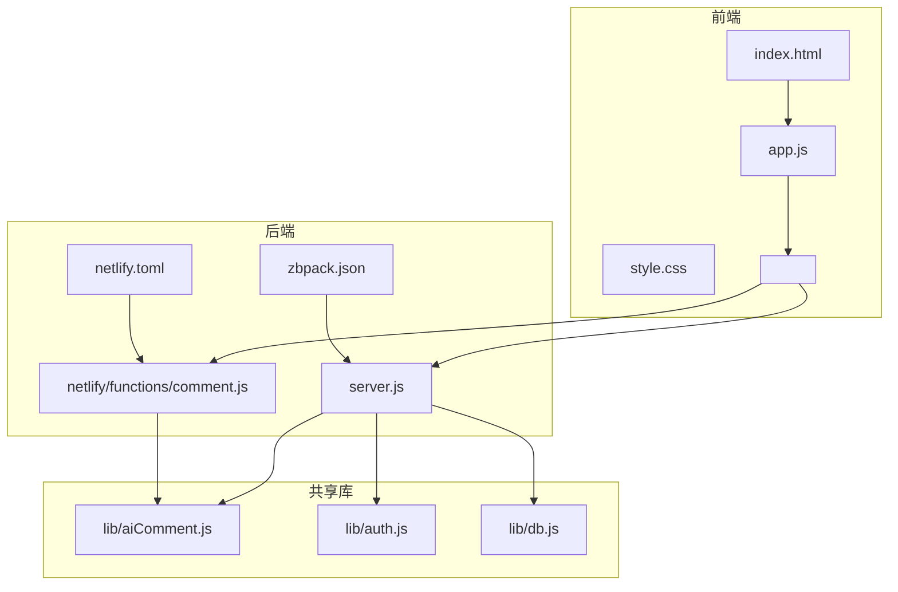
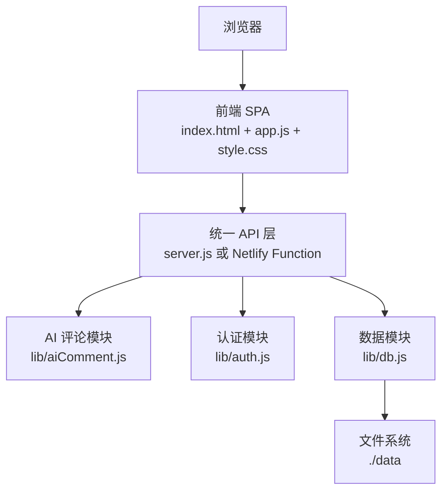
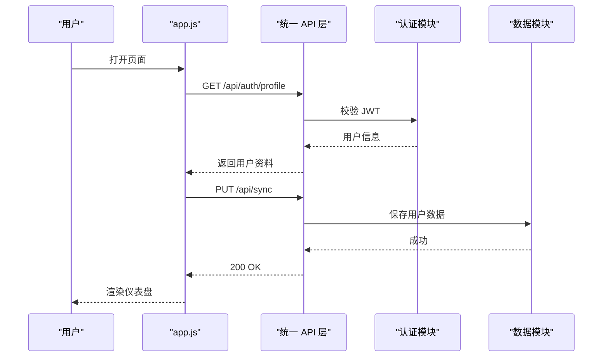
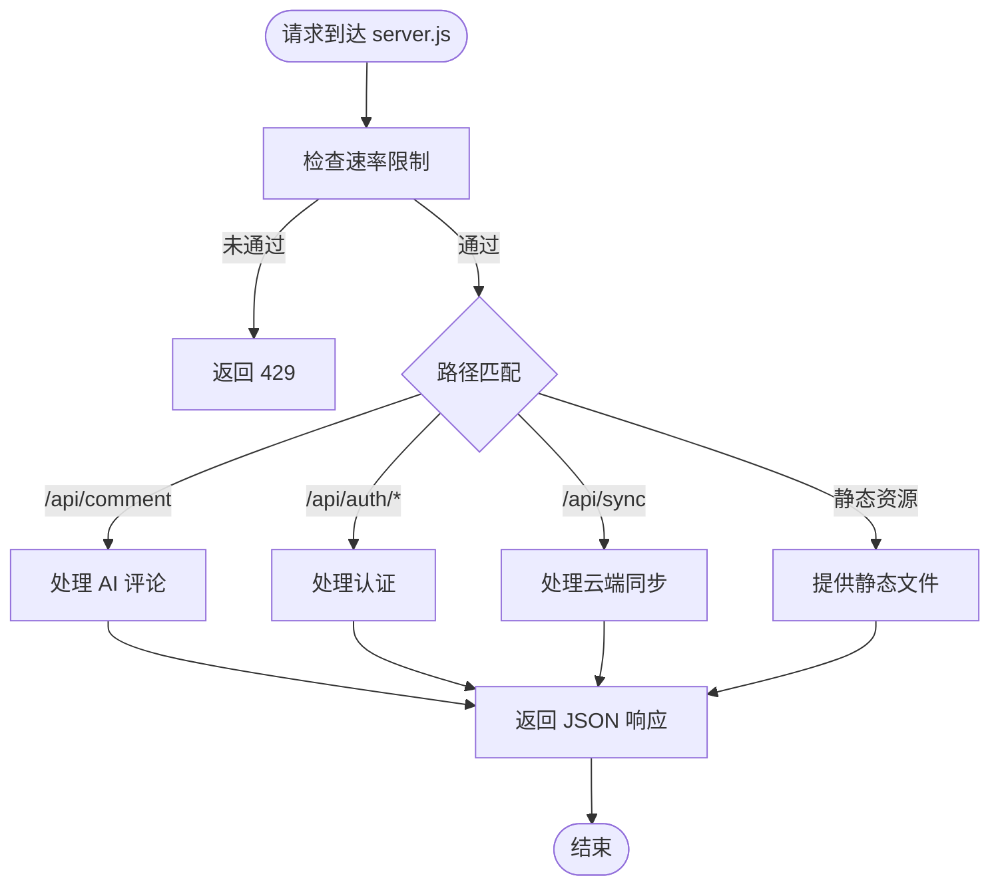
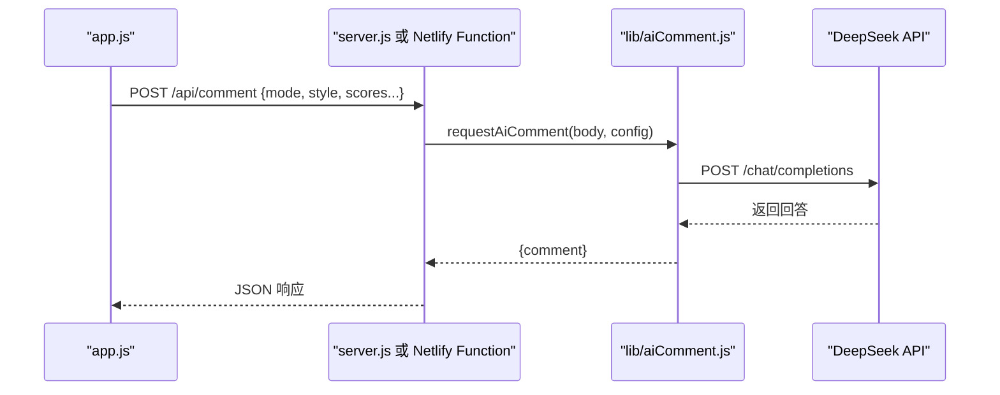
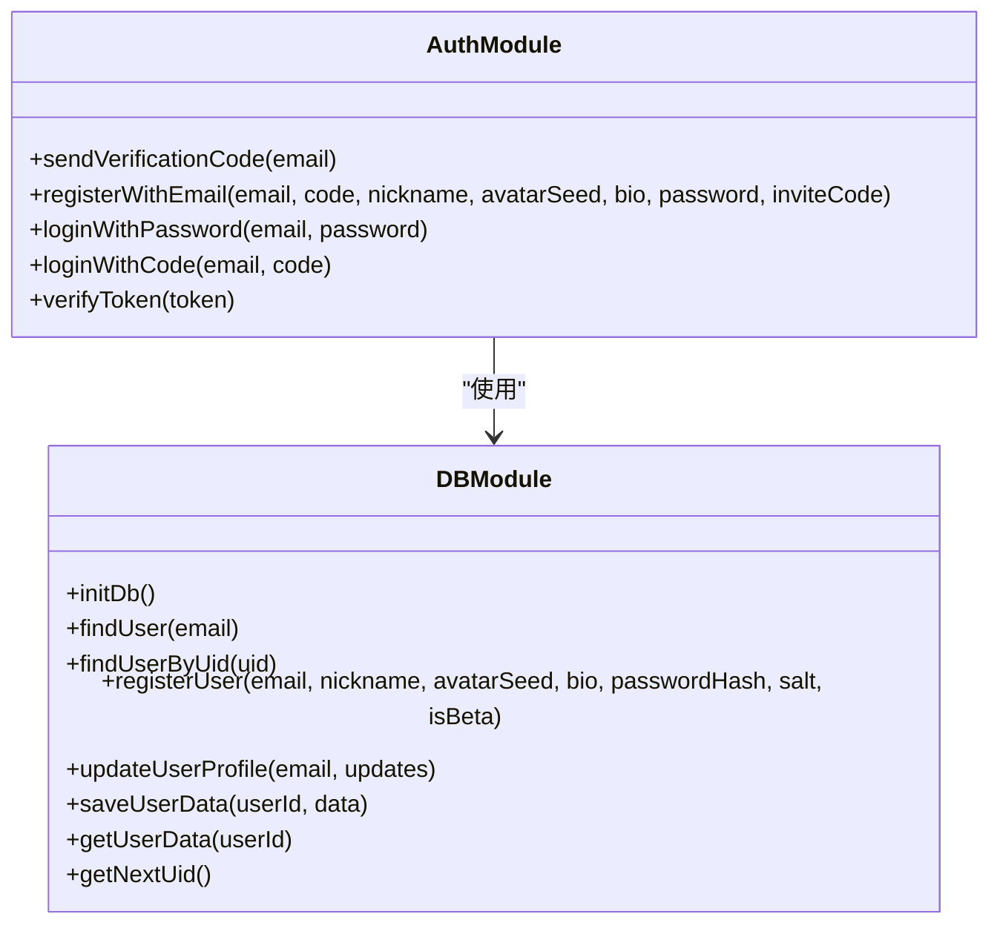
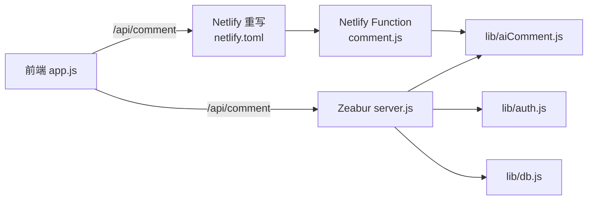
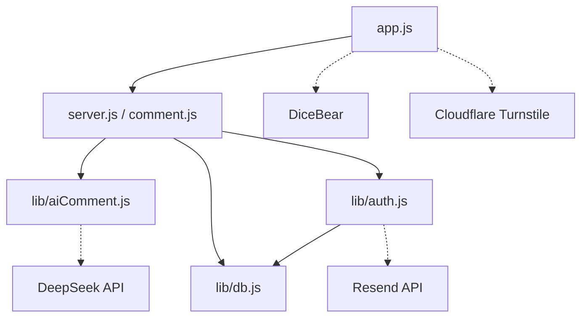

# 架构设计

<cite>
**本文引用的文件**
- [README.md](file://README.md)
- [package.json](file://package.json)
- [server.js](file://server.js)
- [app.js](file://app.js)
- [lib/db.js](file://lib/db.js)
- [lib/auth.js](file://lib/auth.js)
- [lib/aiComment.js](file://lib/aiComment.js)
- [netlify/functions/comment.js](file://netlify/functions/comment.js)
- [netlify.toml](file://netlify.toml)
- [DEPLOYMENT.md](file://DEPLOYMENT.md)
- [zbpack.json](file://zbpack.json)
- [index.html](file://index.html)
</cite>

## 目录
1. [简介](#简介)
2. [项目结构](#项目结构)
3. [核心组件](#核心组件)
4. [架构总览](#架构总览)
5. [详细组件分析](#详细组件分析)
6. [依赖关系分析](#依赖关系分析)
7. [性能考量](#性能考量)
8. [故障排查指南](#故障排查指南)
9. [结论](#结论)
10. [附录](#附录)

## 简介
MyScore 是一款基于前后端分离与统一 API 设计的单页应用（SPA），提供成绩记录、趋势分析、AI 智能评价与云端同步能力。系统采用“前端静态托管 + 后端统一 API”的架构，支持在 Netlify 与 Zeabur 两大平台部署，通过统一的 /api/comment 接口实现前后端解耦与跨平台兼容。

系统围绕以下关键目标构建：
- 前后端分离：前端负责 UI 与交互，后端提供统一 API。
- 微服务化思路：认证、AI 评论、数据持久化拆分为独立模块，便于演进与替换。
- 事件驱动与异步：认证与同步采用异步流程，前端通过 API 与后端交互。
- 安全与合规：JWT、CORS、速率限制、Turnstile、输入校验与错误脱敏。
- 可扩展与可移植：统一 API、环境变量配置、容器化启动参数，便于迁移与扩容。

## 项目结构
项目采用“前端静态资源 + 后端统一 API + 共享库”的组织方式，核心目录与文件如下：
- 前端资源：index.html、style.css、app.js、fonts 等
- 后端入口：server.js（Zeabur 部署）、netlify/functions/comment.js（Netlify 函数）
- 共享库：lib/aiComment.js（AI 评论）、lib/auth.js（认证）、lib/db.js（数据与用户）
- 部署配置：netlify.toml（Netlify 路由重写）、zbpack.json（Zeabur 启动参数）、DEPLOYMENT.md（部署说明）

**图表来源**
- [index.html:7-7](file://index.html#L7-L7)
- [server.js:1-12](file://server.js#L1-L12)
- [netlify/functions/comment.js:1-11](file://netlify/functions/comment.js#L1-L11)
- [netlify.toml:4-7](file://netlify.toml#L4-L7)
- [zbpack.json:1-5](file://zbpack.json#L1-L5)
- [lib/aiComment.js:1-5](file://lib/aiComment.js#L1-L5)
- [lib/auth.js:1-15](file://lib/auth.js#L1-L15)
- [lib/db.js:1-10](file://lib/db.js#L1-L10)

**章节来源**
- [README.md: 217-236:217-236](file://README.md#L217-L236)
- [package.json: 1-13:1-13](file://package.json#L1-L13)
- [netlify.toml: 1-9:1-9](file://netlify.toml#L1-L9)
- [DEPLOYMENT.md: 1-75:1-75](file://DEPLOYMENT.md#L1-L75)

## 核心组件
- 前端 SPA（app.js）：负责用户交互、路由切换、登录态管理、云端同步、AI 评论调用、样式与资源加载。
- 后端统一 API（server.js）：提供 /api/comment、/api/auth/*、/api/sync 等接口，封装速率限制、CORS、Turnstile、JWT 校验与静态资源服务。
- 共享库（lib/*）：
  - aiComment.js：统一 AI 评论逻辑（风格化 prompt、上游 API 调用、错误处理）。
  - auth.js：认证流程（验证码发送、注册、密码登录、JWT 签发与校验）。
  - db.js：用户与数据持久化（JSON 文件存储、UID 分配、验证码缓存、用户资料更新）。
- 平台适配：
  - Netlify：通过 netlify.toml 将 /api/comment 重写到 Netlify Function。
  - Zeabur：通过 server.js 直接提供 API 与静态资源服务。

**章节来源**
- [server.js: 135-176:135-176](file://server.js#L135-L176)
- [lib/aiComment.js: 47-171:47-171](file://lib/aiComment.js#L47-L171)
- [lib/auth.js: 138-190:138-190](file://lib/auth.js#L138-L190)
- [lib/db.js: 24-207:24-207](file://lib/db.js#L24-L207)
- [netlify/functions/comment.js: 13-34:13-34](file://netlify/functions/comment.js#L13-L34)
- [netlify.toml: 4-7:4-7](file://netlify.toml#L4-L7)

## 架构总览
MyScore 采用“前端静态托管 + 后端统一 API + 共享库”的三层架构：
- 前端层：index.html + app.js + style.css，负责用户界面与交互。
- API 层：server.js（Zeabur）或 netlify/functions/comment.js（Netlify）提供统一 API。
- 数据层：lib/db.js 与文件系统存储用户与数据；lib/auth.js 与 lib/aiComment.js 提供认证与 AI 评论能力。

**图表来源**
- [server.js: 504-536:504-536](file://server.js#L504-L536)
- [lib/aiComment.js: 47-171:47-171](file://lib/aiComment.js#L47-L171)
- [lib/auth.js: 138-190:138-190](file://lib/auth.js#L138-L190)
- [lib/db.js: 24-207:24-207](file://lib/db.js#L24-L207)

## 详细组件分析

### 前端组件（app.js）
- 用户模式与登录态管理：支持本地模式与登录模式，本地模式每日 AI 评论上限 5 次；登录后自动拉取云端数据并合并本地数据。
- 云端同步：定时推送本地数据至 /api/sync（PUT），拉取云端数据（GET）。
- 认证流程：邮箱验证码登录、密码登录、注册、编辑资料、退出登录。
- AI 评论：通过 meta 标签动态解析 /api/comment，支持四种 AI 风格与回怼模式。
- UI 与资源：DiceBear 头像、Turnstile 人机验证、Material 3 风格、响应式布局。

**图表来源**
- [app.js: 442-472:442-472](file://app.js#L442-L472)
- [app.js: 666-703:666-703](file://app.js#L666-L703)
- [server.js: 398-455:398-455](file://server.js#L398-L455)
- [lib/auth.js: 36-59:36-59](file://lib/auth.js#L36-L59)
- [lib/db.js: 192-206:192-206](file://lib/db.js#L192-L206)

**章节来源**
- [app.js: 1-L800:1-800](file://app.js#L1-L800)
- [index.html: 7-7:7-7](file://index.html#L7-L7)

### 后端统一 API（server.js）
- 路由与入口：统一处理 /api/comment、/api/auth/*、/api/sync 与静态资源。
- 速率限制：针对敏感端点（验证码、登录、AI 评论）进行限流。
- CORS 与安全：支持 ALLOWED_ORIGIN，返回标准 CORS 头。
- Turnstile：可选的人机验证，防止验证码滥用。
- JWT：登录成功签发 JWT，校验失败返回 401。
- 静态资源：支持 gzip 压缩、缓存策略、304 条件返回。

**图表来源**
- [server.js: 504-536:504-536](file://server.js#L504-L536)
- [server.js: 18-48:18-48](file://server.js#L18-L48)
- [server.js: 135-176:135-176](file://server.js#L135-L176)
- [server.js: 275-462:275-462](file://server.js#L275-L462)
- [server.js: 469-502:469-502](file://server.js#L469-L502)
- [server.js: 178-273:178-273](file://server.js#L178-L273)

**章节来源**
- [server.js: 1-L541:1-541](file://server.js#L1-L541)

### 共享库（lib/aiComment.js）
- 统一 AI 评论：支持四种风格（风暴、暖阳、冷锋、阵雨），回怼模式与伴学助手模式。
- 输入清洗：对用户输入进行长度截断，防止注入与超长请求。
- 上游调用：根据配置调用 DeepSeek API，处理错误与非 200 响应。
- CORS：导出 CORS 头，供后端统一使用。

**图表来源**
- [app.js: 745-748:745-748](file://app.js#L745-L748)
- [server.js: 135-176:135-176](file://server.js#L135-L176)
- [netlify/functions/comment.js: 13-34:13-34](file://netlify/functions/comment.js#L13-L34)
- [lib/aiComment.js: 47-171:47-171](file://lib/aiComment.js#L47-L171)

**章节来源**
- [lib/aiComment.js: 1-L172:1-172](file://lib/aiComment.js#L1-L172)

### 认证与数据模块（lib/auth.js、lib/db.js）
- JWT：手写实现 HS256 签发与校验，强制配置 JWT_SECRET。
- 验证码：生成 6 位随机码，保存至 JSON 缓存，5 分钟过期，最多尝试 5 次。
- 注册与登录：邮箱/UID 支持，密码登录与验证码登录，注册时可选内测邀请码。
- 用户资料：昵称、头像种子、个性签名长度校验，更新后返回最新资料。
- 数据持久化：用户与数据文件存储在 ./data 目录，支持 UID 自增与并发安全。

**图表来源**
- [lib/auth.js: 138-190:138-190](file://lib/auth.js#L138-L190)
- [lib/db.js: 24-207:24-207](file://lib/db.js#L24-L207)

**章节来源**
- [lib/auth.js: 1-L191:1-191](file://lib/auth.js#L1-L191)
- [lib/db.js: 1-L207:1-207](file://lib/db.js#L1-L207)

### 平台适配（Netlify 与 Zeabur）
- Netlify：通过 netlify.toml 将 /api/comment 重写到 Netlify Function；Function 读取 Netlify 环境变量并调用共享 AI 逻辑。
- Zeabur：server.js 直接提供 API 与静态资源，支持 DATA_DIR、PORT、HOST 等环境变量。

**图表来源**
- [netlify.toml: 4-7:4-7](file://netlify.toml#L4-L7)
- [netlify/functions/comment.js: 13-34:13-34](file://netlify/functions/comment.js#L13-L34)
- [server.js: 504-536:504-536](file://server.js#L504-L536)
- [lib/aiComment.js: 1-L5:1-5](file://lib/aiComment.js#L1-L5)

**章节来源**
- [netlify.toml: 1-9:1-9](file://netlify.toml#L1-L9)
- [DEPLOYMENT.md: 18-75:18-75](file://DEPLOYMENT.md#L18-L75)
- [zbpack.json: 1-5:1-5](file://zbpack.json#L1-L5)

## 依赖关系分析
- 组件耦合：
  - app.js 仅通过统一 API 与后端交互，耦合度低，便于替换后端实现。
  - server.js 与 netlify/functions/comment.js 通过 lib/aiComment.js 解耦，共享 AI 逻辑。
  - lib/auth.js 与 lib/db.js 紧密协作，共同完成认证与数据持久化。
- 外部依赖：
  - Node.js 内置模块（fs、http、path、crypto、zlib）实现零第三方依赖。
  - 前端依赖 Chart.js（用于可视化）。
  - 第三方服务：DeepSeek（AI 评论）、Resend（邮件）、DiceBear（头像）、Cloudflare Turnstile（人机验证）。

**图表来源**
- [server.js: 5-L8:5-8](file://server.js#L5-L8)
- [lib/aiComment.js: 73-149:73-149](file://lib/aiComment.js#L73-L149)
- [lib/auth.js: 67-134:67-134](file://lib/auth.js#L67-134)
- [app.js: 32-34:32-34](file://app.js#L32-L34)

**章节来源**
- [package.json: 1-13:1-13](file://package.json#L1-L13)
- [README.md: 179-236:179-236](file://README.md#L179-L236)

## 性能考量
- 静态资源优化：gzip 压缩文本类资源，缓存策略针对字体与图片设置长缓存，HTML/CSS/JS 设置 revalidate。
- 速率限制：对验证码、登录、AI 评论进行分钟级限流，防止滥用。
- 本地/登录双模式：未登录用户每日 AI 评论上限 5 次，登录用户无限制，平衡免费与成本。
- 前端性能：DiceBear 头像与 Chart.js 作为外部资源，建议在生产环境使用 CDN 以提升加载速度。
- 数据持久化：JSON 文件存储简单可靠，适合中小规模数据；若用户量增长，建议迁移到数据库。

[本节为通用性能建议，不直接分析具体文件]

## 故障排查指南
- 401 未授权：检查前端是否携带 Bearer Token，后端 JWT_SECRET 是否配置。
- 429 请求频繁：检查速率限制配置与前端重试策略。
- 500 内部错误：查看后端日志与 AI 上游返回，确认 API Key 与模型配置。
- CORS 失败：检查 ALLOWED_ORIGIN 配置与前端请求头。
- Turnstile 失败：确认站点密钥与服务端密钥配对，且前端已正确加载脚本。
- 云端同步失败：检查网络连通性与 /api/sync 权限，确认登录状态。

**章节来源**
- [server.js: 18-48:18-48](file://server.js#L18-L48)
- [server.js: 52-67:52-67](file://server.js#L52-L67)
- [lib/auth.js: 5-8:5-8](file://lib/auth.js#L5-L8)
- [app.js: 666-703:666-703](file://app.js#L666-L703)

## 结论
MyScore 通过统一 API 与共享库实现了前后端解耦与跨平台部署能力，采用零第三方依赖的 Node.js 内置模块构建后端，结合 Netlify 与 Zeabur 的差异化适配，满足不同部署场景的需求。系统在安全、性能与可扩展性方面做了平衡设计，适合个人或小团队长期演进与维护。

[本节为总结性内容，不直接分析具体文件]

## 附录

### 技术栈与版本
- 前端：HTML/CSS/JavaScript（ES Module）、Chart.js
- 后端：Node.js（>=20）、HTTP/HTTPS、CORS、JWT、Crypto、Zlib
- 部署：Netlify（函数 + 重写）、Zeabur（server.js + zbpack.json）
- 第三方：DeepSeek（AI）、Resend（邮件）、DiceBear（头像）、Cloudflare Turnstile（人机验证）

**章节来源**
- [package.json: 6-8:6-8](file://package.json#L6-L8)
- [README.md: 179-236:179-236](file://README.md#L179-L236)

### 环境变量清单
- 通用（Netlify 与 Zeabur）：
  - AI_API_KEY：AI 评论 API Key
  - AI_BASE_URL：AI 服务基础 URL（默认 DeepSeek）
  - AI_MODEL：模型名称（默认 deepseek-chat）
  - ALLOWED_ORIGIN：CORS 允许来源域名
- Zeabur 专用：
  - JWT_SECRET：JWT 签发密钥（必需）
  - RESEND_API_KEY：Resend 邮件 API Key
  - RESEND_FROM：发件人地址
  - DATA_DIR：数据存储目录（默认 ./data）
  - PORT/HOST：监听端口与主机
  - TURNSTILE_SECRET_KEY：Cloudflare Turnstile Secret Key
  - INVITE_CODES：内测邀请码列表（逗号分隔）

**章节来源**
- [DEPLOYMENT.md: 20-49:20-49](file://DEPLOYMENT.md#L20-L49)
- [lib/auth.js: 4-14:4-14](file://lib/auth.js#L4-L14)
- [server.js: 10-12:10-12](file://server.js#L10-L12)
- [lib/db.js: 5-9:5-9](file://lib/db.js#L5-L9)

### 部署拓扑
- Netlify：前端静态托管，/api/comment 重写到 Netlify Function，Function 调用共享 AI 逻辑。
- Zeabur：server.js 提供 API 与静态资源，支持数据持久化与环境变量配置。

**章节来源**
- [netlify.toml: 4-7:4-7](file://netlify.toml#L4-L7)
- [DEPLOYMENT.md: 18-75:18-75](file://DEPLOYMENT.md#L18-L75)
- [zbpack.json: 1-5:1-5](file://zbpack.json#L1-L5)