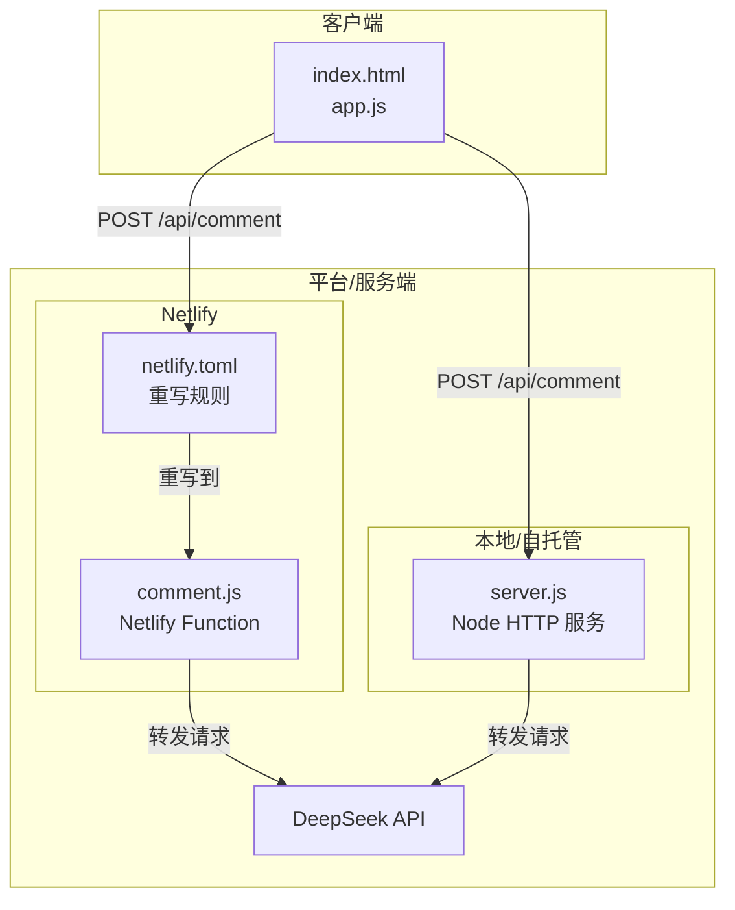
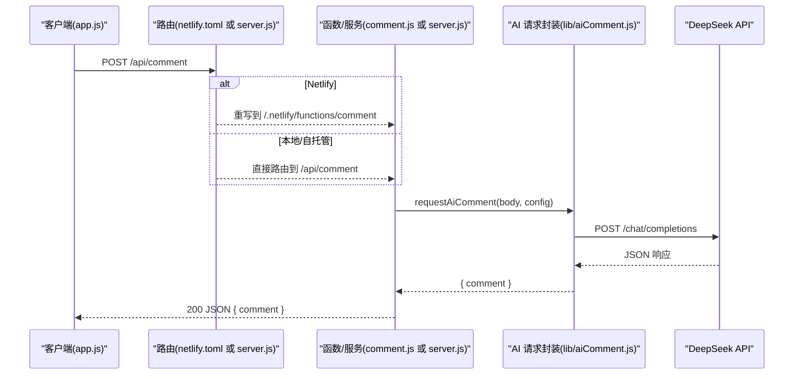
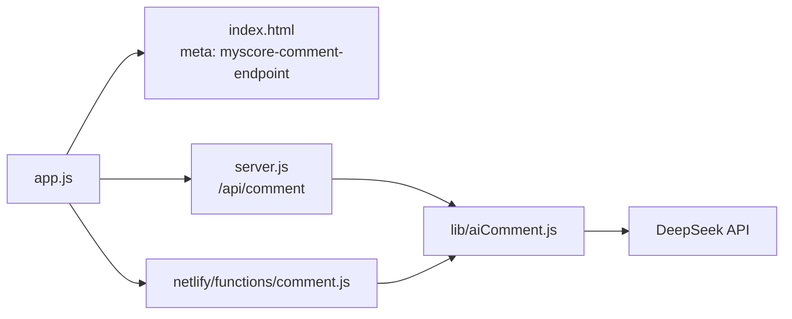

# AI API 集成

<cite>
**本文引用的文件**
- [lib/aiComment.js](file://lib/aiComment.js)
- [netlify/functions/comment.js](file://netlify/functions/comment.js)
- [server.js](file://server.js)
- [app.js](file://app.js)
- [index.html](file://index.html)
- [netlify.toml](file://netlify.toml)
- [DEPLOYMENT.md](file://DEPLOYMENT.md)
- [package.json](file://package.json)
- [zbpack.json](file://zbpack.json)
- [.gitignore](file://.gitignore)
</cite>

## 目录
1. [简介](#简介)
2. [项目结构](#项目结构)
3. [核心组件](#核心组件)
4. [架构总览](#架构总览)
5. [详细组件分析](#详细组件分析)
6. [依赖关系分析](#依赖关系分析)
7. [性能考量](#性能考量)
8. [故障排除指南](#故障排除指南)
9. [结论](#结论)
10. [附录](#附录)

## 简介
本文件面向 MyScore 的 AI API 集成功能，系统化阐述其架构、配置与运行机制，覆盖：
- DeepSeek API 接入与请求转发
- Netlify Functions 与本地 Node 服务的双端部署与路径映射
- API 端点、认证机制、请求格式与响应处理
- 环境变量管理、API 密钥安全存储与速率限制
- 本地开发与生产环境差异配置
- 监控与日志记录
- 最佳实践与故障排除

## 项目结构
MyScore 采用前后端一体化的单页应用（SPA）结构，AI 评论能力通过统一的 /api/comment 端点对外提供，支持两种运行形态：
- Netlify 平台：通过 netlify.toml 将 /api/comment 重写到 Netlify Functions（comment.js）
- 本地/自托管平台（如 Zebur）：直接由 server.js 提供 /api/comment 服务

图表来源
- [netlify.toml:4-8](file://netlify.toml#L4-L8)
- [netlify/functions/comment.js:13-34](file://netlify/functions/comment.js#L13-L34)
- [server.js:504-536](file://server.js#L504-L536)
- [lib/aiComment.js:47-171](file://lib/aiComment.js#L47-L171)

章节来源
- [netlify.toml:1-9](file://netlify.toml#L1-L9)
- [DEPLOYMENT.md:1-75](file://DEPLOYMENT.md#L1-L75)
- [index.html:7-7](file://index.html#L7-L7)
- [app.js:1005-1040](file://app.js#L1005-L1040)

## 核心组件
- AI 请求封装与上游调用：lib/aiComment.js
- Netlify 函数入口：netlify/functions/comment.js
- 本地/自托管服务端：server.js
- 前端调用与端点配置：index.html、app.js
- 部署与路径映射：netlify.toml、DEPLOYMENT.md、zbpack.json
- 环境变量与安全：.gitignore、DEPLOYMENT.md

章节来源
- [lib/aiComment.js:1-172](file://lib/aiComment.js#L1-L172)
- [netlify/functions/comment.js:1-35](file://netlify/functions/comment.js#L1-L35)
- [server.js:1-541](file://server.js#L1-L541)
- [index.html:7-7](file://index.html#L7-L7)
- [app.js:1005-1040](file://app.js#L1005-L1040)
- [netlify.toml:1-9](file://netlify.toml#L1-L9)
- [DEPLOYMENT.md:1-75](file://DEPLOYMENT.md#L1-L75)
- [zbpack.json:1-5](file://zbpack.json#L1-L5)
- [.gitignore:1-12](file://.gitignore#L1-L12)

## 架构总览
统一端点 /api/comment 在不同平台上的处理流程如下：

图表来源
- [netlify/functions/comment.js:13-34](file://netlify/functions/comment.js#L13-L34)
- [server.js:135-176](file://server.js#L135-L176)
- [lib/aiComment.js:47-171](file://lib/aiComment.js#L47-L171)

## 详细组件分析

### AI 请求封装（lib/aiComment.js）
- 职责
  - 定义 CORS 头（允许来源可由环境变量配置）
  - 定义多种 AI 风格（风暴、暖阳、冷锋、阵雨）的系统提示模板与温度参数
  - 校验与清洗输入参数，构造消息数组与推理参数
  - 向上游 API 发送请求，解析响应，处理错误
- 关键点
  - 环境变量：AI_API_KEY、AI_BASE_URL、AI_MODEL、ALLOWED_ORIGIN
  - 请求路径：将 apiBaseUrl 规范化后拼接 /chat/completions
  - 错误处理：对上游 JSON 解析失败、HTTP 非 OK 状态进行包装与抛出
- 与前端交互
  - 前端通过统一端点 /api/comment 调用，无需关心后端部署形态

章节来源
- [lib/aiComment.js:1-172](file://lib/aiComment.js#L1-L172)

### Netlify 函数（netlify/functions/comment.js）
- 职责
  - 处理 OPTIONS 预检与方法校验
  - 从 Netlify 环境变量读取 AI 配置（AI_API_KEY、AI_BASE_URL、AI_MODEL）
  - 调用 lib/aiComment.js 的 requestAiComment 并返回 JSON
  - 捕获异常并返回带状态码的错误响应
- 与部署映射
  - 通过 netlify.toml 将 /api/comment 重写到该函数

章节来源
- [netlify/functions/comment.js:1-35](file://netlify/functions/comment.js#L1-L35)
- [netlify.toml:4-8](file://netlify.toml#L4-L8)

### 本地/自托管服务端（server.js）
- 职责
  - 提供 /api/comment 的 Node HTTP 服务端处理
  - 读取环境变量（AI_API_KEY、AI_BASE_URL、AI_MODEL、ALLOWED_ORIGIN、PORT、HOST）
  - 实现速率限制（按路径与 IP）、匿名用户每日上限（按 IP）
  - 身份认证：从 Authorization 头提取 Bearer Token，验证 JWT
  - 调用 lib/aiComment.js 的 requestAiComment 并返回 JSON
- 速率限制
  - 敏感端点（验证码、登录、评论）按路径与窗口时间限制
  - 匿名用户每日评论上限，按 IP 与日期维度计数

章节来源
- [server.js:16-48](file://server.js#L16-L48)
- [server.js:114-133](file://server.js#L114-L133)
- [server.js:135-176](file://server.js#L135-L176)

### 前端调用与端点配置（index.html、app.js）
- 端点配置
  - 通过 <meta name="myscore-comment-endpoint" content="/api/comment"> 注入端点
  - app.js 中通过 COMMENT_API_ENDPOINT 获取并发起 POST 请求
- 认证与超时
  - 已登录用户在请求头附加 Authorization: Bearer <token>
  - 设置 30 秒超时，捕获 AbortError 并提示超时
- 错误处理
  - 解析响应 JSON，非 2xx 抛出错误，包含上游错误信息或状态码

章节来源
- [index.html:7-7](file://index.html#L7-L7)
- [app.js:1005-1040](file://app.js#L1005-L1040)

### 部署与路径映射（netlify.toml、DEPLOYMENT.md、zbpack.json）
- Netlify
  - 使用 netlify.toml 将 /api/comment 重写到 Netlify Function
  - 环境变量：AI_API_KEY、AI_BASE_URL、AI_MODEL、ALLOWED_ORIGIN
- 本地/自托管（如 Zebur）
  - 通过 zbpack.json 指定根目录与启动命令
  - server.js 监听环境变量 PORT/HOST，提供 /api/comment
- 统一路径
  - 前端与 Netlify/本地均使用 /api/comment，便于无缝切换

章节来源
- [netlify.toml:1-9](file://netlify.toml#L1-L9)
- [DEPLOYMENT.md:1-75](file://DEPLOYMENT.md#L1-L75)
- [zbpack.json:1-5](file://zbpack.json#L1-L5)
- [package.json:9-11](file://package.json#L9-L11)

## 依赖关系分析

图表来源
- [app.js:1005-1040](file://app.js#L1005-L1040)
- [index.html:7-7](file://index.html#L7-L7)
- [server.js:504-536](file://server.js#L504-L536)
- [netlify/functions/comment.js:1-35](file://netlify/functions/comment.js#L1-L35)
- [lib/aiComment.js:47-171](file://lib/aiComment.js#L47-L171)

章节来源
- [app.js:1005-1040](file://app.js#L1005-L1040)
- [server.js:504-536](file://server.js#L504-L536)
- [netlify/functions/comment.js:1-35](file://netlify/functions/comment.js#L1-L35)
- [lib/aiComment.js:47-171](file://lib/aiComment.js#L47-L171)

## 性能考量
- 请求超时与并发
  - 前端设置 30 秒超时，避免长时间阻塞
  - 服务端对敏感端点与评论接口实施速率限制，防止滥用
- 响应体积与解析
  - 严格限制请求体大小（超过 1MB 抛错），减少内存压力
  - 对上游 JSON 解析失败进行容错，避免整站崩溃
- 缓存与静态资源
  - 服务端对静态资源设置合理的缓存策略与 gzip 压缩
- 本地与云端差异
  - 本地模式下匿名用户每日评论上限为 5 次，登录后解除限制

章节来源
- [app.js:1005-1040](file://app.js#L1005-L1040)
- [server.js:103-112](file://server.js#L103-L112)
- [server.js:16-48](file://server.js#L16-L48)
- [server.js:114-133](file://server.js#L114-L133)

## 故障排除指南
- 常见错误与定位
  - 405 Method Not Allowed：仅支持 POST，检查前端请求方法
  - 429 Too Many Requests：触发速率限制，检查是否频繁请求
  - 401 Unauthorized：缺少或无效的 Bearer Token，检查登录状态
  - 429 且提示“今日 AI 评论次数已用完”：匿名用户达到每日上限
  - Upstream AI 返回无效 JSON 或 HTTP 非 OK：检查 AI_API_KEY、AI_BASE_URL、AI_MODEL
- 环境变量与密钥
  - Netlify：AI_API_KEY、AI_BASE_URL、AI_MODEL、ALLOWED_ORIGIN
  - 本地/自托管：AI_API_KEY、AI_BASE_URL、AI_MODEL、ALLOWED_ORIGIN、PORT、HOST
  - .gitignore 中包含 .env 与 data/，避免将密钥与数据提交到仓库
- 日志与监控
  - 服务端错误通过 console.error 输出，便于排查
  - 前端错误通过提示与控制台输出，辅助定位
- 本地开发与生产差异
  - 生产环境建议启用 ALLOWED_ORIGIN 限制跨域来源
  - 本地开发可临时放宽限制，但上线前务必收紧

章节来源
- [server.js:135-176](file://server.js#L135-L176)
- [server.js:458-461](file://server.js#L458-L461)
- [app.js:1020-1040](file://app.js#L1020-L1040)
- [.gitignore:1-12](file://.gitignore#L1-L12)
- [DEPLOYMENT.md:18-49](file://DEPLOYMENT.md#L18-L49)

## 结论
MyScore 的 AI API 集成通过统一端点 /api/comment 实现跨平台一致性，既能在 Netlify 上借助函数实现轻量部署，也能在本地/自托管环境中由 server.js 提供完整的速率限制与认证能力。通过严格的输入清洗、错误处理与环境变量管理，系统在易用性与安全性之间取得平衡。建议在生产环境启用 CORS 白名单与密钥安全存储，并结合日志与监控持续优化用户体验。

## 附录

### API 端点与请求/响应规范
- 端点
  - POST /api/comment
- 请求头
  - Content-Type: application/json
  - Authorization: Bearer <token>（登录后可选）
- 请求体（节选）
  - mode: "companion" 或其他模式
  - examType: 考试类型字符串
  - currentScore: 当前分数
  - historyScores: 历史分数数组
  - userRebuttal: 学生回嘴内容（可选）
  - previousComment: 上次 AI 评价（可选）
  - userMessage: 伴学对话内容（可选）
  - conversationHistory: 伴学历史消息（可选）
  - style: 风格标识（storm/sun/cold/rain）
- 响应
  - 200: { comment: "AI 生成的评价文本" }
  - 4xx/5xx: { error: "错误信息" }

章节来源
- [lib/aiComment.js:47-171](file://lib/aiComment.js#L47-L171)
- [server.js:135-176](file://server.js#L135-L176)
- [netlify/functions/comment.js:13-34](file://netlify/functions/comment.js#L13-L34)

### 环境变量清单
- Netlify
  - AI_API_KEY（必需）
  - AI_BASE_URL（可选，默认 DeepSeek）
  - AI_MODEL（可选，默认 deepseek-chat）
  - ALLOWED_ORIGIN（可选，限制 CORS 来源）
- 本地/自托管
  - AI_API_KEY、AI_BASE_URL、AI_MODEL、ALLOWED_ORIGIN、PORT、HOST
- 安全
  - .env、data/ 已加入 .gitignore，避免泄露

章节来源
- [netlify/functions/comment.js:24-28](file://netlify/functions/comment.js#L24-L28)
- [server.js:161-165](file://server.js#L161-L165)
- [.gitignore:1-12](file://.gitignore#L1-L12)

### 部署与切换指南
- Netlify
  - 通过 netlify.toml 将 /api/comment 重写到函数
  - 保持现有环境变量不变
- 本地/自托管（如 Zebur）
  - 使用 zbpack.json 指定根目录与启动命令
  - server.js 监听 PORT/HOST，提供 /api/comment
- 前端切换
  - 前端已预留统一端点，可在下一次前端切换时直接使用 /api/comment

章节来源
- [netlify.toml:1-9](file://netlify.toml#L1-L9)
- [DEPLOYMENT.md:1-75](file://DEPLOYMENT.md#L1-L75)
- [zbpack.json:1-5](file://zbpack.json#L1-L5)
- [package.json:9-11](file://package.json#L9-L11)