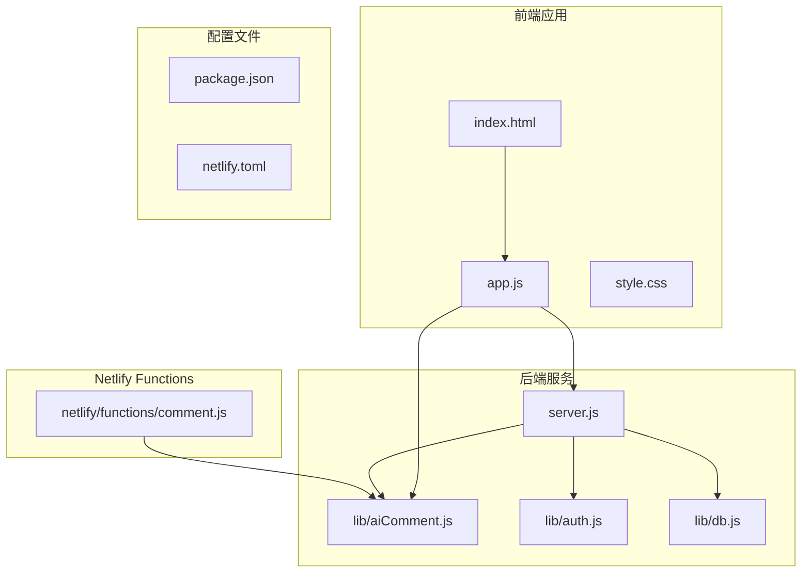
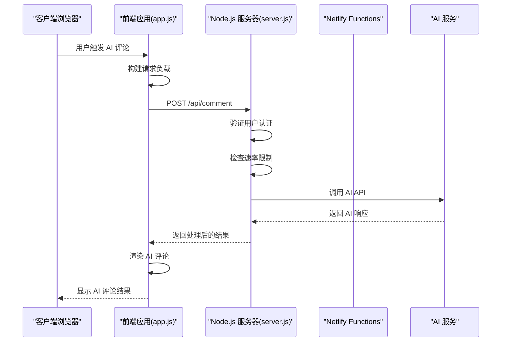
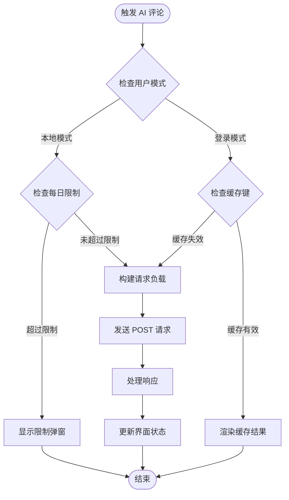
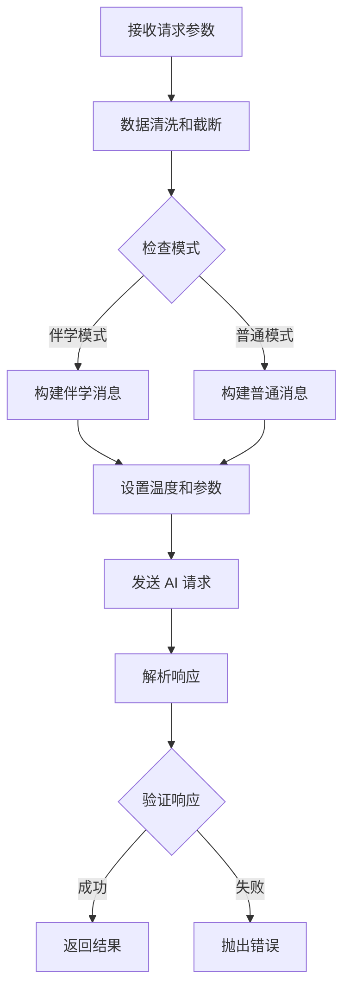
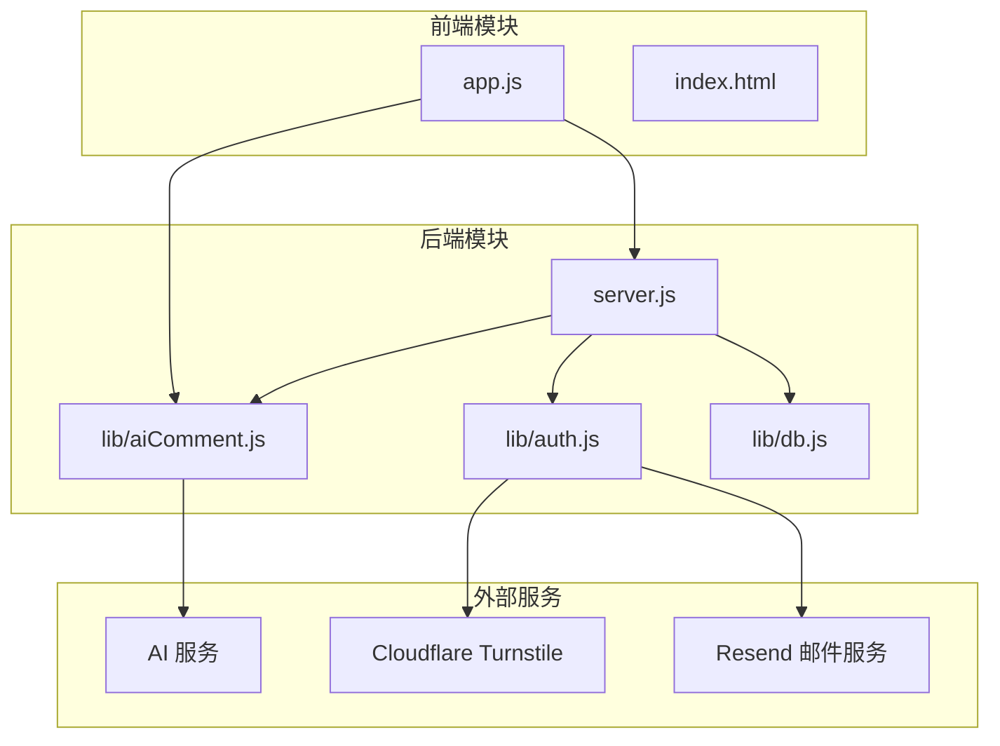

# AI 评论流程

<cite>
**本文档引用的文件**
- [lib/aiComment.js](file://lib/aiComment.js)
- [netlify/functions/comment.js](file://netlify/functions/comment.js)
- [server.js](file://server.js)
- [app.js](file://app.js)
- [index.html](file://index.html)
- [package.json](file://package.json)
</cite>

## 目录
1. [简介](#简介)
2. [项目结构](#项目结构)
3. [核心组件](#核心组件)
4. [架构概览](#架构概览)
5. [详细组件分析](#详细组件分析)
6. [依赖关系分析](#依赖关系分析)
7. [性能考虑](#性能考虑)
8. [故障排除指南](#故障排除指南)
9. [结论](#结论)

## 简介

MyScore 的 AI 评论流程是一个完整的端到端系统，从用户输入到 AI 响应的全过程处理。该系统提供了四种不同的 AI 风格（风暴、暖阳、冷锋、阵雨），支持用户与 AI 的互动对话，以及本地模式下的 AI 评论功能。

系统的核心特点包括：
- 多样化的 AI 风格配置
- 输入数据的安全处理和长度截断
- 消息构建和 API 请求发送
- 错误处理机制和超时处理
- 并发控制和性能优化策略
- 与前端应用的数据交互和状态管理

## 项目结构

MyScore 项目采用模块化架构，主要包含以下核心目录和文件：



**图表来源**
- [index.html:1-200](file://index.html#L1-L200)
- [app.js:1-800](file://app.js#L1-L800)
- [server.js:1-541](file://server.js#L1-L541)
- [lib/aiComment.js:1-172](file://lib/aiComment.js#L1-L172)

**章节来源**
- [package.json:1-13](file://package.json#L1-L13)
- [index.html:1-200](file://index.html#L1-L200)

## 核心组件

### AI 评论核心模块

AI 评论功能的核心实现在 `lib/aiComment.js` 文件中，包含以下关键组件：

#### CORS 头配置
系统支持跨域资源共享，允许特定的 Origin、Headers 和 Methods：
- Access-Control-Allow-Origin: 可配置的允许源
- Access-Control-Allow-Headers: Content-Type
- Access-Control-Allow-Methods: POST, OPTIONS

#### AI 风格模板
系统提供四种不同的 AI 风格，每种风格都有独特的提示词模板和温度参数：

1. **风暴风格 (storm)**: 幽默、毒舌但不恶毒，语气傲娇刻薄
2. **暖阳风格 (sun)**: 温暖、共情力强，语气温柔真诚
3. **冷锋风格 (cold)**: 冷静的分析员，只说数据和事实
4. **阵雨风格 (rain)**: 先损后帮，形成反转效果

#### 安全输入处理
系统对用户输入进行严格的安全处理：
- 考试类型：最大 30 字符
- 当前分数：最大 20 字符  
- 用户回嘴：最大 500 字符
- 前一条评论：最大 500 字符
- 用户消息：最大 1000 字符

**章节来源**
- [lib/aiComment.js:1-45](file://lib/aiComment.js#L1-L45)
- [lib/aiComment.js:62-67](file://lib/aiComment.js#L62-L67)

## 架构概览

MyScore 的 AI 评论系统采用三层架构设计，实现了前后端分离和模块化处理：



**图表来源**
- [app.js:1005-1040](file://app.js#L1005-L1040)
- [server.js:135-176](file://server.js#L135-L176)
- [lib/aiComment.js:47-172](file://lib/aiComment.js#L47-L172)

## 详细组件分析

### 前端应用层

#### AI 评论触发机制

前端应用通过 `triggerLocalAiComment` 函数处理 AI 评论的触发：



**图表来源**
- [app.js:2257-2295](file://app.js#L2257-L2295)
- [app.js:2344-2394](file://app.js#L2344-L2394)

#### 超时和错误处理

前端实现了完善的超时和错误处理机制：

1. **超时控制**: 使用 AbortController 设置 30 秒超时
2. **错误分类**: 区分网络错误、超时错误、AI 服务错误
3. **用户反馈**: 通过 Toast 消息和界面状态变化提供反馈

#### 并发控制

系统通过全局变量实现并发控制：
- `aiStyleLocked`: 防止同时发起多个 AI 请求
- `aiStyleCooldown`: 防止用户快速连续点击
- `lastAiCacheKey`: 缓存机制避免重复请求

**章节来源**
- [app.js:2250-2295](file://app.js#L2250-L2295)
- [app.js:1005-1040](file://app.js#L1005-L1040)

### 后端服务层

#### 速率限制机制

服务器实现了多层级的速率限制：

```mermaid
graph LR
subgraph "IP 级限流"
A[/api/auth/send-code<br/>3次/分钟]
B[/api/auth/login-password<br/>10次/分钟]
C[/api/auth/login-code<br/>10次/分钟]
D[/api/comment<br/>20次/分钟]
end
subgraph "匿名用户限制"
E[每日 5 次 AI 评论]
end
subgraph "认证用户"
F[无限制访问]
end
```

**图表来源**
- [server.js:18-23](file://server.js#L18-L23)
- [server.js:114-125](file://server.js#L114-L125)

#### 人机验证集成

系统集成了 Cloudflare Turnstile 人机验证：
- 在发送验证码前必须通过验证
- 验证失败时拒绝请求
- 支持多种验证状态回调

#### 数据库和用户管理

后端服务集成了完整的用户认证系统：
- JWT 令牌验证
- 用户注册和登录
- 数据同步和存储

**章节来源**
- [server.js:16-48](file://server.js#L16-L48)
- [server.js:54-67](file://server.js#L54-L67)

### AI 评论核心处理

#### 请求构建和消息构建

AI 评论的核心处理逻辑在 `requestAiComment` 函数中：



**图表来源**
- [lib/aiComment.js:47-172](file://lib/aiComment.js#L47-L172)

#### 消息构建规则

系统根据不同的模式构建相应的消息：

1. **伴学模式**: 构建包含对话历史的系统提示
2. **普通模式**: 根据用户选择的风格构建提示词
3. **回嘴模式**: 结合之前的评论和用户的回嘴内容

#### 温度参数和输出控制

不同风格使用不同的温度参数：
- 风暴风格: 1.2-1.4
- 暖阳风格: 0.7
- 冷锋风格: 0.6
- 阵雨风格: 1.1-1.3

**章节来源**
- [lib/aiComment.js:78-135](file://lib/aiComment.js#L78-L135)

### Netlify Functions 层

#### 无服务器函数实现

Netlify Functions 提供了轻量级的 AI 评论处理：
- 简化的 CORS 处理
- 直接调用核心 AI 评论函数
- 环境变量配置支持

#### 配置管理

函数支持以下环境变量：
- AI_API_KEY: AI 服务密钥
- AI_BASE_URL: AI 服务基础 URL
- AI_MODEL: AI 模型名称

**章节来源**
- [netlify/functions/comment.js:1-35](file://netlify/functions/comment.js#L1-L35)

## 依赖关系分析

### 模块依赖图



**图表来源**
- [app.js:1-800](file://app.js#L1-L800)
- [server.js:1-541](file://server.js#L1-L541)
- [lib/aiComment.js:1-172](file://lib/aiComment.js#L1-L172)

### 关键依赖关系

1. **前端到后端**: 通过 `/api/comment` 端点通信
2. **后端到 AI**: 通过 `requestAiComment` 函数调用
3. **认证集成**: JWT 令牌验证用户权限
4. **环境配置**: 通过环境变量管理服务配置

**章节来源**
- [app.js:745-748](file://app.js#L745-L748)
- [server.js:504-536](file://server.js#L504-L536)

## 性能考虑

### 并发控制策略

系统采用了多层次的并发控制机制：

1. **前端防抖**: 通过 `aiStyleLocked` 和 `aiStyleCooldown` 防止重复请求
2. **后端限流**: 基于 IP 的速率限制防止滥用
3. **缓存机制**: 使用 `lastAiCacheKey` 避免重复计算

### 超时和重试机制

1. **前端超时**: 30 秒超时，防止长时间阻塞
2. **后端超时**: 与上游 AI 服务的超时协调
3. **错误重试**: 系统自动处理网络异常和临时故障

### 资源优化

1. **静态资源缓存**: 通过 HTTP 缓存头优化静态资源加载
2. **Gzip 压缩**: 对文本资源启用 Gzip 压缩
3. **内存管理**: 定期清理过期的速率限制数据

**章节来源**
- [app.js:1005-1040](file://app.js#L1005-L1040)
- [server.js:16-48](file://server.js#L16-L48)
- [server.js:224-273](file://server.js#L224-L273)

## 故障排除指南

### 常见问题诊断

#### AI 服务不可用

**症状**: 请求超时或返回错误
**解决方案**:
1. 检查 AI API 密钥配置
2. 验证网络连接
3. 查看服务器日志
4. 等待服务恢复

#### 用户认证失败

**症状**: 401 未授权错误
**解决方案**:
1. 检查 JWT 令牌有效性
2. 验证用户凭据
3. 确认账户状态
4. 重新登录

#### 速率限制触发

**症状**: 429 请求过于频繁
**解决方案**:
1. 等待当前窗口结束
2. 减少请求频率
3. 考虑升级到付费账户
4. 实现指数退避策略

### 调试技巧

1. **浏览器开发者工具**: 监控网络请求和响应
2. **服务器日志**: 查看详细的错误信息
3. **环境变量检查**: 确认配置正确
4. **缓存清理**: 清理本地存储数据

**章节来源**
- [app.js:1029-1036](file://app.js#L1029-L1036)
- [server.js:147-175](file://server.js#L147-L175)

## 结论

MyScore 的 AI 评论流程是一个设计精良的完整系统，具有以下特点：

1. **安全性**: 多层次的安全处理，包括输入验证、长度截断和错误处理
2. **可扩展性**: 模块化设计支持功能扩展和定制
3. **用户体验**: 流畅的交互流程和友好的错误反馈
4. **性能优化**: 并发控制、缓存机制和资源优化
5. **可靠性**: 完善的错误处理和故障恢复机制

该系统为用户提供了丰富的 AI 互动体验，同时保持了良好的性能和可靠性。通过合理的架构设计和实现细节，确保了系统的稳定运行和良好的用户体验。