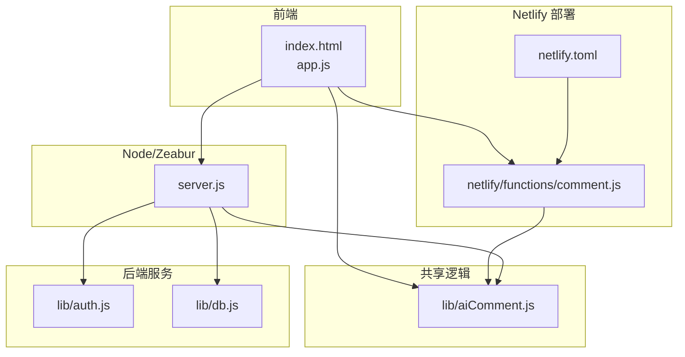
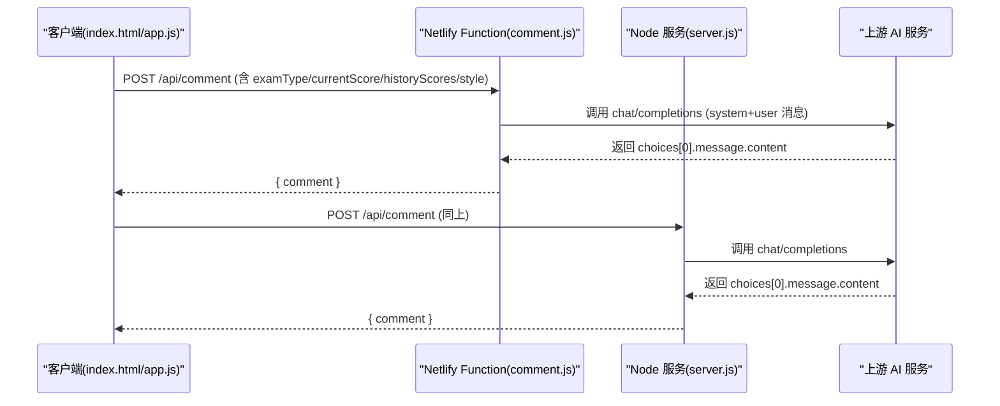
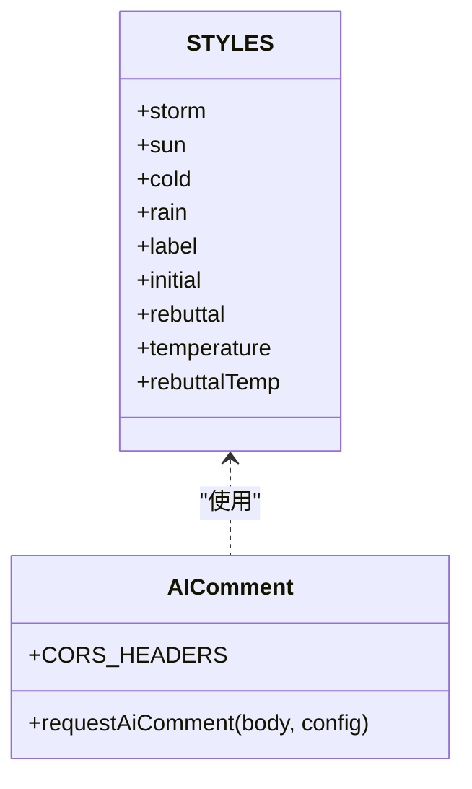
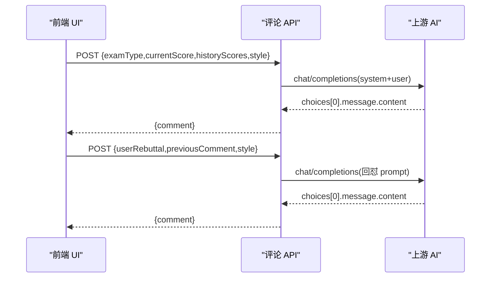
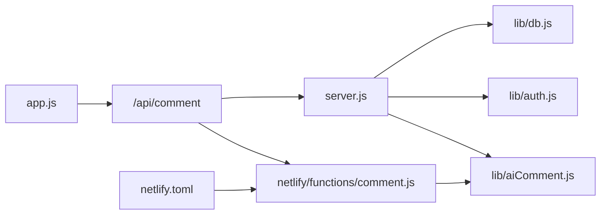

# AI 评论系统

<cite>
**本文档引用的文件**
- [lib/aiComment.js](file://lib/aiComment.js)
- [netlify/functions/comment.js](file://netlify/functions/comment.js)
- [server.js](file://server.js)
- [app.js](file://app.js)
- [index.html](file://index.html)
- [netlify.toml](file://netlify.toml)
- [README.md](file://README.md)
- [lib/auth.js](file://lib/auth.js)
- [lib/db.js](file://lib/db.js)
</cite>

## 目录
1. [简介](#简介)
2. [项目结构](#项目结构)
3. [核心组件](#核心组件)
4. [架构总览](#架构总览)
5. [详细组件分析](#详细组件分析)
6. [依赖关系分析](#依赖关系分析)
7. [性能考虑](#性能考虑)
8. [故障排除指南](#故障排除指南)
9. [结论](#结论)
10. [附录](#附录)

## 简介
MyScore 的 AI 评论系统是一个集成了四种 AI 评论风格（风暴、暖阳、冷锋、阵雨）的智能交互模块，支持回怼对话、伴学助手、对话历史管理、本地 AI 使用限制与 Netlify Functions 部署。系统通过统一的 `/api/comment` 接口在前端与后端之间解耦，既可在 Netlify 上通过 Serverless Function 提供服务，也可在 Zeabur/Node 环境下直接运行。

## 项目结构
- 前端入口与交互逻辑集中在 `index.html` 与 `app.js`，负责 UI 渲染、事件绑定、样式切换、回怼对话与本地 AI 使用限制。
- AI 逻辑与 API 调用封装在 `lib/aiComment.js`，包含 CORS 头、风格模板、温度与 token 控制、上游 AI 响应解析与错误处理。
- Netlify Functions 适配层位于 `netlify/functions/comment.js`，负责接收请求、读取环境变量、调用共享 AI 逻辑并返回标准化响应。
- Node/Zeabur 服务端位于 `server.js`，提供统一的 `/api/comment` 接口、速率限制、匿名用户每日限额、CORS 与错误处理。
- 部署配置与路由映射在 `netlify.toml`，将 `/api/comment` 转发到 Netlify Function。
- README.md 提供部署说明、功能特性与版本演进记录。

**图表来源**
- [index.html](file://index.html)
- [app.js](file://app.js)
- [lib/aiComment.js](file://lib/aiComment.js)
- [netlify/functions/comment.js](file://netlify/functions/comment.js)
- [server.js](file://server.js)
- [netlify.toml](file://netlify.toml)
- [lib/auth.js](file://lib/auth.js)
- [lib/db.js](file://lib/db.js)

**章节来源**
- [README.md](file://README.md)
- [netlify.toml](file://netlify.toml)

## 核心组件
- AI 风格模板与温度控制：四种风格（storm/sun/cold/rain）定义了初始 prompt、回怼 prompt、temperature 与 max_tokens，确保输出长度与语气风格一致。
- 回怼对话机制：前端通过 `postComment` 发送用户回嘴与上次评论上下文，后端构造系统消息与用户消息，调用上游模型并返回带建议的评价。
- 伴学助手（mode: companion）：支持连续对话与情绪陪伴，限制最多 3 条可执行建议，单次回复控制在 120 字内。
- 本地 AI 使用限制：匿名用户按 IP 每日限制 5 次，登录用户无限制；前端本地模式同样限制每日次数并在 UI 中提示。
- Netlify Functions 与 Node 服务：统一 `/api/comment` 接口，分别在 Netlify Function 与 server.js 中实现，便于双平台部署。

**章节来源**
- [lib/aiComment.js](file://lib/aiComment.js)
- [app.js](file://app.js)
- [server.js](file://server.js)
- [netlify/functions/comment.js](file://netlify/functions/comment.js)

## 架构总览
AI 评论系统采用前后端分离与共享逻辑复用的设计：
- 前端负责 UI、事件与上下文管理，调用统一的 `/api/comment`。
- 后端（Netlify Function 或 Node 服务）负责速率限制、CORS、环境变量读取与上游 AI 调用。
- 共享逻辑（lib/aiComment.js）封装 prompt 模板、消息构造、温度与 token 控制、错误处理与响应解析。

**图表来源**
- [app.js](file://app.js)
- [netlify/functions/comment.js](file://netlify/functions/comment.js)
- [server.js](file://server.js)
- [lib/aiComment.js](file://lib/aiComment.js)

## 详细组件分析

### 组件 A：AI 风格系统（风暴/暖阳/冷锋/阵雨）
- 设计理念
  - 风暴：犀利刻薄，进步酸溜溜地夸，退步挖苦，强调幽默与毒舌。
  - 暖阳：温暖鼓励，先肯定努力，退步也只说鼓励，强调共情与温柔。
  - 冷锋：冷静分析，只说数据与事实，强调客观与精准。
  - 阵雨：先损后帮，开头泼冷水，随后给出有用建议，强调反转与实用。
- 实现原理
  - 每种风格包含 initial/rebuttal prompt、temperature 与 max_tokens，确保输出长度与语气一致。
  - 回怼模式下使用 rebuttal prompt，并提高 temperature 以增强对抗性。
- 代码示例路径
  - [lib/aiComment.js](file://lib/aiComment.js) 中的 STYLES 定义与温度控制
  - [index.html](file://index.html) 中的风格按钮与事件绑定
  - [app.js](file://app.js) 中的 setAiStyle 与 fetchAIComment 调用

**图表来源**
- [lib/aiComment.js](file://lib/aiComment.js)

**章节来源**
- [lib/aiComment.js](file://lib/aiComment.js)
- [index.html](file://index.html)
- [app.js](file://app.js)

### 组件 B：AI 评论流程与回怼功能
- 评论流程
  - 前端收集 examType、currentScore、historyScores、style 等参数，调用 `/api/comment`。
  - 后端读取环境变量（AI_API_KEY/AI_BASE_URL/AI_MODEL），构造 system 与 user 消息。
  - 调用上游 chat/completions，解析 choices[0].message.content，返回 comment。
- 回怼对话
  - 前端将 userRebuttal 与 previousComment 作为上下文发送，后端使用 rebuttal prompt 生成反击。
  - UI 切换为“对战中”状态，显示用户与老师的对话，支持无限套娃回怼。
- 代码示例路径
  - [app.js](file://app.js) 中的 fetchAIComment、sendRebuttal、renderAiComment
  - [lib/aiComment.js](file://lib/aiComment.js) 中的 requestAiComment 消息构造与响应解析

**图表来源**
- [app.js](file://app.js)
- [lib/aiComment.js](file://lib/aiComment.js)

**章节来源**
- [app.js](file://app.js)
- [lib/aiComment.js](file://lib/aiComment.js)

### 组件 C：伴学助手（mode: companion）
- 使用方法
  - 前端通过 conversationHistory 传递最近对话，后端以 system prompt 初始化，优先给出可执行建议。
  - 支持 Enter 发送、Shift+Enter 换行、Esc 关闭、会话本地持久化。
- 实现要点
  - 限定 maxTokens 与 temperature，确保回复简洁、可执行。
  - 仅保留最近 12 条有效消息，过滤非法角色与内容。
- 代码示例路径
  - [app.js](file://app.js) 中的 companion 模式 UI 与历史管理
  - [lib/aiComment.js](file://lib/aiComment.js) 中的 companion 模式消息构造

**章节来源**
- [app.js](file://app.js)
- [lib/aiComment.js](file://lib/aiComment.js)

### 组件 D：对话历史管理
- 历史存储
  - 本地：使用 localStorage 存储最近对话（myscore_tutuer_history），支持导出/导入。
  - 云端：登录用户通过 /api/sync 同步对话历史到服务器。
- 历史清理
  - 仅保留 user/assistant 角色的有效消息，过滤非法字段与过长内容。
  - companion 模式限制最多 12 条历史，避免上下文过长。
- 代码示例路径
  - [app.js](file://app.js) 中的 tutuer_history 读取与合并
  - [server.js](file://server.js) 中的 /api/sync GET/PUT

**章节来源**
- [app.js](file://app.js)
- [server.js](file://server.js)

### 组件 E：Netlify Functions 部署与配置
- 路由映射
  - netlify.toml 将 /api/comment 转发到 /.netlify/functions/comment。
- 环境变量
  - AI_API_KEY：上游 AI 认证密钥。
  - ALLOWED_ORIGIN：CORS 来源域名（可选）。
  - AI_BASE_URL/AI_MODEL：上游服务地址与模型名（可选默认值）。
- 代码示例路径
  - [netlify/functions/comment.js](file://netlify/functions/comment.js)
  - [netlify.toml](file://netlify.toml)

**章节来源**
- [netlify/functions/comment.js](file://netlify/functions/comment.js)
- [netlify.toml](file://netlify.toml)

### 组件 F：AI API 集成与错误处理
- API 集成
  - 通过 fetch 调用上游 chat/completions，携带 Authorization: Bearer。
  - 解析 JSON 响应，若非 JSON 抛出错误；若 response.ok 为 false，提取 error.message 并返回。
- 错误处理
  - 服务端与 Netlify Function 统一捕获异常，返回带 statusCode 的错误对象。
  - 前端在 UI 中显示“老师断线了”等提示，并可重试。
- 代码示例路径
  - [lib/aiComment.js](file://lib/aiComment.js)
  - [netlify/functions/comment.js](file://netlify/functions/comment.js)
  - [server.js](file://server.js)

**章节来源**
- [lib/aiComment.js](file://lib/aiComment.js)
- [netlify/functions/comment.js](file://netlify/functions/comment.js)
- [server.js](file://server.js)

### 组件 G：prompt 管理与安全
- prompt 管理
  - STYLES 中集中定义四种风格的 initial/rebuttal prompt，确保输出格式与长度约束。
  - companion 模式使用固定 system prompt，强调可执行建议与共情。
- 安全措施
  - 输入长度截断：对 examType、currentScore、userRebuttal、previousComment、userMessage 等进行安全截断。
  - CORS 头：支持 ALLOWED_ORIGIN 环境变量，避免跨域风险。
  - 速率限制：服务端对 /api/comment 实施每分钟最多 20 次的限制。
- 代码示例路径
  - [lib/aiComment.js](file://lib/aiComment.js)
  - [server.js](file://server.js)

**章节来源**
- [lib/aiComment.js](file://lib/aiComment.js)
- [server.js](file://server.js)

### 组件 H：评论缓存机制与本地 AI 使用限制
- 评论缓存
  - 前端在 fetchAIComment 中保存 lastExamType、lastScore、lastHistory 与 lastAiComment，用于回怼与 UI 刷新。
  - setAiStyle 切换风格后自动重新请求评价，避免重复请求。
- 本地 AI 使用限制
  - 本地模式每日限制 5 次，使用 localStorage 记录 {date, count}。
  - 未登录用户匿名每日限制 5 次，超过后提示登录解锁。
- 代码示例路径
  - [app.js](file://app.js) 中的 getLocalAiUsage、incrementLocalAiUsage、isLocalAiLimitReached
  - [server.js](file://server.js) 中的 ANONYMOUS_DAILY_LIMIT 与 checkAnonymousDailyLimit

**章节来源**
- [app.js](file://app.js)
- [server.js](file://server.js)

## 依赖关系分析
- 前端依赖
  - app.js 依赖 index.html 的 DOM 结构与按钮事件，依赖 lib/aiComment.js 的 requestAiComment。
  - app.js 依赖 server.js/netlify/functions/comment.js 的 /api/comment 接口。
- 后端依赖
  - server.js 依赖 lib/aiComment.js 的 AI 逻辑，依赖 lib/auth.js/lib/db.js 的认证与数据存储。
  - netlify/functions/comment.js 依赖 lib/aiComment.js 的 AI 逻辑。
- 部署依赖
  - netlify.toml 将 /api/comment 映射到 Netlify Function。

**图表来源**
- [app.js](file://app.js)
- [netlify/functions/comment.js](file://netlify/functions/comment.js)
- [server.js](file://server.js)
- [lib/aiComment.js](file://lib/aiComment.js)
- [lib/auth.js](file://lib/auth.js)
- [lib/db.js](file://lib/db.js)
- [netlify.toml](file://netlify.toml)

**章节来源**
- [app.js](file://app.js)
- [server.js](file://server.js)
- [netlify/functions/comment.js](file://netlify/functions/comment.js)
- [lib/aiComment.js](file://lib/aiComment.js)
- [lib/auth.js](file://lib/auth.js)
- [lib/db.js](file://lib/db.js)
- [netlify.toml](file://netlify.toml)

## 性能考虑
- 速率限制：服务端对 /api/comment 实施每分钟 20 次限制，防止滥用。
- 匿名用户每日限额：按 IP 计数，超过限制提示登录。
- 前端请求锁与冷却：setAiStyle 切换风格时加锁并设置 3 秒冷却，避免高频点击导致后端压力。
- 响应解析与错误处理：统一捕获上游 JSON 解析失败与 HTTP 错误，减少前端异常分支。
- 建议优化
  - 前端可增加节流/防抖，避免短时间内多次请求。
  - 后端可引入缓存层（如 Redis）以进一步降低上游调用频率。
  - 对历史消息进行压缩与分页，避免过长上下文影响响应速度。

[本节为通用指导，无需特定文件来源]

## 故障排除指南
- 常见错误
  - AI_API_KEY 未配置：抛出“AI_API_KEY is not configured”错误。
  - 上游 AI 返回非 JSON：抛出“Upstream AI returned invalid JSON”错误。
  - HTTP 非 200：提取 error.message 或 error，返回带 statusCode 的错误对象。
  - 匿名用户超出每日限额：返回“今日 AI 评论次数已用完，登录即可解锁完整功能”。
- 前端提示
  - “老师断线了”、“老师去吃饭了”等提示，建议刷新页面或稍后重试。
  - 本地模式提示“今日已用 X/Y 次”，引导登录解锁。
- 代码示例路径
  - [lib/aiComment.js](file://lib/aiComment.js)
  - [server.js](file://server.js)
  - [netlify/functions/comment.js](file://netlify/functions/comment.js)

**章节来源**
- [lib/aiComment.js](file://lib/aiComment.js)
- [server.js](file://server.js)
- [netlify/functions/comment.js](file://netlify/functions/comment.js)

## 结论
MyScore 的 AI 评论系统通过统一的共享逻辑与双平台部署方案，实现了稳定的风格化评价、回怼对话与伴学助手功能。系统在安全性、可维护性与用户体验方面做了充分设计，支持本地与登录用户的差异化使用策略，并提供了清晰的部署与错误处理机制。建议在生产环境中结合缓存与监控进一步提升性能与稳定性。

[本节为总结性内容，无需特定文件来源]

## 附录

### A. 调用 AI 评论 API 的代码示例路径
- 前端发起请求
  - [app.js](file://app.js) 中的 fetchAIComment/postComment
- Netlify Function 处理请求
  - [netlify/functions/comment.js](file://netlify/functions/comment.js)
- Node/Zeabur 服务端处理请求
  - [server.js](file://server.js)

**章节来源**
- [app.js](file://app.js)
- [netlify/functions/comment.js](file://netlify/functions/comment.js)
- [server.js](file://server.js)

### B. 部署与配置清单
- Netlify
  - 环境变量：AI_API_KEY、ALLOWED_ORIGIN（可选）
  - 路由映射：/api/comment -> /.netlify/functions/comment
- Zeabur/Node
  - 环境变量：AI_API_KEY、JWT_SECRET、RESEND_API_KEY、RESEND_FROM、TURNSTILE_SECRET_KEY（可选）
  - 启动命令：npm start

**章节来源**
- [README.md](file://README.md)
- [netlify.toml](file://netlify.toml)