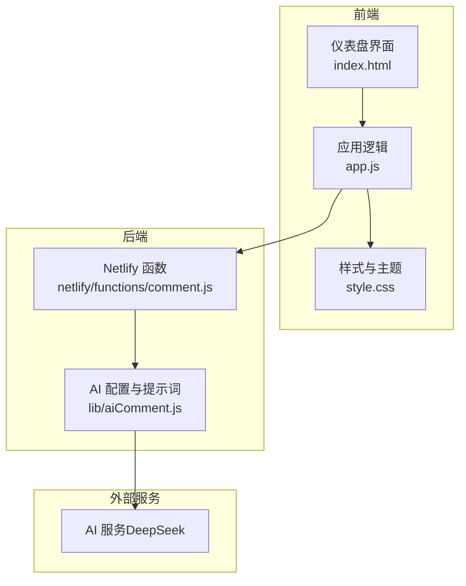
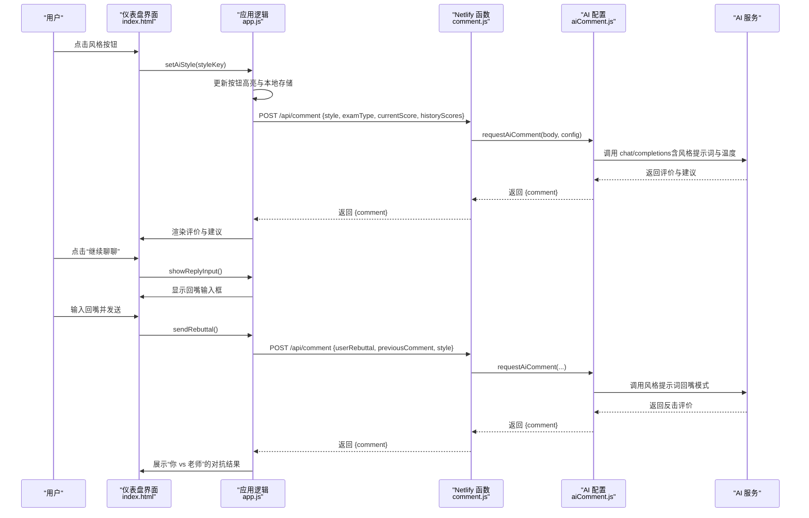
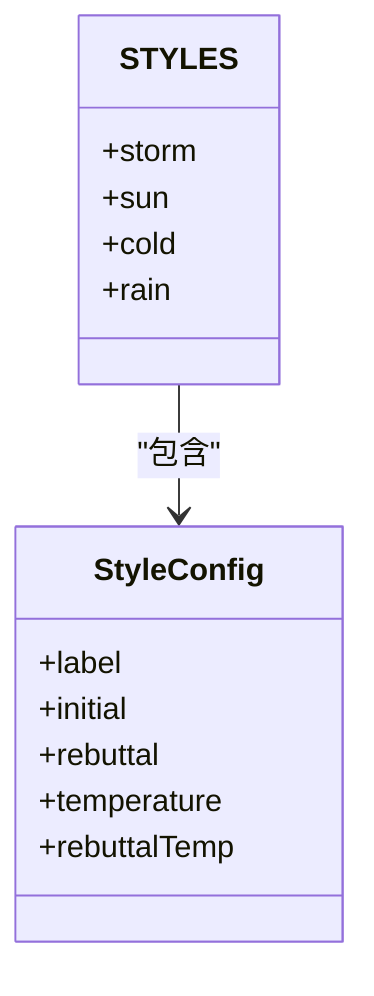
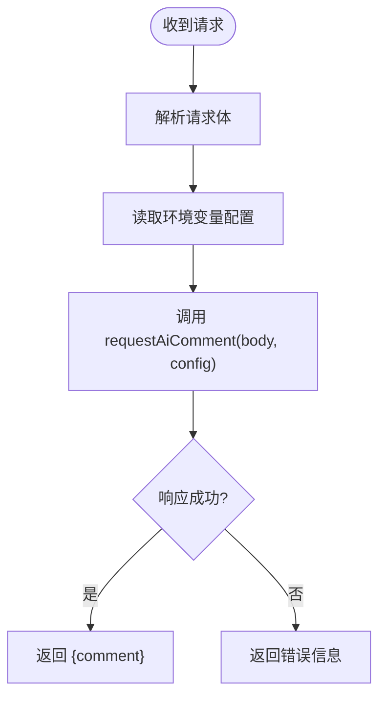
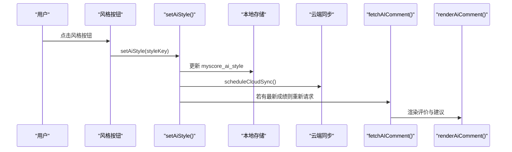
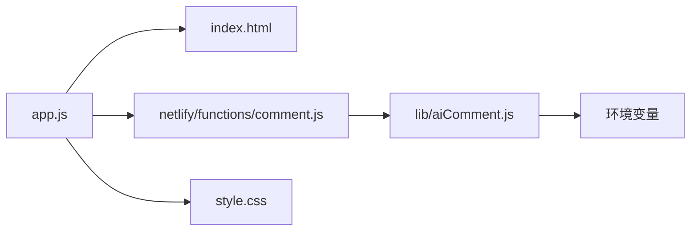

# AI 评论风格

<cite>
**本文档引用的文件**
- [lib/aiComment.js](file://lib/aiComment.js)
- [netlify/functions/comment.js](file://netlify/functions/comment.js)
- [app.js](file://app.js)
- [index.html](file://index.html)
- [style.css](file://style.css)
</cite>

## 目录
1. [简介](#简介)
2. [项目结构](#项目结构)
3. [核心组件](#核心组件)
4. [架构总览](#架构总览)
5. [详细组件分析](#详细组件分析)
6. [依赖关系分析](#依赖关系分析)
7. [性能考虑](#性能考虑)
8. [故障排除指南](#故障排除指南)
9. [结论](#结论)

## 简介
本文件为 MyScore 的 AI 评论风格功能提供全面的技术文档。MyScore 在仪表盘页面集成了基于天气意象命名的四种 AI 评论风格：风暴（幽默毒舌）、暖阳（温暖共情）、冷锋（冷静分析）、阵雨（先损后帮）。用户可通过顶部的风格切换条选择不同风格，系统会根据所选风格生成对应的评价与建议，并支持“回嘴”对抗模式，实现与 AI 的互动辩论。

## 项目结构
MyScore 的 AI 评论风格功能由前端 JavaScript（app.js）负责风格选择与 UI 交互，后端函数（netlify/functions/comment.js）负责转发请求到外部 AI 服务，AI 配置与提示词模板集中在 lib/aiComment.js 中。

**图示来源**
- [index.html](file://index.html)
- [app.js](file://app.js)
- [netlify/functions/comment.js](file://netlify/functions/comment.js)
- [lib/aiComment.js](file://lib/aiComment.js)

**章节来源**
- [index.html](file://index.html)
- [app.js](file://app.js)
- [netlify/functions/comment.js](file://netlify/functions/comment.js)
- [lib/aiComment.js](file://lib/aiComment.js)

## 核心组件
- 风格配置与提示词模板：定义四种风格的 label、提示词、温度与 token 限制。
- Netlify 函数：接收前端请求，读取环境变量，调用外部 AI 接口。
- 前端交互：提供风格切换按钮、AI 评论展示区、回嘴输入与对抗展示。
- 本地化与缓存：使用 localStorage 存储当前风格与使用次数，支持云端同步。

**章节来源**
- [lib/aiComment.js](file://lib/aiComment.js)
- [netlify/functions/comment.js](file://netlify/functions/comment.js)
- [app.js](file://app.js)
- [index.html](file://index.html)

## 架构总览
MyScore 的 AI 评论风格采用“前端选择 + 后端转发 + 外部模型”的三层架构。前端负责风格选择与 UI 展示，后端函数负责安全地封装外部 API 调用，AI 模型根据风格提示词生成评价与建议。

**图示来源**
- [app.js](file://app.js)
- [netlify/functions/comment.js](file://netlify/functions/comment.js)
- [lib/aiComment.js](file://lib/aiComment.js)

## 详细组件分析

### 风格配置与提示词模板（lib/aiComment.js）
- STYLES 定义四种风格：
  - 风暴：犀利刻薄，emoji 限制，建议使用 ||| 分隔评价与建议。
  - 暖阳：温暖鼓励，强调共情与建议。
  - 冷锋：冷静分析，强调数据与事实。
  - 阵雨：先损后帮，反转式建议。
- 每种风格包含：
  - label：本地化显示名称（中文）。
  - initial/rebuttal：初始评价与回嘴模式提示词。
  - temperature/rebuttalTemp：生成温度参数。
  - maxTokens：token 上限（回嘴模式较小，避免过度消耗）。
- companion 模式：伴学助手模式，使用独立 system prompt 与较低温度。

**图示来源**
- [lib/aiComment.js](file://lib/aiComment.js)

**章节来源**
- [lib/aiComment.js](file://lib/aiComment.js)

### Netlify 函数（netlify/functions/comment.js）
- 负责处理跨域与请求转发。
- 从环境变量读取 AI API Key、Base URL 与 Model。
- 将前端请求体传递给 lib/aiComment.js 的 requestAiComment，并返回标准化响应。

**图示来源**
- [netlify/functions/comment.js](file://netlify/functions/comment.js)
- [lib/aiComment.js](file://lib/aiComment.js)

**章节来源**
- [netlify/functions/comment.js](file://netlify/functions/comment.js)

### 前端交互与风格切换（app.js）
- 风格常量与按钮：
  - AI_STYLES 定义图标、名称与描述，按钮 ID 与 setAiStyle 对应。
  - setAiStyle 更新按钮高亮、本地存储、云端同步，并在风格切换后自动重新请求评价。
- 本地模式与每日限额：
  - 本地模式每日限制 5 次，使用 localStorage 记录使用次数与日期。
  - 触发时弹出模式选择或上限提示。
- 评价渲染：
  - renderAiComment 支持 ||| 分隔的“评价 + 建议”格式，点击展开/收起建议。
- 回嘴对抗：
  - showReplyInput 显示输入框，sendRebuttal 将用户回嘴与上次评价发送给 AI，展示“你 vs 老师”的对抗结果。
- 伴学助手：
  - companion 模式使用独立 system prompt，温度较低，优先给出可执行建议。

**图示来源**
- [app.js](file://app.js)
- [index.html](file://index.html)

**章节来源**
- [app.js](file://app.js)
- [index.html](file://index.html)

### UI 结构与本地化（index.html）
- 风格按钮条：包含风暴、暖阳、冷锋、阵雨四个按钮，使用 emoji 与中文标签。
- AI 评论容器：展示评价与建议，支持展开/收起建议。
- 回嘴输入区：输入框与发送按钮，隐藏/显示由 showReplyInput 控制。
- 本地模式提示条：显示当日使用次数与登录解锁链接。

**章节来源**
- [index.html](file://index.html)

### 样式与主题（style.css）
- 风格按钮高亮：选中态使用特定背景与边框颜色，未选中态使用浅色。
- 评论容器：根据风格切换背景与边框颜色，突出视觉反馈。
- 建议展开：使用圆角与浅色背景，提升可读性。

**章节来源**
- [style.css](file://style.css)

## 依赖关系分析
- app.js 依赖：
  - index.html 的 DOM 结构与按钮事件。
  - netlify/functions/comment.js 的 /api/comment 接口。
  - lib/aiComment.js 的 requestAiComment 与 CORS_HEADERS。
- lib/aiComment.js 依赖：
  - 外部 AI 服务（DeepSeek）的 chat/completions 接口。
  - 环境变量（AI_API_KEY、AI_BASE_URL、AI_MODEL）。
- netlify/functions/comment.js 依赖：
  - lib/aiComment.js 的 requestAiComment 与 CORS_HEADERS。
  - Netlify 环境变量（AI_API_KEY、AI_BASE_URL、AI_MODEL）。

**图示来源**
- [app.js](file://app.js)
- [index.html](file://index.html)
- [netlify/functions/comment.js](file://netlify/functions/comment.js)
- [lib/aiComment.js](file://lib/aiComment.js)
- [style.css](file://style.css)

**章节来源**
- [app.js](file://app.js)
- [lib/aiComment.js](file://lib/aiComment.js)
- [netlify/functions/comment.js](file://netlify/functions/comment.js)
- [index.html](file://index.html)
- [style.css](file://style.css)

## 性能考虑
- 温度参数与 token 限制：
  - 风暴与阵雨风格温度较高，增加创造性；回嘴模式温度更高，强化对抗感。
  - 回嘴模式 maxTokens 更小，避免过度消耗与响应延迟。
- 本地缓存与节流：
  - setAiStyle 中存在 aiStyleLocked 与 aiStyleCooldown，防止用户频繁切换导致重复请求。
  - fetchAIComment 中设置 aiStyleLocked，在请求完成后延时解除，避免并发冲突。
- 本地模式限额：
  - 本地模式每日 5 次限制，减少外部 API 调用压力，同时通过提示条引导用户登录解锁。

**章节来源**
- [lib/aiComment.js](file://lib/aiComment.js)
- [app.js](file://app.js)

## 故障排除指南
- 环境变量未配置：
  - 错误：AI_API_KEY 未配置，抛出错误。
  - 处理：在 Netlify 环境中设置 AI_API_KEY、AI_BASE_URL、AI_MODEL。
- 外部 AI 服务异常：
  - 错误：Upstream AI request failed 或返回无效 JSON。
  - 处理：检查上游服务状态与网络连接，重试请求。
- 跨域与方法限制：
  - CORS_HEADERS 与 OPTIONS 预检：确保前端与后端的跨域头一致。
- 本地模式上限：
  - 当达到每日上限时，显示提示条并阻止继续请求，引导用户登录。

**章节来源**
- [lib/aiComment.js](file://lib/aiComment.js)
- [netlify/functions/comment.js](file://netlify/functions/comment.js)
- [app.js](file://app.js)

## 结论
MyScore 的 AI 评论风格功能通过清晰的风格模板、合理的温度与 token 策略、完善的前端交互与后端转发机制，实现了可定制、可对抗、可本地化的智能评价体验。四种风格覆盖不同情感需求与使用场景，配合“回嘴”对抗模式与伴学助手，提升了用户的参与感与学习动力。建议在后续版本中进一步完善错误提示与本地缓存策略，优化移动端交互体验，并考虑引入更多风格与个性化选项。