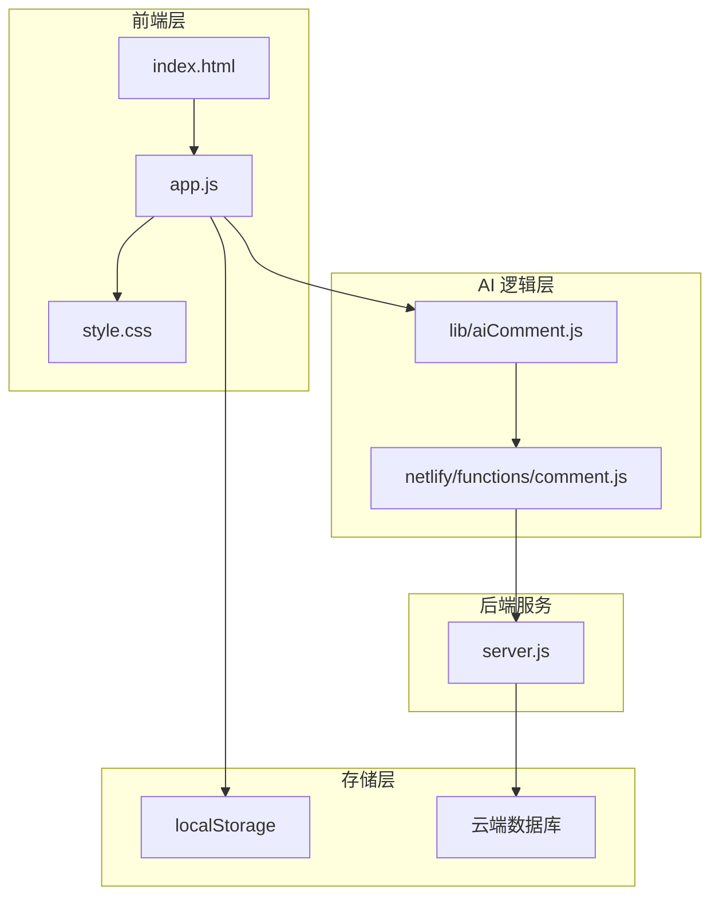
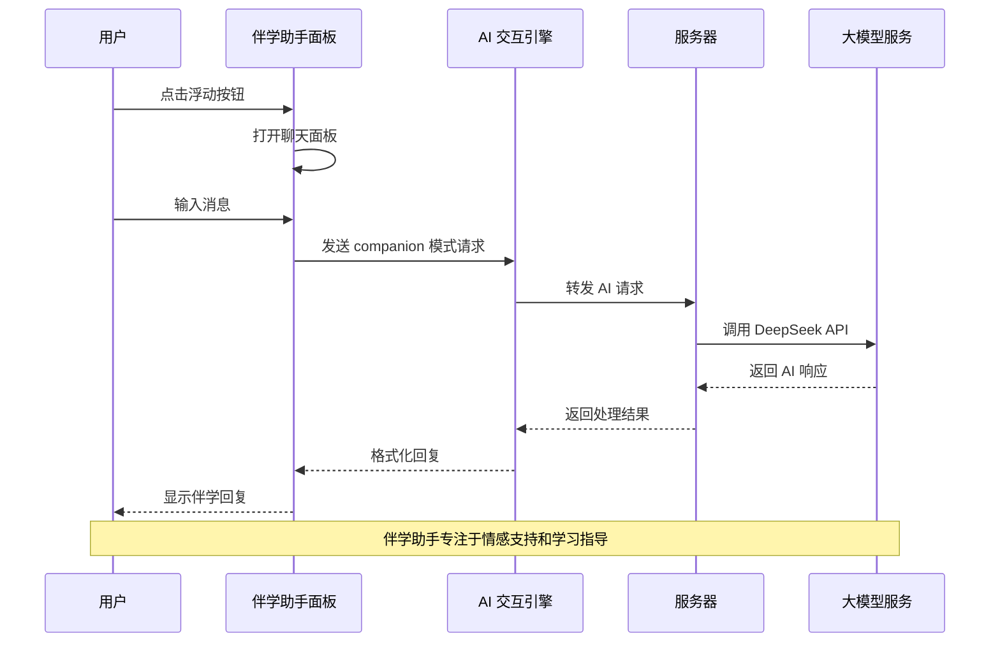
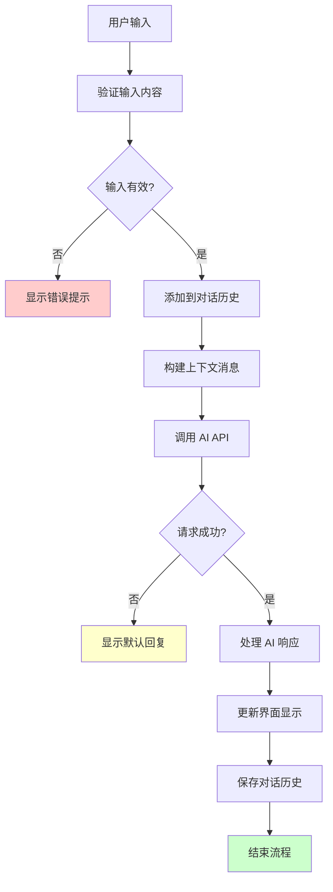
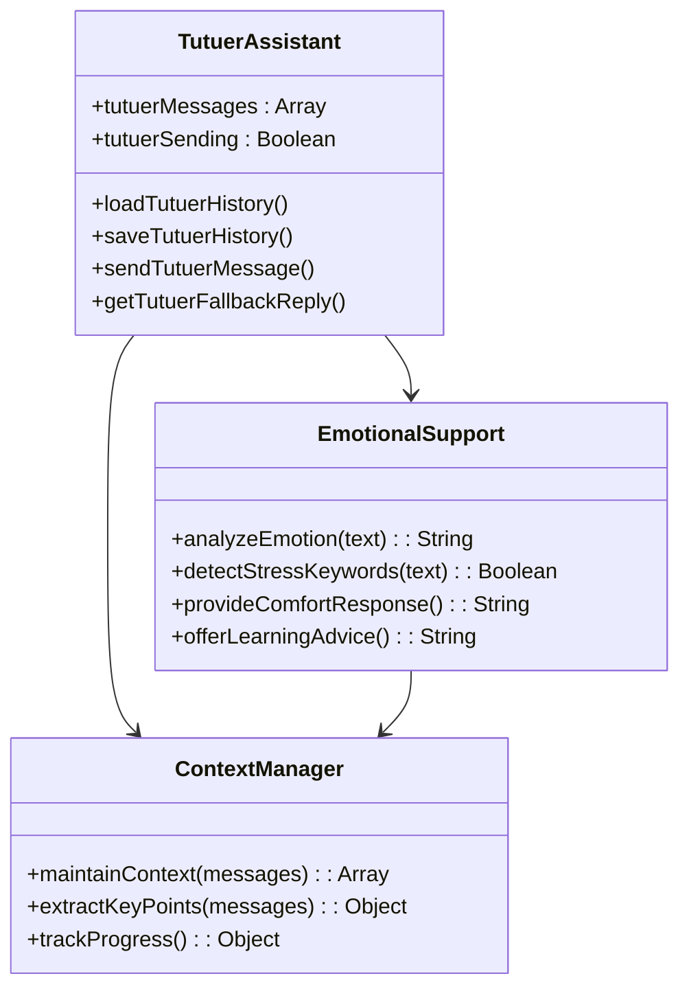
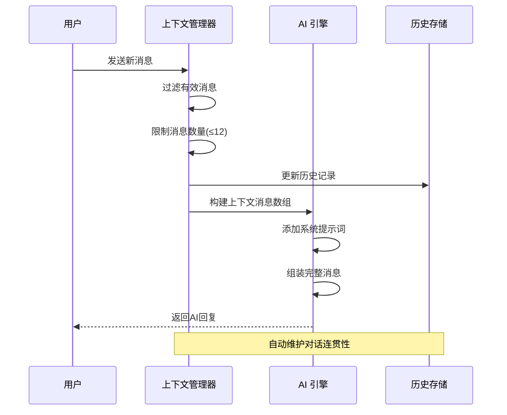
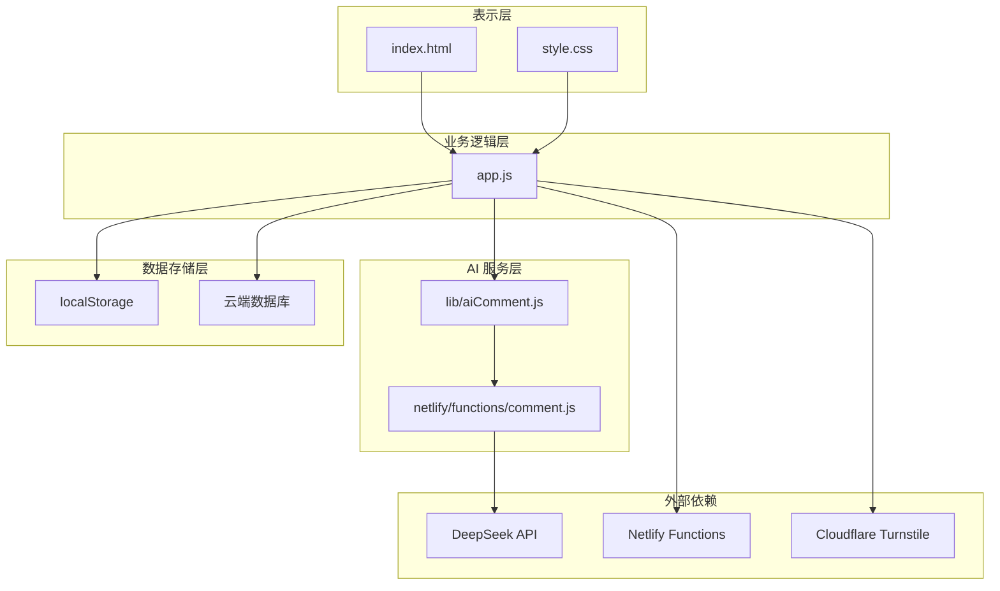

# 伴学助手

<cite>
**本文档引用的文件**
- [app.js](file://app.js)
- [lib/aiComment.js](file://lib/aiComment.js)
- [netlify/functions/comment.js](file://netlify/functions/comment.js)
- [README.md](file://README.md)
- [index.html](file://index.html)
- [style.css](file://style.css)
</cite>

## 目录
1. [简介](#简介)
2. [项目结构](#项目结构)
3. [核心组件](#核心组件)
4. [架构概览](#架构概览)
5. [详细组件分析](#详细组件分析)
6. [依赖关系分析](#依赖关系分析)
7. [性能考虑](#性能考虑)
8. [故障排除指南](#故障排除指南)
9. [结论](#结论)

## 简介

MyScore 的伴学助手（突突er）是一个专为中文学习者设计的 AI 伴学系统。作为 MyScore 的核心功能之一，伴学助手提供了一个温和、可靠的中文伴学 AI，能够倾听用户的学习困扰，提供情感支持和实用的学习建议。

伴学助手与传统的 AI 评价功能（毒舌老师）形成互补：前者专注于情感陪伴和学习支持，后者专注于成绩评价和激励。两者共同构成了 MyScore 的完整 AI 交互生态。

## 项目结构

MyScore 项目采用前后端分离的架构设计，伴学助手功能主要分布在以下几个关键文件中：

**图表来源**
- [index.html](file://index.html)
- [app.js](file://app.js)
- [lib/aiComment.js](file://lib/aiComment.js)
- [netlify/functions/comment.js](file://netlify/functions/comment.js)

**章节来源**
- [README.md](file://README.md)
- [index.html](file://index.html)

## 核心组件

伴学助手系统由多个相互协作的核心组件构成：

### 1. 伴学助手面板组件
- **浮动按钮**：位于屏幕左下角，带有醒目的小红点提醒
- **聊天面板**：支持展开/折叠的现代化聊天界面
- **快捷操作**：一键生成学习计划、清空对话等功能

### 2. 对话管理系统
- **历史记录**：本地存储最近30条对话记录
- **上下文维护**：自动维护最近12条对话上下文
- **状态同步**：支持本地和云端双向同步

### 3. AI 交互引擎
- **模式切换**：支持 companion 模式和传统评价模式
- **情感识别**：基于关键词的情感状态检测
- **个性化回应**：根据用户状态提供定制化建议

### 4. 用户界面组件
- **响应式设计**：完美适配桌面和移动设备
- **无障碍支持**：完整的键盘导航和屏幕阅读器支持
- **视觉反馈**：丰富的动画效果和状态指示

**章节来源**
- [app.js](file://app.js)
- [index.html](file://index.html)
- [style.css](file://style.css)

## 架构概览

伴学助手采用了现代化的前后端分离架构，实现了高内聚、低耦合的设计原则：

**图表来源**
- [app.js](file://app.js)
- [lib/aiComment.js](file://lib/aiComment.js)
- [netlify/functions/comment.js](file://netlify/functions/comment.js)

### 系统架构特点

1. **模块化设计**：每个功能模块都有明确的职责边界
2. **异步处理**：采用 Promise 和 async/await 实现非阻塞操作
3. **错误处理**：完善的异常捕获和用户友好的错误提示
4. **性能优化**：智能缓存和请求节流机制

## 详细组件分析

### 伴学助手核心实现

伴学助手的核心功能集中在 app.js 文件的特定区域，实现了完整的对话管理和 AI 交互流程：

#### 对话管理机制

**图表来源**
- [app.js](file://app.js)

#### 对话历史管理

伴学助手实现了智能的对话历史管理机制：

| 功能特性 | 实现方式 | 存储策略 |
|---------|----------|----------|
| 历史记录上限 | 限制为30条消息 | localStorage 持久化 |
| 上下文维护 | 最近12条对话 | 内存缓存 |
| 数据同步 | 本地/云端双向同步 | 自动同步机制 |
| 清理策略 | 按需清理过期记录 | 智能垃圾回收 |

#### 情感支持策略

伴学助手采用多层次的情感识别和响应机制：

**图表来源**
- [app.js](file://app.js)

### AI 交互引擎

伴学助手的 AI 交互引擎位于 lib/aiComment.js 文件中，提供了强大的自然语言处理能力：

#### companion 模式设计

伴学助手的 companion 模式具有独特的设计理念：

| 设计要素 | 实现细节 | 作用机制 |
|---------|----------|----------|
| 温和语调 | 系统提示词强调"温和、克制、可靠" | 避免强制说教 |
| 情感共鸣 | 优先共情，再提建议 | 建立信任关系 |
| 实用导向 | 提供最多3条可执行建议 | 确保实用性 |
| 文本限制 | 单次回复控制在120字内 | 提高可读性 |

#### 对话上下文维护

**图表来源**
- [lib/aiComment.js](file://lib/aiComment.js)

### 用户界面组件

伴学助手的用户界面采用了现代化的设计理念，注重用户体验和可访问性：

#### 响应式布局设计

| 设备类型 | 布局特点 | 交互方式 |
|---------|----------|----------|
| 桌面端 | 固定面板，展开式设计 | 鼠标悬停，键盘快捷键 |
| 移动端 | 浮动按钮，全屏面板 | 触摸手势，键盘适配 |
| 平板端 | 自适应布局 | 多点触控，方向旋转 |

#### 无障碍支持

伴学助手实现了全面的无障碍访问支持：

- **键盘导航**：完整的 Tab 键顺序和快捷键支持
- **屏幕阅读器**：语义化的 HTML 结构和 ARIA 标签
- **高对比度**：支持高对比度模式
- **语音控制**：支持语音助手操作

**章节来源**
- [app.js](file://app.js)
- [index.html](file://index.html)
- [style.css](file://style.css)

## 依赖关系分析

伴学助手系统的依赖关系体现了清晰的分层架构：

**图表来源**
- [app.js](file://app.js)
- [lib/aiComment.js](file://lib/aiComment.js)
- [netlify/functions/comment.js](file://netlify/functions/comment.js)

### 关键依赖关系

1. **前端依赖**：app.js 依赖于 HTML 结构和 CSS 样式
2. **AI 依赖**：通过 lib/aiComment.js 间接依赖外部 AI 服务
3. **存储依赖**：同时支持本地存储和云端同步
4. **安全依赖**：集成 Cloudflare Turnstile 人机验证

**章节来源**
- [app.js](file://app.js)
- [lib/aiComment.js](file://lib/aiComment.js)

## 性能考虑

伴学助手在设计时充分考虑了性能优化，采用了多种策略来确保流畅的用户体验：

### 内存管理优化

- **消息限制**：对话历史限制为30条，避免内存泄漏
- **上下文优化**：仅维护最近12条消息的上下文
- **垃圾回收**：定期清理无效和过期的消息记录

### 网络性能优化

- **请求缓存**：智能缓存机制减少重复请求
- **超时控制**：30秒超时机制防止长时间等待
- **错误重试**：自动重试机制提高成功率

### 用户体验优化

- **即时反馈**：加载状态指示和即时响应
- **离线支持**：本地存储确保基本功能可用
- **渐进增强**：逐步增强的功能加载

## 故障排除指南

伴学助手系统提供了完善的错误处理和故障排除机制：

### 常见问题诊断

| 问题类型 | 症状表现 | 解决方案 |
|---------|----------|----------|
| AI 请求失败 | 显示"AI 请求失败"错误 | 检查网络连接和 API 密钥 |
| 对话历史丢失 | 重新加载后对话消失 | 检查浏览器存储权限 |
| 响应缓慢 | AI 回复延迟 | 清理浏览器缓存和 Cookie |
| 界面显示异常 | 聊天面板布局错乱 | 刷新页面或清除浏览器缓存 |

### 调试工具和方法

1. **浏览器开发者工具**：检查网络请求和 JavaScript 错误
2. **控制台日志**：查看详细的错误信息和调试输出
3. **存储检查**：验证 localStorage 中的数据完整性
4. **网络监控**：跟踪 API 请求和响应时间

### 性能监控指标

- **响应时间**：AI 请求的平均响应时间
- **成功率**：API 调用的成功率统计
- **内存使用**：对话历史和上下文的内存占用
- **用户满意度**：基于用户反馈的体验评估

**章节来源**
- [app.js](file://app.js)

## 结论

MyScore 的伴学助手（突突er）是一个设计精良、功能完备的 AI 伴学系统。它成功地将情感支持、学习指导和实用建议有机结合，为中文学习者提供了一个温和、可靠的 AI 伙伴。

### 系统优势

1. **设计理念先进**：专注于情感陪伴而非单纯的成绩评价
2. **技术实现成熟**：采用现代化的前端技术和可靠的后端架构
3. **用户体验优秀**：响应式设计和无障碍支持确保广泛的用户覆盖
4. **扩展性强**：模块化设计便于功能扩展和维护

### 应用价值

伴学助手不仅是一个技术产品，更是教育科技人性化发展的体现。它通过 AI 技术为学习者提供情感支持，帮助他们建立积极的学习态度，提高学习效率。

随着 AI 技术的不断发展，伴学助手将继续演进，为用户提供更加智能化、个性化的学习陪伴体验。