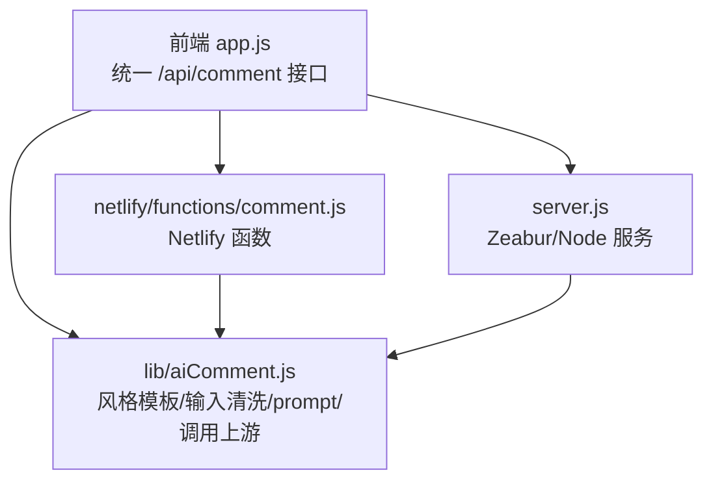
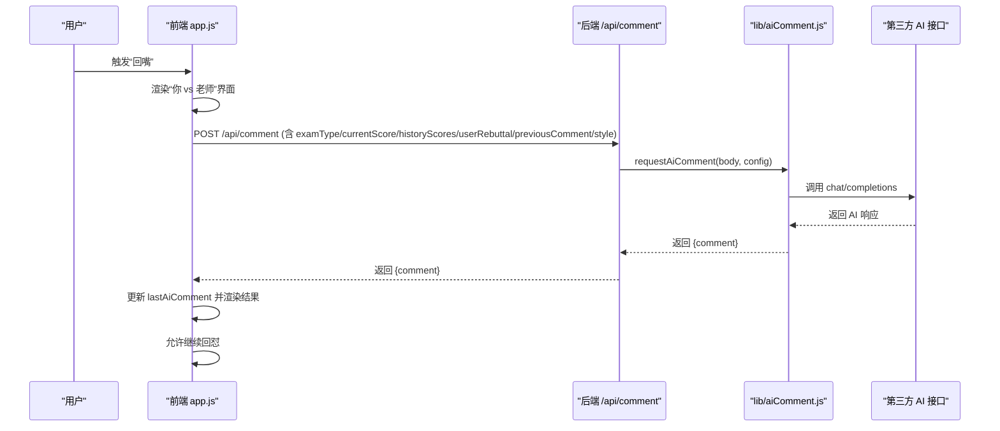
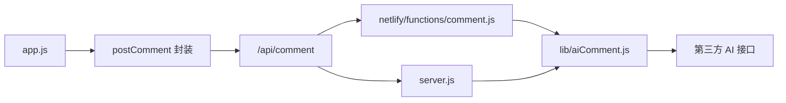

# 回怼功能

<cite>
**本文引用的文件**
- [lib/aiComment.js](file://lib/aiComment.js)
- [netlify/functions/comment.js](file://netlify/functions/comment.js)
- [server.js](file://server.js)
- [app.js](file://app.js)
- [README.md](file://README.md)
</cite>

## 目录
1. [简介](#简介)
2. [项目结构](#项目结构)
3. [核心组件](#核心组件)
4. [架构总览](#架构总览)
5. [详细组件分析](#详细组件分析)
6. [依赖关系分析](#依赖关系分析)
7. [性能考量](#性能考量)
8. [故障排查指南](#故障排查指南)
9. [结论](#结论)
10. [附录](#附录)

## 简介
本文件系统性阐述 MyScore 的 AI 回怼功能，涵盖触发条件、消息构建规则、风格适配机制、安全过滤与长度限制、情感平衡策略、与主评论功能的协同工作、回怼历史管理与展示，以及用户体验设计与交互逻辑。读者可据此理解回怼功能的实现原理与最佳实践。

## 项目结构
MyScore 采用前后端分离与共享逻辑的设计：
- 前端通过统一的 /api/comment 接口发起请求，支持 Netlify 与 Zeabur 两种部署形态。
- 共享逻辑集中在 lib/aiComment.js，负责风格模板、输入清洗、prompt 构建、温度与 token 控制、上游错误处理与返回封装。
- Netlify 侧通过 netlify/functions/comment.js 将请求转发至共享逻辑。
- Zeabur/Node 侧通过 server.js 的 /api/comment 路由复用共享逻辑，并增加速率限制、匿名用户每日限额等安全策略。

图表来源
- [app.js:745-748](file://app.js#L745-L748)
- [lib/aiComment.js:47-171](file://lib/aiComment.js#L47-L171)
- [netlify/functions/comment.js:1-35](file://netlify/functions/comment.js#L1-L35)
- [server.js:135-176](file://server.js#L135-L176)

章节来源
- [README.md:217-236](file://README.md#L217-L236)
- [app.js:745-748](file://app.js#L745-L748)

## 核心组件
- 回怼触发与输入处理：前端在 AI 评价展示后，提供“回嘴”入口，收集用户反驳输入，构建回怼 payload 并调用 /api/comment。
- 风格系统：风暴、暖阳、冷锋、阵雨四种风格，分别对应不同的 system prompt、温度与 token 配置。
- 上游调用：共享逻辑负责将回怼请求发送至第三方 AI 接口，处理错误与响应。
- 历史与展示：回怼结果与之前的 AI 评价共同组成对话历史，前端以“你 vs 老师”的形式展示，并支持继续回怼。

章节来源
- [app.js:2471-2516](file://app.js#L2471-L2516)
- [lib/aiComment.js:8-45](file://lib/aiComment.js#L8-L45)
- [lib/aiComment.js:47-171](file://lib/aiComment.js#L47-L171)

## 架构总览
回怼功能的关键交互序列如下：

图表来源
- [app.js:2471-2516](file://app.js#L2471-L2516)
- [lib/aiComment.js:47-171](file://lib/aiComment.js#L47-L171)
- [netlify/functions/comment.js:13-34](file://netlify/functions/comment.js#L13-L34)
- [server.js:135-176](file://server.js#L135-L176)

## 详细组件分析

### 回怼触发与输入处理
- 触发条件：AI 评价生成后，前端显示“回嘴”按钮；用户点击后弹出输入框。
- 输入收集：收集用户反驳内容，同时携带上次 AI 评价作为上下文，确保回怼具备针对性。
- 界面状态：回怼过程中界面切换为“对战中”样式，输入框隐藏，等待 AI 回应。
- 继续回怼：AI 回应后，允许用户继续输入，形成多轮对话。

章节来源
- [app.js:2371-2394](file://app.js#L2371-L2394)
- [app.js:2471-2516](file://app.js#L2471-L2516)

### 消息构建规则与风格适配
- 风格模板：lib/aiComment.js 定义四种风格的 system prompt 与温度、token 配置。回怼模式使用风格的 rebuttal prompt。
- 回怼 prompt 构建：当存在 userRebuttal 时，系统使用风格的 rebuttal prompt，并拼接“考试、分数、上次评价、学生回嘴”的上下文。
- 温度与 token：回怼模式使用风格的 rebuttalTemp 与 150 的 max_tokens，确保输出更聚焦、更短小精悍。
- 建议分段：AI 响应支持“评价|||建议”的格式，前端提供建议展开/收起交互。

章节来源
- [lib/aiComment.js:8-45](file://lib/aiComment.js#L8-L45)
- [lib/aiComment.js:116-135](file://lib/aiComment.js#L116-L135)
- [lib/aiComment.js:2397-2409](file://lib/aiComment.js#L2397-L2409)

### 安全过滤与长度限制
- 输入截断：对 examType、currentScore、userRebuttal、previousComment、userMessage 等字段进行长度截断，防止过长输入影响 prompt。
- CORS 与速率限制：后端对 /api/comment 设置速率限制，匿名用户按 IP 每分钟最多 20 次；匿名用户每日 AI 评论上限 5 次。
- 人机验证：可选的 Cloudflare Turnstile 验证，防止验证码接口被滥用。
- 错误处理：上游返回非 JSON 或非 2xx 时，抛出明确错误并透传状态码，前端进行友好提示。

章节来源
- [lib/aiComment.js:62-71](file://lib/aiComment.js#L62-L71)
- [server.js:18-48](file://server.js#L18-L48)
- [server.js:118-133](file://server.js#L118-L133)
- [server.js:135-176](file://server.js#L135-L176)

### 情感平衡与输出约束
- 风格温度：风暴 1.4、暖阳 0.7、冷锋 0.6、阵雨 1.3，温度越高越“调皮”，越低越“稳重”。
- 输出长度：回怼模式 max_tokens 150，主评论模式 180；同时限制单条输入长度，确保输出在 50 字以内（评价）与 30 字以内（建议）。
- Emoji 限制：风格模板限定 1-2 个 emoji，避免过度装饰影响可读性。
- 建议分段：建议与评价分离，便于用户选择是否展开查看。

章节来源
- [lib/aiComment.js:15-16](file://lib/aiComment.js#L15-L16)
- [lib/aiComment.js:24-25](file://lib/aiComment.js#L24-L25)
- [lib/aiComment.js:33-34](file://lib/aiComment.js#L33-L34)
- [lib/aiComment.js:42-43](file://lib/aiComment.js#L42-L43)
- [lib/aiComment.js:116-129](file://lib/aiComment.js#L116-L129)
- [lib/aiComment.js:2397-2409](file://lib/aiComment.js#L2397-L2409)

### 与主评论功能的协同机制
- 共享逻辑：前后端均复用 lib/aiComment.js，确保风格、prompt、温度、token 等策略一致。
- 主评论模式：当无 userRebuttal 时，使用风格的 initial prompt 生成评价与建议。
- 回怼模式：当存在 userRebuttal 时，使用风格的 rebuttal prompt 进行反击。
- 伴学模式：与回怼模式并行，通过 mode: 'companion' 走另一套对话逻辑，互不冲突。

章节来源
- [lib/aiComment.js:78-135](file://lib/aiComment.js#L78-L135)
- [app.js:3599-3621](file://app.js#L3599-L3621)

### 回怼历史管理与展示
- 历史记录：前端维护 lastAiComment 作为上下文，每次回怼后更新为最新 AI 响应。
- 展示方式：以“你 vs 老师”的对比形式展示，支持建议展开/收起。
- 继续回怼：AI 回应后恢复“回嘴”按钮，允许无限套娃式多轮对话。

章节来源
- [app.js:2494-2516](file://app.js#L2494-L2516)
- [app.js:2397-2409](file://app.js#L2397-L2409)

### 用户体验设计与交互逻辑
- 战斗 UI：回怼时界面切换为“对战中”样式，提升沉浸感。
- 输入体验：回怼时隐藏输入框，等待 AI 思考，结束后恢复输入并允许继续。
- 风格切换：支持四种风格一键切换，切换后自动重新请求评价，冷却期防止频繁切换。
- 提示与反馈：网络异常、超时、限额等场景提供友好提示。

章节来源
- [app.js:2486-2492](file://app.js#L2486-L2492)
- [app.js:779-800](file://app.js#L779-L800)
- [README.md:142-147](file://README.md#L142-L147)

## 依赖关系分析
- 前端依赖：
  - 统一的 /api/comment 接口（通过 meta 标签配置）。
  - postComment 封装 fetch、超时控制与错误处理。
- 后端依赖：
  - 共享逻辑 lib/aiComment.js。
  - 速率限制与匿名限额。
  - 可选的人机验证。
- 第三方依赖：
  - 第三方 AI 接口（默认 DeepSeek）。

图表来源
- [app.js:745-748](file://app.js#L745-L748)
- [app.js:1005-1040](file://app.js#L1005-L1040)
- [netlify/functions/comment.js:13-34](file://netlify/functions/comment.js#L13-L34)
- [server.js:504-536](file://server.js#L504-L536)
- [lib/aiComment.js:47-171](file://lib/aiComment.js#L47-L171)

章节来源
- [app.js:1005-1040](file://app.js#L1005-L1040)
- [server.js:18-48](file://server.js#L18-L48)
- [server.js:118-133](file://server.js#L118-L133)

## 性能考量
- 温度与 token：回怼模式使用更高温度与更短 max_tokens，提高响应速度与输出可控性。
- 输入截断：对关键字段进行截断，减少 prompt 长度，降低上游调用成本。
- 速率限制：对 /api/comment 设置每分钟 20 次的速率限制，防止滥用。
- 匿名限额：匿名用户每日 5 次，登录用户无限制，平衡公平与可用性。
- 超时控制：前端对 /api/comment 设置 30 秒超时，避免长时间阻塞。

章节来源
- [lib/aiComment.js:62-71](file://lib/aiComment.js#L62-L71)
- [lib/aiComment.js:116-129](file://lib/aiComment.js#L116-L129)
- [server.js:18-48](file://server.js#L18-L48)
- [server.js:118-133](file://server.js#L118-L133)
- [app.js:1010-1011](file://app.js#L1010-L1011)

## 故障排查指南
- 无回怼响应
  - 检查 /api/comment 是否可达，确认 meta 标签中的 endpoint 配置。
  - 查看网络面板与错误提示，确认是否超时或上游返回非 JSON。
- 回怼风格异常
  - 确认当前风格是否正确保存在本地存储中。
  - 切换风格后是否触发重新请求评价。
- 限额与权限
  - 匿名用户每日 5 次，登录用户无限制。
  - 未登录时是否触发“登录使用/本地使用”模式选择。
- 人机验证
  - 若启用 Turnstile，确认站点密钥与密钥配置正确。

章节来源
- [app.js:745-748](file://app.js#L745-L748)
- [app.js:779-800](file://app.js#L779-L800)
- [server.js:118-133](file://server.js#L118-L133)
- [README.md:324-335](file://README.md#L324-L335)

## 结论
MyScore 的回怼功能通过统一的 /api/comment 接口与共享逻辑实现，结合四种风格的 prompt 模板、严格的输入截断与温度/token 控制，既保证了输出的趣味性与针对性，又兼顾了安全性与性能。与主评论功能协同工作，形成“评价—回怼—建议”的完整交互闭环，辅以战斗 UI 与建议展开等体验细节，提升了用户的参与感与粘性。

## 附录
- 回怼模式触发流程（代码路径）
  - [app.js: showReplyInput:2472-2476](file://app.js#L2472-L2476)
  - [app.js: sendRebuttal:2479-2516](file://app.js#L2479-L2516)
- 回怼 prompt 构建（代码路径）
  - [lib/aiComment.js: requestAiComment 回怼分支:116-135](file://lib/aiComment.js#L116-L135)
- 风格模板与温度配置（代码路径）
  - [lib/aiComment.js: STYLES:8-45](file://lib/aiComment.js#L8-L45)
- 后端路由与速率限制（代码路径）
  - [server.js: handleCommentApi:135-176](file://server.js#L135-L176)
  - [server.js: RATE_LIMITS:18-23](file://server.js#L18-L23)
- Netlify 函数（代码路径）
  - [netlify/functions/comment.js:13-34](file://netlify/functions/comment.js#L13-L34)