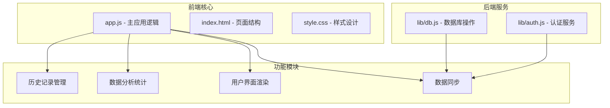
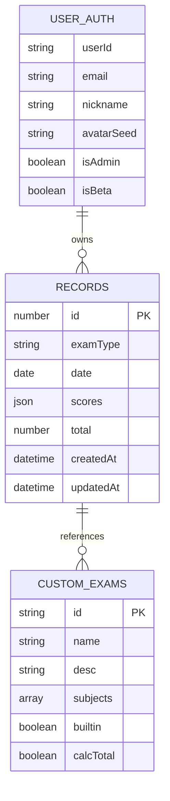
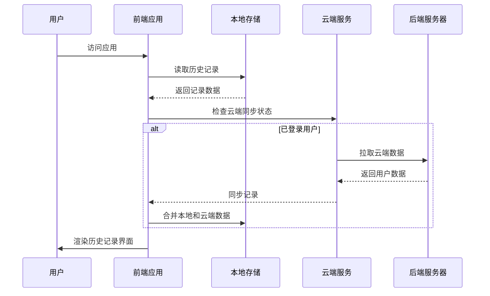
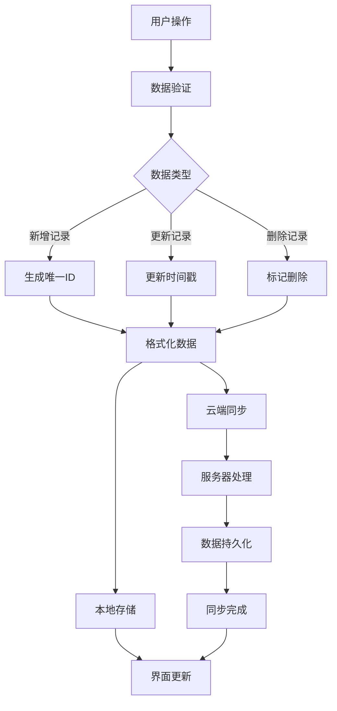
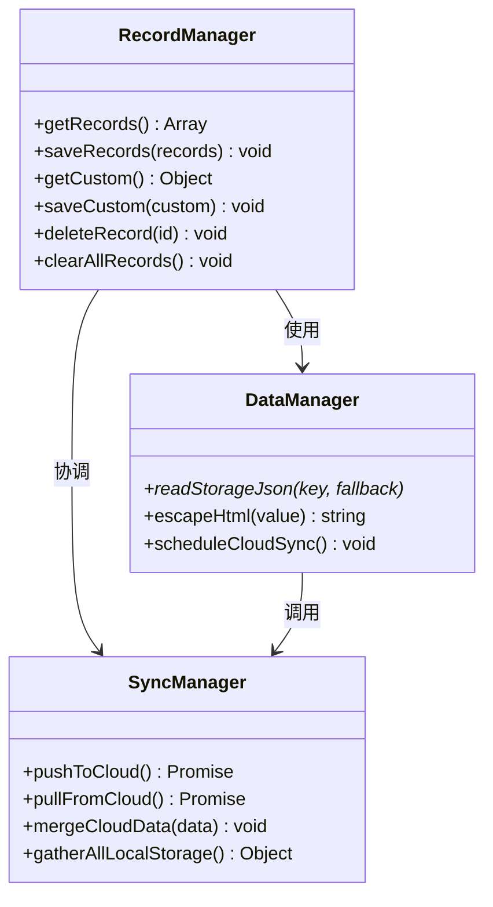
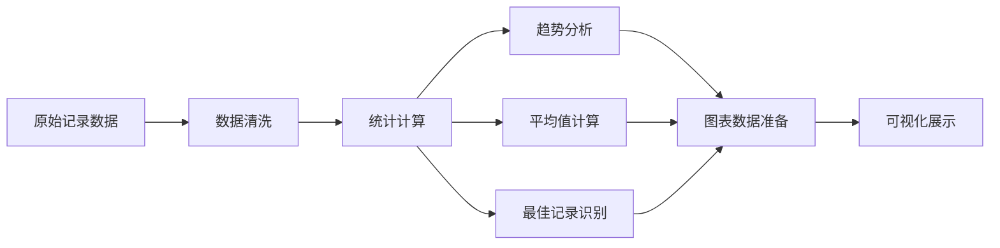
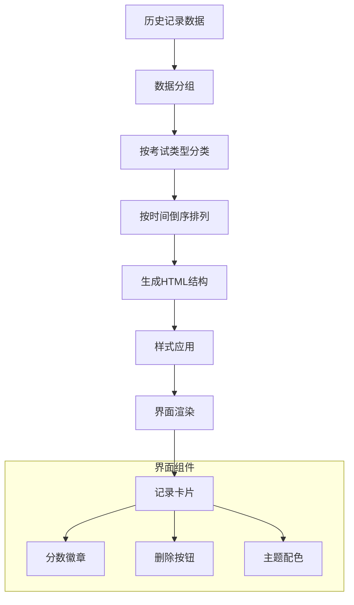
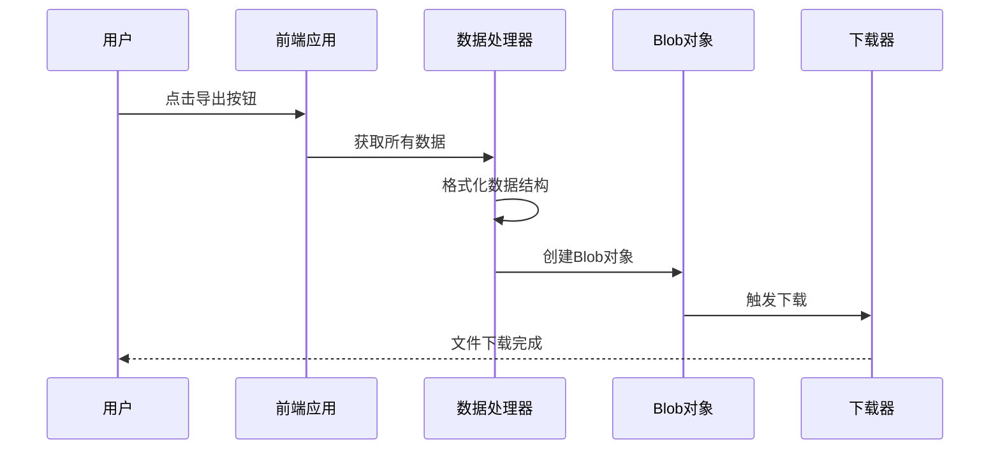
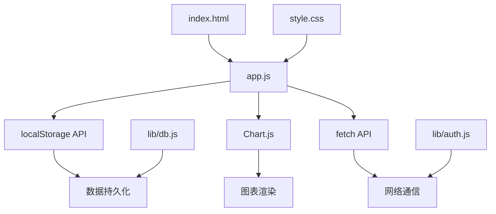
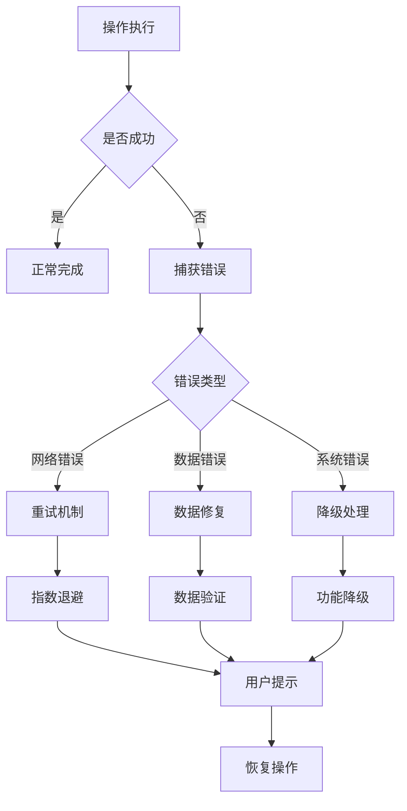

# 历史记录管理

<cite>
**本文档引用的文件**
- [app.js](file://app.js)
- [index.html](file://index.html)
- [style.css](file://style.css)
- [lib/db.js](file://lib/db.js)
- [lib/auth.js](file://lib/auth.js)
</cite>

## 目录
1. [简介](#简介)
2. [项目结构](#项目结构)
3. [核心组件](#核心组件)
4. [架构概览](#架构概览)
5. [详细组件分析](#详细组件分析)
6. [依赖关系分析](#依赖关系分析)
7. [性能考虑](#性能考虑)
8. [故障排除指南](#故障排除指南)
9. [结论](#结论)

## 简介

MyScore 历史记录管理系统是一个完整的前端应用，专门用于管理和分析学生成绩历史。该系统提供了成绩记录、存储、检索、排序和展示的完整解决方案，支持本地存储和云端同步功能。

系统的核心功能包括：
- 成绩历史的增删改查操作
- 多维度的数据统计和分析
- 可视化图表展示
- 本地与云端数据同步
- 数据导出和迁移功能
- 用户友好的界面设计

## 项目结构

MyScore 采用模块化的前端架构设计，主要文件组织如下：



**图表来源**
- [app.js:1-50](file://app.js#L1-L50)
- [lib/db.js:1-30](file://lib/db.js#L1-L30)
- [lib/auth.js:1-20](file://lib/auth.js#L1-L20)

**章节来源**
- [app.js:1-100](file://app.js#L1-L100)
- [index.html:1-100](file://index.html#L1-L100)
- [style.css:1-50](file://style.css#L1-L50)

## 核心组件

### 数据存储系统

系统使用 localStorage 作为主要的本地存储机制，支持以下数据类型：



**图表来源**
- [app.js:1042-1068](file://app.js#L1042-L1068)
- [app.js:1056-1068](file://app.js#L1056-L1068)

### 历史记录数据结构

每个历史记录包含以下关键字段：

| 字段名 | 类型 | 描述 | 必需 |
|--------|------|------|------|
| id | number | 唯一标识符 | 是 |
| examType | string | 考试类型标识 | 是 |
| date | date | 考试日期 | 是 |
| scores | json | 各科目分数对象 | 是 |
| total | number | 总分 | 否 |
| createdAt | datetime | 创建时间 | 否 |
| updatedAt | datetime | 更新时间 | 否 |

**章节来源**
- [app.js:2007-2013](file://app.js#L2007-L2013)
- [app.js:1042-1054](file://app.js#L1042-L1054)

## 架构概览

MyScore 采用前后端分离的架构设计，前端使用纯 JavaScript 实现，后端提供 RESTful API 服务。



**图表来源**
- [app.js:666-743](file://app.js#L666-L743)
- [lib/db.js:192-207](file://lib/db.js#L192-L207)

### 数据流架构



**图表来源**
- [app.js:1513-1527](file://app.js#L1513-L1527)
- [app.js:1047-1054](file://app.js#L1047-L1054)

**章节来源**
- [app.js:666-743](file://app.js#L666-L743)
- [lib/db.js:192-207](file://lib/db.js#L192-L207)

## 详细组件分析

### 历史记录管理核心功能

#### 数据存储与检索

系统实现了完整的 CRUD 操作，支持历史记录的增删改查：



**图表来源**
- [app.js:1042-1068](file://app.js#L1042-L1068)
- [app.js:672-743](file://app.js#L672-L743)

#### 记录增删改查操作

**新增记录流程**：
1. 验证考试日期和分数范围
2. 计算总分和各科目折算分
3. 生成唯一 ID 和时间戳
4. 保存到本地存储
5. 触发云端同步

**删除记录流程**：
1. 用户确认删除操作
2. 过滤掉指定 ID 的记录
3. 更新本地存储
4. 渲染更新后的界面

**章节来源**
- [app.js:1953-2021](file://app.js#L1953-L2021)
- [app.js:1513-1527](file://app.js#L1513-L1527)

### 数据统计与分析功能

#### 统计计算模块

系统提供多种统计分析功能：



**图表来源**
- [app.js:1393-1419](file://app.js#L1393-L1419)
- [app.js:1422-1511](file://app.js#L1422-L1511)

#### 统计指标计算

系统支持以下统计指标：

| 指标类型 | 计算方法 | 应用场景 |
|----------|----------|----------|
| 考试次数 | 计算记录总数 | 基础统计 |
| 最佳成绩 | 数值最大值 | 成绩对比 |
| 平均分 | 数值总和/数量 | 整体表现 |
| 最近记录 | 按日期排序取最新 | 时间轴展示 |
| 成绩趋势 | 多期数据对比 | 发展轨迹 |

**章节来源**
- [app.js:1394-1405](file://app.js#L1394-L1405)
- [app.js:1441-1490](file://app.js#L1441-L1490)

### 用户界面渲染系统

#### 历史记录列表渲染

系统采用响应式设计，支持多种屏幕尺寸：



**图表来源**
- [app.js:1321-1359](file://app.js#L1321-L1359)
- [style.css:418-485](file://style.css#L418-L485)

#### 交互式筛选功能

系统提供多种筛选和排序选项：

| 筛选类型 | 实现方式 | 用户体验 |
|----------|----------|----------|
| 考试类型筛选 | 标签页切换 | 直观易用 |
| 时间范围筛选 | 日期选择器 | 精确控制 |
| 分数区间筛选 | 滑块组件 | 直观反馈 |
| 排序方式 | 下拉菜单 | 灵活配置 |

**章节来源**
- [app.js:1361-1419](file://app.js#L1361-L1419)
- [index.html:316-326](file://index.html#L316-L326)

### 数据导出与迁移功能

#### 导出机制

系统支持完整的数据导出功能：



**图表来源**
- [app.js:2192-2209](file://app.js#L2192-L2209)

#### 数据迁移策略

系统提供安全的数据迁移机制：

| 迁移类型 | 处理方式 | 安全性 |
|----------|----------|--------|
| 本地到云端 | 自动同步 | 加密传输 |
| 云端到本地 | 手动导入 | 数据校验 |
| 跨设备迁移 | 备份文件 | 版本兼容 |
| 数据恢复 | 历史备份 | 完整性验证 |

**章节来源**
- [app.js:2211-2249](file://app.js#L2211-L2249)
- [lib/db.js:192-207](file://lib/db.js#L192-L207)

## 依赖关系分析

### 核心依赖关系



**图表来源**
- [app.js:1-50](file://app.js#L1-L50)
- [lib/db.js:1-30](file://lib/db.js#L1-L30)
- [lib/auth.js:1-20](file://lib/auth.js#L1-L20)

### 外部依赖管理

系统对外部依赖的管理策略：

| 依赖类型 | 版本管理 | 更新策略 | 安全性 |
|----------|----------|----------|--------|
| Chart.js | CDN托管 | 自动更新 | 官方源 |
| DiceBear API | 外部服务 | 降级处理 | HTTPS加密 |
| Resend API | 环境变量 | 错误重试 | 密钥保护 |
| Cloudflare Turnstile | 外部服务 | 超时处理 | 人机验证 |

**章节来源**
- [app.js:153-210](file://app.js#L153-L210)
- [lib/auth.js:67-134](file://lib/auth.js#L67-L134)

## 性能考虑

### 存储优化策略

系统采用了多项性能优化措施：

1. **数据压缩**：使用 JSON 序列化减少存储空间
2. **增量同步**：只同步变更的数据，减少网络传输
3. **缓存机制**：本地缓存常用数据，减少重复计算
4. **懒加载**：图表和大数据集按需加载

### 查询优化

```mermaid
flowchart TD
A[查询请求] --> B{数据量大小}
B --> |小量数据| C[内存查询]
B --> |大量数据| D[索引查询]
C --> E[Array.filter]
D --> F[Map/Set优化]
E --> G[时间复杂度 O(n)]
F --> H[时间复杂度 O(log n)]
I[分页加载] --> J[虚拟滚动]
J --> K[提升渲染性能]
```

**图表来源**
- [app.js:715-743](file://app.js#L715-L743)
- [app.js:1441-1442](file://app.js#L1441-L1442)

### 内存管理

系统实现了完善的内存管理机制：

- **垃圾回收**：定期清理不再使用的数据引用
- **数据分片**：大数组分片处理，避免内存峰值
- **事件监听器**：组件销毁时自动清理事件绑定
- **缓存策略**：LRU 缓存算法管理热点数据

## 故障排除指南

### 常见问题诊断

| 问题类型 | 症状描述 | 解决方案 | 预防措施 |
|----------|----------|----------|----------|
| 数据丢失 | 历史记录消失 | 检查浏览器存储权限 | 定期导出备份 |
| 同步失败 | 云端数据不一致 | 重置同步状态 | 检查网络连接 |
| 性能缓慢 | 页面加载卡顿 | 清理本地缓存 | 优化数据结构 |
| 图表异常 | 图表渲染错误 | 刷新页面重试 | 检查数据格式 |

### 错误处理机制

系统采用多层次的错误处理策略：



**图表来源**
- [app.js:672-703](file://app.js#L672-L703)
- [app.js:2345-2394](file://app.js#L2345-L2394)

### 调试工具

系统内置了多种调试和监控工具：

- **控制台日志**：详细的执行过程记录
- **性能监控**：关键操作的耗时统计
- **错误报告**：自动收集和上报异常信息
- **数据审计**：记录重要的数据变更操作

**章节来源**
- [app.js:672-703](file://app.js#L672-L703)
- [app.js:2345-2394](file://app.js#L2345-L2394)

## 结论

MyScore 历史记录管理系统是一个功能完善、架构清晰的前端应用。系统通过精心设计的数据结构、高效的算法实现和优雅的用户界面，为用户提供了一站式的成绩管理解决方案。

### 主要优势

1. **完整的功能覆盖**：从数据录入到分析展示的全流程支持
2. **优秀的用户体验**：直观的界面设计和流畅的交互体验
3. **可靠的数据安全**：多重备份和同步机制确保数据安全
4. **良好的扩展性**：模块化设计便于功能扩展和维护

### 技术亮点

- **本地优先**：充分利用浏览器存储能力，减少服务器依赖
- **智能同步**：云端与本地数据的智能合并和冲突解决
- **可视化分析**：丰富的图表和统计功能帮助用户洞察数据
- **响应式设计**：适配各种设备和屏幕尺寸

### 发展方向

未来可以考虑的功能增强：

1. **移动端优化**：针对移动设备的专用界面和交互
2. **高级分析**：机器学习算法进行成绩预测和建议
3. **社交功能**：成绩分享和对比功能
4. **集成扩展**：与其他教育平台的数据互通

该系统为类似的学习管理应用提供了优秀的参考范例，其设计理念和技术实现都值得深入学习和借鉴。