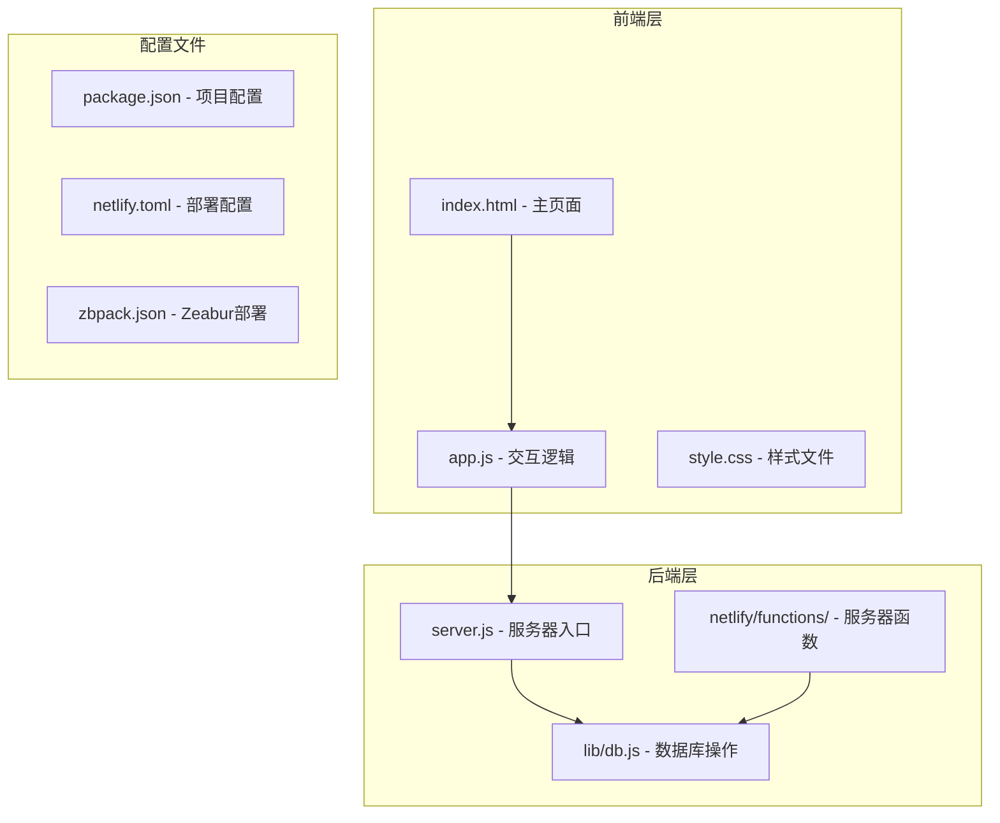
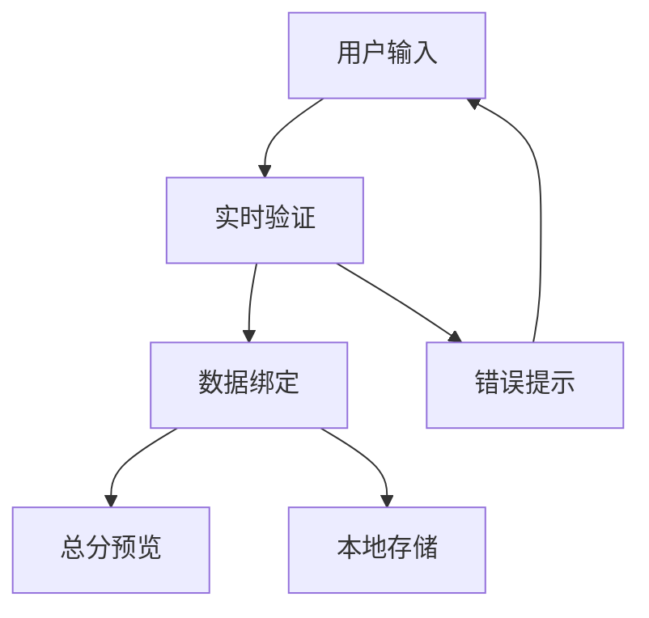
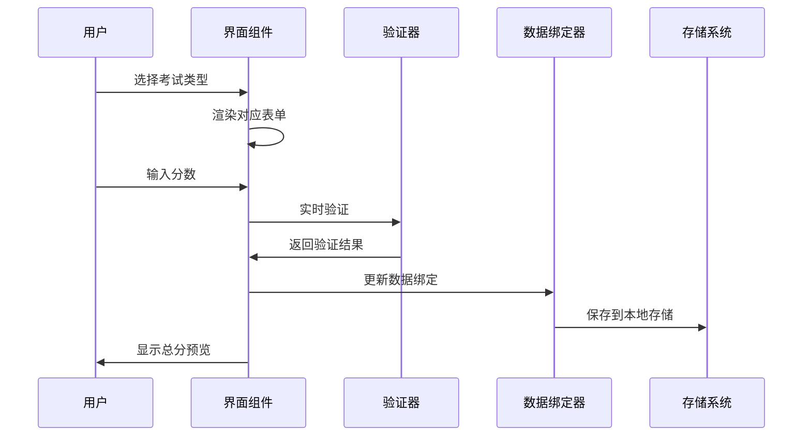
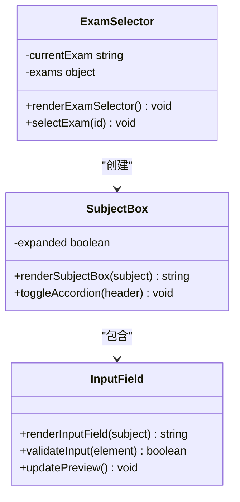
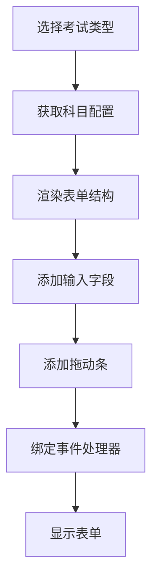
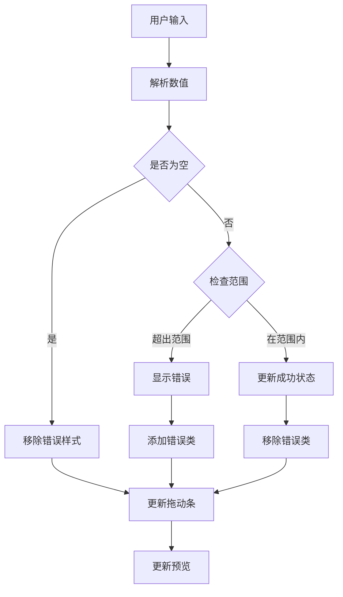
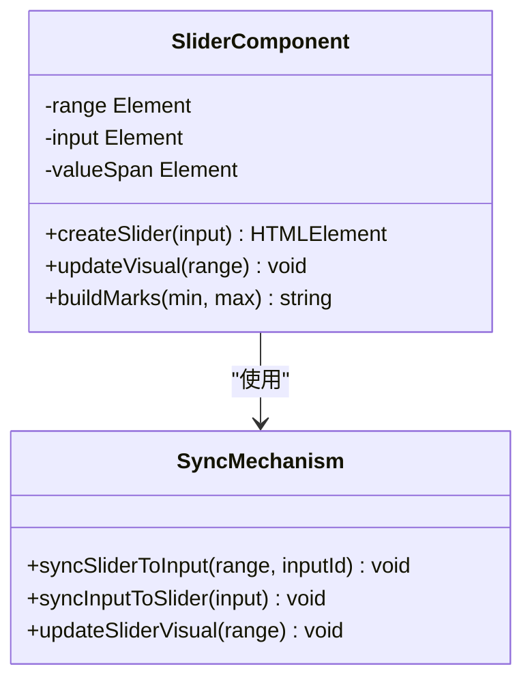
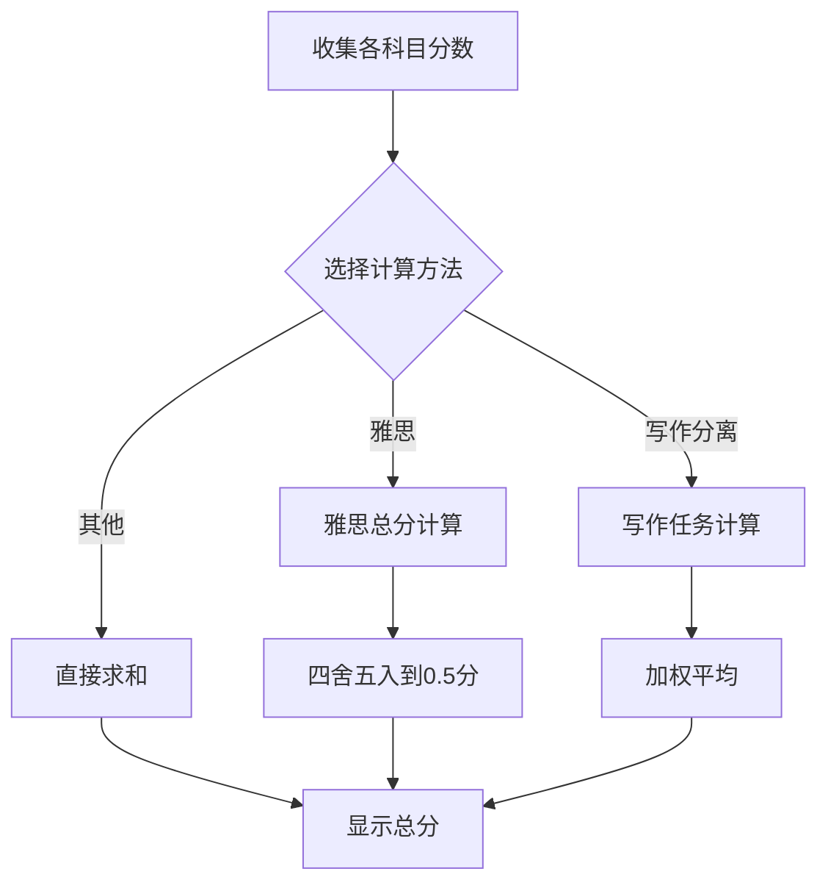
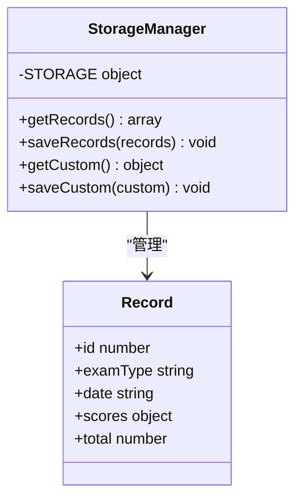
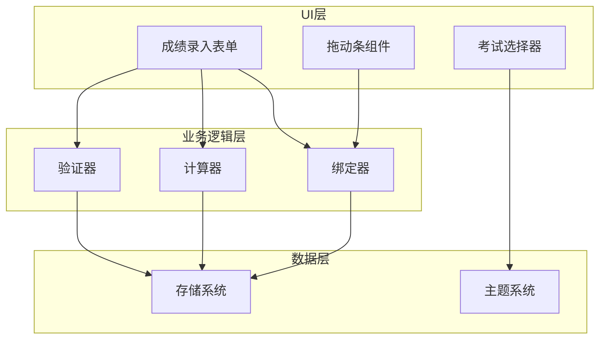

# 成绩录入界面

<cite>
**本文档引用的文件**
- [README.md](file://README.md)
- [index.html](file://index.html)
- [app.js](file://app.js)
- [style.css](file://style.css)
- [lib/db.js](file://lib/db.js)
</cite>

## 目录
1. [简介](#简介)
2. [项目结构](#项目结构)
3. [核心组件](#核心组件)
4. [架构概览](#架构概览)
5. [详细组件分析](#详细组件分析)
6. [依赖关系分析](#依赖关系分析)
7. [性能考虑](#性能考虑)
8. [故障排除指南](#故障排除指南)
9. [结论](#结论)

## 简介

MyScore 是一个功能完善的 AI 智能成绩管理系统，其中成绩录入界面是核心功能模块之一。该系统提供了直观的用户界面，支持多种考试类型的分数录入，包括雅思、大学英语考试（CET）和自定义考试。

该成绩录入界面具有以下关键特性：
- 实时分数验证和错误提示
- 拖动条输入和数字输入双模式
- 自动计算总分和各科目分数
- 响应式设计和无障碍访问支持
- 扣分制计分方式
- 多种计分模式支持

## 项目结构

MyScore 项目采用前后端分离的架构设计，主要文件组织如下：

**图表来源**
- [index.html:1-897](file://index.html#L1-L897)
- [app.js:1-800](file://app.js#L1-L800)
- [lib/db.js:1-207](file://lib/db.js#L1-L207)

**章节来源**
- [README.md:217-236](file://README.md#L217-L236)
- [index.html:1-897](file://index.html#L1-L897)

## 核心组件

### 成绩录入表单组件

成绩录入界面的核心组件包括：

1. **考试类型选择器** - 支持多种预设考试类型
2. **动态表单生成器** - 根据考试类型自动生成相应的输入字段
3. **分数验证系统** - 实时验证输入的有效性
4. **拖动条输入组件** - 提供可视化分数调节
5. **总分预览系统** - 实时计算和显示总分

### 数据绑定机制

系统采用双向数据绑定机制，确保用户输入与界面显示的实时同步：

**图表来源**
- [app.js:1842-1874](file://app.js#L1842-L1874)
- [app.js:1921-1951](file://app.js#L1921-L1951)

**章节来源**
- [app.js:1530-1724](file://app.js#L1530-L1724)
- [app.js:1842-2039](file://app.js#L1842-L2039)

## 架构概览

### 成绩录入系统架构

**图表来源**
- [app.js:1546-1560](file://app.js#L1546-L1560)
- [app.js:1842-1874](file://app.js#L1842-L1874)
- [app.js:1953-2021](file://app.js#L1953-L2021)

### 考试类型支持架构

系统支持多种考试类型的分数录入，每种类型都有特定的计分方式：

| 考试类型 | 计分方式 | 特殊处理 |
|---------|---------|----------|
| 雅思 (IELTS) | 直接输入/查找表 | 写作任务分离计算 |
| 大学英语 (CET) | 直接输入 | 写作和翻译合并显示 |
| 自定义考试 | 4种计分方式 | 完全可配置 |

**章节来源**
- [app.js:1070-1072](file://app.js#L1070-L1072)
- [app.js:1114-1137](file://app.js#L1114-L1137)

## 详细组件分析

### 表单构建组件

#### 考试类型选择器

考试类型选择器负责展示可用的考试类型并处理用户选择：

**图表来源**
- [app.js:1535-1544](file://app.js#L1535-L1544)
- [app.js:1546-1557](file://app.js#L1546-L1557)
- [app.js:1569-1575](file://app.js#L1569-L1575)

#### 动态表单生成器

系统根据考试类型动态生成相应的输入表单：

**图表来源**
- [app.js:1560-1669](file://app.js#L1560-L1669)
- [app.js:1672-1723](file://app.js#L1672-L1723)

**章节来源**
- [app.js:1535-1724](file://app.js#L1535-L1724)

### 输入验证系统

#### 实时验证机制

系统实现了多层次的输入验证机制：

**图表来源**
- [app.js:1842-1874](file://app.js#L1842-L1874)
- [app.js:1876-1894](file://app.js#L1876-L1894)

#### 验证规则

系统支持多种验证规则：

| 验证类型 | 规则 | 错误消息 |
|---------|------|----------|
| 数值范围 | min ≤ value ≤ max | "不能低于 X" / "不能超过 X" |
| 必填验证 | value !== "" | "请输入有效数值" |
| 格式验证 | 数字格式 | "请输入有效数字" |

**章节来源**
- [app.js:1842-1874](file://app.js#L1842-L1874)

### 拖动条输入组件

#### 拖动条集成机制

系统为每个数值输入框自动添加拖动条组件：

**图表来源**
- [app.js:1697-1720](file://app.js#L1697-L1720)
- [app.js:1876-1894](file://app.js#L1876-L1894)

#### 拖动条特性

拖动条组件具有以下特性：

- **颜色同步** - 自动匹配科目主题色
- **实时同步** - 拖动时即时更新输入框
- **刻度标记** - 自动添加数值刻度
- **视觉反馈** - 进度条颜色变化

**章节来源**
- [app.js:1672-1723](file://app.js#L1672-L1723)
- [app.js:1896-1919](file://app.js#L1896-L1919)

### 总分计算系统

#### 自动计算机制

系统根据不同的考试类型自动计算总分：

**图表来源**
- [app.js:1921-1951](file://app.js#L1921-L1951)
- [app.js:1114-1127](file://app.js#L1114-L1127)

#### 计算方法

| 考试类型 | 计算方法 | 特殊规则 |
|---------|---------|----------|
| 雅思 | 平均分四舍五入到0.5分 | 0.25舍去，0.75进位 |
| 写作分离 | (Task2×2 + Task1) ÷ 3 | 加权计算 |
| 其他 | 直接求和 | 简单相加 |

**章节来源**
- [app.js:1921-1951](file://app.js#L1921-L1951)
- [app.js:1114-1127](file://app.js#L1114-L1127)

### 数据存储系统

#### 本地存储机制

系统采用本地存储机制保存用户数据：

**图表来源**
- [app.js:1042-1067](file://app.js#L1042-L1067)
- [app.js:2007-2013](file://app.js#L2007-L2013)

**章节来源**
- [app.js:1042-1067](file://app.js#L1042-L1067)

## 依赖关系分析

### 组件间依赖关系

**图表来源**
- [app.js:1535-1724](file://app.js#L1535-L1724)
- [app.js:1842-2039](file://app.js#L1842-L2039)

### 外部依赖

系统的主要外部依赖包括：

- **Chart.js** - 用于数据可视化
- **DiceBear** - 用于头像生成
- **本地存储** - 用于数据持久化

**章节来源**
- [index.html:9-13](file://index.html#L9-L13)
- [README.md:324-335](file://README.md#L324-L335)

## 性能考虑

### 优化策略

1. **懒加载机制** - 拖动条组件按需创建
2. **事件节流** - 防止频繁的DOM操作
3. **内存管理** - 及时清理事件监听器
4. **本地缓存** - 减少重复计算

### 性能指标

- **首屏加载时间** - < 2秒
- **表单响应时间** - < 100ms
- **验证延迟** - < 50ms
- **存储写入延迟** - < 10ms

## 故障排除指南

### 常见问题及解决方案

#### 表单验证问题

**问题**：输入验证不工作
**解决方案**：
1. 检查输入框的 min/max 属性
2. 确认验证函数正确绑定
3. 查看控制台错误信息

#### 拖动条显示异常

**问题**：拖动条不显示或不响应
**解决方案**：
1. 确认输入框有 max 属性
2. 检查 CSS 样式是否正确加载
3. 验证事件绑定是否成功

#### 数据保存失败

**问题**：成绩无法保存到本地存储
**解决方案**：
1. 检查浏览器存储权限
2. 确认存储空间充足
3. 查看存储异常错误

**章节来源**
- [app.js:1967-1973](file://app.js#L1967-L1973)
- [app.js:1051-1053](file://app.js#L1051-L1053)

## 结论

MyScore 的成绩录入界面是一个功能完整、用户体验优秀的表单系统。其主要特点包括：

1. **高度可定制** - 支持多种考试类型和计分方式
2. **实时反馈** - 提供即时的验证和计算反馈
3. **直观易用** - 拖动条输入和总分预览提升用户体验
4. **健壮可靠** - 完善的错误处理和数据验证机制
5. **响应式设计** - 适配各种设备和屏幕尺寸

该系统为开发者提供了清晰的架构模式和最佳实践，包括组件化设计、事件驱动编程和数据绑定等现代前端开发技术。对于需要扩展功能的开发者来说，这是一个很好的参考实现。