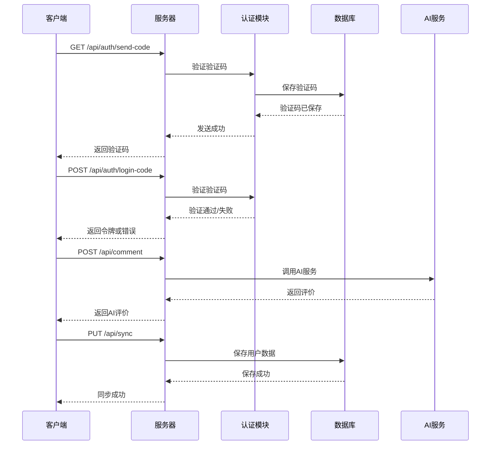
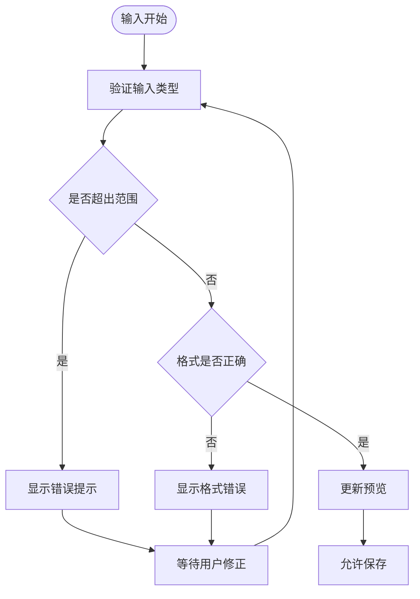
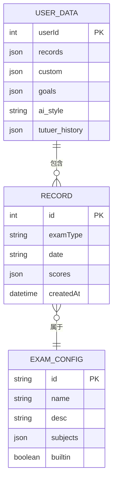
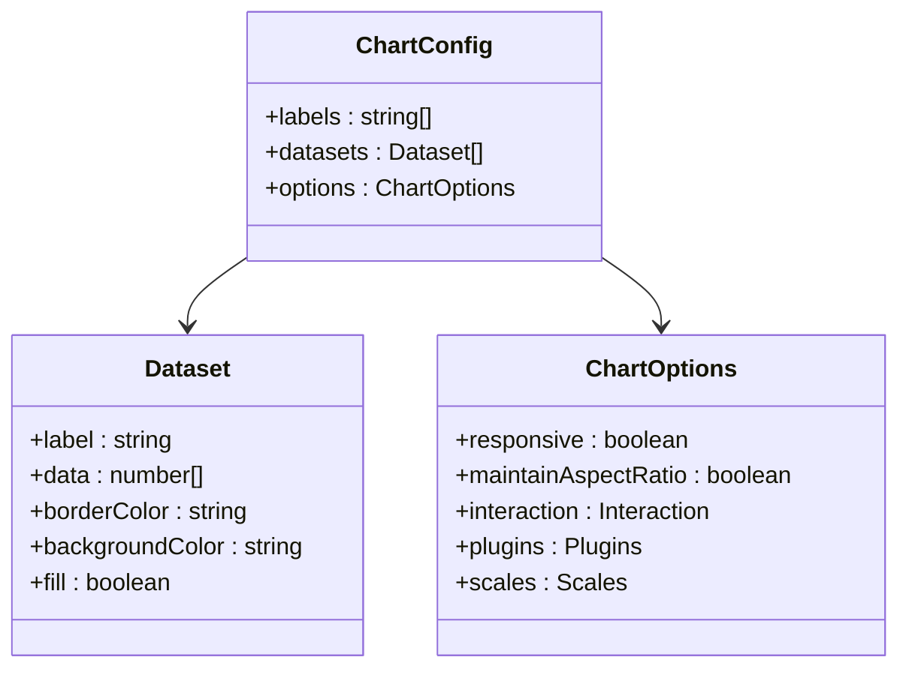
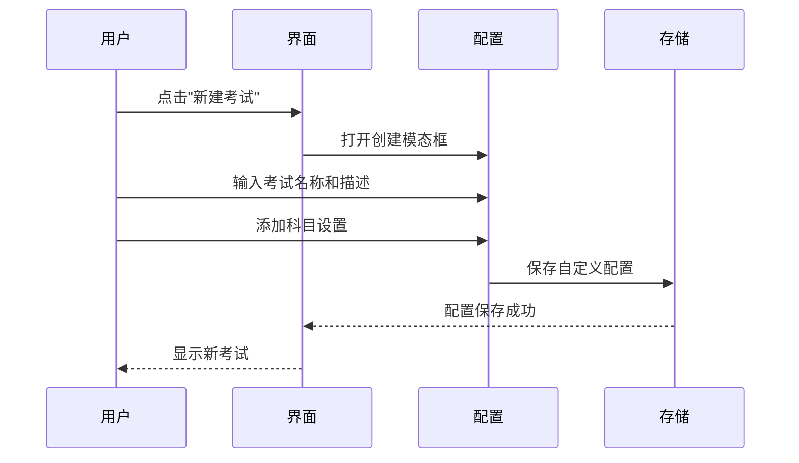
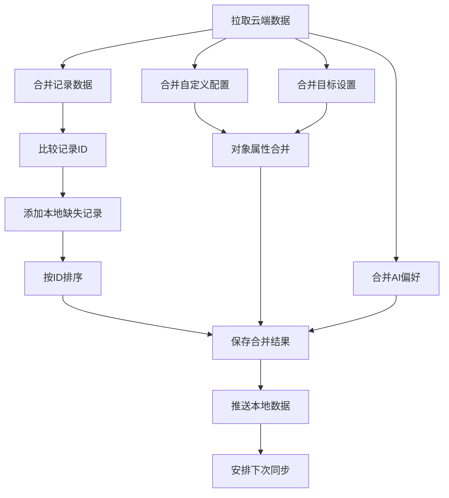
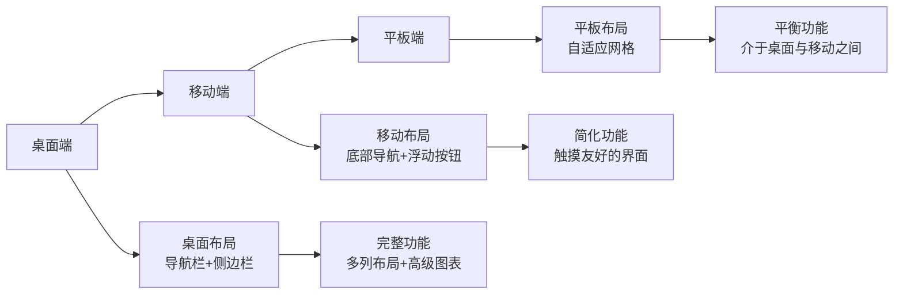
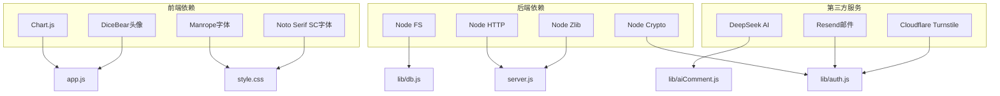

# 成绩管理系统

<cite>
**本文引用的文件**
- [README.md](file://README.md)
- [app.js](file://app.js)
- [index.html](file://index.html)
- [server.js](file://server.js)
- [lib/db.js](file://lib/db.js)
- [lib/auth.js](file://lib/auth.js)
- [lib/aiComment.js](file://lib/aiComment.js)
- [netlify/functions/comment.js](file://netlify/functions/comment.js)
- [style.css](file://style.css)
</cite>

## 目录
1. [简介](#简介)
2. [项目结构](#项目结构)
3. [核心组件](#核心组件)
4. [架构总览](#架构总览)
5. [详细组件分析](#详细组件分析)
6. [依赖关系分析](#依赖关系分析)
7. [性能考虑](#性能考虑)
8. [故障排除指南](#故障排除指南)
9. [结论](#结论)

## 简介
MyScore 是一款具备 AI 交互能力与云端账号系统的考试成绩管理系统。系统支持多种考试类型（雅思、四六级、自定义考试），提供成绩录入、趋势分析、AI 评价反馈、云端数据同步等功能。当前版本为 V5.0.0-beta，新增拖动条输入、扣分制计分、输入实时校验与分享卡记录选择等特性。

## 项目结构
项目采用前后端分离架构，前端使用纯 HTML/CSS/JavaScript，后端使用 Node.js 实现，支持 Netlify Functions 与 Zeabur 部署。

```mermaid
graph TB
subgraph "前端"
UI[用户界面]
APP[应用逻辑(app.js)]
CSS[样式(style.css)]
HTML[页面(index.html)]
end
subgraph "后端"
SERVER[HTTP服务器(server.js)]
AUTH[认证(auth.js)]
DB[数据库(db.js)]
AI[AI评论(aiComment.js)]
NETFUNC[Netlify函数(comment.js)]
end
UI --> APP
APP --> HTML
APP --> CSS
APP --> SERVER
SERVER --> AUTH
SERVER --> DB
SERVER --> AI
NETFUNC --> AI
```

**图表来源**
- [server.js:1-541](file://server.js#L1-L541)
- [lib/auth.js:1-191](file://lib/auth.js#L1-L191)
- [lib/db.js:1-207](file://lib/db.js#L1-L207)
- [lib/aiComment.js:1-172](file://lib/aiComment.js#L1-L172)
- [netlify/functions/comment.js:1-35](file://netlify/functions/comment.js#L1-L35)

**章节来源**
- [README.md:217-236](file://README.md#L217-L236)

## 核心组件
系统的核心组件包括：

### 数据存储层
- **本地存储**: 使用 localStorage 存储用户数据、自定义考试配置、AI 风格偏好等
- **云端同步**: 登录用户数据通过 /api/sync 接口进行云端同步
- **数据结构**: 
  - 成绩记录: `{id, examType, date, scores, createdAt}`
  - 自定义考试: `{name, desc, subjects: [{id, name, shortName, color, type, ...}]}`
  - 用户数据: `{records, custom, goals, ai_style, tutuer_history}`

### 认证与授权
- **JWT 令牌**: 使用 HS256 算法进行用户身份验证
- **验证码登录**: 支持邮箱验证码注册/登录
- **密码登录**: 已注册用户可直接使用密码登录
- **UID 登录**: 支持邮箱或 UID 两种登录方式

### AI 交互系统
- **多风格评价**: 风暴、暖阳、冷锋、阵雨四种 AI 评价风格
- **回怼模式**: 用户可对 AI 评价进行反驳，实现多轮对话
- **伴学助手**: 突突er 伴学助手提供学习陪伴与建议

**章节来源**
- [app.js:1-800](file://app.js#L1-L800)
- [lib/db.js:1-207](file://lib/db.js#L1-L207)
- [lib/auth.js:1-191](file://lib/auth.js#L1-L191)

## 架构总览
系统采用客户端-服务器架构，支持本地模式与登录模式双模式运行。



**图表来源**
- [server.js:275-502](file://server.js#L275-L502)
- [lib/auth.js:138-191](file://lib/auth.js#L138-L191)
- [lib/aiComment.js:47-172](file://lib/aiComment.js#L47-L172)

## 详细组件分析

### 成绩录入界面与数据验证
系统提供直观的成绩录入界面，支持多种输入方式：

#### 输入验证机制


**图表来源**
- [app.js:1842-1874](file://app.js#L1842-L1874)

#### 成绩计算引擎
系统支持四种计分方式：

1. **直接输入分数**: 直接录入最终分数
2. **多小题计分**: 将大题分解为多个小题，自动求和
3. **分部分计分**: 按部分计算，每部分题数×分值
4. **公式计算**: 原始分×系数换算
5. **扣分制**: 从满分开始扣除相应分数

**章节来源**
- [app.js:1639-1653](file://app.js#L1639-L1653)
- [README.md:348-399](file://README.md#L348-L399)

### 历史记录管理
系统提供完整的历史记录管理功能：

#### 记录数据结构


**图表来源**
- [app.js:1-800](file://app.js#L1-L800)
- [lib/db.js:190-207](file://lib/db.js#L190-L207)

#### 记录操作
- **查看**: 历史记录列表展示
- **编辑**: 支持修改单条记录
- **删除**: 支持删除单条或批量删除
- **导出**: 支持 JSON 格式数据导出
- **导入**: 支持从备份文件恢复数据

**章节来源**
- [app.js:1513-1517](file://app.js#L1513-L1517)
- [index.html:316-326](file://index.html#L316-L326)

### 趋势分析功能
系统使用 Chart.js 实现成绩趋势可视化：

#### 图表配置


**图表来源**
- [app.js:1483-1511](file://app.js#L1483-L1511)

#### 分析维度
- **总体趋势**: 显示所有考试类型的综合趋势
- **单项分析**: 按科目维度分析各分项表现
- **对比分析**: 支持多科目同时对比
- **统计指标**: 自动生成平均分、最高分、最低分等统计信息

**章节来源**
- [app.js:1483-1511](file://app.js#L1483-L1511)
- [index.html:284-314](file://index.html#L284-L314)

### 自定义考试创建流程
系统提供完整的自定义考试创建与管理流程：

#### 创建流程


**图表来源**
- [index.html:364-393](file://index.html#L364-L393)
- [app.js:1-800](file://app.js#L1-L800)

#### 科目配置选项
- **科目名称**: 显示在界面中的完整名称
- **简称**: 在卡片中显示的缩写形式
- **颜色**: 用于区分不同科目的标识色
- **计分方式**: 支持五种不同的计分方式
- **权重设置**: 可配置各科目的权重

**章节来源**
- [index.html:364-393](file://index.html#L364-L393)
- [README.md:348-399](file://README.md#L348-L399)

### 本地存储与云端同步
系统采用双模式数据存储策略：

#### 数据同步算法


**图表来源**
- [app.js:715-743](file://app.js#L715-L743)

#### 同步策略
- **双向合并**: 云端与本地数据双向合并，避免数据丢失
- **冲突解决**: 通过 ID 比较解决重复数据冲突
- **增量同步**: 仅同步变更的数据，提高效率
- **错误处理**: 网络异常时自动重试并提示用户

**章节来源**
- [app.js:666-743](file://app.js#L666-L743)
- [server.js:469-502](file://server.js#L469-L502)

### 用户界面交互逻辑
系统提供丰富的用户交互体验：

#### 响应式设计


**图表来源**
- [style.css:1-200](file://style.css#L1-L200)
- [index.html:1-800](file://index.html#L1-L800)

#### 交互特性
- **拖动条输入**: 支持拖动条与数字输入双重模式
- **实时校验**: 输入时即时验证数据有效性
- **动画效果**: 流畅的过渡动画和状态变化
- **无障碍设计**: 支持键盘导航和屏幕阅读器

**章节来源**
- [README.md:20-28](file://README.md#L20-L28)
- [style.css:1-200](file://style.css#L1-L200)

## 依赖关系分析

### 技术栈依赖


**图表来源**
- [server.js:1-541](file://server.js#L1-L541)
- [lib/auth.js:1-191](file://lib/auth.js#L1-L191)
- [lib/db.js:1-207](file://lib/db.js#L1-L207)
- [lib/aiComment.js:1-172](file://lib/aiComment.js#L1-L172)

### 安全与性能考虑
- **JWT 安全**: 强制配置 JWT_SECRET，防止未授权访问
- **速率限制**: 对敏感 API 接口实施速率限制
- **CORS 配置**: 支持 ALLOWED_ORIGIN 环境变量配置
- **压缩传输**: 对静态资源启用 Gzip 压缩
- **缓存策略**: 智能缓存控制，减少带宽消耗

**章节来源**
- [server.js:16-48](file://server.js#L16-L48)
- [server.js:275-462](file://server.js#L275-L462)

## 性能考虑
系统在性能方面采取了多项优化措施：

### 前端性能优化
- **懒加载**: 图片和字体资源采用懒加载策略
- **虚拟滚动**: 大列表采用虚拟滚动减少 DOM 节点
- **事件节流**: 输入验证采用防抖处理
- **内存管理**: 及时清理定时器和事件监听器

### 后端性能优化
- **连接池**: 数据库连接采用连接池管理
- **缓存机制**: 频繁访问的数据进行缓存
- **异步处理**: I/O 密集型操作采用异步处理
- **资源压缩**: 静态资源自动压缩传输

## 故障排除指南

### 常见问题与解决方案

#### 登录相关问题
- **验证码发送失败**: 检查 RESEND_API_KEY 配置
- **登录失败**: 确认账号状态和密码
- **令牌过期**: 系统会自动刷新令牌

#### 数据同步问题
- **同步失败**: 检查网络连接和服务器状态
- **数据丢失**: 系统会自动合并本地和云端数据
- **权限不足**: 确认用户登录状态

#### AI 服务问题
- **AI 评论失败**: 检查 AI_API_KEY 配置
- **访问受限**: 未登录用户有每日访问限制
- **响应超时**: 网络不稳定时会自动重试

**章节来源**
- [server.js:118-133](file://server.js#L118-L133)
- [app.js:672-687](file://app.js#L672-L687)

## 结论
MyScore 成绩管理系统通过精心设计的架构和丰富的功能特性，为用户提供了一个完整的学习成绩管理解决方案。系统不仅支持多种考试类型的灵活配置，还提供了智能化的 AI 交互体验和可靠的云端数据同步能力。

### 核心优势
- **多考试类型支持**: 雅思、四六级、自定义考试全覆盖
- **智能数据验证**: 实时输入校验，防止无效数据录入
- **强大的趋势分析**: 基于 Chart.js 的可视化分析
- **双模式运行**: 本地模式与登录模式灵活切换
- **云端同步**: 数据安全可靠，跨设备无缝访问

### 技术特色
- **纯前端架构**: 无需后端依赖，部署简单
- **零依赖设计**: 使用 Node.js 内置模块，减少外部依赖
- **响应式设计**: 适配各种设备和屏幕尺寸
- **安全防护**: 多层安全机制，保护用户数据安全

系统将继续演进，为用户提供更加智能、便捷的学习成绩管理体验。