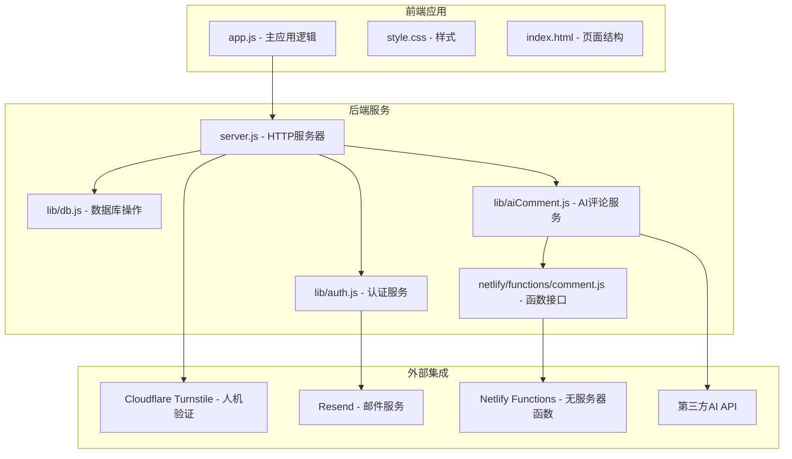
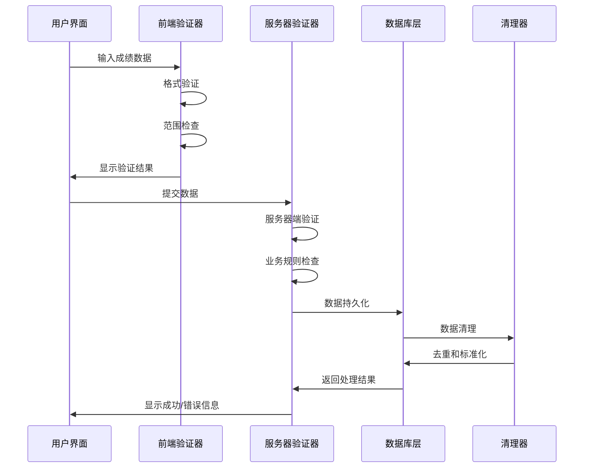
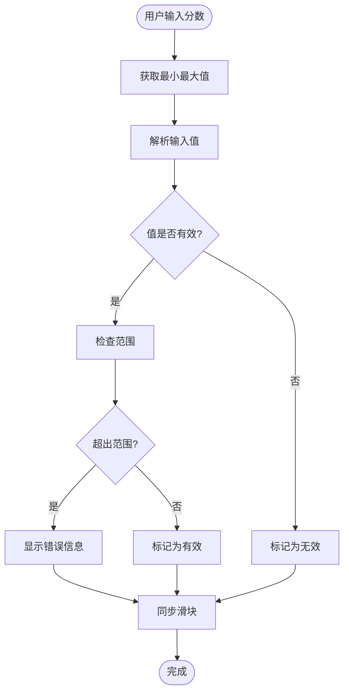
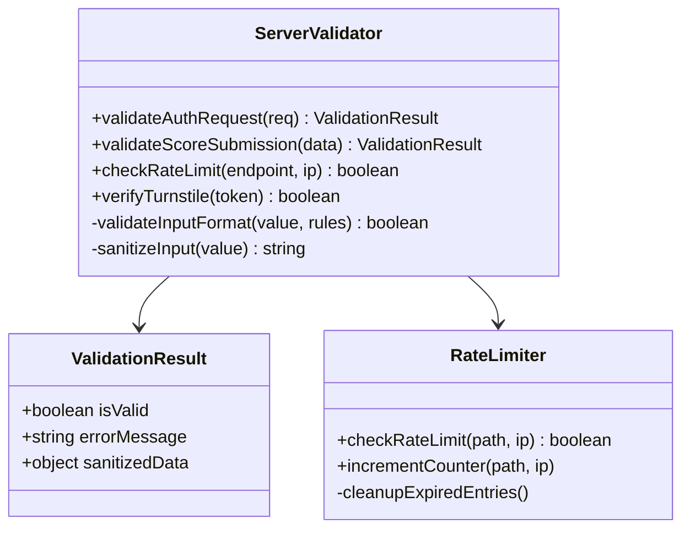
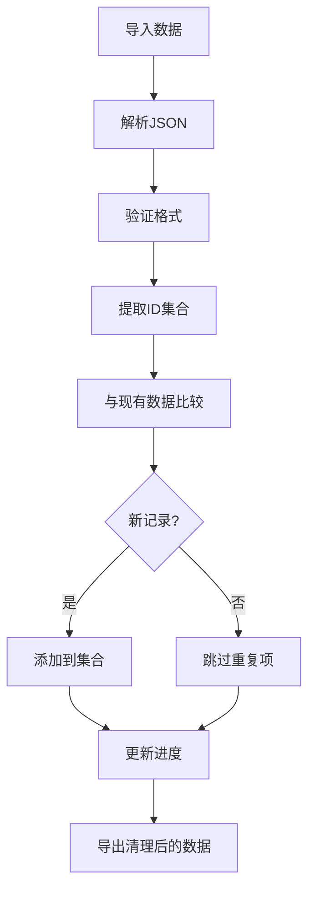
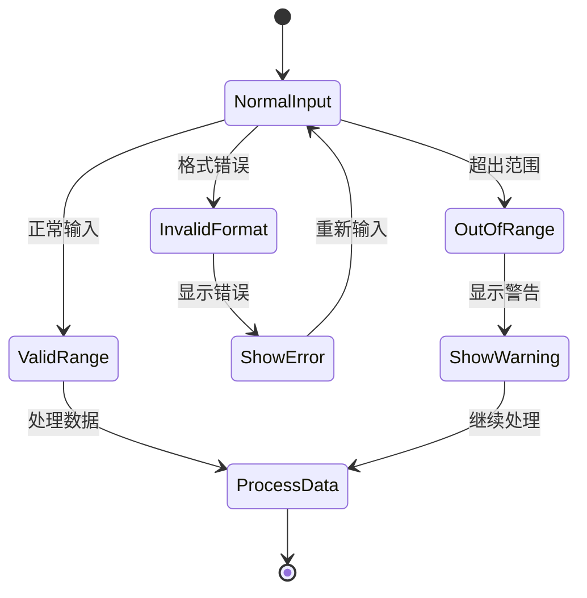
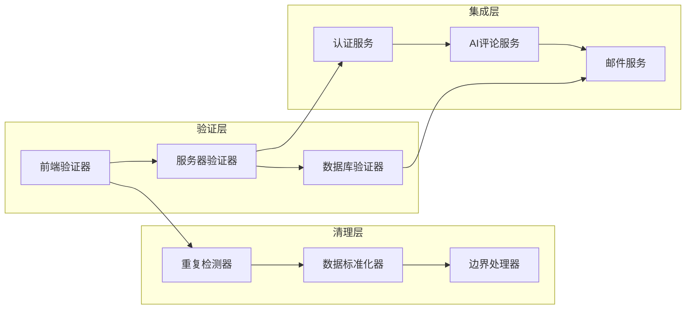

# 数据验证与清理

<cite>
**本文档引用的文件**
- [app.js](file://app.js)
- [server.js](file://server.js)
- [lib/db.js](file://lib/db.js)
- [lib/auth.js](file://lib/auth.js)
- [lib/aiComment.js](file://lib/aiComment.js)
- [netlify/functions/comment.js](file://netlify/functions/comment.js)
</cite>

## 目录
1. [简介](#简介)
2. [项目结构](#项目结构)
3. [核心组件](#核心组件)
4. [架构概览](#架构概览)
5. [详细组件分析](#详细组件分析)
6. [依赖关系分析](#依赖关系分析)
7. [性能考虑](#性能考虑)
8. [故障排除指南](#故障排除指南)
9. [结论](#结论)

## 简介

MyScore 是一个成绩记录与管理工具，专注于数据验证与清理系统的实现。本文档深入分析了系统的验证规则、清理算法和错误处理机制，涵盖了分数范围检查、格式验证、重复数据检测和异常值处理等方面。

系统采用前后端分离架构，前端负责用户界面和本地数据处理，后端提供API服务和数据持久化。数据验证贯穿整个生命周期，从用户输入到云端同步都有一致的验证标准。

## 项目结构

MyScore 项目采用模块化设计，主要包含以下核心模块：



**图表来源**
- [app.js:1-50](file://app.js#L1-L50)
- [server.js:1-50](file://server.js#L1-L50)
- [lib/db.js:1-30](file://lib/db.js#L1-L30)
- [lib/auth.js:1-20](file://lib/auth.js#L1-L20)

**章节来源**
- [app.js:1-100](file://app.js#L1-L100)
- [server.js:1-100](file://server.js#L1-L100)

## 核心组件

### 数据存储层

系统采用多层数据存储策略，确保数据的安全性和一致性：

```mermaid
erDiagram
LOCAL_STORAGE {
string RECORDS
object CUSTOM
object AUTH
string USER_MODE
object LOCAL_AI_USAGE
}
CLOUD_DATABASE {
json users.json
json codes.json
directory userdata/
json uid_counter.json
}
EXAM_SCHEMA {
string exam_type
array subjects
object calc_total
string builtin
}
RECORD_ENTITY {
number id
string examType
string date
object scores
number total
}
LOCAL_STORAGE ||--|| CLOUD_DATABASE : "同步"
EXAM_SCHEMA ||--o{ RECORD_ENTITY : "定义"
RECORD_ENTITY ||--o{ LOCAL_STORAGE : "存储"
```

**图表来源**
- [app.js:1041-1068](file://app.js#L1041-L1068)
- [lib/db.js:48-94](file://lib/db.js#L48-L94)

### 验证规则体系

系统实现了多层次的验证规则，覆盖输入格式、业务逻辑和数据完整性：

| 验证类型 | 规则描述 | 实现位置 | 错误处理 |
|---------|---------|---------|----------|
| 格式验证 | 数字范围检查、必需字段验证 | validateScoreInput | 输入框高亮显示 |
| 业务验证 | 考试日期验证、全零检查 | submitScore | Toast消息提示 |
| 数据完整性 | 重复ID检测、空值处理 | 导入/合并逻辑 | 跳过重复项 |
| 安全验证 | XSS防护、SQL注入防护 | 服务器端 | 过滤危险字符 |

**章节来源**
- [app.js:1842-1874](file://app.js#L1842-L1874)
- [app.js:1953-2021](file://app.js#L1953-L2021)
- [server.js:275-462](file://server.js#L275-L462)

## 架构概览

MyScore 的数据验证与清理系统采用分层架构，确保每个环节都有相应的验证和清理机制：



**图表来源**
- [app.js:1842-1874](file://app.js#L1842-L1874)
- [server.js:275-462](file://server.js#L275-L462)
- [lib/db.js:192-206](file://lib/db.js#L192-L206)

## 详细组件分析

### 前端数据验证组件

#### 分数输入验证器

前端实现了智能的分数输入验证系统，提供实时反馈和错误提示：



**图表来源**
- [app.js:1842-1874](file://app.js#L1842-L1874)

验证器的核心功能包括：
- **范围检查**：基于HTML5的min/max属性进行实时验证
- **格式验证**：确保输入为有效数字
- **即时反馈**：通过CSS类和错误消息提供视觉反馈
- **滑块同步**：双向同步输入框和滑块组件

#### 成绩提交处理器

提交流程包含了完整的验证和清理逻辑：

**章节来源**
- [app.js:1953-2021](file://app.js#L1953-L2021)
- [app.js:1842-1874](file://app.js#L1842-L1874)

### 后端数据验证组件

#### 服务器端验证器

后端提供了更强有力的验证机制，确保数据的完整性和安全性：



**图表来源**
- [server.js:275-462](file://server.js#L275-L462)
- [server.js:16-48](file://server.js#L16-L48)

验证器的主要职责：
- **认证验证**：JWT令牌验证和权限检查
- **速率限制**：防止滥用和DDoS攻击
- **输入净化**：移除潜在的恶意内容
- **业务规则**：复杂的业务逻辑验证

#### 数据库验证器

数据库层提供了数据完整性的最后一道防线：

**章节来源**
- [lib/db.js:10-30](file://lib/db.js#L10-L30)
- [lib/db.js:129-188](file://lib/db.js#L129-L188)

### 数据清理组件

#### 重复数据检测器

系统实现了智能的重复数据检测和清理机制：



**图表来源**
- [app.js:2211-2249](file://app.js#L2211-L2249)

清理策略包括：
- **ID去重**：基于唯一ID识别重复记录
- **智能合并**：保留最新数据，跳过重复项
- **进度跟踪**：显示导入统计信息
- **错误恢复**：单条记录失败不影响整体导入

#### 数据标准化器

系统提供了统一的数据标准化机制：

**章节来源**
- [app.js:2211-2249](file://app.js#L2211-L2249)
- [server.js:469-502](file://server.js#L469-L502)

### 异常值处理组件

#### 边界条件处理器

系统能够智能处理各种边界条件和异常情况：



**图表来源**
- [app.js:1842-1874](file://app.js#L1842-L1874)

处理机制包括：
- **格式异常**：捕获并报告解析错误
- **范围异常**：提供合理的默认值
- **空值处理**：转换为零值而非NaN
- **精度处理**：统一小数位数

## 依赖关系分析

### 组件耦合度分析



**图表来源**
- [app.js:1842-1874](file://app.js#L1842-L1874)
- [server.js:275-462](file://server.js#L275-L462)
- [lib/auth.js:138-191](file://lib/auth.js#L138-L191)

### 外部依赖关系

系统依赖于多个外部服务和API：

| 依赖服务 | 用途 | 配置要求 | 备注 |
|---------|------|----------|------|
| Cloudflare Turnstile | 人机验证 | SITE_KEY, SECRET_KEY | 可选配置 |
| Resend | 邮件发送 | API_KEY, FROM_EMAIL | 注册验证码 |
| Netlify Functions | AI评论API | API_KEY, BASE_URL | 无服务器函数 |
| 第三方AI API | 评论生成 | API_KEY, MODEL | DeepSeek等 |

**章节来源**
- [server.js:54-67](file://server.js#L54-L67)
- [lib/auth.js:67-134](file://lib/auth.js#L67-L134)
- [lib/aiComment.js:47-172](file://lib/aiComment.js#L47-L172)

## 性能考虑

### 验证性能优化

系统采用了多种性能优化策略：

1. **前端即时验证**：减少不必要的服务器请求
2. **批量验证**：一次性验证多个输入字段
3. **缓存机制**：缓存验证结果避免重复计算
4. **异步处理**：非阻塞的验证流程

### 清理性能优化

数据清理过程的性能优化包括：

1. **内存管理**：使用Set进行快速ID查找
2. **流式处理**：大文件的分块处理
3. **增量更新**：只处理新增数据
4. **压缩存储**：减少存储空间占用

### 扩展性考虑

系统设计考虑了未来的扩展需求：

1. **插件架构**：支持自定义验证规则
2. **配置驱动**：通过配置文件调整验证策略
3. **模块化设计**：独立的功能模块便于维护
4. **监控集成**：内置性能监控和日志记录

## 故障排除指南

### 常见验证错误

| 错误类型 | 症状 | 解决方案 |
|---------|------|----------|
| 格式错误 | 输入框变红色，显示错误消息 | 检查输入格式，确保为有效数字 |
| 范围错误 | 显示"超出范围"提示 | 调整到允许范围内 |
| 必需字段缺失 | 表单提交失败 | 填写所有必需字段 |
| 重复数据 | 导入时跳过重复项 | 检查数据源的唯一性 |

### 调试技巧

1. **浏览器开发者工具**：检查网络请求和响应
2. **控制台日志**：查看详细的错误信息
3. **本地存储检查**：验证数据存储状态
4. **服务器日志**：分析后端错误原因

### 错误恢复策略

系统提供了多种错误恢复机制：

1. **自动重试**：网络错误时自动重试
2. **降级模式**：部分功能失效时的替代方案
3. **数据回滚**：验证失败时的数据恢复
4. **用户反馈**：清晰的错误提示和解决方案

**章节来源**
- [app.js:763-777](file://app.js#L763-L777)
- [server.js:458-461](file://server.js#L458-L461)

## 结论

MyScore 的数据验证与清理系统展现了现代Web应用的最佳实践。系统通过多层次的验证机制、智能的数据清理算法和完善的错误处理策略，确保了数据的质量和系统的稳定性。

### 主要优势

1. **全面的验证覆盖**：从前端到后端的完整验证链
2. **智能的数据清理**：自动化的重复检测和去重
3. **优秀的用户体验**：即时反馈和友好的错误提示
4. **强大的扩展性**：模块化设计支持功能扩展

### 改进建议

1. **增强AI验证**：集成机器学习算法检测异常模式
2. **性能监控**：添加详细的性能指标和告警机制
3. **测试覆盖**：增加单元测试和集成测试
4. **文档完善**：补充详细的API文档和开发指南

通过持续的优化和改进，MyScore 的数据验证与清理系统将继续为用户提供可靠、高效的成绩管理体验。