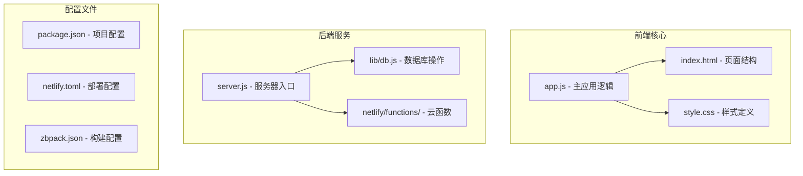
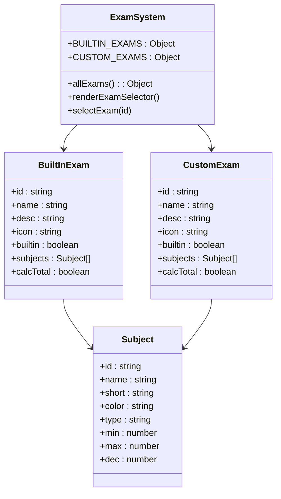
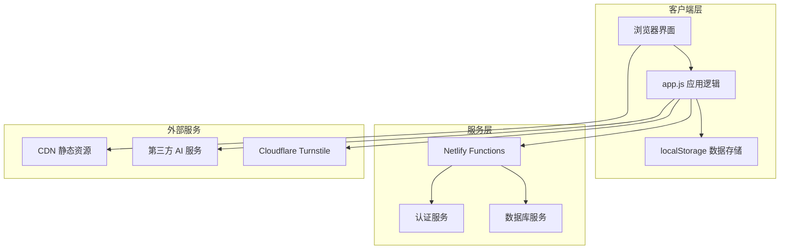
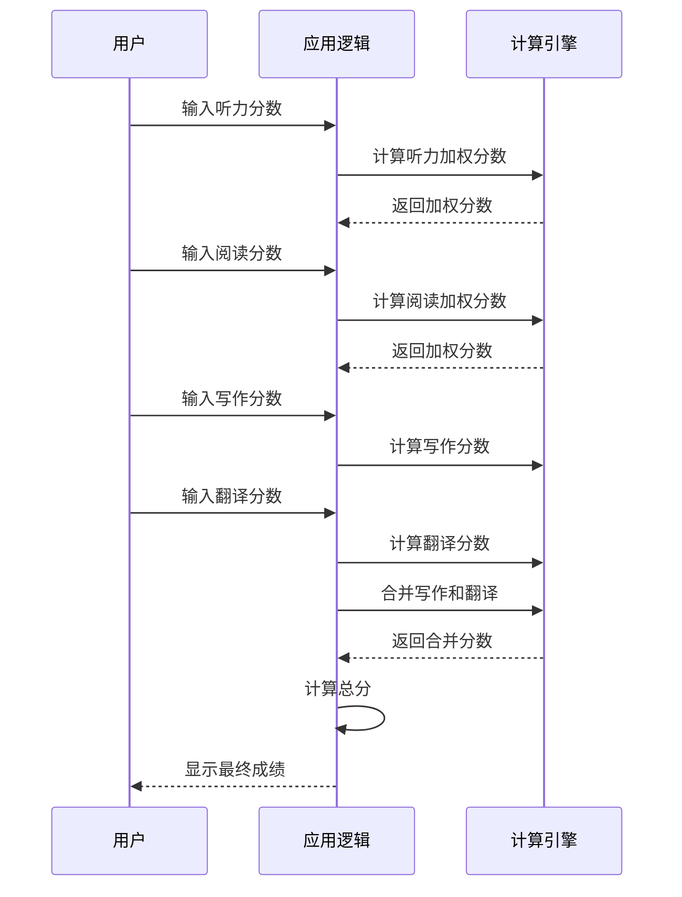
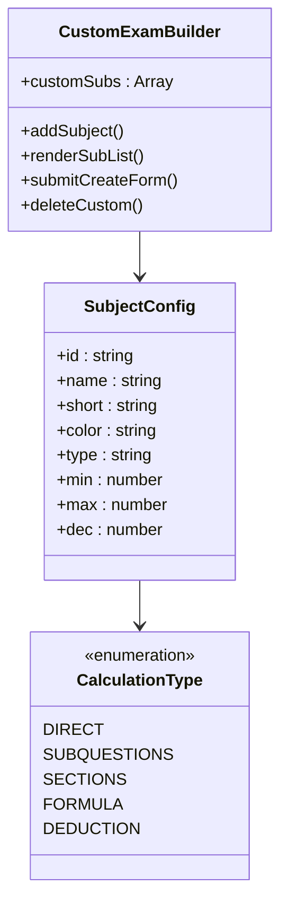
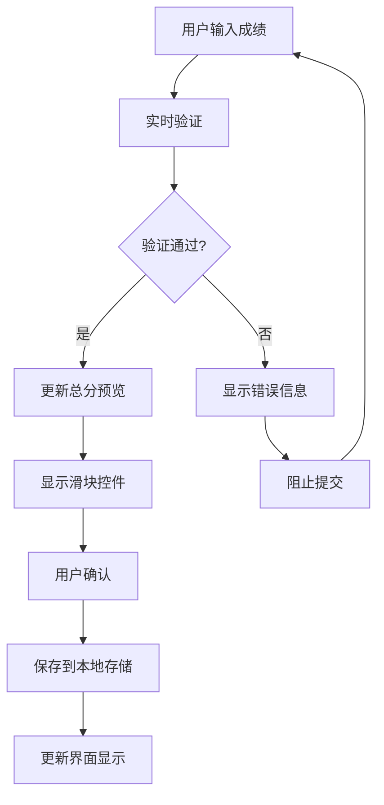
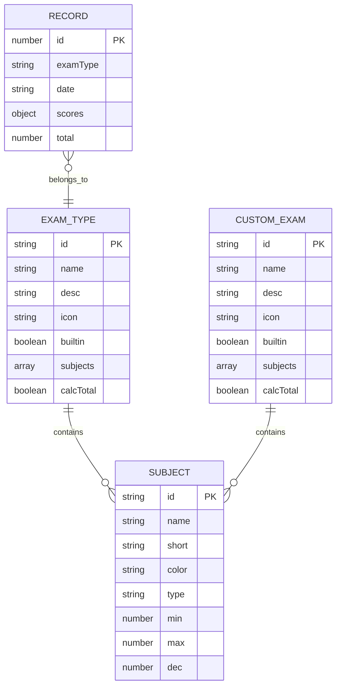
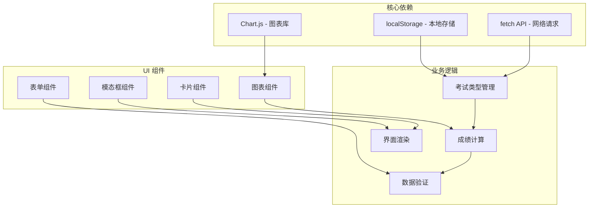
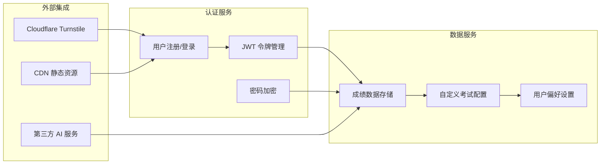

# 考试类型管理

<cite>
**本文档引用的文件**
- [app.js](file://app.js)
- [index.html](file://index.html)
- [style.css](file://style.css)
- [lib/db.js](file://lib/db.js)
- [package.json](file://package.json)
</cite>

## 目录
1. [简介](#简介)
2. [项目结构](#项目结构)
3. [核心组件](#核心组件)
4. [架构概览](#架构概览)
5. [详细组件分析](#详细组件分析)
6. [依赖关系分析](#依赖关系分析)
7. [性能考虑](#性能考虑)
8. [故障排除指南](#故障排除指南)
9. [结论](#结论)

## 简介

MyScore 是一个基于 Web 的成绩管理应用，提供了完整的考试类型管理系统。该系统支持三种预设考试类型（雅思 IELTS、大学英语四六级 CET-4/CET-6）和自定义考试类型，具有灵活的配置选项和强大的数据处理能力。

系统采用纯前端实现，使用 localStorage 进行本地数据存储，同时支持云端同步功能。用户可以通过直观的界面管理各种考试类型，录入和分析成绩数据。

## 项目结构

MyScore 项目采用模块化架构设计，主要文件组织如下：



**图表来源**
- [app.js:1-50](file://app.js#L1-L50)
- [package.json:1-13](file://package.json#L1-L13)

**章节来源**
- [app.js:1-50](file://app.js#L1-L50)
- [package.json:1-13](file://package.json#L1-L13)

## 核心组件

### 考试类型系统架构

MyScore 的考试类型管理系统基于以下核心组件构建：



**图表来源**
- [app.js:811-870](file://app.js#L811-L870)
- [app.js:1070-1072](file://app.js#L1070-L1072)

### 数据存储结构

系统使用 localStorage 进行数据持久化，主要存储结构包括：

| 存储键 | 类型 | 描述 |
|--------|------|------|
| myscore_v51_records | Array | 成绩记录数组 |
| myscore_v51_custom | Object | 自定义考试配置 |
| myscore_auth | Object | 用户认证信息 |
| myscore_user_mode | string | 用户模式（local/login） |

**章节来源**
- [app.js:2-8](file://app.js#L2-L8)
- [app.js:1042-1068](file://app.js#L1042-L1068)

## 架构概览

MyScore 采用前后端分离的架构设计，前端使用纯 JavaScript 实现，后端提供必要的 API 服务。



**图表来源**
- [app.js:153-210](file://app.js#L153-L210)
- [lib/db.js:1-30](file://lib/db.js#L1-L30)

## 详细组件分析

### 预设考试类型实现

#### 雅思 IELTS 考试类型

雅思考试类型是系统中最复杂的预设考试类型，具有独特的评分机制：

```mermaid
flowchart TD
A[雅思写作输入] --> B{Task1 和 Task2 输入}
B --> |都已输入| C[计算公式: (Task2×2 + Task1) ÷ 3]
B --> |部分输入| D[等待完整输入]
C --> E[显示总分]
E --> F[更新总分预览]
D --> B
G[听力/阅读输入] --> H[查找表转换]
H --> I[映射到雅思分数]
I --> J[显示折算分]
J --> K[更新总分预览]
```

**图表来源**
- [app.js:1122-1137](file://app.js#L1122-L1137)
- [app.js:1579-1597](file://app.js#L1579-L1597)

雅思考试类型的核心特性包括：

- **写作任务分离**：支持 Task1 和 Task2 分别输入，自动计算总分
- **查找表转换**：听力和阅读使用查找表进行分数转换
- **整体分计算**：四个单项分数的加权平均，按雅思规则取整

**章节来源**
- [app.js:812-824](file://app.js#L812-L824)
- [app.js:909-923](file://app.js#L909-L923)
- [app.js:1114-1127](file://app.js#L1114-L1127)

#### 大学英语四六级考试类型

四六级考试类型采用加权计算方式：



**图表来源**
- [app.js:826-868](file://app.js#L826-L868)
- [app.js:1213-1214](file://app.js#L1213-L1214)

四六级考试类型的特点：

- **加权计算**：听力和阅读采用三部分加权计算
- **写作翻译合并**：写作和翻译分数相加显示
- **统一标准**：四级和六级使用相同的计算逻辑

**章节来源**
- [app.js:826-868](file://app.js#L826-L868)
- [app.js:1213-1214](file://app.js#L1213-L1214)

### 自定义考试类型系统

自定义考试类型系统提供了最大的灵活性，允许用户创建符合自己需求的考试结构：



**图表来源**
- [app.js:2025-2190](file://app.js#L2025-L2190)

自定义考试类型支持的计算方式：

| 计算类型 | 描述 | 示例场景 |
|----------|------|----------|
| direct | 直接打分 | 标准测试题 |
| subquestions | 按题组求和 | 多个小题组合 |
| sections | 按答对题数算 | 不同部分独立计分 |
| formula | 按系数折算 | 原始分转换 |
| deduction | 从满分扣分 | 错误扣分制 |

**章节来源**
- [app.js:2061-2150](file://app.js#L2061-L2150)
- [app.js:2151-2190](file://app.js#L2151-L2190)

### 成绩录入和验证系统

系统提供了完整的成绩录入和验证机制：



**图表来源**
- [app.js:1842-1874](file://app.js#L1842-L1874)
- [app.js:1921-1951](file://app.js#L1921-L1951)

验证规则包括：

- **数值范围检查**：确保输入值在允许范围内
- **格式验证**：检查输入格式的正确性
- **实时反馈**：提供即时的验证结果反馈
- **滑块同步**：数字输入和滑块控件双向同步

**章节来源**
- [app.js:1842-1874](file://app.js#L1842-L1874)
- [app.js:1672-1724](file://app.js#L1672-L1724)

### 数据模型和存储策略

系统采用 JSON 结构存储所有数据：



**图表来源**
- [app.js:811-870](file://app.js#L811-L870)
- [app.js:1042-1068](file://app.js#L1042-L1068)

**章节来源**
- [app.js:811-870](file://app.js#L811-L870)
- [app.js:1042-1068](file://app.js#L1042-L1068)

## 依赖关系分析

### 前端依赖关系



**图表来源**
- [index.html:9](file://index.html#L9)
- [app.js:1421-1511](file://app.js#L1421-L1511)

### 后端服务依赖

系统后端服务相对简单，主要提供认证和数据同步功能：



**图表来源**
- [lib/db.js:48-108](file://lib/db.js#L48-L108)
- [lib/db.js:190-207](file://lib/db.js#L190-L207)

**章节来源**
- [lib/db.js:48-108](file://lib/db.js#L48-L108)
- [lib/db.js:190-207](file://lib/db.js#L190-L207)

## 性能考虑

### 前端性能优化

系统采用了多项前端性能优化策略：

1. **懒加载机制**：图表和复杂组件按需加载
2. **虚拟滚动**：大量记录的高效渲染
3. **防抖处理**：输入验证的性能优化
4. **内存管理**：及时清理不再使用的 DOM 元素

### 数据存储优化

- **增量同步**：只同步变化的数据
- **压缩存储**：减少本地存储空间占用
- **缓存策略**：热门数据的缓存机制

## 故障排除指南

### 常见问题和解决方案

| 问题类型 | 症状 | 解决方案 |
|----------|------|----------|
| 数据丢失 | 刷新页面后数据消失 | 检查浏览器存储权限 |
| 同步失败 | 云端数据不同步 | 检查网络连接和认证状态 |
| 表单验证错误 | 输入框显示红色边框 | 检查输入值是否在允许范围内 |
| 图表不显示 | 报表页面空白 | 检查浏览器是否支持 Canvas API |

### 调试工具

系统提供了内置的调试功能：

- **控制台日志**：详细的错误信息输出
- **状态监控**：实时显示系统状态
- **数据导出**：便于问题诊断的数据导出功能

**章节来源**
- [app.js:2193-2249](file://app.js#L2193-L2249)

## 结论

MyScore 的考试类型管理系统展现了优秀的软件工程实践，具有以下特点：

1. **模块化设计**：清晰的组件分离和职责划分
2. **可扩展性**：支持自定义考试类型的灵活架构
3. **用户体验**：直观的界面和流畅的交互体验
4. **数据安全**：完善的验证和错误处理机制
5. **性能优化**：高效的前端实现和优化策略

该系统为教育类应用提供了一个优秀的参考实现，特别是在考试管理和成绩分析方面的创新设计值得借鉴。通过合理的架构设计和实现策略，系统能够满足不同用户的需求，同时保持良好的性能和可维护性。