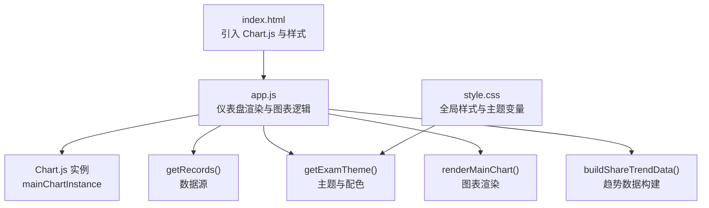
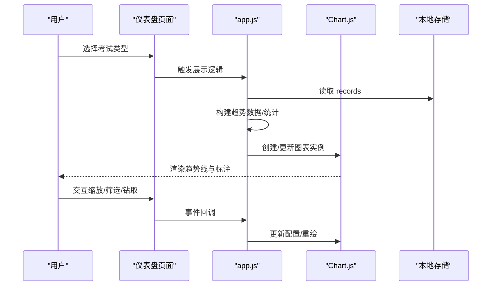
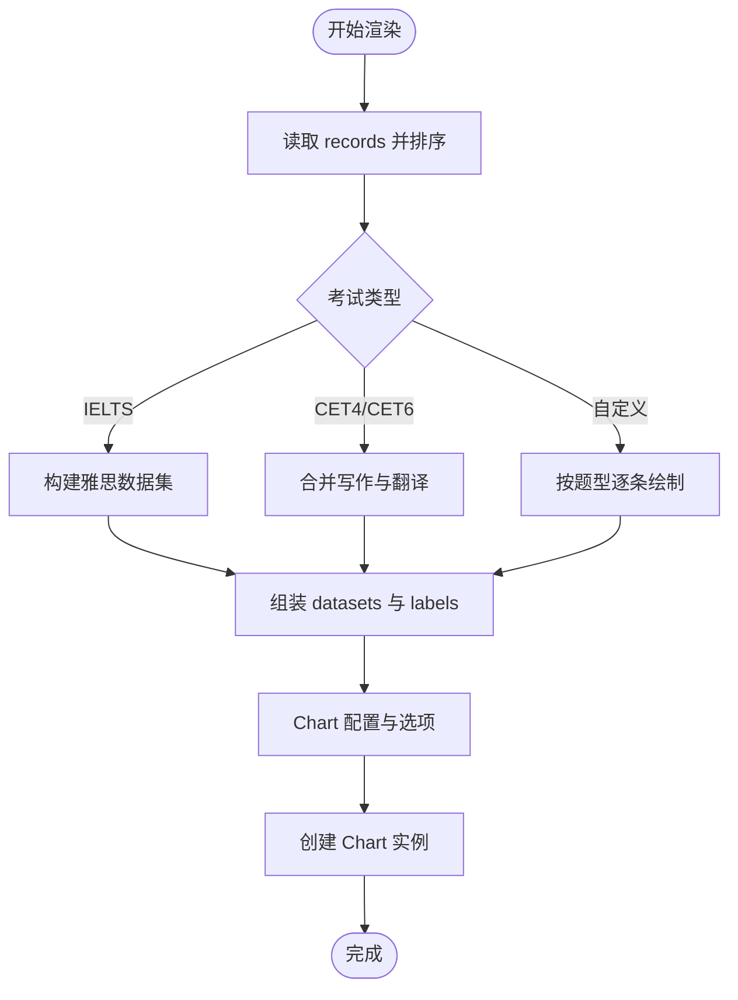
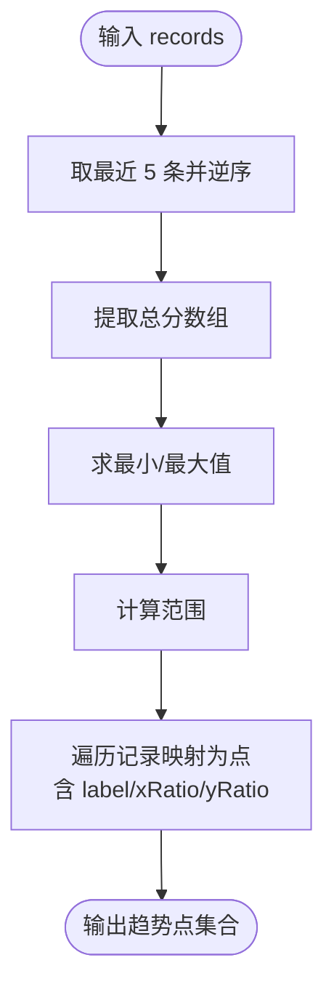
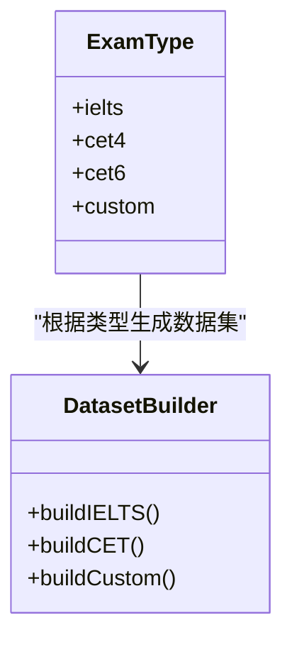
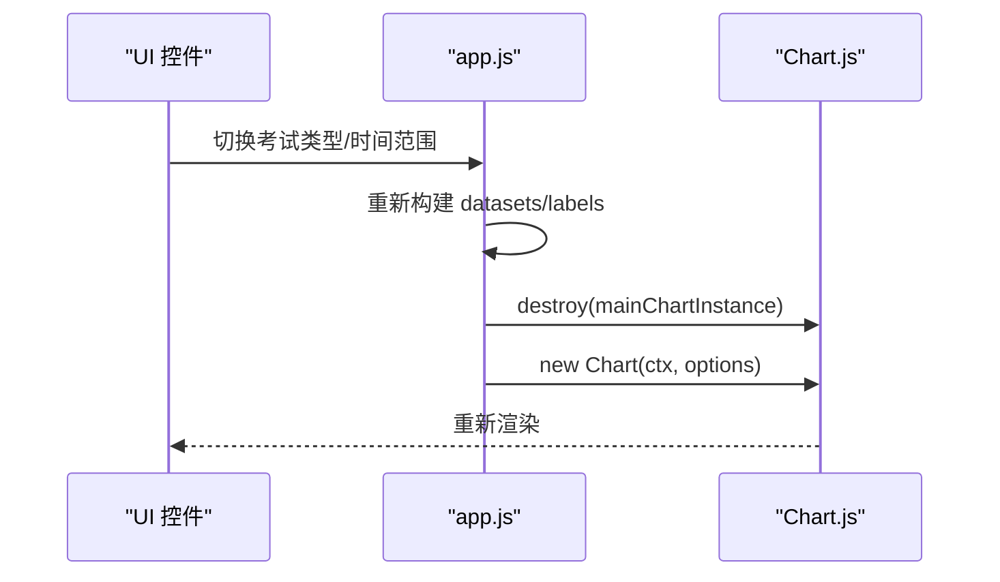
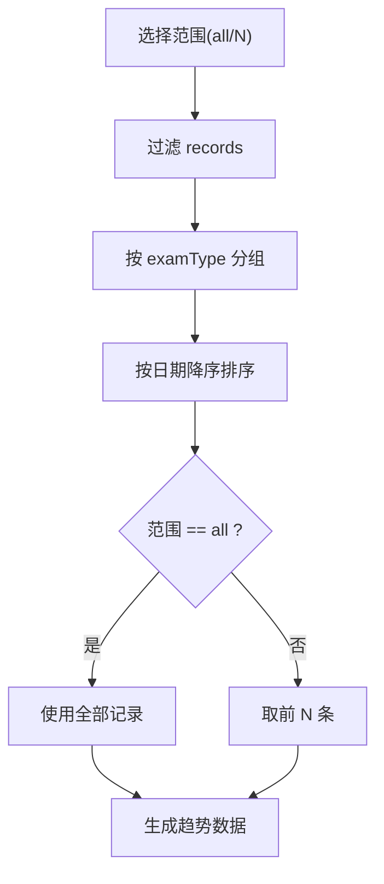
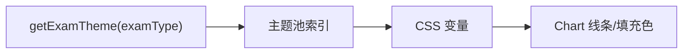
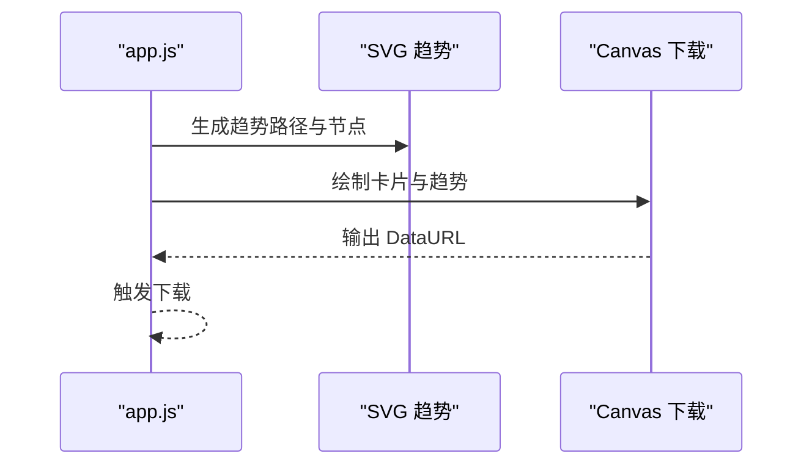
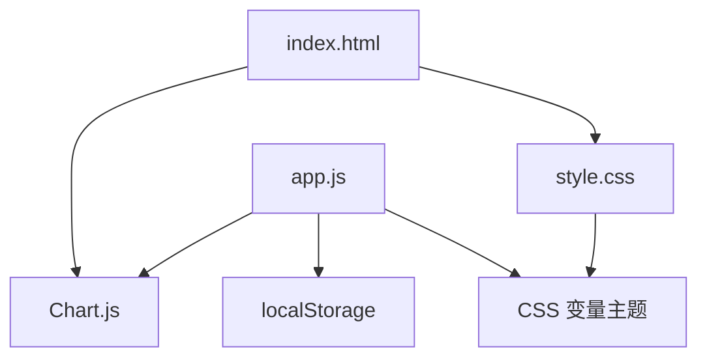

# 趋势分析与图表

<cite>
**本文引用的文件**
- [app.js](file://app.js)
- [index.html](file://index.html)
- [style.css](file://style.css)
- [lib/db.js](file://lib/db.js)
</cite>

## 目录
1. [简介](#简介)
2. [项目结构](#项目结构)
3. [核心组件](#核心组件)
4. [架构总览](#架构总览)
5. [详细组件分析](#详细组件分析)
6. [依赖关系分析](#依赖关系分析)
7. [性能考虑](#性能考虑)
8. [故障排除指南](#故障排除指南)
9. [结论](#结论)

## 简介
本文件针对 MyScore 的趋势分析与图表系统进行深入文档化，覆盖以下关键主题：
- 成绩趋势的计算算法与可视化呈现
- Chart.js 集成方式、配置选项与自定义样式
- 不同考试类型的图表展示差异与数据聚合策略
- 时间范围选择与动态图表更新
- 图表交互功能（缩放、筛选、数据钻取）的实现细节
- 响应式设计与大数据量下的性能优化技巧

## 项目结构
MyScore 前端采用单页应用架构，趋势分析与图表功能集中在仪表盘页面，通过 Chart.js 实现线性趋势图，并结合自定义主题与样式系统实现一致的视觉体验。

**图表来源**
- [index.html:9](file://index.html#L9)
- [app.js:1422](file://app.js#L1422-L1511)
- [app.js:949](file://app.js#L949-L955)
- [style.css:8-43](file://style.css#L8-L43)

**章节来源**
- [index.html:1-15](file://index.html#L1-L15)
- [app.js:1161-1199](file://app.js#L1161-L1199)
- [style.css:8-43](file://style.css#L8-L43)

## 核心组件
- 图表渲染引擎：Chart.js（CDN 引入）
- 数据源：本地存储 records 数组（JSON 序列化）
- 主题系统：getExamTheme() 基于考试类型派生主题色板
- 趋势数据构建：buildShareTrendData() 用于生成趋势卡片与分享卡片
- 仪表盘渲染：renderDashboard() 负责统计区与图表区的组合渲染

关键实现位置：
- 图表初始化与销毁：[app.js:1427-1430](file://app.js#L1427-L1430)
- 图表配置与渲染：[app.js:1483-1511](file://app.js#L1483-L1511)
- 趋势数据构建：[app.js:3786-3804](file://app.js#L3786-L3804)
- 主题派生与配色：[app.js:949-955](file://app.js#L949-L955)

**章节来源**
- [app.js:1422-1511](file://app.js#L1422-L1511)
- [app.js:3786-3804](file://app.js#L3786-L3804)
- [app.js:949-955](file://app.js#L949-L955)

## 架构总览
趋势分析与图表系统的整体流程如下：

**图表来源**
- [app.js:1422-1511](file://app.js#L1422-L1511)
- [app.js:3786-3804](file://app.js#L3786-L3804)
- [index.html:9](file://index.html#L9)

## 详细组件分析

### 图表渲染与配置
- 数据准备：按考试类型区分数据集，雅思、四六级与自定义考试分别处理。
- 图表类型：线图（line），启用交互索引模式，支持悬停索引。
- 坐标轴：y 轴 beginAtZero=false，x 轴网格隐藏，提升可读性。
- 图例：顶部居中，使用点样式，标签间距适配。
- 响应式：responsive=true，maintainAspectRatio=false，容器高度固定。

**图表来源**
- [app.js:1444-1481](file://app.js#L1444-L1481)
- [app.js:1483-1511](file://app.js#L1483-L1511)

**章节来源**
- [app.js:1422-1511](file://app.js#L1422-L1511)

### 趋势数据算法
- 最近 N 次（默认 5 次）成绩取最近记录，逆序排列。
- 计算最小/最大值与范围，用于归一化坐标。
- 生成每个点的 xRatio/yRatio，用于 SVG 或 Canvas 绘制。

**图表来源**
- [app.js:3786-3804](file://app.js#L3786-L3804)

**章节来源**
- [app.js:3786-3804](file://app.js#L3786-L3804)

### 不同考试类型的图表差异
- 雅思（ielts）：绘制总分与四项分项，总分填充曲线，分项为细线。
- 四六级（cet4/cet6）：总分独立绘制，写作与翻译合并为“写作翻译”数据集。
- 自定义考试：总分与各题型分别绘制，颜色来自题型配置。

**图表来源**
- [app.js:1447-1481](file://app.js#L1447-L1481)

**章节来源**
- [app.js:1447-1481](file://app.js#L1447-L1481)

### 图表交互与动态更新
- 交互模式：index 悬停，intersect=false，便于跨数据集索引。
- 动态更新：destroy 旧实例，重建新实例，确保响应式与数据变更生效。
- 无数据状态：隐藏图表容器，显示空状态提示。

**图表来源**
- [app.js:1427-1430](file://app.js#L1427-L1430)
- [app.js:1483-1511](file://app.js#L1483-L1511)

**章节来源**
- [app.js:1427-1430](file://app.js#L1427-L1430)
- [app.js:1483-1511](file://app.js#L1483-L1511)

### 时间范围选择与数据聚合
- 时间范围：通过报表预览与下载接口实现“全部/最近 N 次”的选择。
- 数据聚合：按考试类型分组，按日期降序排序，截取指定数量。
- 趋势卡片：基于最近 5 次成绩生成 SVG 趋势路径与节点。

**图表来源**
- [app.js:3819-3826](file://app.js#L3819-L3826)
- [app.js:3902-3906](file://app.js#L3902-L3906)

**章节来源**
- [app.js:3819-3826](file://app.js#L3819-L3826)
- [app.js:3902-3906](file://app.js#L3902-L3906)

### 图表样式与主题系统
- 主题派生：基于考试类型字符串计算 seed，从主题池中取主题。
- 配色变量：通过 CSS 变量定义主色、强调色、渐变色等。
- 图表配色：使用主题色作为线条与填充色，确保一致性。

**图表来源**
- [app.js:949-955](file://app.js#L949-L955)
- [style.css:8-43](file://style.css#L8-L43)

**章节来源**
- [app.js:949-955](file://app.js#L949-L955)
- [style.css:8-43](file://style.css#L8-L43)

### 报表与分享卡片中的趋势
- 成绩卡片：表格形式展示各考试类型与题型得分。
- 分享卡片：SVG 趋势路径与节点，标注日期与评分。
- 下载为图片：Canvas 渲染，生成 PNG 文件并触发下载。

**图表来源**
- [app.js:3925-3954](file://app.js#L3925-L3954)
- [app.js:4196-4389](file://app.js#L4196-L4389)

**章节来源**
- [app.js:3925-3954](file://app.js#L3925-L3954)
- [app.js:4196-4389](file://app.js#L4196-L4389)

## 依赖关系分析
- Chart.js：通过 CDN 引入，版本随页面加载。
- 本地存储：records 与自定义考试配置存储于 localStorage。
- 样式系统：CSS 变量驱动主题与配色，确保图表与 UI 一致。

**图表来源**
- [index.html:9](file://index.html#L9)
- [style.css:8-43](file://style.css#L8-L43)
- [app.js:1042-1068](file://app.js#L1042-L1068)

**章节来源**
- [index.html:9](file://index.html#L9)
- [style.css:8-43](file://style.css#L8-L43)
- [app.js:1042-1068](file://app.js#L1042-L1068)

## 性能考虑
- 图表实例生命周期：每次切换考试类型或范围时销毁旧实例并重建，避免内存泄漏与状态污染。
- 数据规模控制：趋势卡片默认取最近 5 次，降低渲染复杂度。
- 响应式布局：容器固定高度与 Chart.js 响应式配置，减少重排与重绘。
- Canvas 下载：采用 3 倍分辨率生成图片，兼顾清晰度与体积。

优化建议（通用指导，非现有实现）：
- 大数据量场景：启用 Chart.js 的数据缓存与懒加载，按需渲染。
- 交互性能：使用 requestAnimationFrame 与防抖优化频繁交互。
- 主题切换：CSS 变量变更即时生效，避免全量重绘。

**章节来源**
- [app.js:1427-1430](file://app.js#L1427-L1430)
- [app.js:3786-3804](file://app.js#L3786-L3804)
- [app.js:4196-4389](file://app.js#L4196-L4389)

## 故障排除指南
- 图表不显示或空白
  - 检查 records 是否为空，确认无数据时显示空状态。
  - 确认 Canvas 容器可见且尺寸有效。
  - 参考：[app.js:1432-1436](file://app.js#L1432-L1436)

- 图表颜色异常
  - 检查主题派生是否正确，确认 getExamTheme 返回预期主题。
  - 参考：[app.js:949-955](file://app.js#L949-L955)

- 交互无效或索引不准
  - 确认 interaction.mode 为 'index'，intersect=false。
  - 参考：[app.js:1493-1494](file://app.js#L1493-L1494)

- 下载图片失败
  - 检查 Canvas 渲染是否成功，确认 DataURL 可用。
  - 参考：[app.js:4387-4389](file://app.js#L4387-L4389)

**章节来源**
- [app.js:1432-1436](file://app.js#L1432-L1436)
- [app.js:949-955](file://app.js#L949-L955)
- [app.js:1493-1494](file://app.js#L1493-L1494)
- [app.js:4387-4389](file://app.js#L4387-L4389)

## 结论
MyScore 的趋势分析与图表系统以 Chart.js 为核心，结合本地存储与主题系统，实现了对不同考试类型的差异化展示与高效交互。通过合理的数据聚合策略与响应式配置，系统在中小规模数据下具备良好的性能与用户体验。对于更大规模数据，建议进一步引入虚拟滚动、增量渲染与缓存机制以提升性能。