# 数据同步系统

<cite>
**本文档引用的文件**
- [app.js](file://app.js)
- [server.js](file://server.js)
- [lib/db.js](file://lib/db.js)
- [lib/auth.js](file://lib/auth.js)
- [lib/aiComment.js](file://lib/aiComment.js)
- [netlify/functions/comment.js](file://netlify/functions/comment.js)
- [package.json](file://package.json)
</cite>

## 目录
1. [简介](#简介)
2. [项目结构](#项目结构)
3. [核心组件](#核心组件)
4. [架构概览](#架构概览)
5. [详细组件分析](#详细组件分析)
6. [依赖关系分析](#依赖关系分析)
7. [性能考虑](#性能考虑)
8. [故障排除指南](#故障排除指南)
9. [结论](#结论)
10. [附录](#附录)

## 简介

MyScore 是一个基于 Web 的成绩记录与管理工具，具备云端数据同步功能。本文档深入分析其数据同步系统的完整实现，包括云端同步机制、本地存储策略、数据合并算法以及相关的错误处理和网络异常恢复机制。

系统采用客户端-服务器架构，客户端负责本地数据存储和用户界面交互，服务器端负责用户认证、数据存储和同步服务。数据同步采用双向合并策略，确保本地和云端数据的一致性。

## 项目结构

MyScore 项目采用模块化设计，主要包含以下核心模块：

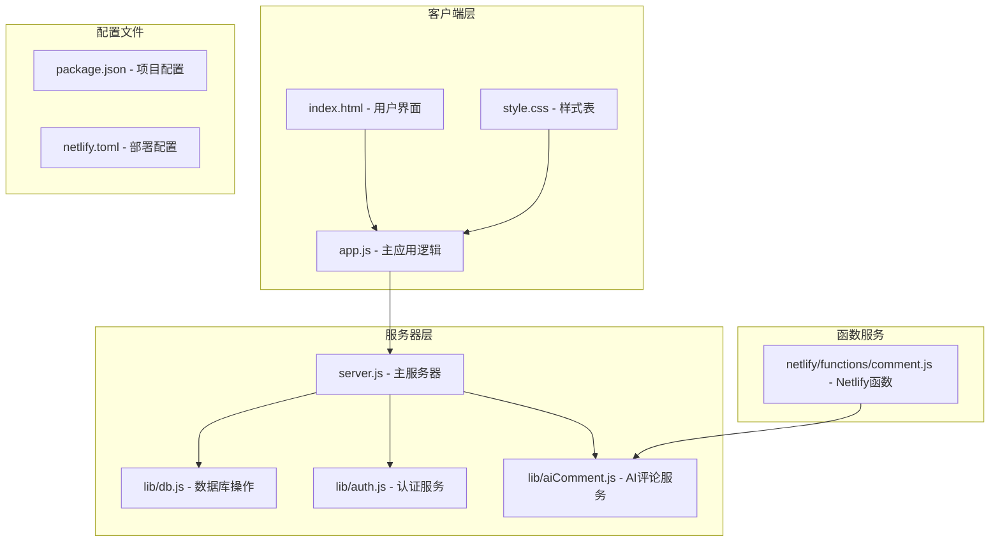

**图表来源**
- [app.js:1-50](file://app.js#L1-L50)
- [server.js:1-50](file://server.js#L1-L50)
- [lib/db.js:1-30](file://lib/db.js#L1-L30)
- [lib/auth.js:1-30](file://lib/auth.js#L1-L30)
- [lib/aiComment.js:1-30](file://lib/aiComment.js#L1-L30)
- [netlify/functions/comment.js:1-20](file://netlify/functions/comment.js#L1-L20)

**章节来源**
- [app.js:1-100](file://app.js#L1-L100)
- [server.js:1-100](file://server.js#L1-L100)

## 核心组件

### 数据存储常量定义

系统使用统一的存储常量来管理不同类型的数据：

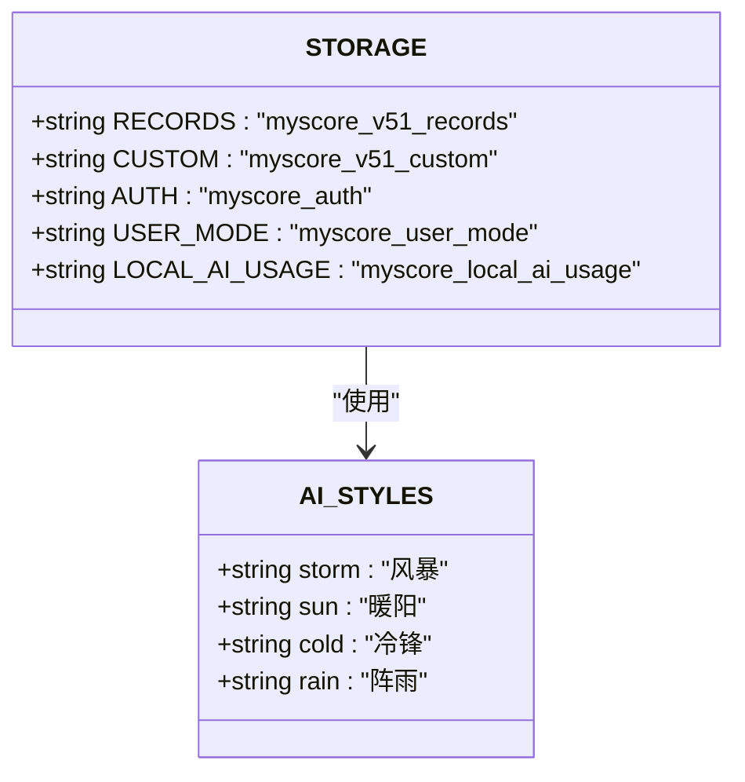

**图表来源**
- [app.js:2-8](file://app.js#L2-L8)
- [app.js:751-757](file://app.js#L751-L757)

系统支持四种用户模式：
- **local模式**：本地用户，数据仅存储在浏览器本地
- **loggedin模式**：已登录用户，支持云端同步

**章节来源**
- [app.js:2-8](file://app.js#L2-L8)
- [app.js:38-69](file://app.js#L38-L69)

### 同步定时器管理

系统使用定时器机制实现智能同步：

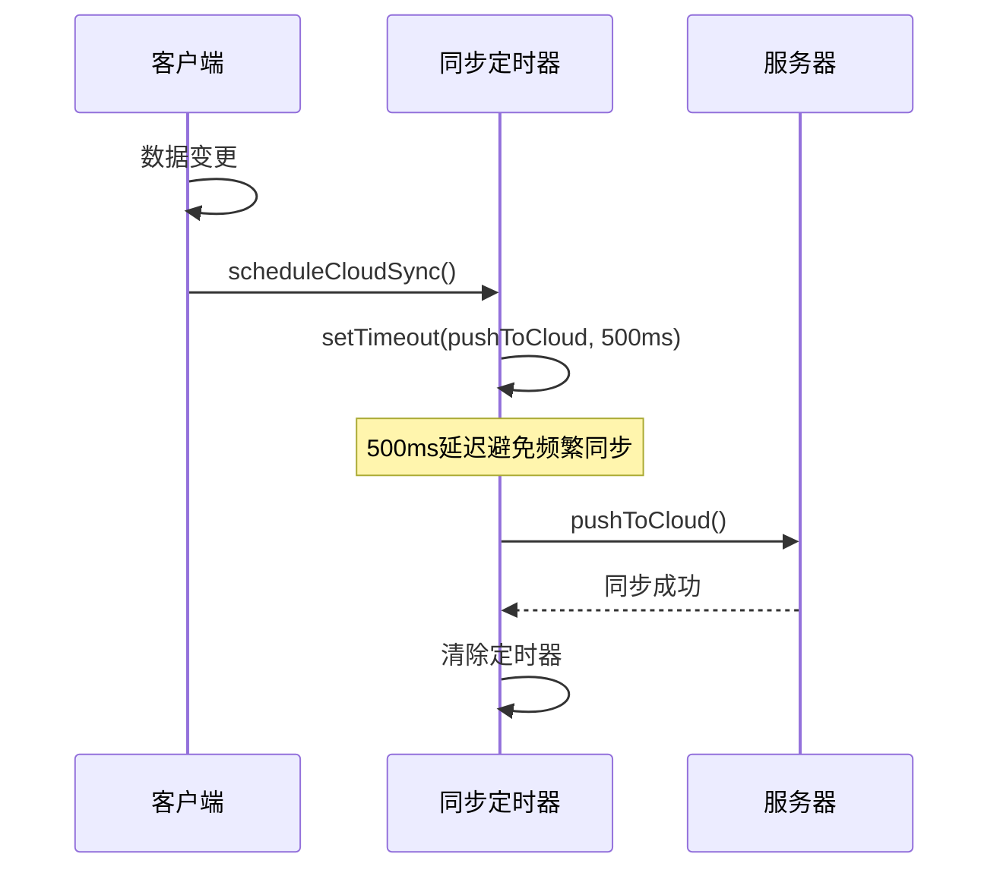

**图表来源**
- [app.js:666-670](file://app.js#L666-L670)
- [app.js:672-687](file://app.js#L672-L687)

**章节来源**
- [app.js:666-687](file://app.js#L666-L687)

## 架构概览

MyScore 的数据同步架构采用客户端-服务器双层设计：

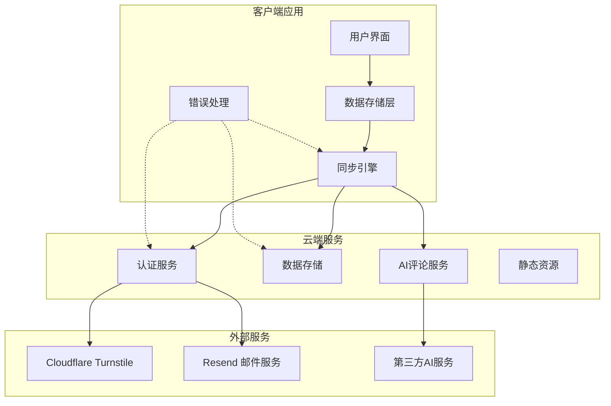

**图表来源**
- [app.js:1042-1068](file://app.js#L1042-L1068)
- [server.js:275-502](file://server.js#L275-L502)

## 详细组件分析

### gatherAllLocalStorage 函数工作原理

gatherAllLocalStorage 函数负责收集客户端所有需要同步的数据：

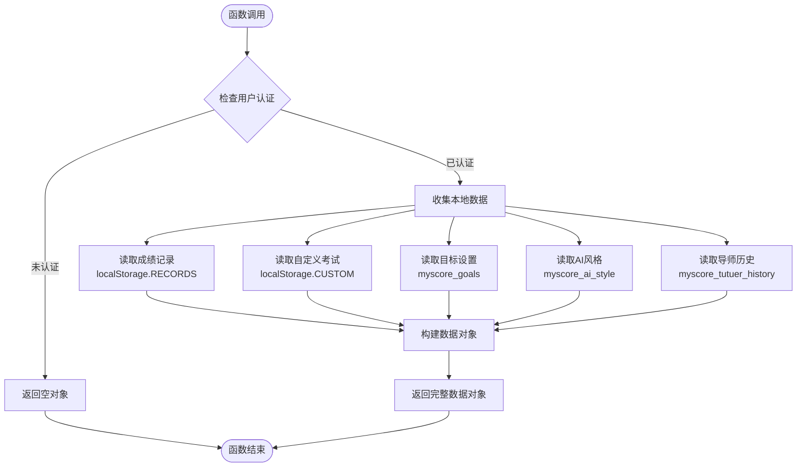

**图表来源**
- [app.js:705-713](file://app.js#L705-L713)

该函数的实现特点：
- **数据完整性**：收集所有可同步的数据类型
- **错误处理**：使用 readStorageJson 函数进行安全的数据读取
- **默认值**：为每个数据类型提供合理的默认值

**章节来源**
- [app.js:705-713](file://app.js#L705-L713)
- [app.js:926-934](file://app.js#L926-L934)

### mergeCloudData 算法实现

mergeCloudData 函数实现了复杂的双向数据合并策略：

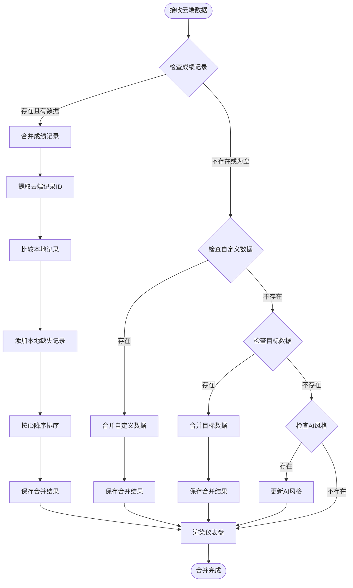

**图表来源**
- [app.js:715-743](file://app.js#L715-L743)

数据合并的核心策略：

1. **成绩记录合并**：
   - 云端优先：保留云端存在的记录
   - 本地补充：添加云端不存在的本地记录
   - 去重处理：使用ID集合避免重复
   - 排序规则：按ID降序排列

2. **自定义数据合并**：
   - 使用 Object.assign 进行浅拷贝合并
   - 云端数据优先于本地数据

3. **目标数据合并**：
   - 解析本地JSON数据
   - 云端优先合并策略

4. **AI风格同步**：
   - 直接替换本地设置
   - 更新当前AI风格状态

**章节来源**
- [app.js:715-743](file://app.js#L715-L743)

### pushToCloud 异步处理流程

pushToCloud 函数负责将本地数据推送到云端：

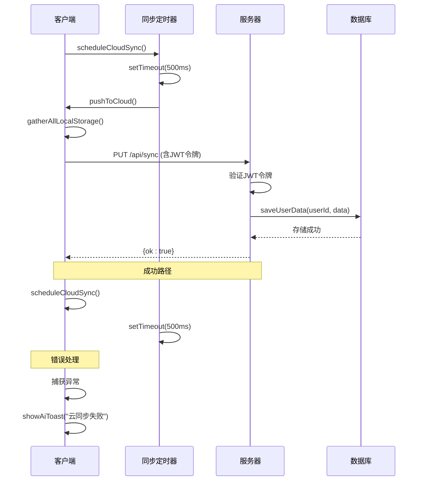

**图表来源**
- [app.js:672-687](file://app.js#L672-L687)
- [server.js:469-502](file://server.js#L469-L502)
- [lib/db.js:192-196](file://lib/db.js#L192-L196)

**章节来源**
- [app.js:672-687](file://app.js#L672-L687)
- [server.js:469-502](file://server.js#L469-L502)

### pullFromCloud 异步处理流程

pullFromCloud 函数负责从云端拉取数据：

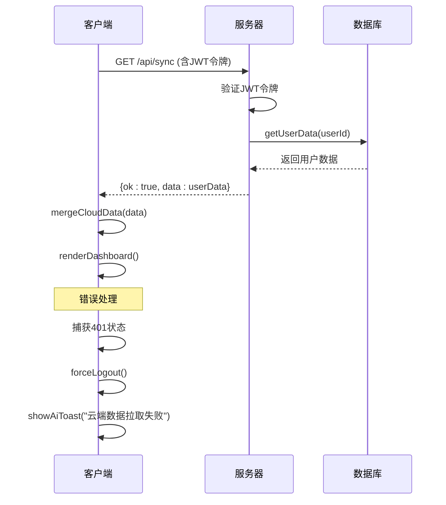

**图表来源**
- [app.js:689-703](file://app.js#L689-L703)
- [server.js:484-487](file://server.js#L484-L487)
- [lib/db.js:198-206](file://lib/db.js#L198-L206)

**章节来源**
- [app.js:689-703](file://app.js#L689-L703)
- [server.js:484-487](file://server.js#L484-L487)

### 本地存储策略

系统采用分层存储策略：

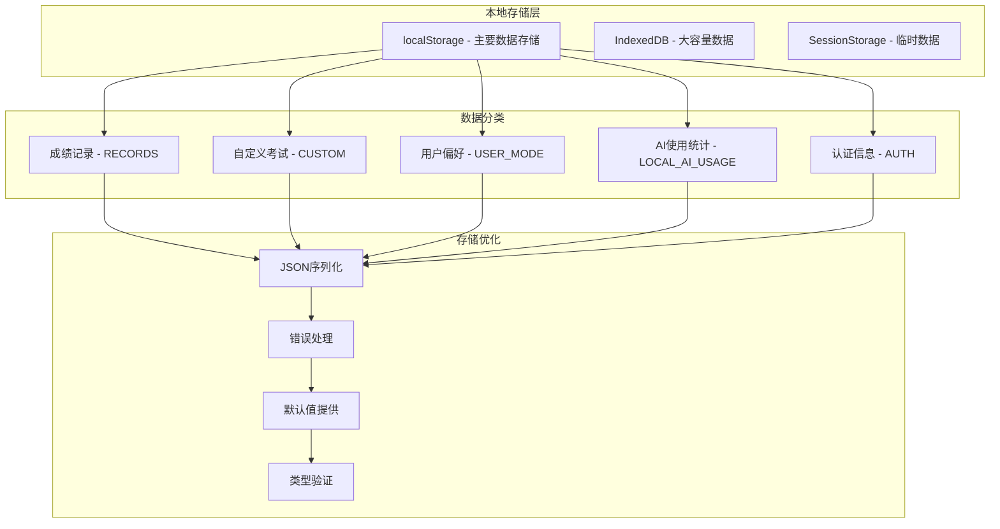

**图表来源**
- [app.js:2-8](file://app.js#L2-L8)
- [app.js:926-934](file://app.js#L926-L934)

**章节来源**
- [app.js:2-8](file://app.js#L2-L8)
- [app.js:926-934](file://app.js#L926-L934)

### 本地 AI 使用次数限制

系统实现了严格的本地AI使用限制机制：

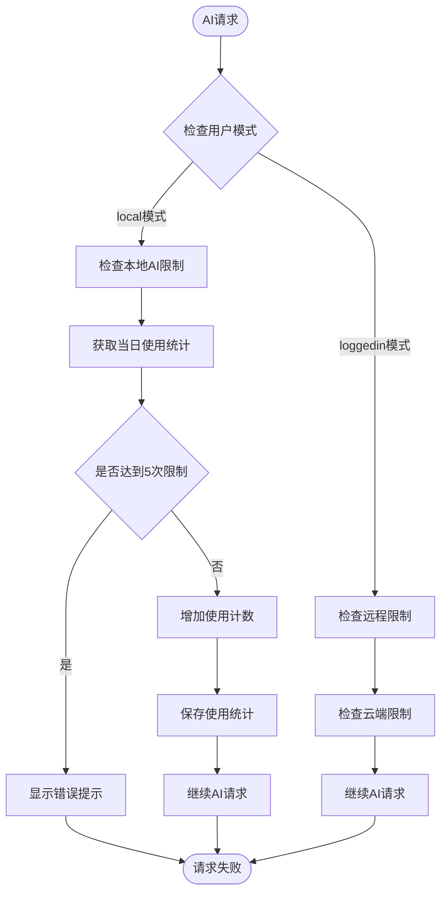

**图表来源**
- [app.js:40-69](file://app.js#L40-L69)
- [server.js:118-133](file://server.js#L118-L133)

**章节来源**
- [app.js:40-69](file://app.js#L40-L69)
- [server.js:118-133](file://server.js#L118-L133)

### 用户模式切换机制

系统支持动态的用户模式切换：

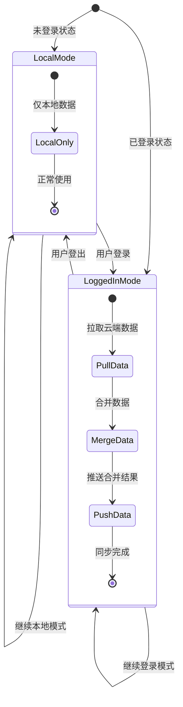

**图表来源**
- [app.js:42-49](file://app.js#L42-L49)
- [app.js:379-388](file://app.js#L379-L388)

**章节来源**
- [app.js:42-49](file://app.js#L42-L49)
- [app.js:379-388](file://app.js#L379-L388)

## 依赖关系分析

### 核心依赖图

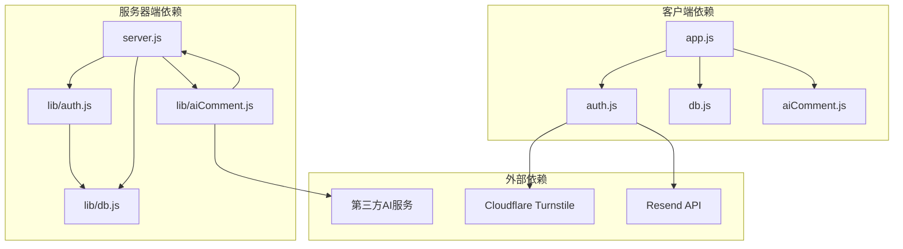

**图表来源**
- [app.js:1-50](file://app.js#L1-L50)
- [server.js:1-15](file://server.js#L1-L15)
- [lib/auth.js:1-15](file://lib/auth.js#L1-L15)
- [lib/aiComment.js:1-6](file://lib/aiComment.js#L1-L6)

### 数据流依赖

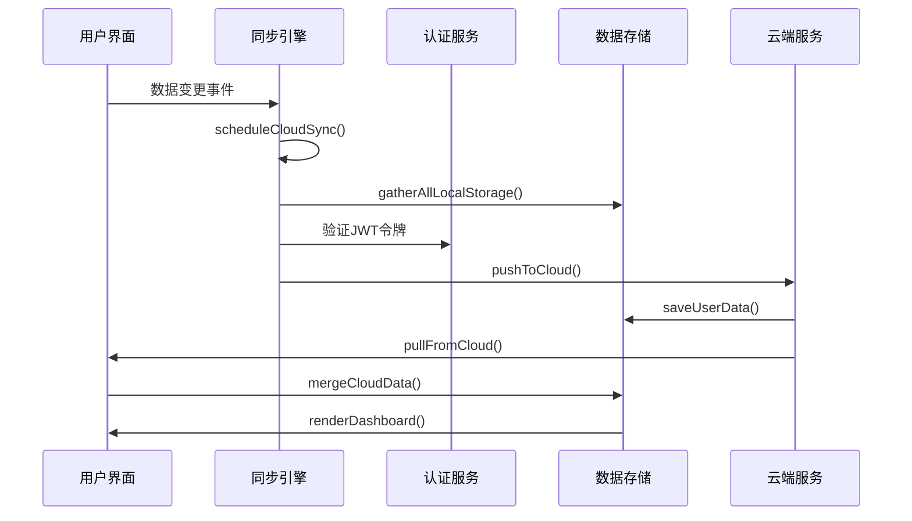

**图表来源**
- [app.js:666-743](file://app.js#L666-L743)
- [server.js:469-502](file://server.js#L469-L502)

**章节来源**
- [app.js:666-743](file://app.js#L666-L743)
- [server.js:469-502](file://server.js#L469-L502)

## 性能考虑

### 同步性能优化

系统采用了多项性能优化策略：

1. **延迟同步**：500ms延迟避免频繁同步
2. **增量更新**：仅在数据变更时触发同步
3. **批量处理**：一次性推送所有本地数据
4. **缓存策略**：本地数据缓存减少重复读取

### 存储性能优化

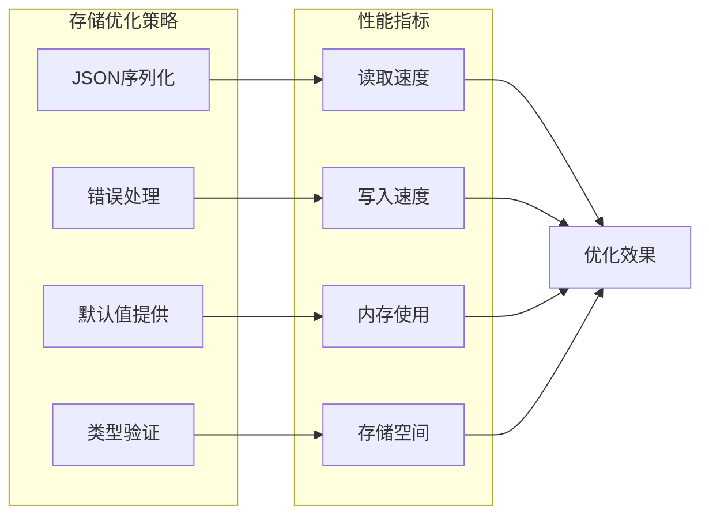

**图表来源**
- [app.js:926-934](file://app.js#L926-L934)

### 网络性能优化

- **超时控制**：AI请求30秒超时限制
- **重试机制**：网络异常时的自动重试
- **错误隔离**：单个请求失败不影响整体系统

## 故障排除指南

### 常见同步问题

| 问题类型 | 症状 | 可能原因 | 解决方案 |
|---------|------|----------|----------|
| 同步失败 | 云同步失败提示 | 网络连接问题 | 检查网络连接，重试同步 |
| 数据不一致 | 本地和云端数据不同步 | JWT令牌过期 | 重新登录获取新令牌 |
| 同步延迟 | 数据更新后未立即同步 | 定时器延迟 | 等待500ms或手动触发同步 |
| 存储不足 | 本地存储空间不足 | localStorage已满 | 导出数据清理空间 |

### 错误处理机制

系统实现了多层次的错误处理：

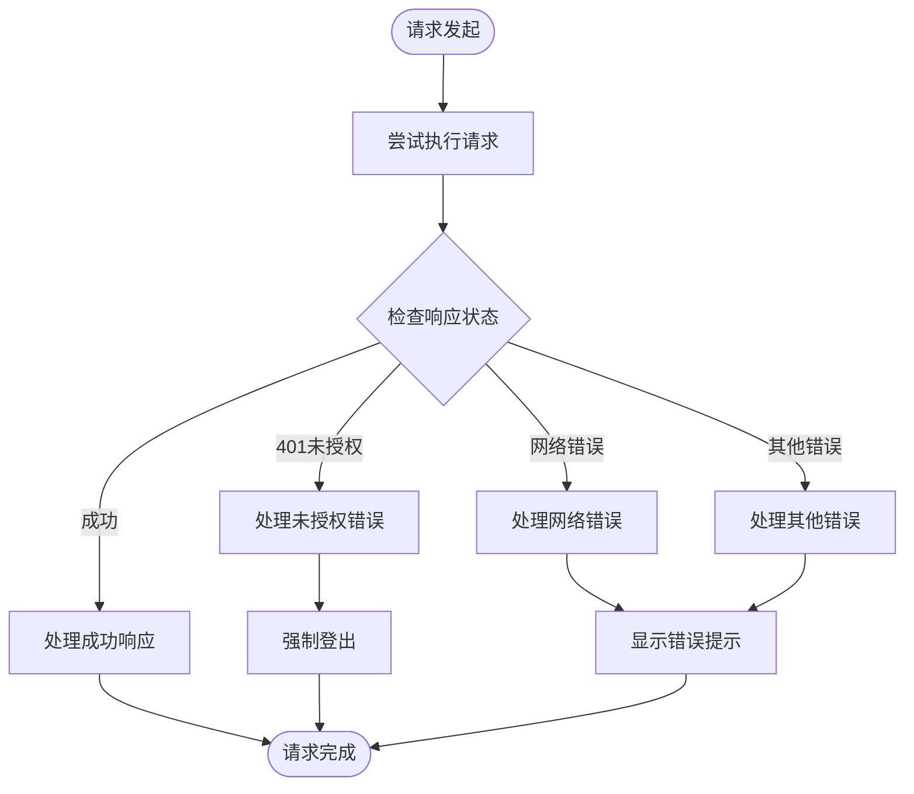

**图表来源**
- [app.js:689-703](file://app.js#L689-L703)
- [app.js:672-687](file://app.js#L672-L687)

**章节来源**
- [app.js:689-703](file://app.js#L689-L703)
- [app.js:672-687](file://app.js#L672-L687)

### 调试技巧

1. **开发者工具**：使用浏览器开发者工具监控网络请求
2. **日志输出**：检查控制台中的错误信息
3. **状态检查**：验证localStorage中的数据完整性
4. **令牌验证**：确认JWT令牌的有效性

## 结论

MyScore 的数据同步系统设计精良，实现了以下关键特性：

1. **可靠的数据一致性**：通过双向合并算法确保本地和云端数据的一致性
2. **智能的同步策略**：采用延迟同步和增量更新优化性能
3. **完善的错误处理**：多层次的错误处理和恢复机制
4. **灵活的用户模式**：支持本地和云端两种使用模式
5. **严格的安全控制**：JWT认证和数据加密保护用户隐私

系统在保证用户体验的同时，确保了数据的安全性和完整性。通过合理的架构设计和实现细节，MyScore 为用户提供了稳定可靠的数据同步服务。

## 附录

### 配置参数说明

| 参数名称 | 类型 | 默认值 | 描述 |
|---------|------|--------|------|
| LOCAL_AI_DAILY_LIMIT | number | 5 | 本地AI使用每日限制 |
| syncTimer | timeout | null | 同步定时器实例 |
| TURNSTILE_SITE_KEY | string | "" | Cloudflare验证密钥 |
| COMMENT_API_ENDPOINT | string | "/api/comment" | AI评论API端点 |

### API端点说明

| 端点 | 方法 | 功能 | 认证要求 |
|------|------|------|----------|
| /api/sync | GET | 拉取用户数据 | JWT |
| /api/sync | PUT | 推送用户数据 | JWT |
| /api/auth/send-code | POST | 发送验证码 | 无需 |
| /api/auth/login-code | POST | 邮箱登录 | 无需 |
| /api/auth/register | POST | 用户注册 | 无需 |
| /api/auth/login-password | POST | 密码登录 | 无需 |
| /api/auth/profile | GET | 获取用户资料 | JWT |
| /api/auth/profile | PUT | 更新用户资料 | JWT |

### 数据模型

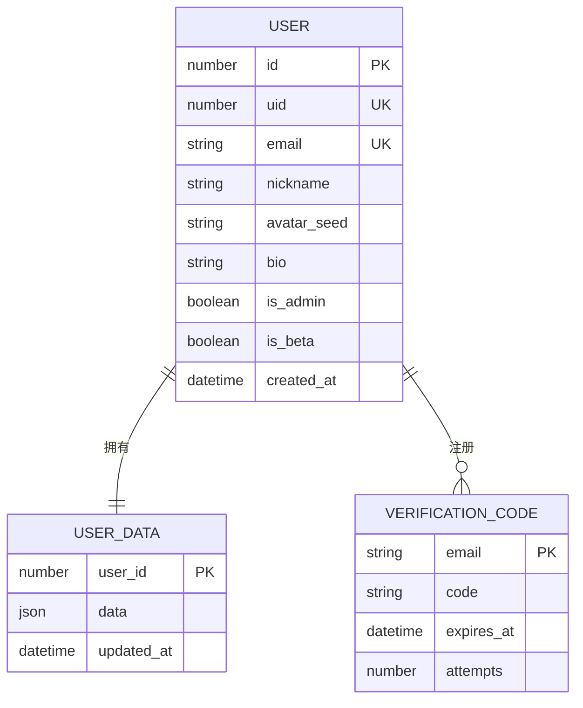

**图表来源**
- [lib/db.js:50-108](file://lib/db.js#L50-L108)
- [lib/db.js:129-188](file://lib/db.js#L129-L188)