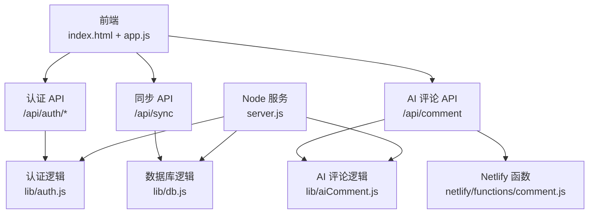
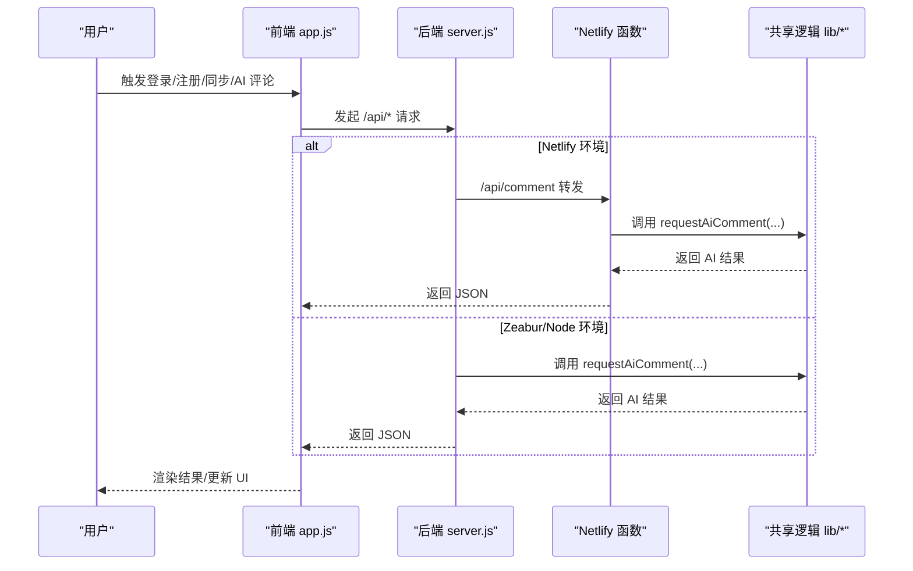
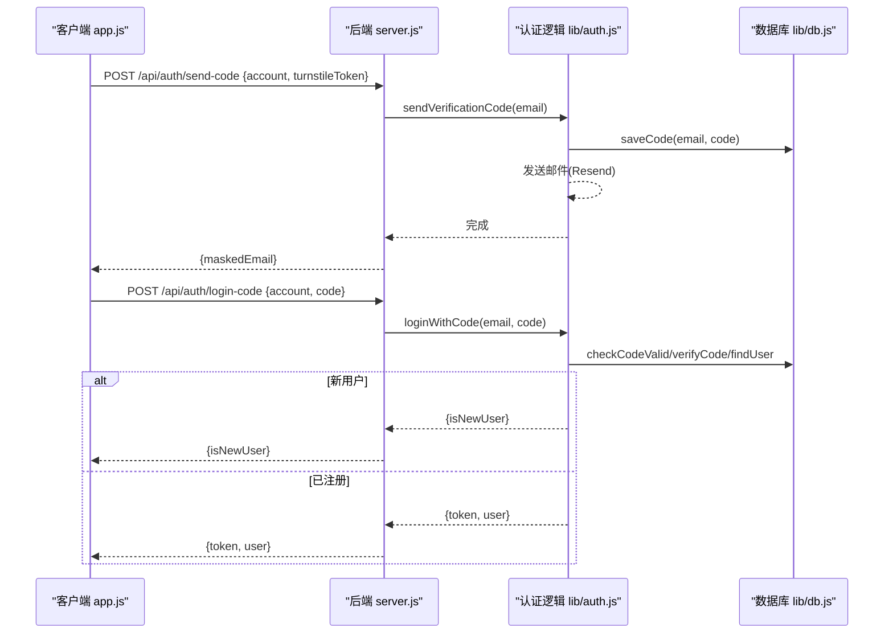
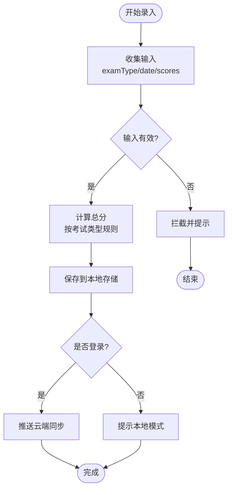
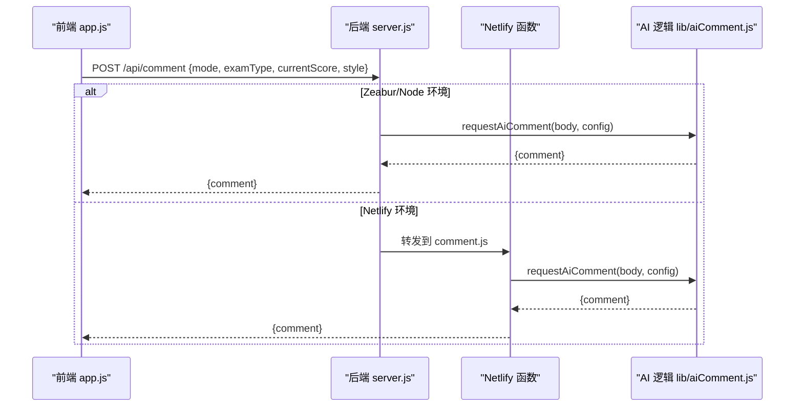
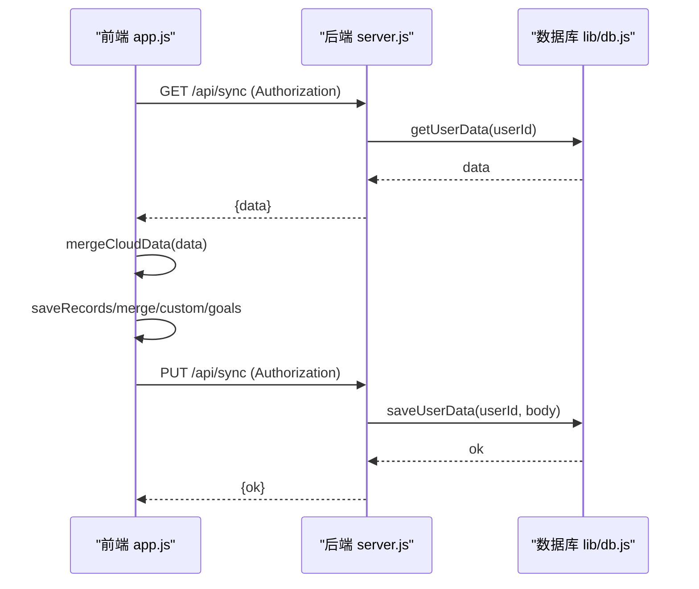
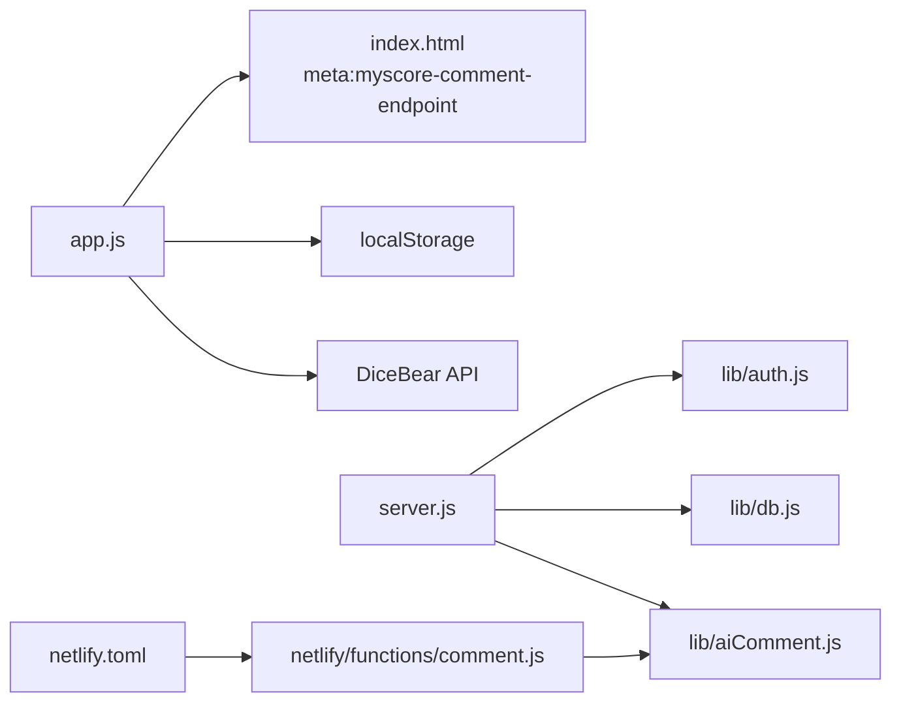

# 核心功能模块

<cite>
**本文引用的文件**
- [app.js](file://app.js)
- [server.js](file://server.js)
- [lib/auth.js](file://lib/auth.js)
- [lib/db.js](file://lib/db.js)
- [lib/aiComment.js](file://lib/aiComment.js)
- [netlify/functions/comment.js](file://netlify/functions/comment.js)
- [index.html](file://index.html)
- [netlify.toml](file://netlify.toml)
- [package.json](file://package.json)
- [README.md](file://README.md)
- [zbpack.json](file://zbpack.json)
</cite>

## 目录
1. [简介](#简介)
2. [项目结构](#项目结构)
3. [核心组件](#核心组件)
4. [架构总览](#架构总览)
5. [详细组件分析](#详细组件分析)
6. [依赖关系分析](#依赖关系分析)
7. [性能考量](#性能考量)
8. [故障排查指南](#故障排查指南)
9. [结论](#结论)
10. [附录](#附录)

## 简介
MyScore 是一款集成了用户认证、成绩管理、AI 评论与数据同步的全栈应用。本文档聚焦五大核心功能模块：
- 用户认证系统：邮箱验证码登录、密码登录与 JWT 令牌管理
- 成绩管理系统：多考试类型支持、自定义考试创建与数据验证
- AI 评论系统：四种风格（风暴、暖阳、冷锋、阵雨）与回怼功能
- 飞书集成系统：飞书机器人绑定、成绩通知推送、命令式交互查询（V5.4.0-beta 新增）
- 数据同步系统：云端存储与本地备份策略

文档提供模块间协作关系、API 接口说明与代码示例路径，帮助开发者快速理解与二次开发。

## 项目结构
项目采用前后端分离与共享逻辑的组织方式：
- 前端：index.html + app.js + style.css
- 后端：server.js（Node HTTP 服务）
- 共享逻辑：lib/ 下的 auth.js、db.js、aiComment.js
- Netlify Serverless：netlify/functions/comment.js
- 部署配置：netlify.toml、zbpack.json、package.json

**图表来源**
- [index.html](file://index.html)
- [app.js](file://app.js)
- [server.js](file://server.js)
- [lib/auth.js](file://lib/auth.js)
- [lib/db.js](file://lib/db.js)
- [lib/aiComment.js](file://lib/aiComment.js)
- [netlify/functions/comment.js](file://netlify/functions/comment.js)

**章节来源**
- [README.md](file://README.md)
- [package.json](file://package.json)
- [netlify.toml](file://netlify.toml)
- [zbpack.json](file://zbpack.json)

## 核心组件
- 用户认证系统：负责邮箱验证码发送、验证码校验、密码登录、注册与 JWT 令牌签发与校验
- 成绩管理系统：负责成绩录入、多考试类型计算、目标追踪与历史记录展示
- AI 评论系统：负责四种风格的 AI 评价与回怼，以及伴学助手对话
- 飞书集成系统：负责飞书机器人绑定码管理、事件处理、消息发送与成绩通知推送（V5.4.0-beta 新增）
- 数据同步系统：负责登录用户的云端数据拉取与推送，以及本地数据合并策略

**章节来源**
- [app.js](file://app.js)
- [server.js](file://server.js)
- [lib/auth.js](file://lib/auth.js)
- [lib/db.js](file://lib/db.js)
- [lib/aiComment.js](file://lib/aiComment.js)

## 架构总览
MyScore 采用“前端直连后端 API + Netlify 函数”的双平台部署架构。前端通过 app.js 调用后端 API，后端 server.js 提供认证、同步与 AI 评论接口；Netlify 环境下，/api/comment 通过 netlify.toml 转发到 netlify/functions/comment.js，后者复用 lib/aiComment.js 的 AI 逻辑。

**图表来源**
- [app.js](file://app.js)
- [server.js](file://server.js)
- [lib/aiComment.js](file://lib/aiComment.js)
- [netlify/functions/comment.js](file://netlify/functions/comment.js)
- [netlify.toml](file://netlify.toml)

## 详细组件分析

### 用户认证系统
- 功能特性
  - 邮箱验证码登录：支持邮箱或 UID 输入，人机验证（可选）通过后发送验证码
  - 密码登录：已注册用户凭密码登录
  - 注册流程：验证码校验通过后填写昵称、头像、签名、密码，生成 UID
  - JWT 令牌管理：签发 30 天有效期令牌，携带用户标识与邮箱
  - 用户资料：昵称、头像、个性签名、UID、管理员标识
  - 云端同步：登录后自动拉取云端数据并合并本地数据，再推送合并结果

- 实现要点
  - 前端 app.js 负责 UI 交互与表单校验，调用 /api/auth/* 接口
  - 后端 server.js 提供 send-code、login-code、register、login-password、profile 等接口
  - lib/auth.js 实现验证码发送、注册、密码登录与 JWT 签发/校验
  - lib/db.js 提供用户查询、注册、密码哈希与验证码存储
  - 人机验证：Cloudflare Turnstile 可选启用，前端加载脚本并渲染 widget，后端校验 token

- API 接口
  - POST /api/auth/send-code
    - 请求体：{ account, turnstileToken }
    - 返回：{ maskedEmail } 或错误
  - POST /api/auth/login-code
    - 请求体：{ account, code }
    - 返回：{ isNewUser } 或 { token, user }
  - POST /api/auth/register
    - 请求体：{ email, code, nickname, avatarSeed, bio, password, inviteCode }
    - 返回：{ token, user }
  - POST /api/auth/login-password
    - 请求体：{ account, password }
    - 返回：{ token, user }
  - GET /api/auth/profile
    - 请求头：Authorization: Bearer <token>
    - 返回：{ profile }
  - PUT /api/auth/profile
    - 请求头：Authorization: Bearer <token>
    - 请求体：{ nickname?, avatar_seed?, bio? }
    - 返回：{ profile }

- 令牌与会话
  - JWT 由 lib/auth.js 签发，有效期 30 天
  - 前端 app.js 在登录成功后保存用户信息与 token，后续同步与 AI 评论均携带 Authorization 头

**图表来源**
- [app.js](file://app.js)
- [server.js](file://server.js)
- [lib/auth.js](file://lib/auth.js)
- [lib/db.js](file://lib/db.js)

**章节来源**
- [app.js](file://app.js)
- [server.js](file://server.js)
- [lib/auth.js](file://lib/auth.js)
- [lib/db.js](file://lib/db.js)

### 成绩管理系统
- 功能特性
  - 多考试类型：雅思、大学英语（CET/TOEFL 等）与自定义考试
  - 自定义考试：支持科目/题型、颜色、计分方式（直接输入、多小题、分部分、公式、扣分制）
  - 数据验证：输入范围校验、实时拦截、NaN 防御
  - 目标追踪：为每种考试设置目标分数，显示进度百分比
  - 历史记录：对比上次成绩、总分计算、可视化展示

- 实现要点
  - 前端 app.js 负责成绩录入、计算与 UI 渲染
  - 前端通过 localStorage 存储本地记录与自定义考试配置
  - 登录后云端数据与本地数据合并，避免丢失

- 关键流程
  - 成绩保存：收集输入 → 计算总分 → 写入本地存储 → 触发云端同步
  - 目标追踪：读取目标值 → 计算百分比 → 渲染进度条
  - 历史对比：筛选同类型记录 → 计算差值 → 渲染对比卡片

**图表来源**
- [app.js](file://app.js)

**章节来源**
- [app.js](file://app.js)

### AI 评论系统
- 功能特性
  - 四种风格：风暴（犀利刻薄）、暖阳（温暖鼓励）、冷锋（理性分析）、阵雨（先损后帮）
  - 回怼功能：用户反驳 AI 评价，触发更有趣的反击
  - 伴学助手：独立入口，支持连续对话与情绪陪伴
  - 风格切换频率限制：请求锁与冷却期，防止高频点击

- 实现要点
  - 前端 app.js 负责风格选择、缓存键生成与 UI 切换
  - 后端 server.js 与 Netlify 函数 comment.js 调用 lib/aiComment.js
  - lib/aiComment.js 构造系统提示词与用户消息，调用上游 AI 接口，返回评价与建议

- API 接口
  - POST /api/comment
    - 请求体：{ mode, examType, currentScore, historyScores, userRebuttal, previousComment, userMessage, conversationHistory, style }
    - 返回：{ comment }

- 交互序列
  - 成绩保存后，前端根据用户模式与缓存键决定是否调用 AI 评论
  - 登录用户：携带 Authorization 调用后端 /api/comment
  - 未登录用户：按 IP 每日限额，超过限制提示登录解锁

**图表来源**
- [app.js](file://app.js)
- [server.js](file://server.js)
- [lib/aiComment.js](file://lib/aiComment.js)
- [netlify/functions/comment.js](file://netlify/functions/comment.js)
- [netlify.toml](file://netlify.toml)

**章节来源**
- [app.js](file://app.js)
- [server.js](file://server.js)
- [lib/aiComment.js](file://lib/aiComment.js)
- [netlify/functions/comment.js](file://netlify/functions/comment.js)
- [netlify.toml](file://netlify.toml)

### 数据同步系统
- 功能特性
  - 登录后自动拉取云端数据并合并本地数据，再推送合并结果
  - 云端数据结构：记录、自定义考试、目标、AI 风格、伴学历史
  - 本地备份：未登录状态下数据保存在浏览器 localStorage
  - 退出登录：清理本地成绩与偏好，保留用户设置

- 实现要点
  - 前端 app.js 负责定时推送、拉取与合并策略
  - 后端 server.js 提供 /api/sync GET/PUT 接口
  - lib/db.js 提供用户数据文件存储与读取

- 同步流程
  - 登录成功后：拉取云端数据 → 合并本地与云端 → 保存到本地 → 推送合并结果
  - 本地模式：每日 AI 评论限额 5 次，登录后解除限制并自动迁移数据

**图表来源**
- [app.js](file://app.js)
- [server.js](file://server.js)
- [lib/db.js](file://lib/db.js)

**章节来源**
- [app.js](file://app.js)
- [server.js](file://server.js)
- [lib/db.js](file://lib/db.js)

## 依赖关系分析
- 前端依赖
  - app.js 依赖 index.html 的 meta 标签提供的 /api/comment 端点
  - app.js 依赖 localStorage 作为本地存储
  - app.js 依赖 DiceBear API 生成头像

- 后端依赖
  - server.js 依赖 lib/auth.js、lib/db.js、lib/aiComment.js
  - Netlify 环境下，/api/comment 通过 netlify.toml 转发到 netlify/functions/comment.js

**图表来源**
- [app.js](file://app.js)
- [index.html](file://index.html)
- [server.js](file://server.js)
- [lib/auth.js](file://lib/auth.js)
- [lib/db.js](file://lib/db.js)
- [lib/aiComment.js](file://lib/aiComment.js)
- [netlify/functions/comment.js](file://netlify/functions/comment.js)
- [netlify.toml](file://netlify.toml)

**章节来源**
- [index.html](file://index.html)
- [app.js](file://app.js)
- [server.js](file://server.js)
- [lib/auth.js](file://lib/auth.js)
- [lib/db.js](file://lib/db.js)
- [lib/aiComment.js](file://lib/aiComment.js)
- [netlify/functions/comment.js](file://netlify/functions/comment.js)
- [netlify.toml](file://netlify.toml)

## 性能考量
- 前端
  - 本地存储：大量数据写入 localStorage 可能阻塞 UI，建议分批写入与节流
  - 缓存键：AI 评论使用 examType + total + historyRecs 生成缓存键，避免重复请求
  - 合并策略：云端与本地数据合并时，按 id 去重并排序，减少重复渲染

- 后端
  - 速率限制：对敏感接口（验证码、登录、AI 评论）设置每分钟上限
  - 匿名用户限额：未登录用户每日 AI 评论限制 5 次，防止滥用
  - 静态资源：按类型设置缓存策略，支持 gzip 压缩

**章节来源**
- [app.js](file://app.js)
- [server.js](file://server.js)

## 故障排查指南
- 登录失败
  - 检查账户格式（邮箱或 UID），确认验证码是否过期
  - 确认 Turnstile 人机验证是否通过
  - 查看后端日志与 429 速率限制提示

- 云端同步异常
  - 确认 Authorization 头是否携带有效 JWT
  - 检查 /api/sync 的 GET/PUT 是否返回 200
  - 查看本地是否有残留同步定时器

- AI 评论失败
  - 检查 AI_API_KEY、AI_BASE_URL、AI_MODEL 环境变量
  - 未登录用户是否超过每日限额
  - 检查上游 AI 返回状态与错误信息

- 数据丢失
  - 退出登录会清理本地成绩数据，但云端保留
  - 建议定期导出数据或登录以启用云端同步

**章节来源**
- [app.js](file://app.js)
- [server.js](file://server.js)
- [lib/aiComment.js](file://lib/aiComment.js)

## 结论
MyScore 通过清晰的模块划分与前后端协作，实现了从用户认证到成绩管理、AI 评论与数据同步的完整闭环。模块间通过标准化 API 与共享逻辑协作，既满足了本地使用场景，又提供了云端同步能力。开发者可基于现有接口与实现模式快速扩展新功能。

## 附录
- 部署与环境变量
  - Zeabur：JWT_SECRET、AI_API_KEY、RESEND_API_KEY、TURNSTILE_SECRET_KEY、DATA_DIR、INVITE_CODES
  - Netlify：AI_API_KEY、ALLOWED_ORIGIN（可选）
- 双平台隔离：Netlify 与 Zeabur 环境变量互不影响
- 零依赖：使用 Node.js 内置模块实现，无需额外安装

**章节来源**
- [README.md](file://README.md)
- [server.js](file://server.js)