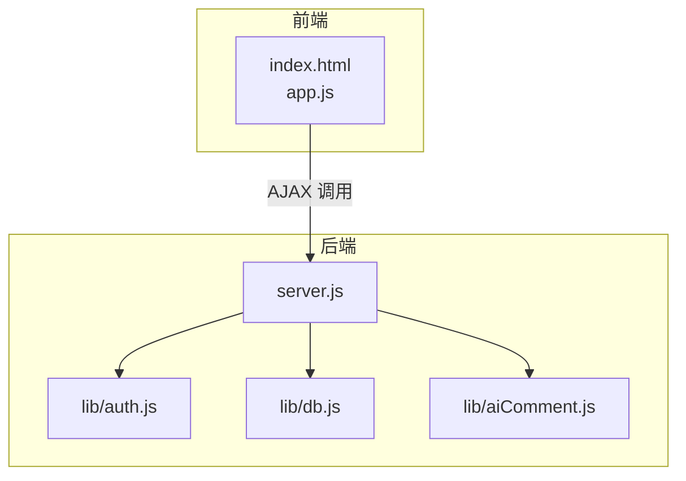
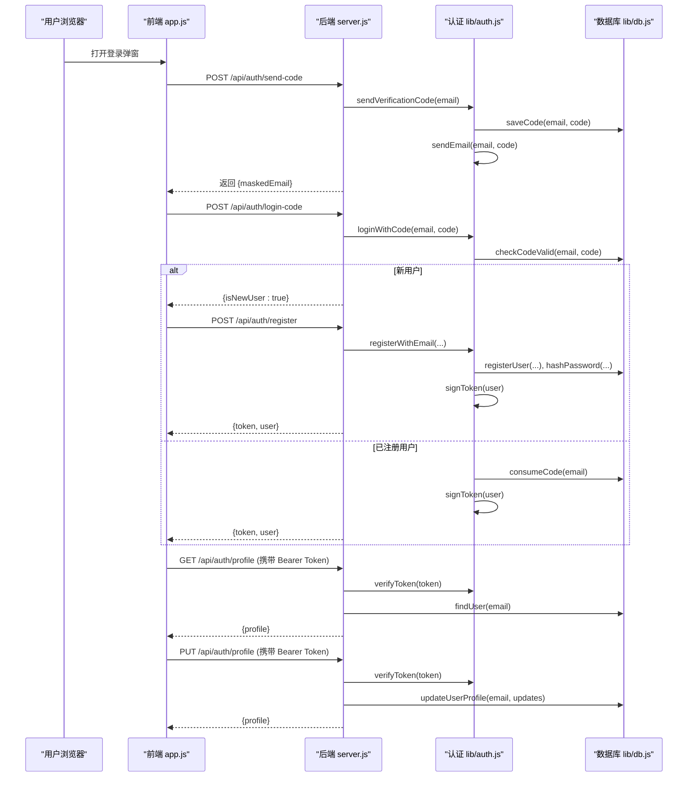
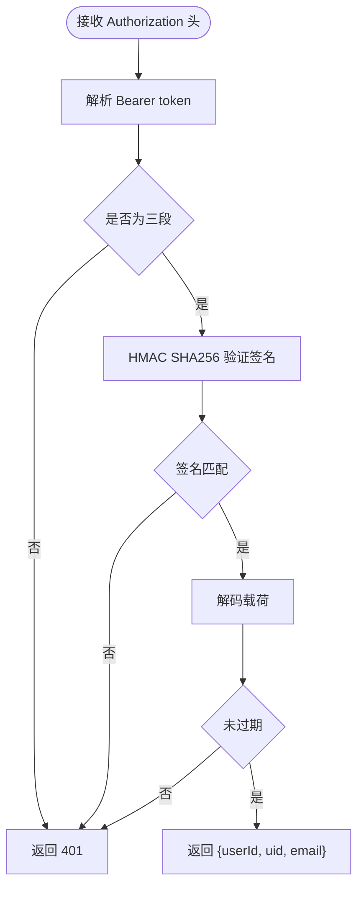
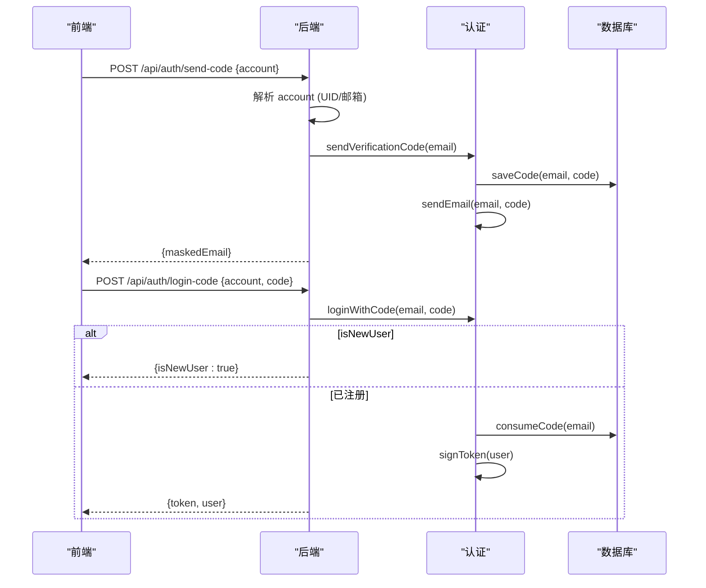
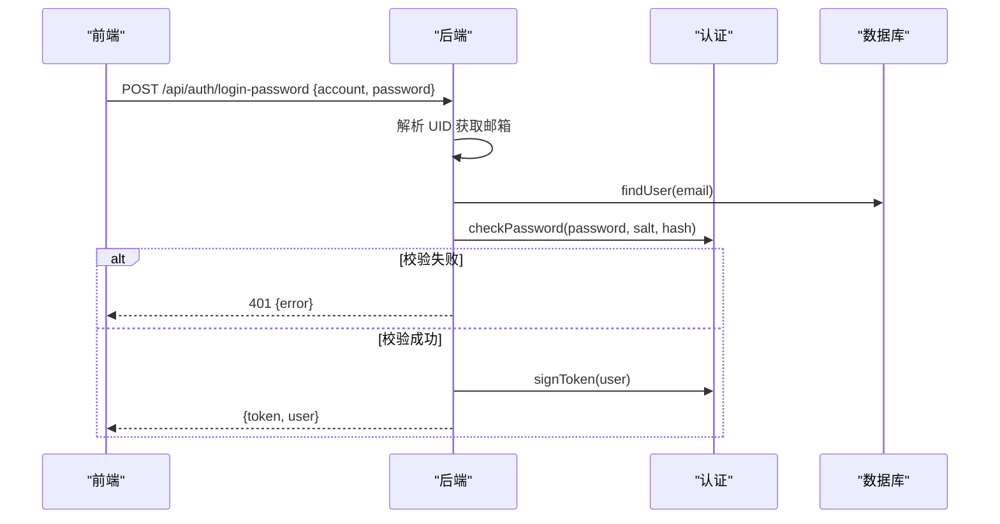
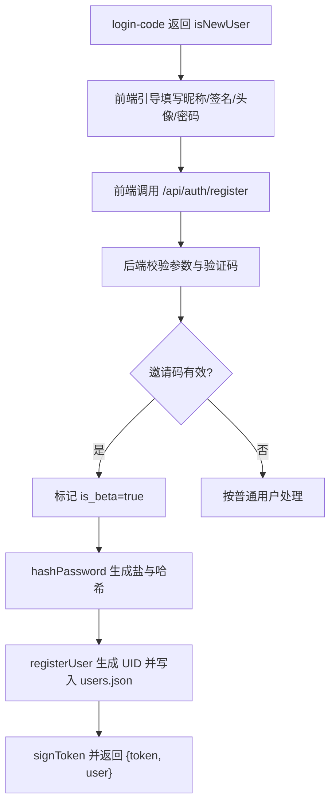
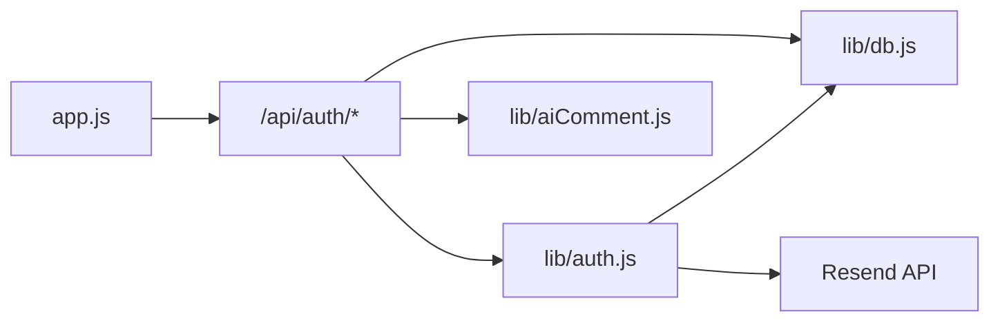

# 用户认证系统

<cite>
**本文引用的文件**
- [lib/auth.js](file://lib/auth.js)
- [lib/db.js](file://lib/db.js)
- [server.js](file://server.js)
- [app.js](file://app.js)
- [index.html](file://index.html)
- [lib/aiComment.js](file://lib/aiComment.js)
- [README.md](file://README.md)
- [package.json](file://package.json)
- [start-local.bat](file://start-local.bat)
</cite>

## 目录
1. [简介](#简介)
2. [项目结构](#项目结构)
3. [核心组件](#核心组件)
4. [架构总览](#架构总览)
5. [详细组件分析](#详细组件分析)
6. [依赖关系分析](#依赖关系分析)
7. [性能考量](#性能考量)
8. [故障排查指南](#故障排查指南)
9. [结论](#结论)
10. [附录](#附录)

## 简介
本文件为 MyScore 的用户认证系统提供完整的技术文档，覆盖邮箱验证码登录、密码登录、JWT 令牌管理、验证码发送与验证、用户注册、头像选择系统、用户资料管理与会话管理。文档还包含 API 使用说明、本地存储策略、会话恢复机制与安全考虑，并提供可视化架构图与流程图帮助理解。

## 项目结构
MyScore 采用前后端分离的单页应用架构：
- 前端：index.html + app.js（负责 UI、交互、登录流程、本地存储、会话恢复）
- 后端：server.js（HTTP 服务器，路由到 /api/auth/* 与 /api/sync）
- 认证与数据库：lib/auth.js（JWT、验证码、注册/登录）、lib/db.js（JSON 文件数据库）
- AI 交互：lib/aiComment.js（AI 评价 API 转发与提示词）

**图表来源**
- [server.js:275-462](file://server.js#L275-L462)
- [lib/auth.js:1-191](file://lib/auth.js#L1-L191)
- [lib/db.js:1-207](file://lib/db.js#L1-L207)
- [lib/aiComment.js:1-172](file://lib/aiComment.js#L1-L172)

**章节来源**
- [README.md:217-237](file://README.md#L217-L237)
- [package.json:1-13](file://package.json#L1-L13)

## 核心组件
- 认证模块（lib/auth.js）
  - JWT 生成与验证（HS256）
  - 邮箱验证码生成、发送与校验
  - 用户注册（邮箱+验证码+密码+头像）
  - 密码登录
  - 验证码登录（支持 UID 解析）
- 数据库模块（lib/db.js）
  - 用户表（users.json）
  - 验证码表（codes.json）
  - 用户数据（userdata/<userId>.json）
  - UID 自增与唯一性
  - 密码哈希与安全比较
- 服务器（server.js）
  - /api/auth/* 路由处理
  - 速率限制与人机验证
  - 会话校验与权限控制
- 前端（app.js + index.html）
  - 登录/注册 UI 流程
  - 本地存储与会话恢复
  - 头像选择与资料编辑
  - 云端数据同步

**章节来源**
- [lib/auth.js:1-191](file://lib/auth.js#L1-L191)
- [lib/db.js:1-207](file://lib/db.js#L1-L207)
- [server.js:275-462](file://server.js#L275-L462)
- [app.js:1-800](file://app.js#L1-L800)

## 架构总览
认证系统的关键交互流程如下：

**图表来源**
- [server.js:283-455](file://server.js#L283-L455)
- [lib/auth.js:138-191](file://lib/auth.js#L138-L191)
- [lib/db.js:73-108](file://lib/db.js#L73-L108)

## 详细组件分析

### JWT 令牌管理
- 生成
  - HS256 签名，载荷包含 sub、uid、email、exp（30 天）
  - 生成后返回给前端
- 验证
  - 校验签名与过期时间
  - 通过后从 Authorization: Bearer 头中提取 token
- 使用
  - /api/auth/profile GET/PUT、/api/sync GET/PUT 均需携带 Bearer Token

**图表来源**
- [lib/auth.js:36-59](file://lib/auth.js#L36-L59)
- [server.js:398-455](file://server.js#L398-L455)

**章节来源**
- [lib/auth.js:18-59](file://lib/auth.js#L18-L59)
- [server.js:464-467](file://server.js#L464-L467)

### 邮箱验证码登录
- 发送验证码
  - 前端调用 /api/auth/send-code，携带 account（邮箱或 UID）
  - 后端解析 UID 获取邮箱，调用 sendVerificationCode
  - 生成 6 位随机数，保存到 codes.json（5 分钟有效期，最多 5 次尝试）
  - 通过 Resend 发送邮件（RESEND_API_KEY 必填）
- 验证码登录
  - 前端调用 /api/auth/login-code，携带 account 与 code
  - 后端解析 UID 获取邮箱，调用 loginWithCode
  - 若用户不存在：返回 isNewUser: true
  - 若存在：consumeCode 并签发 token

**图表来源**
- [server.js:283-351](file://server.js#L283-L351)
- [lib/auth.js:138-191](file://lib/auth.js#L138-L191)
- [lib/db.js:129-188](file://lib/db.js#L129-L188)

**章节来源**
- [server.js:283-351](file://server.js#L283-L351)
- [lib/auth.js:67-142](file://lib/auth.js#L67-L142)
- [lib/db.js:129-188](file://lib/db.js#L129-L188)

### 密码登录
- 前端调用 /api/auth/login-password，携带 account（邮箱或 UID）与 password
- 后端解析 UID 获取邮箱，查询用户并校验密码
- 校验成功后签发 token

**图表来源**
- [server.js:369-396](file://server.js#L369-L396)
- [lib/auth.js:168-177](file://lib/auth.js#L168-L177)
- [lib/db.js:118-125](file://lib/db.js#L118-L125)

**章节来源**
- [server.js:369-396](file://server.js#L369-L396)
- [lib/auth.js:168-177](file://lib/auth.js#L168-L177)
- [lib/db.js:118-125](file://lib/db.js#L118-L125)

### 用户注册流程
- 验证码登录返回 isNewUser: true 时，前端引导用户填写昵称、个性签名、选择头像、设置密码
- 前端调用 /api/auth/register，携带 email、code、nickname、avatarSeed、bio、password、inviteCode
- 后端校验验证码、头像合法性、密码强度，可选邀请码（INVITE_CODES），生成 UID，保存用户并签发 token

**图表来源**
- [server.js:353-367](file://server.js#L353-L367)
- [lib/auth.js:144-166](file://lib/auth.js#L144-L166)
- [lib/db.js:73-94](file://lib/db.js#L73-L94)

**章节来源**
- [server.js:353-367](file://server.js#L353-L367)
- [lib/auth.js:144-166](file://lib/auth.js#L144-L166)
- [lib/db.js:73-94](file://lib/db.js#L73-L94)

### 密码哈希存储
- 生成：使用 scryptSync 生成 64 字节哈希，随机 16 字节盐
- 校验：使用 timingSafeEqual 进行恒时比较，避免时序攻击
- 存储：users.json 中保存 password_hash 与 salt

**章节来源**
- [lib/db.js:112-125](file://lib/db.js#L112-L125)

### 验证码发送机制
- 生成：randomInt(100000, 1000000) 生成 6 位验证码
- 存储：codes.json 记录 code、expires_at（+5 分钟）、attempts
- 发送：通过 Resend API 发送 HTML 邮件（RESEND_API_KEY 必填）
- 校验：checkCodeValid 与 verifyCode 分别用于登录校验与注册消费

**章节来源**
- [lib/auth.js:63-142](file://lib/auth.js#L63-L142)
- [lib/db.js:129-188](file://lib/db.js#L129-L188)

### 头像选择系统
- 前端提供 12 种头像种子（adventurer、lorelei、...、thumbs）
- 注册时选择 avatarSeed，保存到 users.json
- 资料编辑时可更换头像，更新后同步到服务器

**章节来源**
- [app.js:17-30](file://app.js#L17-L30)
- [app.js:102-117](file://app.js#L102-L117)
- [server.js:432-439](file://server.js#L432-L439)

### 用户资料管理
- 查询：GET /api/auth/profile，返回 nickname、avatar_seed、bio、uid、is_admin、is_beta（不含敏感字段）
- 更新：PUT /api/auth/profile，支持 nickname、avatar_seed、bio，服务端校验长度与合法性

**章节来源**
- [server.js:398-455](file://server.js#L398-L455)

### 会话管理与本地存储
- 前端使用 localStorage 存储：
  - myscore_auth：当前用户信息（含 token）
  - myscore_user_mode：'local' | 'loggedin'
  - myscore_local_ai_usage：{date, count}
- 会话恢复：启动时读取 myscore_auth，调用 /api/auth/profile 校验 token 并刷新本地资料
- 退出登录：清除 myscore_auth、myscore_user_mode、myscore_local_ai_usage，保留偏好设置

**章节来源**
- [app.js:1-800](file://app.js#L1-L800)
- [server.js:442-472](file://server.js#L442-L472)

### 安全考虑
- JWT_SECRET 强制配置（未设置则拒绝启动）
- 速率限制：send-code（3/min）、login-password（10/min）、login-code（10/min）、comment（20/min）
- 人机验证：Cloudflare Turnstile（可选），验证码接口需提供 turnstileToken
- 输入校验：UID/邮箱解析、昵称/签名长度限制、头像种子白名单
- CORS：通过 ALLOWED_ORIGIN 控制来源
- 密码安全：scrypt 哈希 + timingSafeEqual 比较
- 验证码安全：5 分钟过期、最多 5 次尝试，错误时增加 attempts

**章节来源**
- [server.js:16-48](file://server.js#L16-L48)
- [server.js:50-67](file://server.js#L50-L67)
- [lib/auth.js:4-14](file://lib/auth.js#L4-L14)
- [lib/aiComment.js:1-172](file://lib/aiComment.js#L1-L172)

## 依赖关系分析

**图表来源**
- [server.js:275-462](file://server.js#L275-L462)
- [lib/auth.js:1-191](file://lib/auth.js#L1-L191)
- [lib/db.js:1-207](file://lib/db.js#L1-L207)
- [lib/aiComment.js:1-172](file://lib/aiComment.js#L1-L172)

**章节来源**
- [server.js:275-462](file://server.js#L275-L462)

## 性能考量
- 本地存储：前端使用 localStorage，避免频繁网络请求
- 云端同步：异步推送/拉取，避免阻塞 UI
- 速率限制：防止暴力破解与滥用
- 邮件发送：异步调用 Resend，失败时记录日志
- 前端 UI：Turnstile widget 生命周期管理，避免重复注入

[本节为通用指导，无需特定文件引用]

## 故障排查指南
- JWT_SECRET 未设置
  - 现象：服务启动即退出
  - 处理：设置环境变量 JWT_SECRET（建议使用 openssl 生成）
- RESEND_API_KEY 未设置
  - 现象：验证码发送被跳过，仅输出警告
  - 处理：配置 RESEND_API_KEY 与 RESEND_FROM
- 401 未登录或登录已过期
  - 现象：调用受保护接口返回 401
  - 处理：重新登录获取 token，或检查本地存储 myscore_auth 是否存在
- 验证码错误或已过期
  - 现象：login-code 或 register 返回错误
  - 处理：检查验证码是否在 5 分钟内，尝试重新发送
- 速率限制 429
  - 现象：短时间内多次请求被拒绝
  - 处理：等待窗口期结束或降低请求频率
- 人机验证失败
  - 现象：send-code 返回 400
  - 处理：检查 TURNSTILE_SECRET_KEY 配置与前端 Turnstile 初始化

**章节来源**
- [lib/auth.js:4-10](file://lib/auth.js#L4-L10)
- [lib/auth.js:67-71](file://lib/auth.js#L67-L71)
- [server.js:287-290](file://server.js#L287-L290)
- [server.js:509-513](file://server.js#L509-L513)

## 结论
MyScore 的认证系统以轻量、安全为核心目标：使用 Node.js 内置模块实现 JWT、密码哈希与验证码存储；通过 Resend 实现邮件发送；采用速率限制与人机验证提升安全性；前端通过 localStorage 实现会话持久化与恢复。整体架构清晰、边界明确，便于维护与扩展。

[本节为总结，无需特定文件引用]

## 附录

### API 使用说明

- POST /api/auth/send-code
  - 请求体
    - account: 邮箱或 UID
    - turnstileToken: 可选，人机验证 token
  - 成功响应
    - maskedEmail: 邮箱掩码显示
  - 错误
    - 400: 参数缺失、UID 未注册、邮箱格式错误
    - 400: 人机验证失败
    - 429: 请求过于频繁

- POST /api/auth/login-code
  - 请求体
    - account: 邮箱或 UID
    - code: 6 位验证码
  - 成功响应
    - isNewUser: true（新用户）
    - token + user（已注册用户）
  - 错误
    - 400: 参数缺失、UID 未注册
    - 401: 验证码错误或已过期

- POST /api/auth/register
  - 请求体
    - email: 邮箱
    - code: 验证码
    - nickname: 昵称（1-20）
    - avatarSeed: 头像种子
    - bio: 个性签名（最多 60）
    - password: 密码（至少 6）
    - inviteCode: 可选
  - 成功响应
    - token + user
  - 错误
    - 400: 参数缺失、验证码错误、头像非法、密码过短、昵称过长、邀请码无效

- POST /api/auth/login-password
  - 请求体
    - account: 邮箱或 UID
    - password: 密码
  - 成功响应
    - token + user
  - 错误
    - 400: 参数缺失
    - 401: 账号或密码错误

- GET /api/auth/profile
  - 请求头
    - Authorization: Bearer <token>
  - 成功响应
    - profile: 包含 nickname、avatar_seed、bio、uid、is_admin、is_beta
  - 错误
    - 401: 未登录或登录已过期
    - 404: 用户不存在

- PUT /api/auth/profile
  - 请求头
    - Authorization: Bearer <token>
  - 请求体
    - nickname: 可选（1-20）
    - avatar_seed: 可选（合法种子）
    - bio: 可选（最多 60）
  - 成功响应
    - profile
  - 错误
    - 400: 参数非法
    - 401: 未登录或登录已过期
    - 404: 用户不存在

**章节来源**
- [server.js:283-455](file://server.js#L283-L455)

### 本地存储策略
- myscore_auth: 当前用户信息（token、uid、email、nickname、avatarSeed、bio、isAdmin、isBeta）
- myscore_user_mode: 'local' | 'loggedin'
- myscore_local_ai_usage: {date, count}
- 会话恢复：启动时读取 myscore_auth，调用 /api/auth/profile 校验并刷新本地资料

**章节来源**
- [app.js:1-800](file://app.js#L1-L800)

### 会话恢复机制
- 启动时读取 localStorage 中的 myscore_auth
- 调用 /api/auth/profile，若 401 则强制登出
- 成功则更新本地资料并触发云端数据拉取

**章节来源**
- [app.js:442-472](file://app.js#L442-L472)
- [server.js:398-413](file://server.js#L398-L413)

### 环境变量参考
- JWT_SECRET: JWT 加密密钥（必须）
- RESEND_API_KEY: 邮件发送密钥（可选）
- RESEND_FROM: 发件人地址（可选）
- INVITE_CODES: 内测邀请码列表（可选）
- TURNSTILE_SECRET_KEY: 人机验证密钥（可选）
- DATA_DIR: 数据目录（可选）
- AI_API_KEY: AI 评价密钥（用于 /api/comment）
- ALLOWED_ORIGIN: CORS 允许来源（可选）

**章节来源**
- [lib/auth.js:4-14](file://lib/auth.js#L4-L14)
- [README.md:193-206](file://README.md#L193-L206)
- [start-local.bat:1-7](file://start-local.bat#L1-L7)