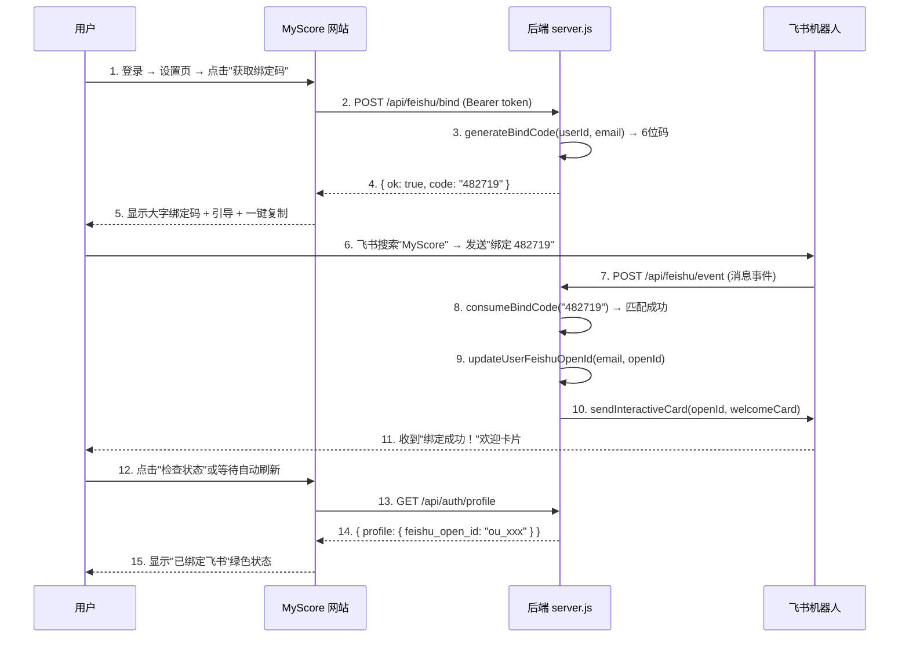
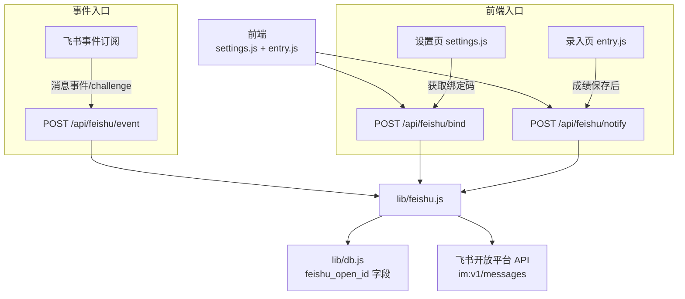

# 飞书集成系统

<cite>
**本文档引用的文件**
- [lib/feishu.js](file://lib/feishu.js)
- [server.js](file://server.js)
- [lib/db.js](file://lib/db.js)
- [js/settings.js](file://js/settings.js)
- [js/entry.js](file://js/entry.js)
- [js/auth.js](file://js/auth.js)
- [index.html](file://index.html)
</cite>

## 目录
1. [功能概述](#功能概述)
2. [绑定流程](#绑定流程)
3. [机器人命令](#机器人命令)
4. [成绩通知推送](#成绩通知推送)
5. [技术架构](#技术架构)
6. [API 接口](#api-接口)
7. [环境配置](#环境配置)
8. [故障排除](#故障排除)

## 功能概述

飞书集成是 MyScore V5.4.0-beta 新增的核心功能，让用户通过飞书机器人与 MyScore 进行交互。绑定后，用户可以在飞书中：

- **接收成绩通知** — 每次录入成绩后自动推送精美的通知卡片
- **查询最新成绩** — 发送 `查询` 即可查看最近一次考试详情
- **查看趋势分析** — 发送 `趋势` 获取近5次成绩变化走势
- **追踪目标进度** — 发送 `目标` 查看各科目目标完成百分比
- **浏览成就墙** — 发送 `成就` 查看已解锁的成就列表

### 设计亮点

- **6位数字码绑定** — 安全简洁，无需复杂 OAuth 流程，5分钟有效期
- **交互式卡片消息** — 使用飞书 Interactive Card，信息层次清晰美观
- **静默通知** — 成绩录入后自动推送，不阻塞主流程，失败不影响用户体验
- **命令式交互** — 自然语言关键词（查询/趋势/目标/成就/帮助），零学习成本

## 绑定流程

绑定流程采用「网站生成码 → 飞书发送码」的双向验证机制，确保只有账号持有者才能完成绑定。



### 操作步骤（面向用户）

1. 打开飞书，在搜索框中搜索 **MyScore**
2. 进入 MyScore 机器人对话
3. 回到 MyScore 网站设置页，点击「获取绑定码」
4. 复制显示的命令（如 `绑定 482719`），粘贴到飞书中发送
5. 收到"绑定成功！"欢迎卡片即表示绑定完成

### 绑定码规则

| 属性 | 值 |
|------|-----|
| 格式 | 6位纯数字（100000-999999） |
| 有效期 | 5分钟 |
| 存储方式 | 服务端内存 Map（重启清空） |
| 使用次数 | 一次性，消费后立即失效 |
| 清理策略 | 每5分钟自动清理过期码 |

## 机器人命令

绑定成功后，用户可以在飞书中直接发送以下命令与 MyScore 交互：

### 查询 — 查看最新成绩

发送：`查询`

返回一张交互式卡片，包含：
- 考试名称和日期
- 总分（大字突出显示）
- 各科分项明细
- 历史记录总数

### 趋势 — 成绩变化分析

发送：`趋势`

返回文字消息，展示最近5次考试成绩：
- 每行格式：`考试名称 日期: 总分 ↑/↓/→`
- 箭头表示与上一次相比的升降趋势
- 不足2条记录时提示继续录入

### 目标 — 目标完成进度

发送：`目标`

返回文字消息，为每个设置了目标的考试类型：
- 显示当前分数 / 目标分数
- 百分比进度条（█░ 字符可视化）
- 未设置目标时引导去网站设置

### 成就 — 已解锁成就列表

发送：`成就`

返回交互式卡片，列出所有已解锁成就：
- 成就图标 + 名称 + 描述
- 显示已解锁数量
- 无成就时鼓励继续使用

### 帮助 — 使用说明

发送：`帮助` 或 `help`

返回帮助卡片，包含所有可用命令的快速参考。

### 命令路由表

| 命令 | 正则匹配 | 处理函数 | 返回类型 |
|------|---------|---------|---------|
| 绑定 XXXXXX | `/^绑定\s+(\d{6})$/` | handleBindCommand | 欢迎卡片 |
| 查询 | `/^查询$/` | handleQueryCommand | 查询结果卡片 |
| 趋势 | `/^趋势$/` | handleTrendCommand | 文字消息 |
| 目标 | `/^目标$/` | handleGoalCommand | 文字消息 |
| 成就 | `/^成就$/` | handleAchievementCommand | 成就卡片 |
| 帮助/help | `/^(帮助\|help)$/` | help handler | 帮助卡片 |

## 成绩通知推送

每次用户在网站录入成绩后，如果已绑定飞书，系统会自动向飞书推送通知卡片。

### 触发时机

```
用户保存成绩 → AI评论完成 → 云端同步 → 飞书通知（静默异步）
```

通知以 IIFE（立即执行函数表达式）方式触发，使用 `.catch(() => {})` 确保不阻塞主流程。

### 通知卡片内容

- **标题**：「成绩通知」（蓝色主题）
- **头部**：考试名称 + 日期 + 总分（右对齐大字）
- **分隔线**
- **分项明细**：各科目分数列表
- **AI摘要**（如有）：斜体显示 AI 生成的简短点评

### 通知条件

以下任一条件不满足时跳过通知（静默失败）：
- 用户未登录
- 用户未绑定飞书（无 feishu_open_id）

## 技术架构

### 两层身份体系

飞书集成涉及两层身份，需要清晰区分：

| 层级 | 标识 | 用途 | 示例 |
|------|------|------|------|
| 应用身份 | App ID + App Secret | 服务器调用飞书 API 的凭证 | `cli_xxxxxxxxxxxxxxxx` |
| 用户身份 | open_id | 飞书用户的唯一标识 | `ou_xxxxxxxxxxxxxxxxxxxxxxxx` |

服务器使用应用身份获取 tenant_access_token，用用户身份（open_id）定向发送消息。

### 模块依赖关系



### 关键文件说明

| 文件 | 职责 | 核心函数 |
|------|------|---------|
| `lib/feishu.js` | 飞书 API 封装、命令路由、卡片模板 | getTenantAccessToken, handleFeishuEvent, sendFeishuNotification, buildXxxCard |
| `server.js` | 提供 bind/notify/event 三个 HTTP 路由 | POST /api/feishu/bind, POST /api/feishu/notify, POST /api/feishu/event |
| `lib/db.js` | 用户数据存储 feishu_open_id 字段 | updateUserFeishuOpenId, findUserByFeishuOpenId |
| `js/settings.js` | 设置页绑定 UI 渲染与交互 | renderFeishuBindSection, requestFeishuBindCode, unbindFeishu |
| `js/entry.js` | 成绩录入后触发通知 | submitScore 内 IIFE 调用 notify API |
| `js/auth.js` | 登录/资料更新时同步 feishuOpenId | onLoginSuccess, restoreSession, profile 回调 |

## API 接口

### POST /api/feishu/bind — 获取绑定码

**认证**: 需要 Bearer token（登录状态）

请求体：空

响应：
```json
{ "ok": true, "code": "482719" }
```

错误：
```json
{ "error": "未登录或登录已过期" }
```

### POST /api/feishu/notify — 触发成绩通知

**认证**: 需要 Bearer token（登录状态）

请求体：
```json
{
  "record": {
    "examType": "ielts",
    "date": "2026-05-03",
    "total": 7.0,
    "scores": { "听力": 7.0, "阅读": 6.5, "写作": 6.0, "口语": 7.0 }
  }
}
```

响应：
```json
{ "ok": true }
// 或用户未绑定时
{ "ok": true, "skipped": true, "reason": "not_bound" }
```

### POST /api/feishu/event — 飞书事件回调

**认证**: 飞书平台调用（无需用户 token），通过 Verification Token 校验

请求体（URL验证）：
```json
{ "challenge": "test_string", "token": "verification_token" }
```

响应：
```json
{ "challenge": "test_string" }
```

请求体（消息事件）：
```json
{
  "event": {
    "sender": { "sender_id": { "open_id": "ou_xxx" } },
    "message": {
      "content": "{\"text\":\"查询\"}"
    }
  }
}
```

响应：
```json
{ "ok": true }
```

## 环境配置

部署到 Zeabur 时需要配置以下环境变量：

| 变量名 | 必需 | 说明 |
|--------|------|------|
| `FEISHU_APP_ID` | 是 | 飞书应用 ID（cli_ 开头） |
| `FEISHU_APP_SECRET` | 是 | 飞书应用密钥 |
| `FEISHU_ENCRYPT_KEY` | 是 | 飞书加密密钥（事件解密用） |
| `FEISHU_VERIFICATION_TOKEN` | 否 | 事件订阅验证 Token |

### 飞书开放平台配置

在 [open.feishu.cn](https://open.feishu.cn) 后台需要完成：

1. **启用机器人能力** — 应用功能 → 机器人 → 开启
2. **配置事件订阅 URL** — `https://你的域名/api/feishu/event`
3. **添加权限**：
   - `im:message` — 接收消息
   - `im:message:send_as_bot` — 以机器人身份发消息
   - `contact:user.base:readonly` — 读取用户基本信息
4. **发布应用版本** — 提交审核后生效

## 故障排除

### 绑定码无效或已过期
- **原因**：绑定码5分钟有效期，或已被消费
- **解决**：重新点击"获取绑定码"获取新的6位码

### 飞书收不到消息
- **原因**：应用未发布/审核未通过、权限未开通、事件订阅 URL 配置错误
- **解决**：确认飞书开放平台的应用状态为"已上线"，检查权限清单，用 curl 测试 challenge 端点

### 找不到 MyScore 机器人
- **原因**：应用尚未发布，或机器人能力未开启
- **解决**：确认开放平台中机器人能力已开启且应用版本已发布

### 录入成绩后没有收到飞书通知
- **原因**：用户未绑定飞书，或通知请求静默失败
- **解决**：先确认设置页显示"已绑定"，再检查浏览器控制台是否有网络错误

### 发送命令后回复"未识别的命令"
- **原因**：命令文本前后有空格或特殊字符
- **解决**：确保发送的是纯文本命令（如 `查询`），不含多余空格或标点
