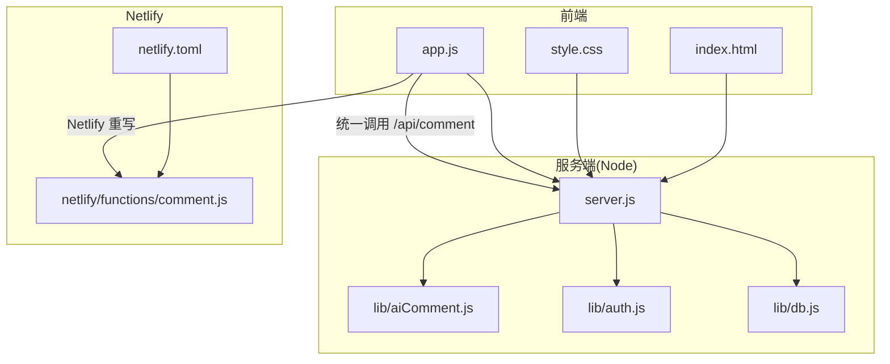
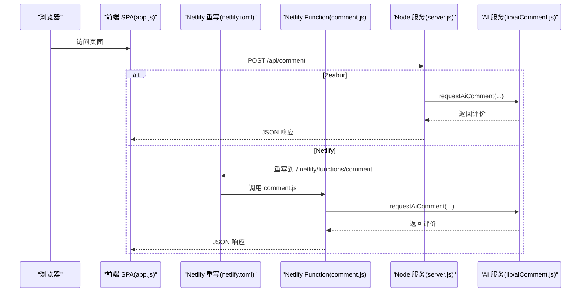
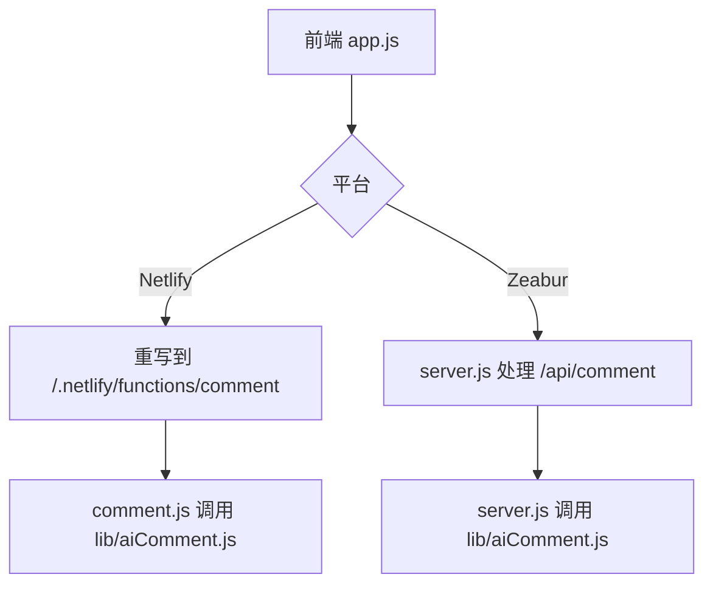
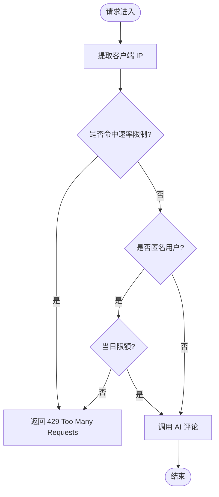
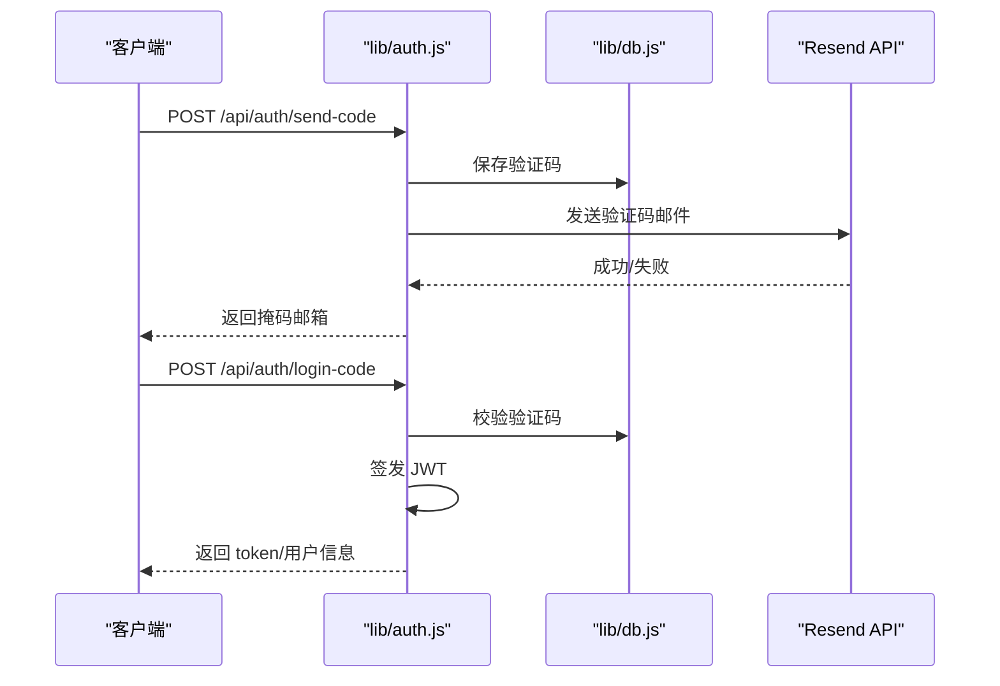
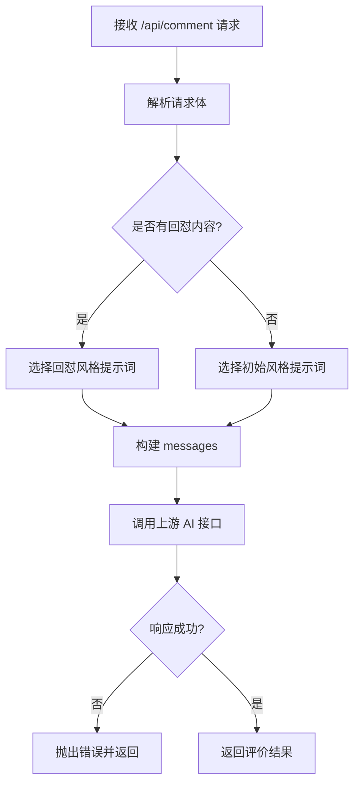
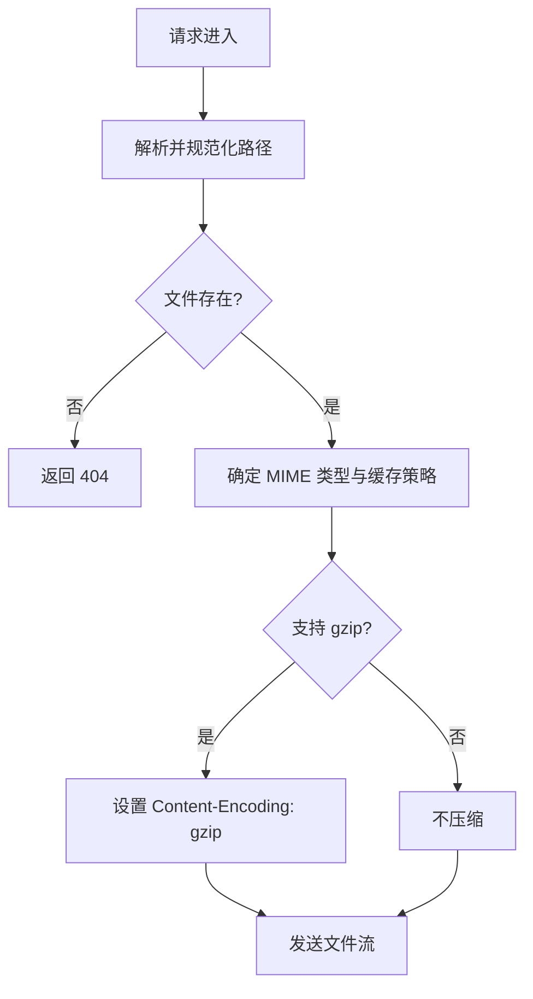
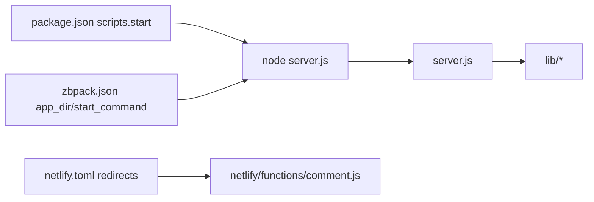

# 部署与运维

<cite>
**本文引用的文件**
- [DEPLOYMENT.md](file://DEPLOYMENT.md)
- [README.md](file://README.md)
- [netlify.toml](file://netlify.toml)
- [zbpack.json](file://zbpack.json)
- [package.json](file://package.json)
- [server.js](file://server.js)
- [lib/aiComment.js](file://lib/aiComment.js)
- [lib/auth.js](file://lib/auth.js)
- [lib/db.js](file://lib/db.js)
- [netlify/functions/comment.js](file://netlify/functions/comment.js)
- [index.html](file://index.html)
- [start-local.bat](file://start-local.bat)
</cite>

## 目录
1. [简介](#简介)
2. [项目结构](#项目结构)
3. [核心组件](#核心组件)
4. [架构总览](#架构总览)
5. [详细组件分析](#详细组件分析)
6. [依赖分析](#依赖分析)
7. [性能考虑](#性能考虑)
8. [故障排除指南](#故障排除指南)
9. [结论](#结论)
10. [附录](#附录)

## 简介
本指南面向运维与开发团队，提供 MyScore 的部署与运维实践，覆盖两种部署方式：
- Netlify 一键部署（仅启用 AI 评价）
- Zeabur 完整部署（启用用户系统、云同步、JWT、邮件验证码等）

同时，文档涵盖环境变量配置、安全最佳实践、监控与日志、域名与 SSL、CDN、CI/CD 自动化、备份与迁移、版本升级流程等。

## 项目结构
MyScore 采用前后端一体化的单页应用（SPA）架构，核心由以下部分组成：
- 前端静态资源：index.html、style.css、app.js
- 服务端（Zeabur/Node）：server.js 提供静态文件服务与 API
- 共享库：lib/aiComment.js（AI 评论）、lib/auth.js（认证与 JWT）、lib/db.js（JSON 文件数据库）
- Netlify 配置：netlify.toml（路由重写）、netlify/functions/comment.js（Netlify Function）
- 部署配置：package.json（Node 启动）、zbpack.json（Zeabur 启动参数）

**图表来源**
- [server.js:1-541](file://server.js#L1-L541)
- [lib/aiComment.js:1-172](file://lib/aiComment.js#L1-L172)
- [lib/auth.js:1-191](file://lib/auth.js#L1-L191)
- [lib/db.js:1-207](file://lib/db.js#L1-L207)
- [netlify.toml:1-9](file://netlify.toml#L1-L9)
- [netlify/functions/comment.js:1-35](file://netlify/functions/comment.js#L1-L35)
- [index.html:1-200](file://index.html#L1-L200)

**章节来源**
- [README.md:217-237](file://README.md#L217-L237)
- [server.js:1-541](file://server.js#L1-L541)
- [lib/aiComment.js:1-172](file://lib/aiComment.js#L1-L172)
- [lib/auth.js:1-191](file://lib/auth.js#L1-L191)
- [lib/db.js:1-207](file://lib/db.js#L1-L207)
- [netlify.toml:1-9](file://netlify.toml#L1-L9)
- [netlify/functions/comment.js:1-35](file://netlify/functions/comment.js#L1-L35)
- [index.html:1-200](file://index.html#L1-L200)

## 核心组件
- 统一 API 入口：前端通过 /api/comment 调用 AI 评论服务，Netlify 重写到函数，Zeabur 由 server.js 直接处理。
- 速率限制：针对敏感端点（验证码、登录、AI 评论）进行 IP 级限流。
- CORS：通过 ALLOWED_ORIGIN 控制来源域，支持动态配置。
- 认证与 JWT：Zeabur 环境变量 JWT_SECRET 必填，用于签发与校验用户令牌。
- 邮件验证码：通过 RESEND_API_KEY 发送验证码邮件。
- 人机验证（可选）：Cloudflare Turnstile Secret Key，配合前端 Site Key 实施风控。
- 数据存储：JSON 文件数据库，支持持久卷（Zeabur）时可启用 DATA_DIR。

**章节来源**
- [DEPLOYMENT.md:7-16](file://DEPLOYMENT.md#L7-L16)
- [server.js:18-48](file://server.js#L18-L48)
- [lib/aiComment.js:1-5](file://lib/aiComment.js#L1-L5)
- [lib/auth.js:4-8](file://lib/auth.js#L4-L8)
- [lib/auth.js:9-10](file://lib/auth.js#L9-L10)
- [lib/auth.js:52-59](file://lib/auth.js#L52-L59)
- [lib/db.js:5-30](file://lib/db.js#L5-L30)

## 架构总览
下图展示了 Netlify 与 Zeabur 两种部署方式的请求流转与职责划分。

**图表来源**
- [netlify.toml:4-7](file://netlify.toml#L4-L7)
- [netlify/functions/comment.js:13-34](file://netlify/functions/comment.js#L13-L34)
- [server.js:515-517](file://server.js#L515-L517)
- [lib/aiComment.js:47-171](file://lib/aiComment.js#L47-L171)

**章节来源**
- [DEPLOYMENT.md:18-60](file://DEPLOYMENT.md#L18-L60)
- [server.js:504-536](file://server.js#L504-L536)
- [netlify.toml:1-9](file://netlify.toml#L1-9)
- [netlify/functions/comment.js:1-35](file://netlify/functions/comment.js#L1-L35)

## 详细组件分析

### 组件一：统一 API 入口与平台映射
- Netlify：/api/comment 重写到 /.netlify/functions/comment，调用 comment.js。
- Zeabur：/api/comment 由 server.js 直接处理，提供静态文件服务与 API。
- 前端通过 meta 标签指定评论端点，确保双平台一致。

**图表来源**
- [index.html:7](file://index.html#L7)
- [netlify.toml:4-7](file://netlify.toml#L4-L7)
- [netlify/functions/comment.js:13-34](file://netlify/functions/comment.js#L13-L34)
- [server.js:515-517](file://server.js#L515-L517)
- [lib/aiComment.js:47-171](file://lib/aiComment.js#L47-L171)

**章节来源**
- [DEPLOYMENT.md:7-34](file://DEPLOYMENT.md#L7-L34)
- [index.html:7](file://index.html#L7)
- [netlify.toml:4-7](file://netlify.toml#L4-L7)
- [netlify/functions/comment.js:13-34](file://netlify/functions/comment.js#L13-L34)
- [server.js:515-517](file://server.js#L515-L517)

### 组件二：速率限制与匿名限额
- 敏感端点限流：验证码、密码登录、验证码登录、AI 评论。
- 匿名用户每日限额：按 IP 计数，超过限制返回 429。
- 定时清理：定期清理过期计数与速率条目。

**图表来源**
- [server.js:18-48](file://server.js#L18-L48)
- [server.js:118-133](file://server.js#L118-L133)
- [server.js:135-176](file://server.js#L135-L176)

**章节来源**
- [server.js:18-48](file://server.js#L18-L48)
- [server.js:118-133](file://server.js#L118-L133)
- [server.js:135-176](file://server.js#L135-L176)

### 组件三：认证与 JWT
- JWT_SECRET 必填，未配置将拒绝启动。
- 支持邮箱/UID 登录，验证码登录与密码登录。
- 令牌签发与校验，过期时间 30 天。
- 邮件验证码通过 Resend 发送。

**图表来源**
- [lib/auth.js:4-8](file://lib/auth.js#L4-L8)
- [lib/auth.js:138-142](file://lib/auth.js#L138-L142)
- [lib/auth.js:179-190](file://lib/auth.js#L179-L190)
- [lib/db.js:129-188](file://lib/db.js#L129-L188)

**章节来源**
- [lib/auth.js:4-8](file://lib/auth.js#L4-L8)
- [lib/auth.js:138-142](file://lib/auth.js#L138-L142)
- [lib/auth.js:179-190](file://lib/auth.js#L179-L190)
- [lib/db.js:129-188](file://lib/db.js#L129-L188)

### 组件四：AI 评论与安全
- 支持多种风格（风暴、暖阳、冷锋、阵雨），可回怼。
- 输入长度截断与安全提示，防止上游异常。
- CORS 与 ALLOWED_ORIGIN 控制来源域。

**图表来源**
- [lib/aiComment.js:47-171](file://lib/aiComment.js#L47-L171)
- [lib/aiComment.js:1-5](file://lib/aiComment.js#L1-L5)

**章节来源**
- [lib/aiComment.js:47-171](file://lib/aiComment.js#L47-L171)
- [lib/aiComment.js:1-5](file://lib/aiComment.js#L1-L5)

### 组件五：静态文件服务与缓存
- 解析请求路径，防止目录穿越。
- 自动选择 Content-Type 与 Cache-Control。
- 支持 gzip 压缩文本类资源。
- 支持 If-Modified-Since 304。

**图表来源**
- [server.js:178-273](file://server.js#L178-L273)

**章节来源**
- [server.js:178-273](file://server.js#L178-L273)

## 依赖分析
- Node 引擎要求：>= 20
- 启动命令：npm start -> node server.js
- 平台差异：
  - Netlify：通过 netlify.toml 重写 /api/comment 到函数
  - Zeabur：通过 zbpack.json 指定根目录与启动命令

**图表来源**
- [package.json:9-11](file://package.json#L9-L11)
- [zbpack.json:1-5](file://zbpack.json#L1-5)
- [netlify.toml:4-7](file://netlify.toml#L4-L7)
- [server.js:1-14](file://server.js#L1-L14)

**章节来源**
- [package.json:6-11](file://package.json#L6-L11)
- [zbpack.json:1-5](file://zbpack.json#L1-L5)
- [netlify.toml:4-7](file://netlify.toml#L4-L7)
- [server.js:1-14](file://server.js#L1-L14)

## 性能考虑
- 静态资源缓存：字体与图片长期缓存，HTML/CSS/JS 严格校验与按需缓存。
- 压缩传输：文本类资源启用 gzip。
- 速率限制：降低突发流量对上游 AI 与数据库的压力。
- 限流策略：针对验证码、登录、AI 评论分别设定窗口与上限。
- 304 缓存：利用 If-Modified-Since 减少带宽消耗。

**章节来源**
- [server.js:224-258](file://server.js#L224-L258)
- [server.js:18-48](file://server.js#L18-L48)

## 故障排除指南
- JWT_SECRET 未配置
  - 现象：服务启动即退出并报错。
  - 处理：在 Zeabur 环境变量中设置随机密钥（建议使用安全随机源生成）。
  - 参考：[lib/auth.js:4-8](file://lib/auth.js#L4-L8)
- AI_API_KEY 未配置
  - 现象：AI 评论接口返回错误。
  - 处理：在 Netlify/Zeabur 环境变量中设置 AI_API_KEY。
  - 参考：[lib/aiComment.js:69-71](file://lib/aiComment.js#L69-L71)
- CORS 跨域失败
  - 现象：浏览器报跨域错误。
  - 处理：在 Netlify/Zeabur 设置 ALLOWED_ORIGIN，确保与前端域名一致。
  - 参考：[lib/aiComment.js:1-5](file://lib/aiComment.js#L1-L5)
- 人机验证失败
  - 现象：验证码接口 400。
  - 处理：在 Zeabur 设置 TURNSTILE_SECRET_KEY，前端需配置 Site Key。
  - 参考：[server.js:52-67](file://server.js#L52-L67)
- 邮件验证码未发送
  - 现象：无邮件或发送失败。
  - 处理：设置 RESEND_API_KEY 与可选 RESEND_FROM；检查上游返回。
  - 参考：[lib/auth.js:67-134](file://lib/auth.js#L67-L134)
- 本地开发
  - 参考：[start-local.bat:1-7](file://start-local.bat#L1-L7)

**章节来源**
- [lib/auth.js:4-8](file://lib/auth.js#L4-L8)
- [lib/aiComment.js:69-71](file://lib/aiComment.js#L69-L71)
- [lib/aiComment.js:1-5](file://lib/aiComment.js#L1-L5)
- [server.js:52-67](file://server.js#L52-L67)
- [lib/auth.js:67-134](file://lib/auth.js#L67-L134)
- [start-local.bat:1-7](file://start-local.bat#L1-L7)

## 结论
MyScore 提供了统一的前端调用路径与灵活的双平台部署方案。通过合理的环境变量配置、速率限制与安全机制，可在 Netlify 上快速启用 AI 评价，在 Zeabur 上实现完整的用户系统与云同步。建议在生产环境中启用 HTTPS、CDN、监控与日志聚合，并制定完善的备份与升级流程。

## 附录

### 环境变量配置清单
- Netlify
  - 必填：AI_API_KEY
  - 可选：AI_BASE_URL、AI_MODEL、ALLOWED_ORIGIN
  - 参考：[DEPLOYMENT.md:20-28](file://DEPLOYMENT.md#L20-L28)
- Zeabur
  - 必填：AI_API_KEY、JWT_SECRET
  - 可选：AI_BASE_URL、AI_MODEL、ALLOWED_ORIGIN、PORT、HOST、DATA_DIR、RESEND_API_KEY、RESEND_FROM、INVITE_CODES、TURNSTILE_SECRET_KEY
  - 参考：[DEPLOYMENT.md:38-49](file://DEPLOYMENT.md#L38-L49)，[README.md:195-204](file://README.md#L195-L204)

### 安全最佳实践
- 严格管理密钥：JWT_SECRET、AI_API_KEY、RESEND_API_KEY、TURNSTILE_SECRET_KEY 均置于环境变量，不提交到仓库。
- CORS 白名单：ALLOWED_ORIGIN 限定为受信域名。
- 速率限制：已内置敏感端点限流，建议结合 WAF/CDN 层进一步限制。
- 人机验证：Turnstile Secret Key 与前端 Site Key 配对使用。
- 日志脱敏：服务端 500 错误不暴露内部细节。
- 参考：[lib/auth.js:4-8](file://lib/auth.js#L4-L8)，[lib/aiComment.js:1-5](file://lib/aiComment.js#L1-L5)，[server.js:18-48](file://server.js#L18-L48)

### 监控与日志
- 建议在平台侧启用访问日志与错误追踪（Netlify/Zeabur 控制台）。
- 对关键端点（/api/comment、/api/auth/*）设置告警阈值。
- 建议使用外部日志聚合服务收集 Node 进程输出。
- 参考：[server.js:459-461](file://server.js#L459-L461)，[server.js:498-501](file://server.js#L498-L501)

### 域名、SSL 与 CDN
- 域名：Netlify 与 Zeabur 均支持自定义域名。
- SSL：平台自动签发与续期，建议强制 HTTPS。
- CDN：可结合平台自带 CDN 或第三方 CDN（如 Cloudflare），开启缓存与压缩。
- 参考：[README.md:183-206](file://README.md#L183-L206)

### CI/CD 与自动化部署
- 推荐使用 GitHub Actions 或平台自带的 CI/CD。
- 流程建议：
  - 分支保护与 PR 审查
  - 自动化测试（前端静态检查、后端健康检查）
  - 部署到 Netlify/Zeabur（按分支区分环境）
  - 自动化备份与发布通知
- 参考：[package.json:9-11](file://package.json#L9-L11)，[zbpack.json:1-5](file://zbpack.json#L1-5)，[netlify.toml:1-9](file://netlify.toml#L1-L9)

### 备份策略与数据迁移
- 数据目录：DATA_DIR（默认 ./data），可挂载持久卷。
- 备份建议：定期导出 users.json、codes.json、userdata 下的用户数据文件。
- 迁移建议：升级前在测试环境验证数据结构兼容性，逐步迁移。
- 参考：[lib/db.js:5-30](file://lib/db.js#L5-L30)，[README.md:324-331](file://README.md#L324-L331)

### 版本升级流程
- 预发布：在测试环境验证 /api/comment 与认证流程。
- 灰度发布：先 Netlify 后 Zeabur，观察错误率与性能指标。
- 回滚：保留上一版本镜像与数据快照，必要时回滚。
- 参考：[README.md:239-284](file://README.md#L239-L284)，[DEPLOYMENT.md:66-75](file://DEPLOYMENT.md#L66-L75)