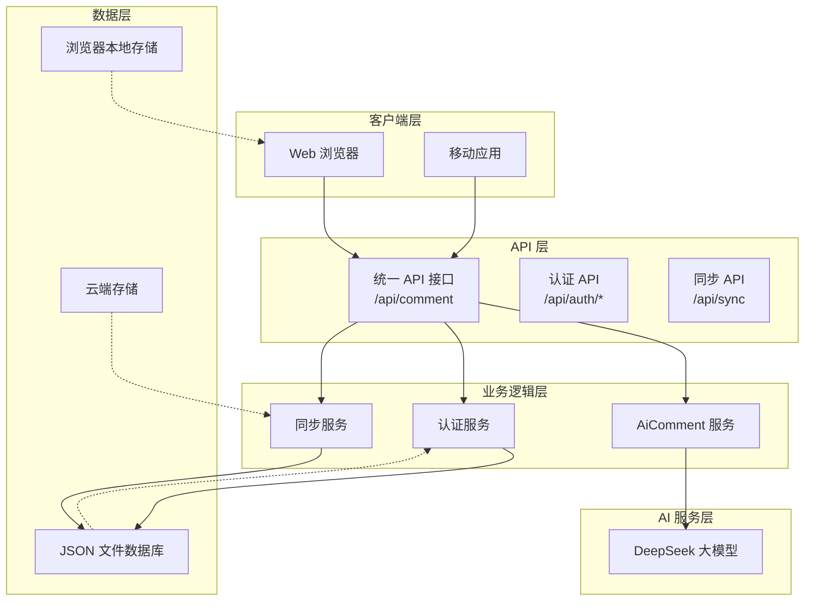
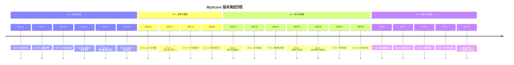

# 项目概述

<cite>
**本文档引用的文件**
- [README.md](file://README.md)
- [package.json](file://package.json)
- [app.js](file://app.js)
- [server.js](file://server.js)
- [lib/aiComment.js](file://lib/aiComment.js)
- [lib/auth.js](file://lib/auth.js)
- [lib/db.js](file://lib/db.js)
- [netlify/functions/comment.js](file://netlify/functions/comment.js)
- [DEPLOYMENT.md](file://DEPLOYMENT.md)
- [index.html](file://index.html)
- [style.css](file://style.css)
- [netlify.toml](file://netlify.toml)
- [zbpack.json](file://zbpack.json)
</cite>

## 目录
1. [项目简介](#项目简介)
2. [核心价值主张](#核心价值主张)
3. [主要功能特性](#主要功能特性)
4. [技术架构概览](#技术架构概览)
5. [设计理念](#设计理念)
6. [发展历程与版本演进](#发展历程与版本演进)
7. [技术栈详解](#技术栈详解)
8. [部署选项](#部署选项)
9. [核心业务价值](#核心业务价值)
10. [项目定位说明](#项目定位说明)
11. [架构决策背景](#架构决策背景)

## 项目简介

MyScore 是一款专为学习者打造的 AI 智能成绩管理系统，旨在帮助用户更好地记录、分析和反思自己的学习成果。该项目从最初的基础成绩记录工具，逐步发展为集成了人工智能交互能力、云端账号系统和多平台部署支持的智能化学习分析平台。

当前版本为 V5.4.0-beta，新增了飞书机器人集成功能，用户可通过飞书接收成绩通知、查询成绩趋势和目标进度等；同时包含拖动条输入、扣分制计分、实时校验和分享卡记录选择等创新功能，配合多项修复与体验优化，为用户提供了更加流畅和智能的学习管理体验。

## 核心价值主张

MyScore 的核心价值在于将传统成绩记录工具升级为智能化学习伙伴，提供以下独特价值：

### 1. 智能化学习分析
- **AI 个性化反馈**：基于用户的考试历史和表现趋势，提供个性化的学习建议和成长洞察
- **多维度数据分析**：通过图表和统计信息帮助用户识别学习模式和改进方向
- **实时学习指导**：在每次成绩录入后即时提供针对性的学习建议

### 2. 无缝学习体验
- **跨设备同步**：云端数据同步确保用户在任何设备上都能访问最新的学习数据
- **响应式设计**：针对移动设备和桌面环境优化的用户体验
- **直观的操作界面**：简化复杂的操作流程，让用户专注于学习本身

### 3. 个性化学习路径
- **多种计分方式**：支持直接输入、多小题计分、分部分计分、公式计算和扣分制等多种计分模式
- **自定义考试类型**：用户可以创建符合自己需求的考试类型和评估标准
- **学习目标追踪**：帮助用户设定和追踪学习目标，提供进度可视化

## 主要功能特性

### 用户系统（4.0.0-beta 新增，4.0.1-beta 加固，4.0.3-beta 修复，4.1.0-beta 双模式）

MyScore 提供了完善的用户管理体系，支持多种登录方式和数据同步功能：

- **邮箱验证码登录**：安全便捷的注册和登录方式
- **密码登录**：已注册用户的快速登录体验
- **UID 登录**：支持邮箱或 UID 的双重登录方式
- **云端同步**：登录后自动同步数据到云端，实现跨设备访问
- **用户资料管理**：支持头像选择、昵称设置、个性签名等个性化配置
- **管理员系统**：首个注册用户自动成为管理员，享有特殊权限

### AI 智能交互（2.x 新增）

项目集成了强大的 AI 交互能力，为用户提供智能化的学习辅助：

- **毒舌老师**：每次录入成绩后，AI 会根据分数走势给出犀利而有针对性的评价
- **回怼模式**：用户可以反驳 AI 的评价，实现多轮智能对话
- **桌面宠物**：右下角的互动表情，根据最近成绩自动变化
- **突突er 伴学助手**：温和的中文伴学 AI，提供学习陪伴和答疑服务
- **AI 风格切换**：支持风暴、暖阳、冷锋、阵雨四种不同的 AI 评价风格

### 飞书机器人集成（V5.4.0-beta 新增）

项目集成了飞书开放平台能力，让用户通过飞书机器人与 MyScore 进行无缝交互：

- **成绩通知推送**：每次录入成绩后自动推送精美的通知卡片到飞书
- **命令式查询**：在飞书中发送「查询」「趋势」「目标」「成就」等命令获取信息
- **6位码快速绑定**：网站生成绑定码 → 飞书发送完成绑定，流程简洁安全
- **交互式卡片**：使用飞书 Interactive Card 展示成绩数据，层次清晰美观

### 响应式体验（2.3.1 重点）

针对不同设备优化的用户体验设计：

- **移动端优先适配**：针对手机和平板设备的专门优化
- **触摸友好的界面**：大尺寸按钮和触控区域设计
- **输入法兼容性**：智能避让移动端输入法，确保操作便利性
- **统一的视觉体验**：在不同设备上保持一致的界面风格

### 支持的考试类型

MyScore 支持多种主流考试类型的管理和分析：

#### 雅思考试 (IELTS)
- **听力/阅读**：根据正确题数自动折算分数（0-40题 → 0-9.0分）
- **写作 (Writing)**：Task 1/Task 2 分离输入，自动加权计算
- **口语 (Speaking)**：直接输入分数
- **Overall 总分**：自动计算四项平均分，按雅思规则取整

#### 大学英语考试 (CET)
- **四级/六级**：完整的成绩管理
- **分项计分**：听力/阅读/写作/翻译 独立录入或换算

#### 自定义考试
- **完全自由**：创建任意考试类型（如托福、GRE、期末考）
- **四种计分**：直接输入、多小题计分、分部分计分、公式计算、扣分制

### 数据可视化与管理（3.0.0 持续升级）

提供丰富的数据管理和可视化功能：

- **趋势图表**：使用 Chart.js 绘制精美成绩曲线
- **报告导出**：支持生成成绩单卡片、详细报告、学习总结
- **云端同步**：登录后自动同步，跨设备访问
- **数据安全**：浏览器 LocalStorage 本地存储 + 服务端加密同步
- **备份恢复**：支持 JSON 格式一键导出/导入

## 技术架构概览

MyScore 采用了现代化的全栈架构设计，实现了前后端分离和多平台部署支持：

**架构图来源**
- [server.js:504-536](file://server.js#L504-L536)
- [lib/aiComment.js:47-171](file://lib/aiComment.js#L47-L171)
- [lib/auth.js:16-59](file://lib/auth.js#L16-L59)

### 前端架构

前端采用纯 JavaScript 架构，通过单页应用模式提供流畅的用户体验：

- **事件驱动编程**：基于事件监听和回调机制的交互设计
- **模块化组织**：将功能划分为用户管理、AI 交互、数据同步等模块
- **响应式设计**：使用 CSS Grid 和 Flexbox 实现自适应布局
- **本地存储**：充分利用浏览器的 localStorage 进行数据持久化

### 后端架构

后端采用 Node.js 构建的轻量级服务器，提供 RESTful API 服务：

- **HTTP 服务器**：基于 Node.js 内置 http 模块构建
- **路由处理**：统一的路由分发机制处理不同 API 请求
- **中间件模式**：支持 CORS、限流、验证等中间件
- **静态文件服务**：内置静态资源服务和缓存机制

### AI 集成架构

项目集成了多种 AI 服务能力，通过统一的接口抽象实现：

- **多风格 AI 评价**：支持四种不同的 AI 评价风格
- **对话管理**：支持连续对话和上下文保持
- **输入验证**：对用户输入进行安全过滤和长度限制
- **错误处理**：完善的错误捕获和降级机制

## 设计理念

MyScore 的设计理念围绕"智能化学习伙伴"这一核心概念展开，体现了以下设计原则：

### 1. 以用户为中心的设计

- **简化复杂性**：将复杂的考试管理和学习分析功能包装成简单易用的操作
- **个性化体验**：通过 AI 风格选择和用户偏好设置提供个性化体验
- **情感化设计**：通过桌面宠物、AI 互动等方式增加情感连接

### 2. 智能化与人性化的平衡

- **AI 辅助而非替代**：AI 提供建议和洞察，但最终决策权在用户手中
- **适度的智能干预**：通过合理的频率限制和反馈机制避免过度依赖
- **人性化交互**：AI 评价既要有专业性，也要有人情味

### 3. 数据驱动的学习改进

- **趋势分析**：通过历史数据分析帮助用户识别学习模式
- **目标导向**：支持学习目标设定和进度追踪
- **反馈循环**：建立"记录-分析-反馈-改进"的闭环

### 4. 开放与包容的生态

- **多平台支持**：同时支持 Netlify 和 Zeabur 两种部署方式
- **可扩展性**：模块化的架构设计便于功能扩展
- **社区友好**：开源项目，欢迎社区贡献和反馈

## 发展历程与版本演进

MyScore 的发展历程体现了从简单工具到智能化学习平台的完整演进过程：

### V2.0.0 - AI 核心接入
- **AI 核心接入**：接入 DeepSeek 大模型，实现智能成绩评价
- **架构升级**：引入 Netlify Functions Serverless 后端

### V3.0.0 - 双平台部署打通
- **统一前端入口**：统一前端 AI 入口为 `/api/comment`
- **保留现有配置**：无需改动原有环境变量配置
- **UI/UX 重构**：首页、学习档案、页脚尾注完成产品化改版

### V4.0.0 - 用户系统建立
- **账号系统**：邮箱验证码注册/登录 + 密码登录
- **云端数据同步**：登录后成绩数据自动上传云端
- **用户资料管理**：头像、昵称、个性签名等个人资料

### V4.1.0 - 本地/登录双模式
- **双模式架构**：未登录用户可选择本地使用或登录使用
- **AI 评论限制**：本地模式每日 AI 评论限制 5 次
- **数据迁移**：本地用户登录后自动同步到云端

### V5.0.0 - 拖动条输入与扣分制
- **拖动条输入**：新增 Slider 拖动条，支持拖动和数字输入双模式
- **扣分制计分**：支持从满分扣除的计分方式
- **实时校验**：超范围成绩立即红框提示
- **分享卡选择**：导出报告时可选择具体记录

**时间线图来源**
- [README.md:18-335](file://README.md#L18-L335)

## 技术栈详解

### 前端技术栈

MyScore 采用现代化的前端技术栈，注重性能和用户体验：

- **HTML5 + CSS3**：语义化标记和现代 CSS 特性
- **JavaScript ES2020+**：模块化编程和现代语法特性
- **Chart.js**：专业的数据可视化库
- **本地存储 API**：浏览器原生数据持久化能力
- **Fetch API**：现代化的网络请求处理

### 后端技术栈

后端采用轻量级但功能完备的 Node.js 技术栈：

- **Node.js v20+**：最新 LTS 版本，性能优异
- **原生模块**：crypto、fs、http 等内置模块
- **JSON 文件存储**：轻量级数据持久化方案
- **JWT 认证**：无状态身份验证机制
- **CORS 支持**：跨域资源共享配置

### AI 集成技术

项目集成了先进的 AI 服务能力：

- **DeepSeek API**：高性能的大语言模型服务
- **多风格提示词**：针对不同评价风格的定制化提示词
- **温度参数调节**：控制 AI 输出的创造性和稳定性
- **上下文管理**：维护对话历史和学习背景

### 部署技术栈

支持多种部署方式的灵活架构：

- **Netlify Functions**：无服务器函数，零配置部署
- **Zeabur 平台**：完整的 PaaS 服务，支持 Node.js 应用
- **静态文件服务**：内置的静态资源服务和缓存机制
- **环境变量配置**：灵活的配置管理方案

## 部署选项

MyScore 提供了灵活的多平台部署方案，满足不同用户的需求：

### Netlify 部署（推荐）

Netlify 提供了最简单的部署方式，适合个人用户和小型团队：

**部署步骤**：
1. Fork 项目到 GitHub
2. 登录 Netlify 选择 Import from Git
3. 在 Environment variables 中添加 AI_API_KEY
4. 项目自动部署，无需手动配置

**环境变量配置**：
- `AI_API_KEY`：DeepSeek API 密钥
- `ALLOWED_ORIGIN`：可选，限制 CORS 来源域名

**优势特点**：
- 零配置部署，快速上线
- 免费额度充足
- 自动 SSL 证书
- 全球 CDN 加速

### Zeabur 部署（完整功能）

Zeabur 提供了完整的 PaaS 服务，支持所有功能特性：

**部署步骤**：
1. 使用相同 GitHub 仓库创建项目
2. 配置环境变量（见下方说明）
3. 项目自动构建和部署

**必需环境变量**：
- `AI_API_KEY`：DeepSeek API 密钥
- `JWT_SECRET`：随机长字符串（必须设置）

**可选环境变量**：
- `RESEND_API_KEY`：Resend API 密钥
- `RESEND_FROM`：发件人地址
- `INVITE_CODES`：内测邀请码列表
- `TURNSTILE_SECRET_KEY`：Cloudflare Turnstile 密钥
- `DATA_DIR`：数据存储路径
- `FEISHU_APP_ID`：飞书应用 ID（飞书集成功能）
- `FEISHU_APP_SECRET`：飞书应用密钥（飞书集成功能）
- `FEISHU_ENCRYPT_KEY`：飞书加密密钥（飞书集成功能）

**优势特点**：
- 完整功能支持
- 持久化存储
- 完整的用户系统
- 企业级安全

### 本地开发部署

对于开发者和高级用户，项目也支持本地开发部署：

**启动步骤**：
1. 确保 Node.js v20+ 已安装
2. 在项目根目录创建 `.env` 文件
3. 运行 `npm start` 启动服务

**开发环境配置**：
- 支持热重载
- 开发工具集成
- 调试功能完整

## 核心业务价值

MyScore 为用户创造了多重核心业务价值：

### 1. 学习效率提升

- **自动化分析**：AI 自动分析学习趋势，识别改进机会
- **个性化建议**：基于个人学习模式提供定制化建议
- **进度可视化**：通过图表和统计数据直观展示学习进展

### 2. 学习体验优化

- **情感化交互**：通过 AI 互动和桌面宠物增加学习乐趣
- **即时反馈**：每次成绩录入后立即获得反馈和建议
- **多风格选择**：用户可以根据心情选择不同的 AI 评价风格

### 3. 数据安全保障

- **本地优先**：默认情况下数据保存在本地浏览器中
- **加密传输**：所有云端通信都经过 HTTPS 加密
- **隐私保护**：严格遵守数据保护法规，保护用户隐私

### 4. 成本效益最大化

- **免费使用**：基础功能完全免费
- **开源透明**：代码开源，用户可以自由使用和修改
- **低维护成本**：基于云服务的零运维模式

## 项目定位说明

### 对初学者的价值

MyScore 为学习者提供了入门级的智能化学习管理工具：

**简单易用**：
- 无需编程基础即可使用
- 直观的界面设计
- 详细的使用说明和帮助文档

**功能完整**：
- 支持主流考试类型
- 提供基本的 AI 交互
- 具备数据导出功能

**学习辅助**：
- 即时的学习反馈
- 进度跟踪和分析
- 个性化学习建议

### 对经验开发者的价值

MyScore 为开发者提供了优秀的技术参考和学习案例：

**架构设计**：
- 前后端分离的现代化架构
- 模块化设计便于理解和扩展
- 多平台部署支持的最佳实践

**技术实现**：
- Node.js 服务端开发范例
- 前端事件驱动编程模式
- AI 集成和 API 设计模式

**安全实践**：
- JWT 认证实现
- CORS 配置和安全策略
- 数据加密和隐私保护

## 架构决策背景

MyScore 的架构设计体现了对技术选型和业务需求的深入理解：

### 技术选型考量

**Node.js 作为后端技术**：
- 与前端 JavaScript 技术栈保持一致
- 丰富的生态系统和社区支持
- 适合构建轻量级 API 服务
- 开发和部署成本较低

**JSON 文件存储**：
- 简单可靠的数据持久化方案
- 无需额外的数据库服务器
- 便于备份和迁移
- 适合中小规模数据量

**Chart.js 数据可视化**：
- 专业的图表绘制库
- 支持多种图表类型
- 轻量级，易于集成
- 丰富的配置选项

### 架构设计原则

**单一职责原则**：
- 每个模块负责特定的功能领域
- API 层、业务逻辑层、数据层职责明确
- 便于维护和测试

**开放封闭原则**：
- 对扩展开放，对修改封闭
- 通过插件和配置支持功能扩展
- 保持核心功能的稳定性

**依赖倒置原则**：
- 高层模块不依赖低层模块
- 通过接口抽象实现解耦
- 便于替换和测试

### 安全设计考虑

**认证授权机制**：
- JWT 令牌机制确保用户身份验证
- 基于角色的访问控制
- 会话管理和令牌刷新

**数据安全保护**：
- 密码使用 scrypt 算法加密存储
- 敏感信息的脱敏处理
- API 调用的频率限制和防护

**隐私保护措施**：
- 本地数据优先策略
- 最小化数据收集原则
- 用户数据的可移植性

通过以上全面的分析，MyScore 项目展现了从简单工具到智能化学习平台的完整演进过程，体现了现代 Web 应用开发的最佳实践和技术发展趋势。项目不仅为用户提供了实用的学习管理工具，也为开发者提供了优秀的技术参考和学习案例。